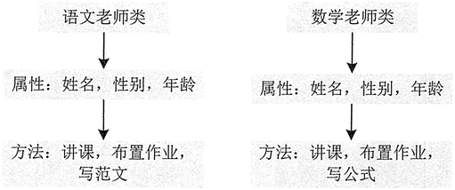
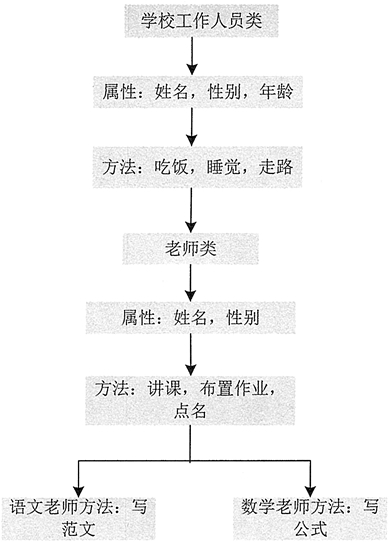
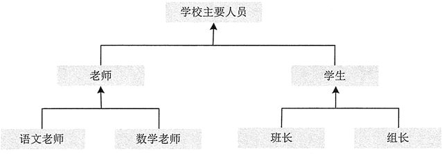
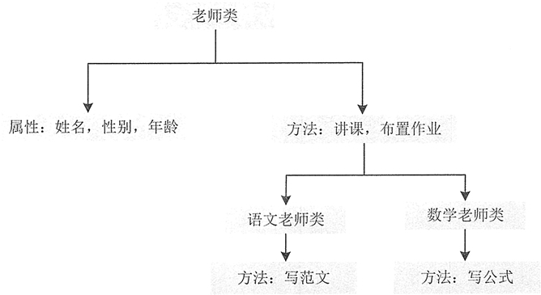

对 Java 语言来说，一切皆是对象。把现实世界中的对象抽象地体现在编程世界中，一个对象代表了某个具体的操作。一个个对象最终组成了完整的程序设计，这些对象可以是独立存在的，也可以是从别的对象继承过来的。对象之间通过相互作用传递信息，实现程序开发
### 对象的概念
Java 是面向对象的编程语言，对象就是面向对象程序设计的核心。所谓对象就是真实世界中的实体，对象与实体是一一对应的，也就是说现实世界中每一个实体都是一个对象，它是一种具体的概念。对象有以下特点：

* 对象具有属性和行为。
* 对象具有变化的状态。
* 对象具有唯一性。
* 对象都是某个类别的实例。
* 一切皆为对象，真实世界中的所有事物都可以视为对象。

### 面向对象的三大核心特性
面向对象开发模式更有利于人们开拓思维，在具体的开发过程中便于程序的划分，方便程序员分工合作，提高开发效率。面向对象程序设计有以下优点。
> 1. 可重用性：它是面向对象软件开发的核心思路，提高了开发效率。面向对象程序设计的抽象、继承、封装和多态四大特点都围绕这个核心。
> 2. 可扩展性：它使面向对象设计脱离了基于模块的设计，便于软件的修改。
> 3. 可管理性：能够将功能与数据结合，方便管理。

该开发模式之所以使程序设计更加完善和强大，主要是因为面向对象具有**继承、封装和多态** 3 个核心特性。
#### 继承性
如同生活中的子女继承父母拥有的所有财产，程序中的继承性是指子类拥有父类数据结构的方法和机制，这是类之间的一种关系；继承只能是单继承。
例如定义一个语文老师类和数学老师类，如果不采用继承方式，那么两个类中需要定义的属性和方法如图所示。

从图能够看出，语文老师类和数学老师类中的许多属性和方法相同，这些相同的属性和方法可以提取出来放在一个父类中，这个父类用于被语文老师类和数学老师类继承。当然父类还可以继承别的类，如图所示。

总结继承关系，可以用概括的树形关系来表示，如图所示。

从图中可以看出，学校主要人员是一个大的类别，老师和学生是学校主要人员的两个子类，而老师又可以分为语文老师和数学老师两个子类，学生也可以分为班长和组长两个子类。
使用这种层次形的分类方式，是为了将多个类的通用属性和方法提取出来，放在它们的父类中，然后只需要在子类中各自定义自己独有的属性和方法，并以继承的形式在父类中获取它们的通用属性和方法即可。
#### 封装性
封装是将代码及其处理的数据绑定在一起的一种编程机制，该机制保证了程序和数据都不受外部干扰且不被误用。封装的目的在于保护信息，使用它的主要优点如下。

* 保护类中的信息，它可以阻止在外部定义的代码随意访问内部代码和数据。
* 隐藏细节信息，一些不需要程序员修改和使用的信息，比如取款机中的键盘，用户只需要知道按哪个键实现什么操作就可以，至于它内部是如何运行的，用户不需要知道。
* 有助于建立各个系统之间的松耦合关系，提高系统的独立性。当一个系统的实现方式发生变化时，只要它的接口不变，就不会影响其他系统的使用。例如 U 盘，不管里面的存储方式怎么改变，只要 U 盘上的 USB 接口不变，就不会影响用户的正常操作。
* 提高软件的复用率，降低成本。每个系统都是一个相对独立的整体，可以在不同的环境中得到使用。例如，一个 U 盘可以在多台电脑上使用。

Java 语言的基本封装单位是类。由于类的用途是封装复杂性，所以类的内部有隐藏实现复杂性的机制。Java 提供了私有和公有的访问模式，类的公有接口代表外部的用户应该知道或可以知道的每件东西，私有的方法数据只能通过该类的成员代码来访问，这就可以确保不会发生不希望的事情。
#### 多态性
面向对象的多态性，即“一个接口，多个方法”。多态性体现在父类中定义的属性和方法被子类继承后，可以具有不同的属性或表现方式。多态性允许一个接口被多个同类使用，弥补了单继承的不足。多态概念可以用树形关系来表示，如图所示。

从图中可以看出，老师类中的许多属性和方法可以被语文老师类和数学老师类同时使用，这样也不易出错。
