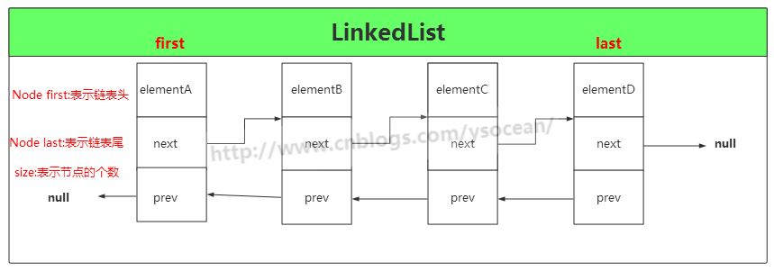
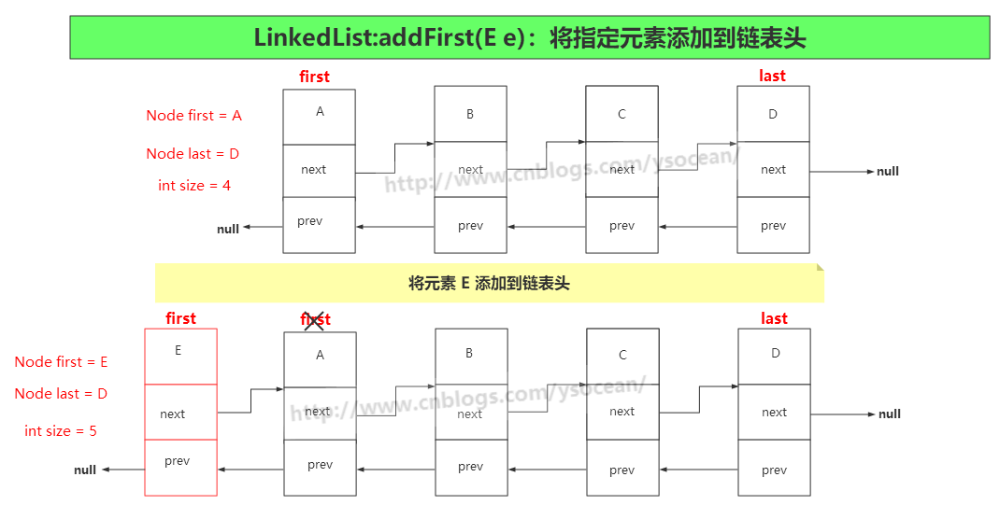
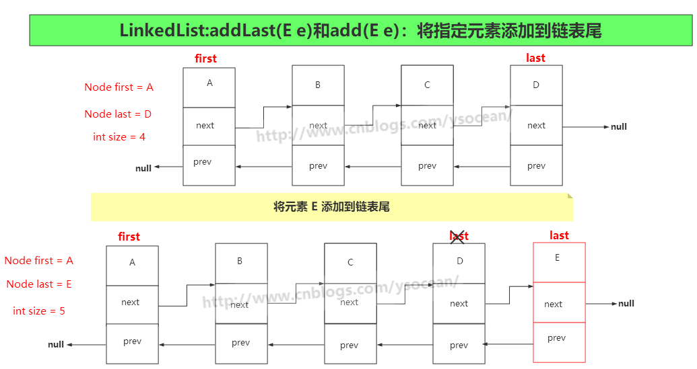
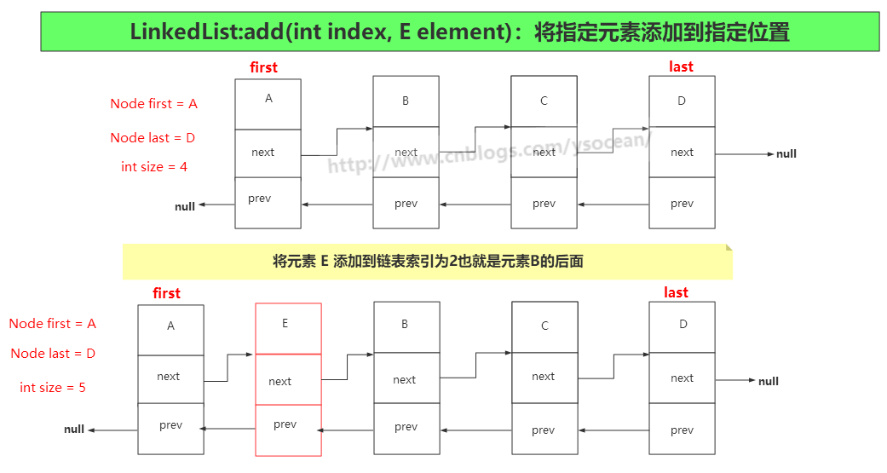
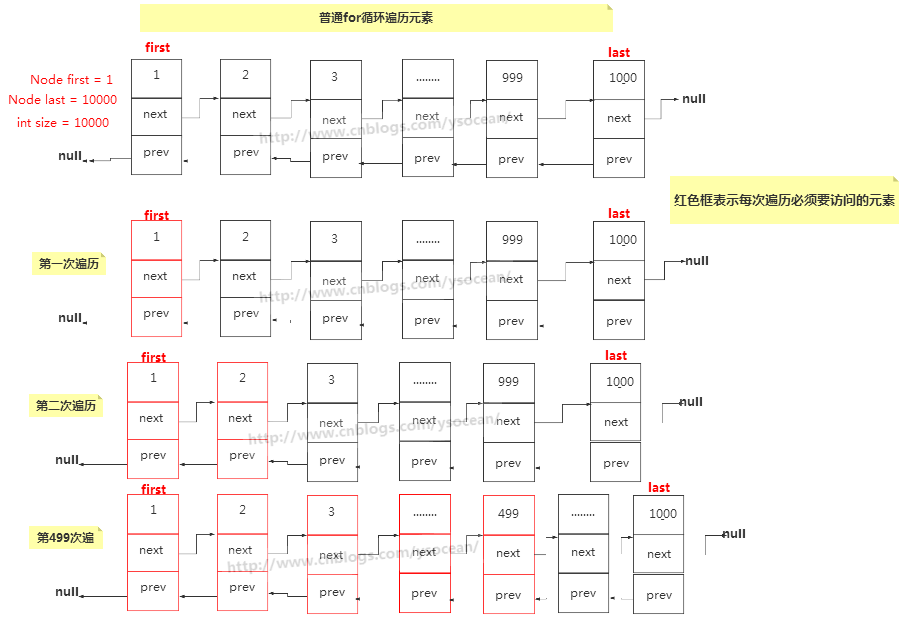
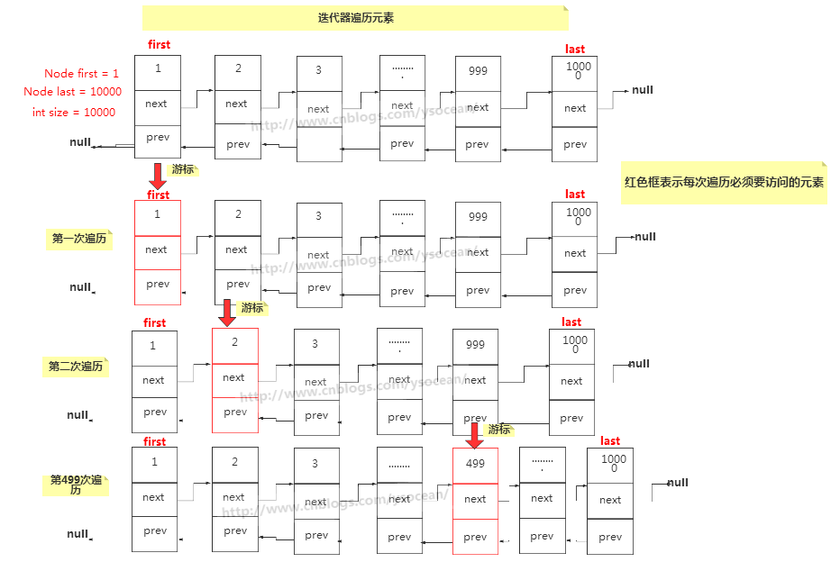

### 1、LinkedList 定义
LinkedList 是一个用链表实现的集合，元素有序且可以重复。
```java
public class LinkedList<E>
     extends AbstractSequentialList<E>
     implements List<E>, Deque<E>, Cloneable, java.io.Serializable
```


和 ArrayList 集合一样，LinkedList 集合也实现了Cloneable接口和Serializable接口，分别用来支持克隆以及支持序列化。List 接口也不用多说，定义了一套 List 集合类型的方法规范。

注意，相对于 ArrayList 集合，LinkedList 集合多实现了一个 Deque 接口，这是一个双向队列接口，双向队列就是两端都可以进行增加和删除操作。
### 2、字段属性
```java
//链表元素（节点）的个数
    transient int size = 0;

    /**
     *指向第一个节点的指针
     */
    transient Node<E> first;

    /**
     *指向最后一个节点的指针
     */
    transient Node<E> last;
```
注意这里出现了一个 Node 类，这是 LinkedList 类中的一个内部类，其中每一个元素就代表一个 Node 类对象，LinkedList 集合就是由许多个 Node 对象类似于手拉着手构成。
```java
private static class Node<E> {
        E item;//实际存储的元素
        Node<E> next;//指向上一个节点的引用
        Node<E> prev;//指向下一个节点的引用

        //构造函数
        Node(Node<E> prev, E element, Node<E> next) {
            this.item = element;
            this.next = next;
            this.prev = prev;
        }
    }
```
如下图所示：



上图的 LinkedList 是有四个元素，也就是由 4 个 Node 对象组成，size=4，head 指向第一个elementA,tail指向最后一个节点elementD。
### 3、构造函数 
```java
public LinkedList() {
    }
    public LinkedList(Collection<? extends E> c) {
        this();
        addAll(c);
    }
```
LinkedList 有两个构造函数，第一个是默认的空的构造函数，第二个是将已有元素的集合Collection 的实例添加到 LinkedList 中，调用的是 addAll() 方法，这个方法下面我们会介绍。

注意：LinkedList 是没有初始化链表大小的构造函数，因为链表不像数组，一个定义好的数组是必须要有确定的大小，然后去分配内存空间，而链表不一样，它没有确定的大小，通过指针的移动来指向下一个内存地址的分配。
### 4、添加元素
#### ①、addFirst(E e)
将指定元素添加到链表头


```java
//将指定的元素附加到链表头节点
    public void addFirst(E e) {
        linkFirst(e);
    }
    private void linkFirst(E e) {
        final Node<E> f = first;    // 将头节点赋值给 f
        final Node<E> newNode = new Node<>(null, e, f); // 将指定元素构造成一个新节点，此节点的指向下一个节点的引用为头节点
        first = newNode;    // 将新节点设为头节点，那么原先的头节点 f 变为第二个节点
        if (f == null)  // 如果第二个节点为空，也就是原先链表是空
            last = newNode; // 将这个新节点也设为尾节点（前面已经设为头节点了）
        else
            f.prev = newNode;   // 将原先的头节点的上一个节点指向新节点
        size++; // 节点数加1
        modCount++; // 和ArrayList中一样，iterator和listIterator方法返回的迭代器和列表迭代器实现使用。
    }
```
#### ②、addLast(E e)和add(E e)
将指定元素添加到链表尾


```java
// 将元素添加到链表末尾
    public void addLast(E e) {
        linkLast(e);
    }
    // 将元素添加到链表末尾
    public boolean add(E e) {
        linkLast(e);
        return true;
    }
    void linkLast(E e) {
        final Node<E> l = last; // 将l设为尾节点
        final Node<E> newNode = new Node<>(l, e, null); // 构造一个新节点，节点上一个节点引用指向尾节点l
        last = newNode; // 将尾节点设为创建的新节点
        if (l == null)  // 如果尾节点为空，表示原先链表为空
            first = newNode;    // 将头节点设为新创建的节点（尾节点也是新创建的节点）
        else
            l.next = newNode;   // 将原来尾节点下一个节点的引用指向新节点
        size++; // 节点数加1
        modCount++; // 和ArrayList中一样，iterator和listIterator方法返回的迭代器和列表迭代器实现使用。
    }
```
#### ③、add(int index, E element)
将指定的元素插入此列表中的指定位置


```java
// 将指定的元素插入此列表中的指定位置
    public void add(int index, E element) {
        // 判断索引 index >= 0 && index <= size中时抛出IndexOutOfBoundsException异常
        checkPositionIndex(index);

        if (index == size)  // 如果索引值等于链表大小
            linkLast(element);  // 将节点插入到尾节点
        else
            linkBefore(element, node(index));
    }
    Node<E> node(int index) {
        if (index < (size >> 1)) {  // 如果插入的索引在前半部分
            Node<E> x = first;  // 设x为头节点
            for (int i = 0; i < index; i++) // 从开始节点到插入节点索引之间的所有节点向后移动一位
                x = x.next;
            return x;
        } else {    // 如果插入节点位置在后半部分
            Node<E> x = last;   // 将x设为最后一个节点
            for (int i = size - 1; i > index; i--)  // 从最后节点到插入节点的索引位置之间的所有节点向前移动一位
                x = x.prev;
            return x;
        }
    }
    void linkBefore(E e, Node<E> succ) {
        final Node<E> pred = succ.prev; // 将pred设为插入节点的上一个节点
        final Node<E> newNode = new Node<>(pred, e, succ);  // 将新节点的上引用设为pred,下引用设为succ
        succ.prev = newNode;    // succ的上一个节点的引用设为新节点
        if (pred == null)   // 如果插入节点的上一个节点引用为空
            first = newNode;    // 新节点就是头节点
        else
            pred.next = newNode;    // 插入节点的下一个节点引用设为新节点
        size++;
        modCount++;
    }
```
#### ④、addAll(Collection<? extends E> c)
按照指定集合的迭代器返回的顺序，将指定集合中的所有元素追加到此列表的末尾

此方法还有一个 addAll(int index, Collection<? extends E> c)，将集合 c 中所有元素插入到指定索引的位置。其实 

addAll(Collection<? extends E> c) ==  addAll(size, Collection<? extends E> c)

源码如下：
```java
// 按照指定集合的迭代器返回的顺序，将指定集合中的所有元素追加到此列表的末尾。
    public boolean addAll(Collection<? extends E> c) {
        return addAll(size, c);
    }
    // 将集合 c 中所有元素插入到指定索引的位置。
    public boolean addAll(int index, Collection<? extends E> c) {
        // 判断索引 index >= 0 && index <= size中时抛出IndexOutOfBoundsException异常
        checkPositionIndex(index);

        Object[] a = c.toArray();   // 将集合转换成一个 Object 类型的数组
        int numNew = a.length;
        if (numNew == 0)    // 如果添加的集合为空，直接返回false
            return false;

        Node<E> pred, succ;
        if (index == size) {    // 如果插入的位置等于链表的长度，就是将原集合元素附加到链表的末尾
            succ = null;
            pred = last;
        } else {
            succ = node(index);
            pred = succ.prev;
        }

        for (Object o : a) {    // 遍历要插入的元素
            @SuppressWarnings("unchecked") E e = (E) o;
            Node<E> newNode = new Node<>(pred, e, null);
            if (pred == null)
                first = newNode;
            else
                pred.next = newNode;
            pred = newNode;
        }

        if (succ == null) {
            last = pred;
        } else {
            pred.next = succ;
            succ.prev = pred;
        }

        size += numNew;
        modCount++;
        return true;
    }
```
看到上面向 LinkedList 集合中添加元素的各种方式，我们发现LinkedList 每次添加元素只是改变元素的上一个指针引用和下一个指针引用，而且没有扩容。，对比于 ArrayList ，需要扩容，而且在中间插入元素时，后面的所有元素都要移动一位，两者插入元素时的效率差异很大。

还有，每次进行添加操作，都有modCount++ 的操作。
### 5、删除元素
删除元素和添加元素一样，也是通过更改指向上一个节点和指向下一个节点的引用即可，这里就不作图形展示了。
#### ①、remove()和removeFirst()
从此列表中移除并返回第一个元素
```java
// 从此列表中移除并返回第一个元素
    public E remove() {
        return removeFirst();
    }
    // 从此列表中移除并返回第一个元素
    public E removeFirst() {
        final Node<E> f = first;    // f设为头结点
        if (f == null)
            throw new NoSuchElementException(); // 如果头结点为空，则抛出异常
        return unlinkFirst(f);
    }
    private E unlinkFirst(Node<E> f) {
        // assert f == first && f != null;
        final E element = f.item;
        final Node<E> next = f.next;    // next 为头结点的下一个节点
        f.item = null;
        f.next = null; // 将节点的元素以及引用都设为 null，便于垃圾回收
        first = next; //修改头结点为第二个节点
        if (next == null)   // 如果第二个节点为空（当前链表只存在第一个元素）
            last = null;    // 那么尾节点也置为 null
        else
            next.prev = null;   // 如果第二个节点不为空，那么将第二个节点的上一个引用置为 null
        size--;
        modCount++;
        return element;
    }
```
#### ②、removeLast()
从该列表中删除并返回最后一个元素
```java
// 从该列表中删除并返回最后一个元素
    public E removeLast() {
        final Node<E> l = last;
        if (l == null)  // 如果尾节点为空，表示当前集合为空，抛出异常
            throw new NoSuchElementException();
        return unlinkLast(l);
    }
    
    private E unlinkLast(Node<E> l) {
        // assert l == last && l != null;
        final E element = l.item;
        final Node<E> prev = l.prev;
        l.item = null;
        l.prev = null;  // 将节点的元素以及引用都设为 null，便于垃圾回收
        last = prev;    // 尾节点为倒数第二个节点
        if (prev == null)   // 如果倒数第二个节点为null
            first = null;   // 那么将节点也置为 null
        else
            prev.next = null;   // 如果倒数第二个节点不为空，那么将倒数第二个节点的下一个引用置为 null
        size--;
        modCount++;
        return element;
    }
```
#### ③、remove(int index)
删除此列表中指定位置的元素
```java
// 删除此列表中指定位置的元素
    public E remove(int index) {
        // 判断索引 index >= 0 && index <= size中时抛出IndexOutOfBoundsException异常
        checkElementIndex(index);
        return unlink(node(index));
    }
    E unlink(Node<E> x) {
        // assert x != null;
        final E element = x.item;
        final Node<E> next = x.next;
        final Node<E> prev = x.prev;

        if (prev == null) { // 如果删除节点位置的上一个节点引用为null（表示删除第一个元素）
            first = next;   // 将头结点置为第一个元素的下一个节点
        } else {    // 如果删除节点位置的上一个节点引用不为null
            prev.next = next;   // 将删除节点的上一个节点的下一个节点引用指向删除节点的下一个节点（去掉删除节点）
            x.prev = null;  // 删除节点的上一个节点引用置为null
        }

        if (next == null) { // 如果删除节点的下一个节点引用为null（表示删除最后一个节点）
            last = prev;    // 将尾节点置为删除节点的上一个节点
        } else {    // 不是删除尾节点
            next.prev = prev;   // 将删除节点的下一个节点的上一个节点的引用指向删除节点的上一个节点
            x.next = null;  // 将删除节点的下一个节点引用置为null
        }

        x.item = null;  // 删除节点内容置为null，便于垃圾回收
        size--;
        modCount++;
        return element;
    }
```
#### ④、remove(Object o)
如果存在，则从该列表中删除指定元素的第一次出现

此方法本质上和 remove(int index) 没多大区别，通过循环判断元素进行删除，需要注意的是，是删除第一次出现的元素，不是所有的。
```java
public boolean remove(Object o) {
        if (o == null) {
            for (Node<E> x = first; x != null; x = x.next) {
                if (x.item == null) {
                    unlink(x);
                    return true;
                }
            }
        } else {
            for (Node<E> x = first; x != null; x = x.next) {
                if (o.equals(x.item)) {
                    unlink(x);
                    return true;
                }
            }
        }
        return false;
    }
```
###  6、修改元素
通过调用 set(int index, E element) 方法，用指定的元素替换此列表中指定位置的元素。
```java
public E set(int index, E element) {
        // 判断索引 index >= 0 && index <= size中时抛出IndexOutOfBoundsException异常
        checkElementIndex(index);
        Node<E> x = node(index);    // 获取指定索引处的元素
        E oldVal = x.item;
        x.item = element;   // 将指定位置的元素替换成要修改的元素
        return oldVal;  // 返回指定索引位置原来的元素
    }
```
这里主要是通过 node(index) 方法获取指定索引位置的节点，然后修改此节点位置的元素即可。
### 7、查找元素
#### ①、getFirst()

返回此列表中的第一个元素
```java
public E getFirst() {
        final Node<E> f = first;
        if (f == null)
            throw new NoSuchElementException();
        return f.item;
    }
```
#### ②、getLast()
返回此列表中的最后一个元素
```java
public E getLast() {
        final Node<E> l = last;
        if (l == null)
            throw new NoSuchElementException();
        return l.item;
    }
```
#### ③、get(int index)
返回指定索引处的元素
```java
public E get(int index) {
         checkElementIndex(index);
         return node(index).item;
     }
```
#### ④、indexOf(Object o)
返回此列表中指定元素第一次出现的索引，如果此列表不包含元素，则返回-1。
```java
// 返回此列表中指定元素第一次出现的索引，如果此列表不包含元素，则返回-1。
    public int indexOf(Object o) {
        int index = 0;
        if (o == null) {    // 如果查找的元素为null(LinkedList可以允许null值)
            for (Node<E> x = first; x != null; x = x.next) {    // 从头结点开始不断向下一个节点进行遍历
                if (x.item == null)
                    return index;
                index++;
            }
        } else {    // 如果查找的元素不为null
            for (Node<E> x = first; x != null; x = x.next) {
                if (o.equals(x.item))
                    return index;
                index++;
            }
        }
        return -1;  // 找不到返回-1
    }
```
### 8、遍历集合
#### ①、普通 for 循环
```java
LinkedList<String> linkedList = new LinkedList<>();
linkedList.add("A");
linkedList.add("B");
linkedList.add("C");
linkedList.add("D");
for(int i = 0 ; i < linkedList.size() ; i++){
    System.out.print(linkedList.get(i)+" ");//A B C D
}
```
代码很简单，我们就利用 LinkedList 的 get(int index) 方法，遍历出所有的元素。

但是需要注意的是， get(int index) 方法每次都要遍历该索引之前的所有元素，这句话这么理解：

比如上面的一个 LinkedList 集合，我放入了 A,B,C,D是个元素。总共需要四次遍历：

第一次遍历打印 A：只需遍历一次。

第二次遍历打印 B：需要先找到 A，然后再找到 B 打印。

第三次遍历打印 C：需要先找到 A，然后找到 B，最后找到 C 打印。

第四次遍历打印 D：需要先找到 A，然后找到 B，然后找到 C，最后找到 D。

这样如果集合元素很多，越查找到后面（当然此处的get方法进行了优化，查找前半部分从前面开始遍历，查找后半部分从后面开始遍历，但是需要的时间还是很多）花费的时间越多。那么如何改进呢？
#### ②、迭代器
```java
LinkedList<String> linkedList = new LinkedList<>();
linkedList.add("A");
linkedList.add("B");
linkedList.add("C");
linkedList.add("D");

Iterator<String> listIt = linkedList.listIterator();
while(listIt.hasNext()){
    System.out.print(listIt.next()+" ");    // A B C D
}

// 通过适配器模式实现的接口，作用是倒叙打印链表
Iterator<String> it = linkedList.descendingIterator();
while(it.hasNext()){
    System.out.print(it.next()+" ");    // D C B A
}
```
在 LinkedList 集合中也有一个内部类 ListItr，方法实现大体上也差不多，通过移动游标指向每一次要遍历的元素，不用在遍历某个元素之前都要从头开始。其方法实现也比较简单：
```java
public ListIterator<E> listIterator(int index) {
        checkPositionIndex(index);
        return new ListItr(index);
    }

    private class ListItr implements ListIterator<E> {
        private Node<E> lastReturned;
        private Node<E> next;
        private int nextIndex;
        private int expectedModCount = modCount;

        ListItr(int index) {
            // assert isPositionIndex(index);
            next = (index == size) ? null : node(index);
            nextIndex = index;
        }

        public boolean hasNext() {
            return nextIndex < size;
        }

        public E next() {
            checkForComodification();
            if (!hasNext())
                throw new NoSuchElementException();

            lastReturned = next;
            next = next.next;
            nextIndex++;
            return lastReturned.item;
        }

        public boolean hasPrevious() {
            return nextIndex > 0;
        }

        public E previous() {
            checkForComodification();
            if (!hasPrevious())
                throw new NoSuchElementException();

            lastReturned = next = (next == null) ? last : next.prev;
            nextIndex--;
            return lastReturned.item;
        }

        public int nextIndex() {
            return nextIndex;
        }

        public int previousIndex() {
            return nextIndex - 1;
        }

        public void remove() {
            checkForComodification();
            if (lastReturned == null)
                throw new IllegalStateException();

            Node<E> lastNext = lastReturned.next;
            unlink(lastReturned);
            if (next == lastReturned)
                next = lastNext;
            else
                nextIndex--;
            lastReturned = null;
            expectedModCount++;
        }

        public void set(E e) {
            if (lastReturned == null)
                throw new IllegalStateException();
            checkForComodification();
            lastReturned.item = e;
        }

        public void add(E e) {
            checkForComodification();
            lastReturned = null;
            if (next == null)
                linkLast(e);
            else
                linkBefore(e, next);
            nextIndex++;
            expectedModCount++;
        }

        public void forEachRemaining(Consumer<? super E> action) {
            Objects.requireNonNull(action);
            while (modCount == expectedModCount && nextIndex < size) {
                action.accept(next.item);
                lastReturned = next;
                next = next.next;
                nextIndex++;
            }
            checkForComodification();
        }

        final void checkForComodification() {
            if (modCount != expectedModCount)
                throw new ConcurrentModificationException();
        }
    }
```
这里需要重点注意的是 modCount 字段，前面我们在增加和删除元素的时候，都会进行自增操作 modCount，这是因为如果想一边迭代，一边用集合自带的方法进行删除或者新增操作，都会抛出异常。（使用迭代器的增删方法不会抛异常）
```java
final void checkForComodification() {
            if (modCount != expectedModCount)
                throw new ConcurrentModificationException();
        }
```
比如：
```java
LinkedList<String> linkedList = new LinkedList<>();
linkedList.add("A");
linkedList.add("B");
linkedList.add("C");
linkedList.add("D");

Iterator<String> listIt = linkedList.listIterator();
while(listIt.hasNext()){
    System.out.print(listIt.next()+" ");    // A B C D
    // linkedList.remove(); // 此处会抛出异常
    listIt.remove();    // 这样可以进行删除操作
}
```
迭代器的另一种形式就是使用 foreach 循环，底层实现也是使用的迭代器，这里我们就不做介绍了。
```java
LinkedList<String> linkedList = new LinkedList<>();
linkedList.add("A");
linkedList.add("B");
linkedList.add("C");
linkedList.add("D");
for(String str : linkedList){
    System.out.print(str + "");
}
```
### 9、迭代器和for循环效率差异
```java
LinkedList<Integer> linkedList = new LinkedList<>();
for(int i = 0 ; i < 10000 ; i++){   // 向链表中添加一万个元素
    linkedList.add(i);
}
long beginTimeFor = System.currentTimeMillis();
for(int i = 0 ; i < 10000 ; i++){
    System.out.print(linkedList.get(i));
}
long endTimeFor = System.currentTimeMillis();
System.out.println("使用普通for循环遍历10000个元素需要的时间："+ (endTimeFor - beginTimeFor));


long beginTimeIte = System.currentTimeMillis();
Iterator<Integer> it = linkedList.listIterator();
while(it.hasNext()){
    System.out.print(it.next()+" ");
}
long endTimeIte = System.currentTimeMillis();
System.out.println("使用迭代器遍历10000个元素需要的时间："+ (endTimeIte - beginTimeIte));
```
打印结果为：


一万个元素两者之间都相差一倍多的时间，如果是十万，百万个元素，那么两者之间相差的速度会越来越大。下面通过图形来解释：

普通for循环：每次遍历一个索引的元素之前，都要访问之间所有的索引。



迭代器：每次访问一个元素后，都会用游标记录当前访问元素的位置，遍历一个元素，记录一个位置。


