### 概述
JDK 1.8对HashMap进行了比较大的优化，底层实现由之前的“数组+链表”改为“数组+链表+红黑树”，本文就HashMap的几个常用的重要方法和JDK 1.8之前的死循环问题展开学习讨论。JDK 1.8的HashMap的数据结构如下图所示，当链表节点较少时仍然是以链表存在，当链表节点较多时（大于8）会转为红黑树。

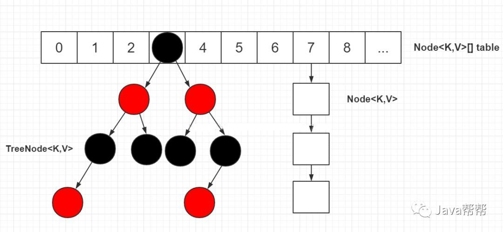
### 几个点：
先了解以下几个点，有利于更好的理解HashMap的源码和阅读本文。
> 1. 头节点指的是table表上索引位置的节点，也就是链表的头节点。
> 
> 2. 根结点（root节点）指的是红黑树最上面的那个节点，也就是没有父节点的节点。
> 
> 3. 红黑树的根结点不一定是索引位置的头结点。
> 
> 4. 转为红黑树节点后，链表的结构还存在，通过next属性维持，红黑树节点在进行操作时都会维护链表的结构，并不是转为红黑树节点，链表结构就不存在了。
> 
> 5. 在红黑树上，叶子节点也可能有next节点，因为红黑树的结构跟链表的结构是互不影响的，不会因为是叶子节点就说该节点已经没有next节点。
> 
> 6. 源码中一些变量定义：如果定义了一个节点p，则pl为p的左节点，pr为p的右节点，pp为p的父节点，ph为p的hash值，pk为p的key值，kc为key的类等等。源码中很喜欢在if/for等语句中进行赋值并判断，请注意。
> 
> 7. 红黑树在维护链表结构时，移除一个节点只需红黑树中增加了一个prev属性，其他操作同理。注：此处只是红黑树维护链表结构的操作，红黑树还需要单独进行红黑树的移除或者其他操作。
> 
> 8. 源码中进行红黑树的查找时，会反复用到以下两条规则：1）如果目标节点的hash值小于p节点的hash值，则向p节点的左边遍历；否则向p节点的右边遍历。2）如果目标节点的key值小于p节点的key值，则向p节点的左边遍历；否则向p节点的右边遍历。这两条规则是利用了红黑树的特性（左节点<根结点<右节点）。
> 
> 9. 源码中进行红黑树的查找时，会用dir（direction）来表示向左还是向右查找，dir存储的值是目标节点的hash/key与p节点的hash/key的比较结果。

### 基本属性
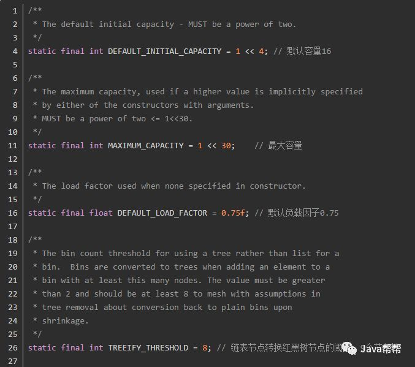
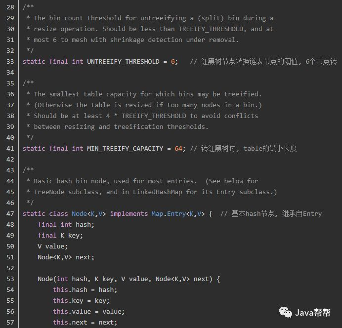
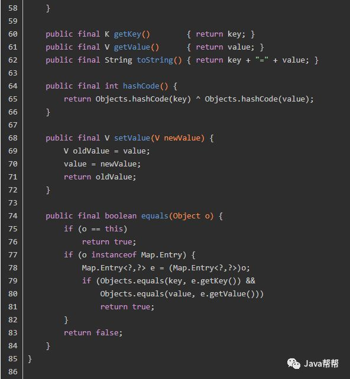
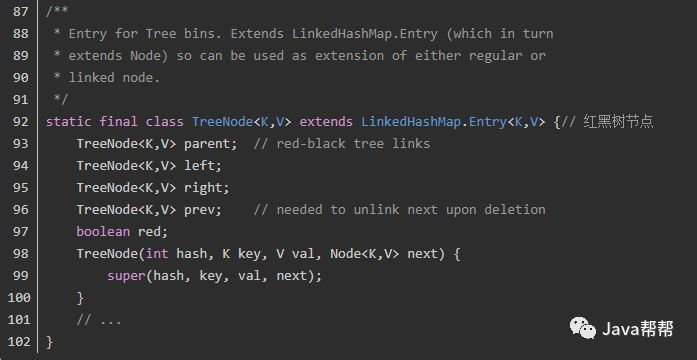
### 定位哈希桶数组索引位置
不管增加、删除、查找键值对，定位到哈希桶数组的位置都是很关键的第一步。前面说过HashMap的数据结构是“数组+链表+红黑树”的结合，所以我们当然希望这个HashMap里面的元素位置尽量分布均匀些，尽量使得每个位置上的元素数量只有一个，那么当我们用hash算法求得这个位置的时候，马上就可以知道对应位置的元素就是我们要的，不用遍历链表/红黑树，大大优化了查询的效率。HashMap定位数组索引位置，直接决定了hash方法的离散性能。下面是定位哈希桶数组的源码：

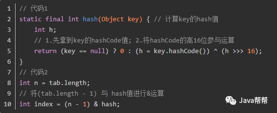

**整个过程本质上就是三步：**
> 1. 拿到key的hashCode值
> 
> 2. 将hashCode的高位参与运算，重新计算hash值
> 
> 3. 将计算出来的hash值与(table.length - 1)进行&运算

**方法解读：**

对于任意给定的对象，只要它的hashCode()返回值相同，那么计算得到的hash值总是相同的。我们首先想到的就是把hash值对table长度取模运算，这样一来，元素的分布相对来说是比较均匀的。

但是模运算消耗还是比较大的，我们知道计算机比较快的运算为位运算，因此JDK团队对取模运算进行了优化，使用上面代码2的位与运算来代替模运算。这个方法非常巧妙，它通过 “(table.length -1) & h” 来得到该对象的索引位置，这个优化是基于以下公式：x mod 2^n = x & (2^n - 1)。我们知道HashMap底层数组的长度总是2的n次方，并且取模运算为“h mod table.length”，对应上面的公式，可以得到该运算等同于“h & (table.length - 1)”。这是HashMap在速度上的优化，因为&比%具有更高的效率。

在JDK1.8的实现中，还优化了高位运算的算法，将hashCode的高16位与hashCode进行异或运算，主要是为了在table的length较小的时候，让高位也参与运算，并且不会有太大的开销。

下图是一个简单的例子，table长度为16：

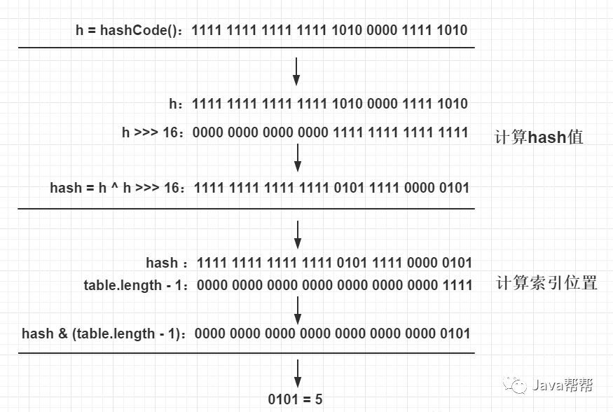
### get方法
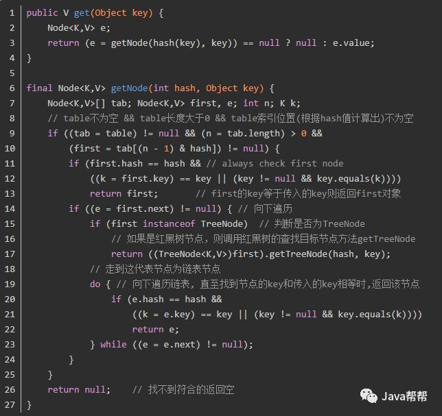
> 1. 先对table进行校验，校验是否为空，length是否大于0
> 
> 2. 使用table.length - 1和hash值进行位与运算，得出在table上的索引位置，将该索引位置的节点赋值给first节点，校验该索引位置是否为空
> 
> 3. 检查first节点的hash值和key是否和入参的一样，如果一样则first即为目标节点，直接返回first节点
> 
> 4. 如果first的next节点不为空则继续遍历
> 
> 5. 如果first节点为TreeNode，则调用getTreeNode方法（见下文代码块1）查找目标节点
> 
> 6. 如果first节点不为TreeNode，则调用普通的遍历链表方法查找目标节点
> 
> 7. 如果查找不到目标节点则返回空

#### 代码块1：getTreeNode方法
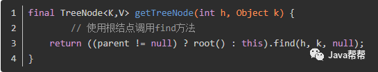
> 1. 找到调用此方法的节点的树的根节点
> 2. 使用该树的根节点调用find方法（见下文代码块2）

#### 代码块2：find方法
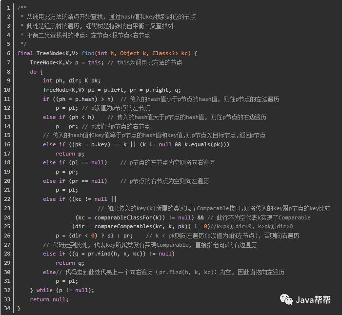
> 1. 将p节点赋值为调用此方法的节点
> 
> 2. 如果传入的hash值小于p节点的hash值，则往p节点的左边遍历
> 
> 3. 如果传入的hash值大于p节点的hash值，则往p节点的右边遍历
> 
> 4. 如果传入的hash值等于p节点的hash值，并且传入的key值跟p节点的key值相等, 则该p节点即为目标节点，返回p节点
> 
> 5. 如果p的左节点为空则向右遍历，反之如果p的右节点为空则向左遍历
> 
> 6. 如果传入的key（即代码中的参数变量k）所属的类实现了Comparable接口（kc不为空，comparableClassFor方法见下文代码块3），则将传入的key跟p节点的key进行比较（kc实现了Comparable接口，因此通过kc的比较方法进行比较），并将比较结果赋值给dir，如果dir<0则代表k<pk，则向p节点的左边遍历（pl）；否则，向p节点的右边遍历（pr）。
> 
> 7. 代码走到此处，代表key所属类没有实现Comparable，因此直接指定向p的右边遍历，如果能找到目标节点则返回
> 
> 8. 代码走到此处代表与第7点向右遍历没有找到目标节点，因此直接向左边遍历
> 
> 9. 以上都找不到目标节点则返回空

#### 代码块3：comparableClassFor方法
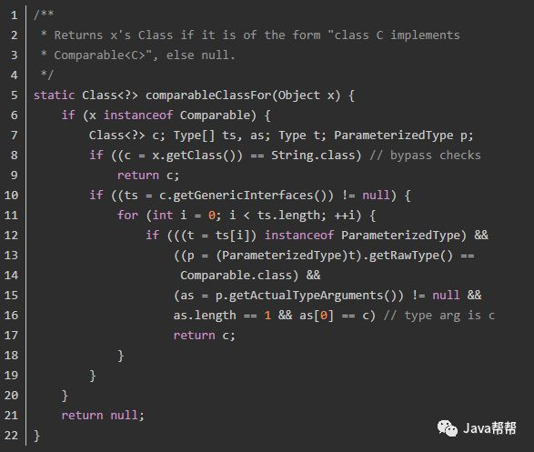

如果x实现了Comparable接口，则返回 x的Class。
### put方法
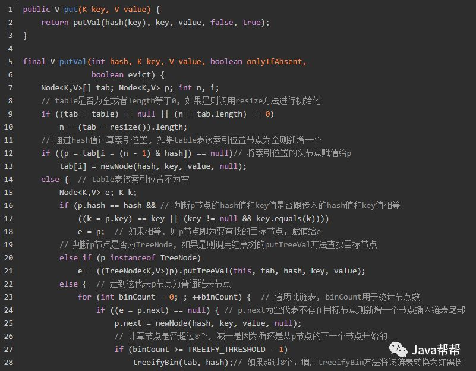
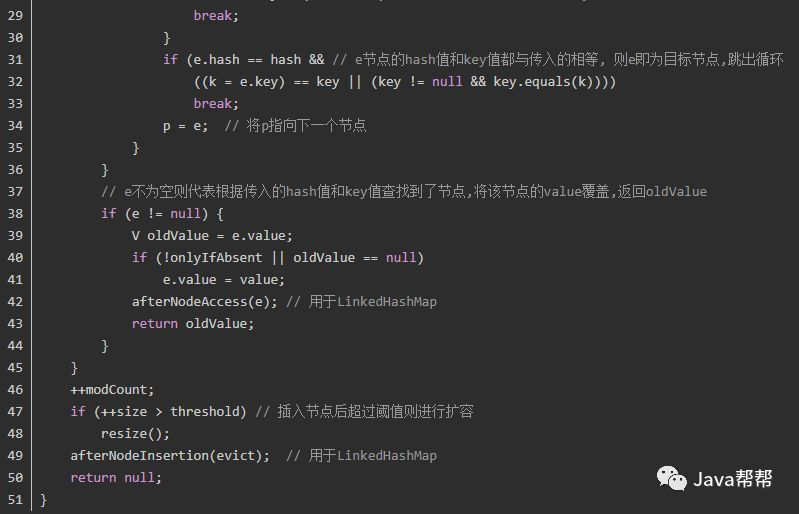
> 1. 校验table是否为空或者length等于0，如果是则调用resize方法（见下文resize方法）进行初始化
> 
> 2. 通过hash值计算索引位置，将该索引位置的头节点赋值给p节点，如果该索引位置节点为空则使用传入的参数新增一个节点并放在该索引位置
> 
> 3. 判断p节点的key和hash值是否跟传入的相等，如果相等, 则p节点即为要查找的目标节点，将p节点赋值给e节点
> 
> 4. 如果p节点不是目标节点，则判断p节点是否为TreeNode，如果是则调用红黑树的putTreeVal方法（见下文代码块4）查找目标节点
> 
> 5. 走到这代表p节点为普通链表节点，则调用普通的链表方法进行查找，并定义变量binCount来统计该链表的节点数
> 
> 6. 如果p的next节点为空时，则代表找不到目标节点，则新增一个节点并插入链表尾部，并校验节点数是否超过8个，如果超过则调用treeifyBin方法（见下文代码块6）将链表节点转为红黑树节点
> 
> 7. 如果遍历的e节点存在hash值和key值都与传入的相同，则e节点即为目标节点，跳出循环
> 
> 8. 如果e节点不为空，则代表目标节点存在，使用传入的value覆盖该节点的value，并返回oldValue
> 
> 9. 如果插入节点后节点数超过阈值，则调用resize方法（见下文resize方法）进行扩容

#### 代码块4：putTreeVal方法
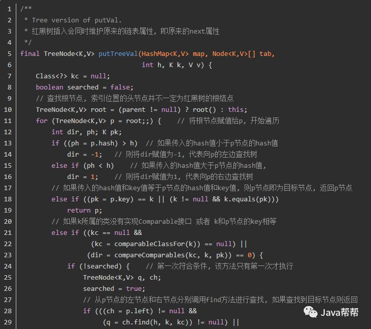
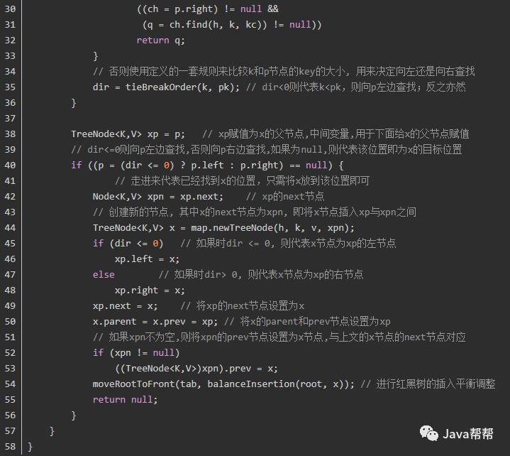
> 1. 查找当前红黑树的根结点，将根结点赋值给p节点，开始进行查找
> 
> 2. 如果传入的hash值小于p节点的hash值，将dir赋值为-1，代表向p的左边查找树
> 
> 3. 如果传入的hash值大于p节点的hash值， 将dir赋值为1，代表向p的右边查找树
> 
> 4. 如果传入的hash值等于p节点的hash值，并且传入的key值跟p节点的key值相等, 则该p节点即为目标节点，返回p节点
> 
> 5. 如果k所属的类没有实现Comparable接口，或者k和p节点的key使用compareTo方法比较相等：第一次会从p节点的左节点和右节点分别调用find方法（见上文代码块2）进行查找，如果查找到目标节点则返回；如果不是第一次或者调用find方法没有找到目标节点，则调用tieBreakOrder方法（见下文代码块5）比较k和p节点的key值的大小，以决定向树的左节点还是右节点查找。
> 
> 6. 如果dir <= 0则向左节点查找（p赋值为p.left，并进行下一次循环），否则向右节点查找，如果已经无法继续查找（p赋值后为null），则代表该位置即为x的目标位置，另外变量xp用来记录查找的最后一个节点，即下文新增的x节点的父节点。
> 
> 7. 以传入的hash、key、value参数和xp节点的next节点为参数，构建x节点（注意：xp节点在此处可能是叶子节点、没有左节点的节点、没有右节点的节点三种情况，即使它是叶子节点，它也可能有next节点，红黑树的结构跟链表的结构是互不影响的，不会因为某个节点是叶子节点就说它没有next节点，红黑树在进行操作时会同时维护红黑树结构和链表结构，next属性就是用来维护链表结构的），根据dir的值决定x决定放在xp节点的左节点还是右节点，将xp的next节点设为x，将x的parent和prev节点设为xp，如果原xp的next节点（xpn）不为空, 则将该节点的prev节点设置为x节点, 与上面的将x节点的next节点设置为xpn对应。
> 
> 8. 进行红黑树的插入平衡调整，见文末的解释2。

#### 代码块5：tieBreakOrder方法
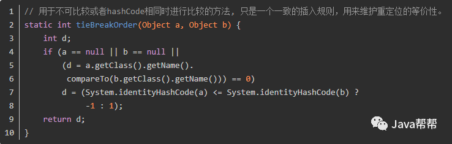

定义一套规则用于极端情况下比较两个参数的大小。
#### 代码块6：treeifyBin方法
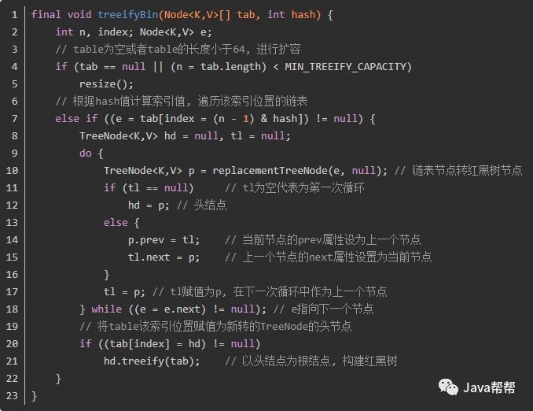
> 1. 校验table是否为空，如果长度小于64，则调用resize方法（见下文resize方法）进行扩容。
> 
> 2. 根据hash值计算索引值，将该索引位置的节点赋值给e节点，从e节点开始遍历该索引位置的链表。
> 
> 3. 调用replacementTreeNode方法（该方法就一行代码，直接返回一个新建的TreeNode）将链表节点转为红黑树节点，将头结点赋值给hd节点，每次遍历结束将p节点赋值给tl，用于在下一次循环中作为上一个节点进行一些链表的关联操作（p.prev = tl 和 tl.next = p）。
> 
> 4. 将table该索引位置赋值为新转的TreeNode的头节点hd，如果该节点不为空，则以hd为根结点，调用treeify方法（见下文代码块7）构建红黑树。

#### 代码块7：treeify方法
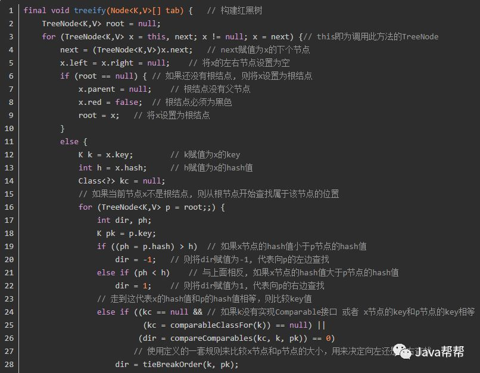
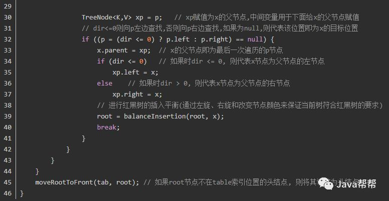
> 1. 从调用此方法的节点作为起点，开始进行遍历，并将此节点设为root节点，标记为黑色（x.red = false）。
> 2. 如果当前节点不是根结点，则从根节点开始查找属于该节点的位置（该段代码跟之前的代码块2和代码块4的查找代码类似）。
> 3. 如果x节点(将要插入红黑树的节点)的hash值小于p节点(当前遍历到的红黑树节点)的hash值，则向p节点的左边查找。
> 4. 与3相反，如果x节点的hash值大于p节点的hash值，则向p节点的右边查找。
> 5. 如果x的key没有实现Comparable接口，或者x节点的key和p节点的key相等，使用tieBreakOrder方法（见上文代码块5）来比较x节点和p节点的大小，以决定向左还是向右查找（dir <= 0向左，否则向右）。
> 6. 如果dir <= 0则向左节点查找（p赋值为p.left，并进行下一次循环），否则向右节点查找，如果已经无法继续查找（p赋值后为null），则代表该位置即为x的目标位置，另外变量xp用来记录最后一个节点，即为下文新增的x节点的父节点。
> 7. 将x的父节点设置为xp，根据dir的值决定x决定放在xp节点的左节点还是右节点，最后进行红黑树的插入平衡调整。
> 8. 调用moveRootToFront方法（见下文代码块8）将root节点调整到索引位置的头结点。

#### 代码块8：moveRootToFront方法
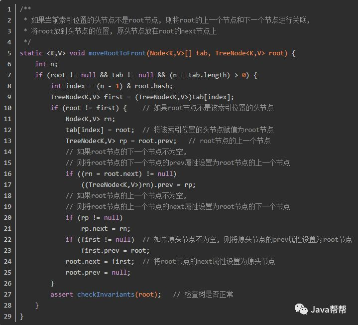
> 1. 校验root是否为空、table是否为空、table的length是否大于0。
> 
> 2. 根据root节点的hash值计算出索引位置，判断该索引位置的头节点是否为root节点，如果不是则进行以下操作将该索引位置的头结点替换为root节点。
> 
> 3. 将该索引位置的头结点赋值为root节点，如果root节点的next节点不为空，则将root节点的next节点的prev属性设置为root节点的prev节点。
> 
> 4. 如果root节点的prev节点不为空，则将root节点的prev节点的next属性设置为root节点的next节点（3和4两个操作是一个完整的链表移除某个节点过程）。
> 
> 5. 如果原头节点不为空，则将原头节点的prev属性设置为root节点
> 
> 6. 将root节点的next属性设置为原头节点（5和6两个操作将first节点接到root节点后面）
> 
> 7. root此时已经被放到该位置的头结点位置，因此将prev属性设为空。
> 
> 8. 调用checkInvariants方法（见下文代码块9）检查树是否正常。

#### 代码块9：checkInvariants方法
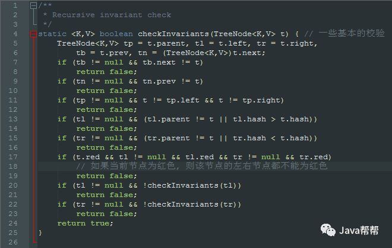

将传入的节点作为根结点，遍历所有节点，校验节点的合法性，主要是保证该树符合红黑树的规则。
### resize方法
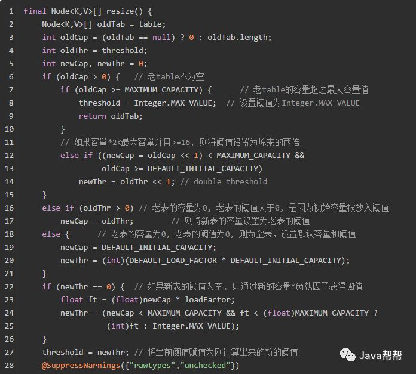
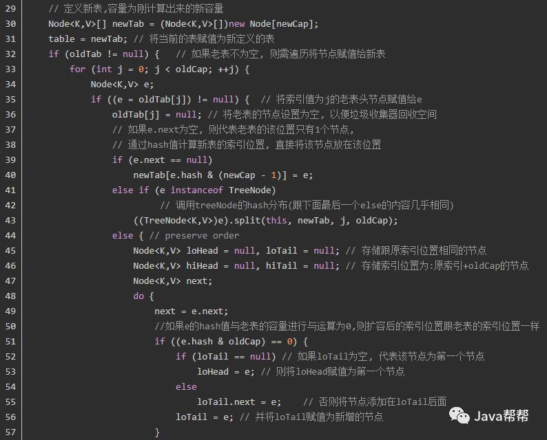
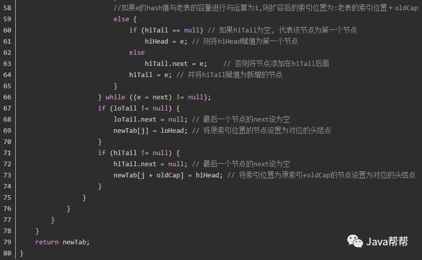
> 1. 如果老表的容量大于0，判断老表的容量是否超过最大容量值：如果超过则将阈值设置为Integer.MAX_VALUE，并直接返回老表（此时oldCap * 2比Integer.MAX_VALUE大，因此无法进行重新分布，只是单纯的将阈值扩容到最大）；如果容量 * 2小于最大容量并且不小于16，则将阈值设置为原来的两倍。
> 
> 2. 如果老表的容量为0，老表的阈值大于0，这种情况是传了容量的new方法创建的空表，将新表的容量设置为老表的阈值（这种情况发生在新创建的HashMap第一次put时，该HashMap初始化的时候传了初始容量，由于HashMap并没有capacity变量来存放容量值，因此传进来的初始容量是存放在threshold变量上（查看HashMap(int initialCapacity, float loadFactor)方法），因此此时老表的threshold的值就是我们要新创建的HashMap的capacity，所以将新表的容量设置为老表的阈值。
> 
> 3. 如果老表的容量为0，老表的阈值为0，这种情况是没有传容量的new方法创建的空表，将阈值和容量设置为默认值。
> 
> 4. 如果新表的阈值为空，则通过新的容量 * 负载因子获得阈值（这种情况是初始化的时候传了初始容量，跟第2点相同情况，也只有走到第2点才会走到该情况）。
> 
> 5. 将当前阈值设置为刚计算出来的新的阈值，定义新表，容量为刚计算出来的新容量，将当前的表设置为新定义的表。
> 
> 6. 如果老表不为空，则需遍历所有节点，将节点赋值给新表。
> 
> 7. 将老表上索引为j的头结点赋值给e节点，并将老表上索引为j的节点设置为空。
> 
> 8. 如果e的next节点为空，则代表老表的该位置只有1个节点，通过hash值计算新表的索引位置，直接将该节点放在新表的该位置上。
> 
> 9. 如果e的next节点不为空，并且e为TreeNode，则调用split方法（见下文代码块10）进行hash分布。
> 
> 10. 如果e的next节点不为空，并且e为普通的链表节点，则进行普通的hash分布。
> 
> 11. 如果e的hash值与老表的容量（为一串只有1个为2的二进制数，例如16为0000 0000 0001 0000）进行位与运算为0，则说明e节点扩容后的索引位置跟老表的索引位置一样（见例子1），进行链表拼接操作：如果loTail为空，代表该节点为第一个节点，则将loHead赋值为该节点；否则将节点添加在loTail后面，并将loTail赋值为新增的节点。
> 
> 12. 如果e的hash值与老表的容量（为一串只有1个为2的二进制数，例如16为0000 0000 0001 0000）进行位与运算为1，则说明e节点扩容后的索引位置为：老表的索引位置＋oldCap（见例子1），进行链表拼接操作：如果hiTail为空，代表该节点为第一个节点，则将hiHead赋值为该节点；否则将节点添加在hiTail后面，并将hiTail赋值为新增的节点。
> 
> 13. 老表节点重新hash分布在新表结束后，如果loTail不为空（说明老表的数据有分布到新表上原索引位置的节点），则将最后一个节点的next设为空，并将新表上原索引位置的节点设置为对应的头结点；如果hiTail不为空（说明老表的数据有分布到新表上原索引+oldCap位置的节点），则将最后一个节点的next设为空，并将新表上索引位置为原索引+oldCap的节点设置为对应的头结点。
> 
> 14. 返回新表。

#### 代码块10：split方法
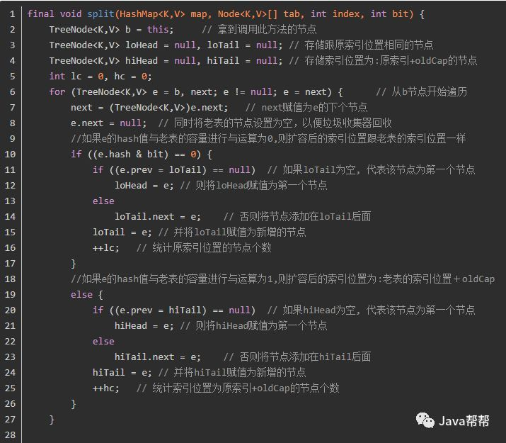
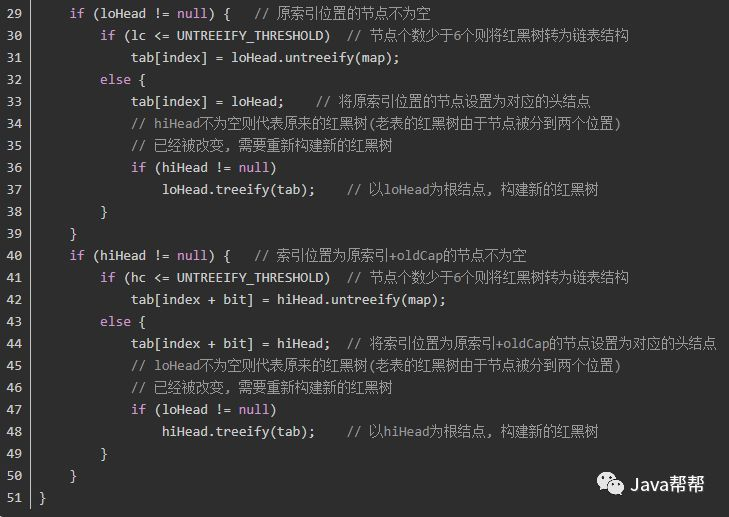
> 1. 以调用此方法的节点开始，遍历整个红黑树节点（此处实际是遍历的链表节点，上文提过，红黑树节点也会同时维护链表结构）。
> 
> 2. 如果e的hash值与老表的容量（为一串只有1个为2的二进制数，例如16为0000 0000 0001 0000）进行位与运算为0，则说明e节点扩容后的索引位置跟老表的索引位置一样（见下文例子1），进行链表拼接操作：如果loTail为空，代表该节点为第一个节点，则将loHead赋值为该节点；否则将节点添加在loTail后面，并将loTail赋值为新增的节点，并统计原索引位置的节点个数。
> 
> 3. 如果e的hash值与老表的容量（为一串只有1个为2的二进制数，例如16为0000 0000 0001 0000）进行位与运算为1，则说明e节点扩容后的索引位置为：老表的索引位置＋oldCap（见例子1），进行链表拼接操作：如果hiTail为空，代表该节点为第一个节点，则将hiHead赋值为该节点；否则将节点添加在hiTail后面，并将hiTail赋值为新增的节点，并统计索引位置为原索引+oldCap的节点个数。
> 
> 4. 如果原索引位置的节点不为空：如果当该索引位置节点数<=6个，调用untreeify方法（见下文代码块11）将红黑树节点转为链表节点；否则将原索引位置的节点设置为对应的头结点（即loHead结点），如果判断hiHead不为空则代表原来的红黑树（老表的红黑树由于节点被分到两个位置）已经被改变，需要重新构建新的红黑树，以loHead为根结点，调用treeify方法（见上文代码块7）构建新的红黑树。
> 
> 5. 如果索引位置为原索引+oldCap的节点不为空：如果当该索引位置节点数<=6个，调用untreeify方法（见下文代码块11）将红黑树节点转为链表节点；否则将索引位置为原索引+oldCap的节点设置为对应的头结点（即hiHead结点），如果判断loHead不为空则代表原来的红黑树（老表的红黑树由于节点被分到两个位置）已经被改变，需要重新构建新的红黑树，以hiHead为根结点，调用treeify方法（见上文代码块7）构建新的红黑树。

#### 代码块11：untreeify方法
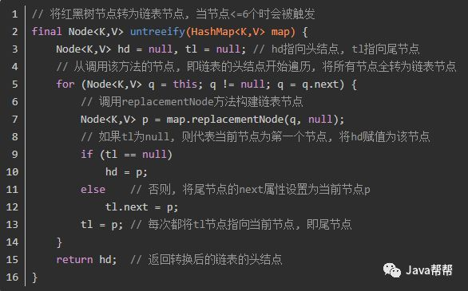
> 1. 从调用该方法的节点，即链表的头结点开始遍历, 将所有节点全转为链表节点
>
> 2. 调用replacementNode方法构建链表节点
>
> 3. 如果tl为null, 则代表当前节点为第一个节点，将hd赋值为该节点，否则, 将尾节点的next属性设置为当前节点p
>
> 4. 每次都将tl节点指向当前节点, 即尾节点
>
> 5. 返回转换后的链表的头结点

#### 例子1：扩容后，节点重hash为什么只可能分布在原索引位置与原索引+oldCap位置？
扩容代码中，使用e节点的hash值跟oldCap进行位与运算，以此决定将节点分布到原索引位置或者原索引+oldCap位置上，这是为什么了？

假设老表的容量为16，即oldCap=16，则新表容量为16*2=32，假设节点1的hash值为0000 0000 0000 0000 0000 1111 0000 1010，节点2的hash值为0000 0000 0000 0000 0000 1111 0001 1010，则节点1和节点2在老表的索引位置计算如下图计算1，由于老表的长度限制，节点1和节点2的索引位置只取决于节点hash值的最后4位。再看计算2，计算2为新表的索引计算，可以知道如果两个节点在老表的索引位置相同，则新表的索引位置只取决于节点hash值倒数第5位的值，而此位置的值刚好为老表的容量值16，此时节点在新表的索引位置只有两种情况：原索引位置和原索引+oldCap位置（在此例中即为10和10+16=26）。由于结果只取决于节点hash值的倒数第5位，而此位置的值刚好为老表的容量值16，因此此时新表的索引位置的计算可以替换为计算3，直接使用节点的hash值与老表的容量16进行位于运算，如果结果为0则该节点在新表的索引位置为原索引位置，否则该节点在新表的索引位置为原索引+oldCap位置。

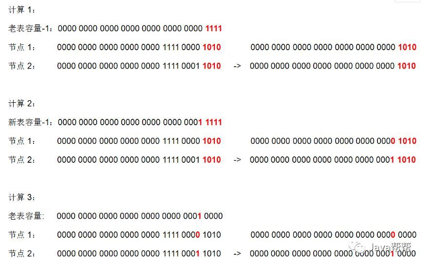
### remove方法
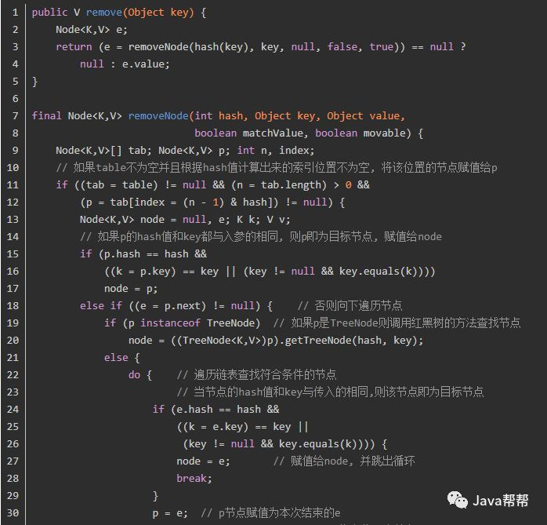
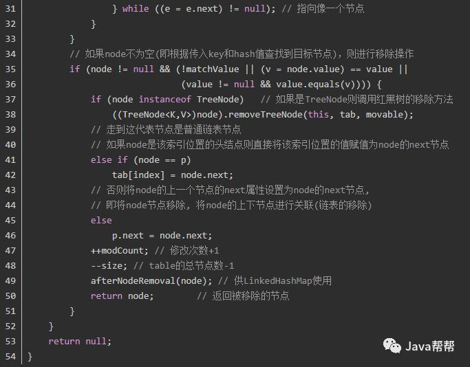
> 1. 如果table不为空并且根据hash值计算出来的索引位置的值不为空，将该位置的节点赋值给p。
> 
> 2. 如果p节点的hash值和key都与传入的相同，则p即为目标节点，赋值给node。
> 
> 3. 向下遍历节点，如果p是TreeNode则调用getTreeNode方法（见上文代码块1）查找节点，并赋值给node。
> 
> 4. 遍历链表查找符合条件的节点，当节点的hash值和key与传入的值相同，则该节点即为目标节点, 赋值给node，并跳出循环。
> 
> 5. 如果node不为空，即根据传入key和hash值查找到目标节点，判断node是否为TreeNode，如果是则调用红黑树的移除方法removeTreeNode方法（见下文代码块12）。
> 
> 6. 如果node是该索引位置的头结点则直接将该索引位置的值赋值为node节点的next节点。
> 
> 7. 否则将node的上一个节点（p节点）的next节点设置为node的next节点，即将node节点移除，将node的上下节点进行关联。

#### 代码块12：removeTreeNode方法
这块代码比较长，目的就是移除调用此方法的节点，也就是该方法中的this节点。移除包括链表的处理和红黑树的处理。可以结合下文的图解理解。

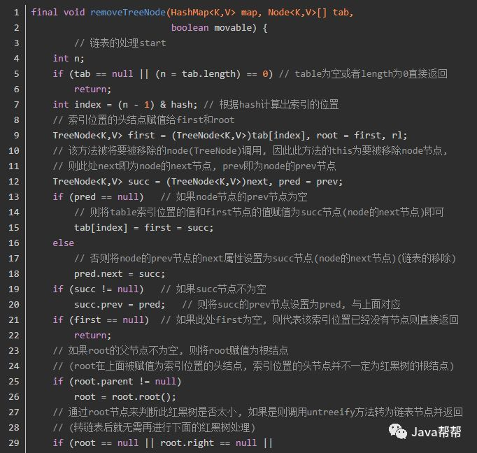
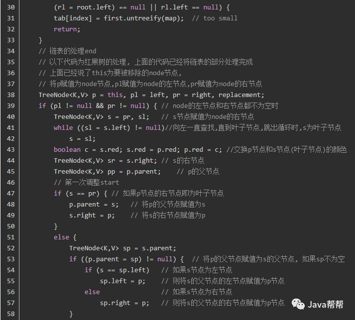
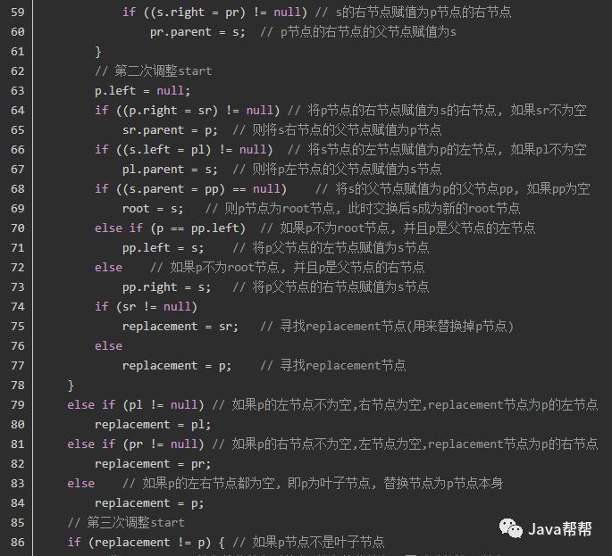
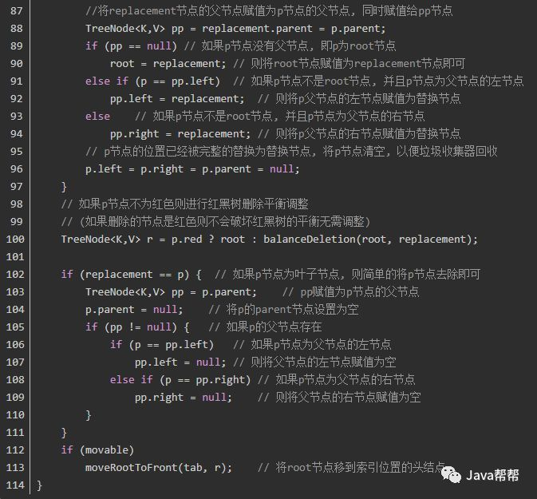
> 1. 如果table为空或者length为0直接返回。
> 
> 2. 根据hash值和length-1位于运算计算出索引的位置。
> 
> 3. 将索引位置的头结点赋值给first和root，removeTreeNode方法是被将要移除的节点node调用，因此removeTreeNode方法里的this即为将要被移除的节点node，将node的next节点赋值给succ节点，prev节点赋值给pred节点。
> 
> 4. 如果node节点的prev节点为空，则代表要被移除的node节点为头结点，则将table索引位置的值和first节点的值赋值为node的next节点（succ节点）即可。
> 
> 5. 否则将node的prev节点（pred节点）的next节点设置为node的next节点（succ节点），如果succ节点不为空，则将succ的prev节点设置为pred。
> 
> 6. 如果进行到此first节点为空，则代表该索引位置已经没有节点则直接返回。
> 
> 7. 如果root的父节点不为空，则将root赋值为根结点（root在上面被赋值为索引位置的头结点，索引位置的头节点并不一定为红黑树的根结点）。
> 
> 8. 通过root节点来判断此红黑树是否太小，如果太小则转为链表节点并返回（转链表后就无需再进行下面的红黑树处理），链表维护部分到此结束，此前的代码说明了，红黑树在进行移除的同时也会维护链表结构，之后的代码为红黑树的移除节点处理。
> 
> 9. 上面已经说了this为将要被移除的node节点，将p节点赋值为将要被移除的node节点（则此时p节点就是我们要移除的节点），pl赋值为node的左节点, pr赋值为node的右节点（方法的命令见开头第6点），replacement变量用来存储将要替换掉被移除的node节点。
> 
> 10. 如果p的左节点和右节点都不为空时，s节点赋值为p的右节点；向s的左节点一直向左查找, 直到叶子节点，跳出循环时，s为叶子节点；交换p节点和s节点（叶子节点）的颜色（此文下面的所有操作都是为了实现将p节点和s节点进行位置调换，因此此处先将颜色替换）；sr赋值为s节点的右节点，pp节点赋值为p节点的父节点。
> 
> 11. PS：下面的第一次调整和第二次调整是将p节点和s节点进行了位置调换，然后找出要替换掉p节点的replacement；第三次调整是将replacement节点覆盖掉p节点；这部分的代码逻辑比较不容易理解透，建议自己动手画图模拟。
> 
> 12. 进行第一次调整：如果p节点的右节点即为叶子节点，将p的父节点赋值为s，将s的右节点赋值为p即可；否则，将p的父节点赋值为s的父节点sp，并判断sp是否为空，如果不为空，并判断s是sp的左节点还是右节点，将s节点替换为p节点；将s的右节点赋值为p节点的右节点pr，如果pr不为空则将pr的父节赋值为s节点。
> 
> 13. 进行第二次调整：将p节点的左节点清空（上文pl已经保存了该节点）；将p节点的右节点赋值为s的右节点sr，如果sr不为空，则将sr的父节点赋值为p节点；将s节点的左节点赋值为p的左节点pl，如果pl不为空，则将p左节点的父节点赋值为s节点；将s的父节点赋值为p的父节点pp，如果pp为空，则p节点为root节点，此时交换后s成为新的root节点，将root赋值为s节点；如果p不为root节点，并且p是父节点的左节点，将p父节点的左节点赋值为s节点；如果p不为root节点，并且p是父节点的右节点，将p父节点的右节点赋值为s节点；如果sr不为空，将replacement赋值为sr节点，否则赋值为p节点。
> 
> 14. 承接第10点的判断，第10点~第12点为p的左右节点都不为空的情况需要进行的处理；如果p的左节点不为空，右节点为空，将replacement赋值为p的左节点即可；如果p的右节点不为空，左节点为空，将replacement赋值为p的右节点即可；如果p的左右节点都为空，即p为叶子节点, 将replacement赋值为p节点本身。
> 
> 15. 进行第三次调整：如果p节点不是replacement（即p不是叶子节点），将replacement的父节点赋值为p的父节点，同事赋值给pp节点；如果pp为空（p节点没有父节点），即p为root节点，则将root节点赋值为replacement节点即可；如果p节点不是root节点，并且p节点为父节点的左节点，则将p父节点的左节点赋值为replacement节点；如果p节点不是root节点，并且p节点为父节点的右节点，则将p父节点的右节点赋值为replacement节点；p节点的位置已经被完整的替换为replacement节点, 将p节点清空。
> 
> 16. 如果p节点不为红色则进行红黑树删除平衡调整（如果删除的节点是红色则不会破坏红黑树的平衡无需调整）。
> 
> 17. 如果p节点为叶子节点，则简单的将p节点移除：将pp赋值为p节点的父节点，将p的parent节点设置为空，如果p的父节点pp存在，如果p节点为父节点的左节点，则将父节点的左节点赋值为空，如果p节点为父节点的右节点，则将父节点的右节点赋值为空。
> 
> 18. 如果movable为true，则调用moveRootToFront方法（见上文代码块8）将root节点移到索引位置的头结点。

#### 解释1：为什么sr是replacement的首选，p为备选？
解析：首先我们看sr是什么？从代码中可以看到sr第一次被赋值时，是在s节点进行了向左穷遍历结束后，因此此时s节点是没有左节点的，sr即为s节点的右节点。而从上面的三次调整我们知道，p节点已经跟s节点进行了位置调换，所以此时sr其实是p节点的右节点，并且p节点没有左节点，因此要移除p节点，只需要将p节点的右节点sr覆盖掉p节点即可，因此sr是replacement的首选，如果sr为空，则代表p节点为叶子节点，此时将p节点清空即可。
#### 图解1：removeTreeNode图解
本图解忽略红黑树的颜色，请注意。

下面的图解是代码中的最复杂的情况，即流程最长的那个，p节点不为根结点，p节点有左右节点，s节点不为pr节点，s节点有右节点。

#### 解释2：关于红黑树的平衡调整？
答：红黑树的操作涉及的操作比较复杂，三言两语无法说清。有兴趣的可以去单独学习，本文由于篇幅关系暂不详细介绍红黑树的具体操作，在这简单的介绍：红黑树是一种自平衡二叉树，拥有优秀的查询和插入/删除性能，广泛应用于关联数组。

对比AVL树，AVL要求每个结点的左右子树的高度之差的绝对值（平衡因子）最多为1，而红黑树通过适当的放低该条件（红黑树限制从根到叶子的最长的可能路径不多于最短的可能路径的两倍长，结果是这个树大致上是平衡的），以此来减少插入/删除时的平衡调整耗时，从而获取更好的性能，而这虽然会导致红黑树的查询会比AVL稍慢，但相比插入/删除时获取的时间，这个付出在大多数情况下显然是值得的。

在HashMap中的应用：HashMap在进行插入和删除时有可能会触发红黑树的插入平衡调整（balanceInsertion方法）或删除平衡调整（balanceDeletion ）方法，调整的方式主要有以下手段：左旋转（rotateLeft方法）、右旋转（rotateRight方法）、改变节点颜色（x.red = false、x.red = true），进行调整的原因是为了维持红黑树的数据结构。
### 死循环问题
在Jdk 1.8以前，Java语言在并发情况下使用HashMap造成Race Condition，从而导致死循环。程序经常占了100%的CPU，查看堆栈，你会发现程序都Hang在了HashMap.get()这个方法上了，重启程序后问题消失。有人将这个问题当成一个bug提给了Sun，但是Sun认为这并不是个bug，因为HashMap本来就不保证并发的线程安全性，在并发下，要用ConcurrentHashMap来代替。

那么，在Jdk 1.8的时候，这个问题解决了吗？

我们知道，Jdk 1.8以前，导致死循环的主要原因是扩容后，节点的顺序会反掉，如下图：扩容前节点A在节点C前面，而扩容后节点C在节点A前面。

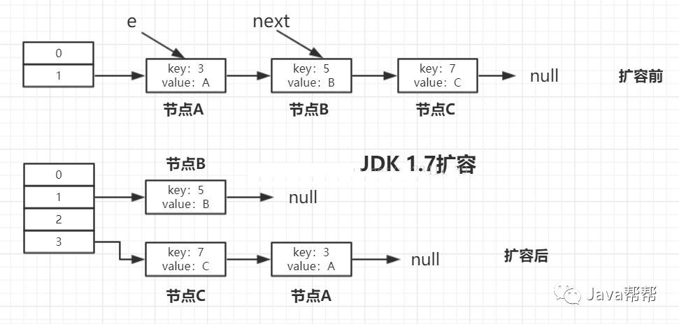
### JDK 1.8扩容过程
JDK1.8 普通链表的扩容代码，如下图所示，在上文已经分析过了：主要是在一个do/while中处理同一个位置的所有节点。

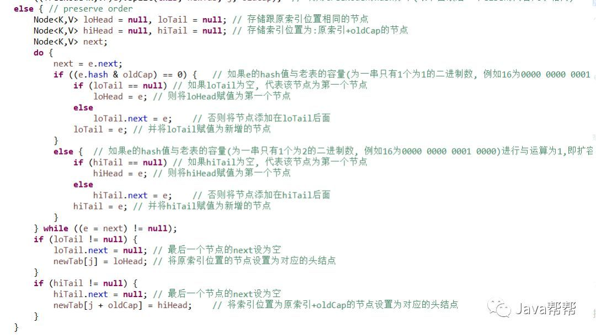

前提：我们假设有3个节点，节点A，节点B，节点C，并且假设他们的hash值等于key值，则按上图扩容的过程模拟如下。

先看下老表和新表计算索引位置的过程：（hash计算省略前面28位0，只看最后4位）

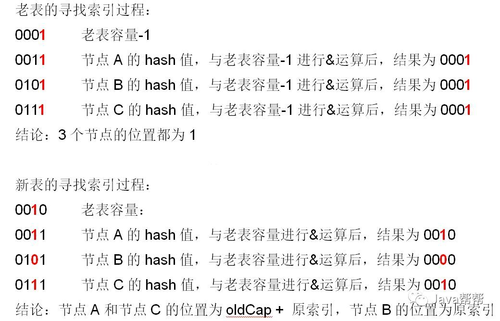

具体扩容过程：
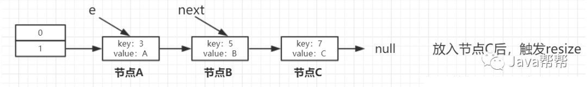
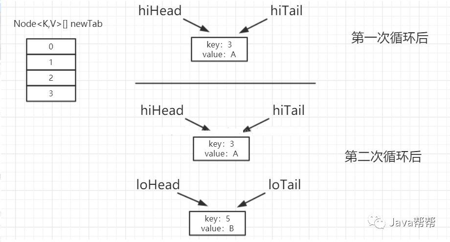
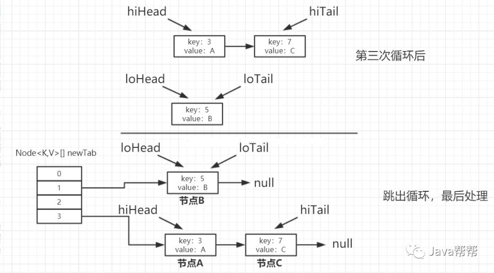

结果：可以看出，扩容后，节点A和节点C的先后顺序跟扩容前是一样的。因此，即使此时有多个线程并发扩容，也不会出现死循环的情况。当然，这仍然改变不了HashMap仍是非并发安全，在并发下，还是要使用ConcurrentHashMap来代替。
### HashMap和Hashtable的区别：
> 1. HashMap允许key和value为null，Hashtable不允许。
> 
> 2. HashMap的默认初始容量为16，Hashtable为11。
> 
> 3. HashMap的扩容为原来的2倍，Hashtable的扩容为原来的2倍加1。
> 
> 4. HashMap是非线程安全的，Hashtable是线程安全的。
> 
> 5. HashMap的hash值重新计算过，Hashtable直接使用hashCode。
> 
> 6. HashMap去掉了Hashtable中的contains方法。
> 
> 7. HashMap继承自AbstractMap类，Hashtable继承自Dictionary类。

### 总结：
> 1. HashMap的底层是个Node数组（Node<K,V>[] table），在数组的具体索引位置，如果存在多个节点，则可能是以链表或红黑树的形式存在。
> 
> 2. 增加、删除、查找键值对时，定位到哈希桶数组的位置是很关键的一步，源码中是通过下面3个操作来完成这一步：1）拿到key的hashCode值；2）将hashCode的高位参与运算，重新计算hash值；3）将计算出来的hash值与(table.length - 1)进行&运算。
> 
> 3. HashMap的默认初始容量（capacity）是16，capacity必须为2的幂次方；默认负载因子（load factor）是0.75；实际能存放的节点个数（threshold，即触发扩容的阈值）= capacity * load factor。
> 
> 4. HashMap在触发扩容后，阈值会变为原来的2倍，并且会进行重hash，重hash后索引位置index的节点的新分布位置最多只有两个：原索引位置或原索引+oldCap位置。例如capacity为16，索引位置5的节点扩容后，只可能分布在新报索引位置5和索引位置21（5+16）。
> 
> 5. 导致HashMap扩容后，同一个索引位置的节点重hash最多分布在两个位置的根本原因是：1）table的长度始终为2的n次方；2）索引位置的计算方法为“(table.length - 1) & hash”。HashMap扩容是一个比较耗时的操作，定义HashMap时尽量给个接近的初始容量值。
> 
> 6. HashMap有threshold属性和loadFactor属性，但是没有capacity属性。初始化时，如果传了初始化容量值，该值是存在threshold变量，并且Node数组是在第一次put时才会进行初始化，初始化时会将此时的threshold值作为新表的capacity值，然后用capacity和loadFactor计算新表的真正threshold值。
> 
> 7. 当同一个索引位置的节点在增加后达到9个时，会触发链表节点（Node）转红黑树节点（TreeNode，间接继承Node），转成红黑树节点后，其实链表的结构还存在，通过next属性维持。链表节点转红黑树节点的具体方法为源码中的treeifyBin(Node<K,V>[] tab, int hash)方法。
> 
> 8. 当同一个索引位置的节点在移除后达到6个时，并且该索引位置的节点为红黑树节点，会触发红黑树节点转链表节点。红黑树节点转链表节点的具体方法为源码中的untreeify(HashMap<K,V> map)方法。
> 
> 9. HashMap在JDK1.8之后不再有死循环的问题，JDK1.8之前存在死循环的根本原因是在扩容后同一索引位置的节点顺序会反掉。
> 
> 10. HashMap是非线程安全的，在并发场景下使用ConcurrentHashMap来代替。
