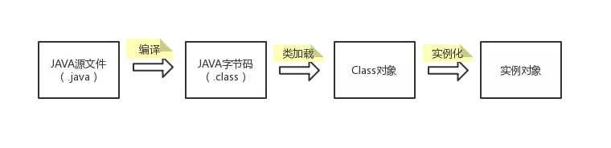
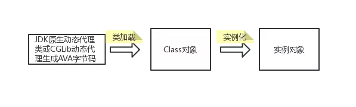
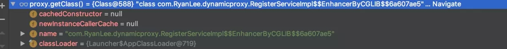

### 1. 静态代理VS动态代理
代理类可以增强被代理对象的方法。可分为静态代理和动态代理。
#### 1.1 静态代理
静态代理：源代码中需要声明代理类
```java
public class TestStaticProxy {

    public static void main(String[] args) {
        IRegisterService iRegisterService = new RegisterServiceImpl();
        IRegisterService proxy = new RegisterServiceProxy(iRegisterService);
        proxy.register("RyanLee", "123");
    }}

interface IRegisterService {
    void register(String name, String pwd);}

class RegisterServiceImpl implements IRegisterService {
    @Override
    public void register(String name, String pwd) {
        System.out.println(String.format("【向数据库中插入数据】name：%s，pwd：%s", name, pwd));
    }}

class RegisterServiceProxy implements IRegisterService {
    IRegisterService iRegisterService;

    public RegisterServiceProxy(IRegisterService iRegisterService) {
        this.iRegisterService = iRegisterService;
    }

    @Override
    public void register(String name, String pwd) {
        System.out.println("[Proxy]一些前置处理");
        System.out.println(String.format("[Proxy]打印注册信息：姓名：%s,密码：%s", name, pwd));
        iRegisterService.register(name, pwd);
        System.out.println("[Proxy]一些后置处理");

    }}
```
执行结果
```java
[Proxy]一些前置处理
[Proxy]打印注册信息：姓名：RyanLee,密码：123
【向数据库中插入数据】name：RyanLee，pwd：123
[Proxy]一些后置处理
```
#### 1.2 动态代理
动态代理：无需声明代理类。是使用反射和字节码的技术，在运行期创建指定接口或类的子类（即动态代理类）以及其实例对象的技术。通过动态代理技术可以无侵入地对代码进行增强。




动态代理实现的方式主要有两种：
> 1. JDK原生动态代理
> 
> 2. CGLib动态代理（CG:Code Generation）

### 2. 动态代理的实现方式
#### 2.1 JDK原生动态代理
动态代理类和被代理类必须继承同一个接口。动态代理只能对接口中声明的方法进行代理。
##### 2.1.1 Proxy
java.lang.reflect.Proxy是所有动态代理的父类。它通过静态方法newProxyInstance()来创建动态代理的class对象和实例。
##### 2.1.2 InvocationHandler
每一个动态代理实例都有一个关联的InvocationHandler。通过代理实例调用方法，方法调用请求会被转发给InvocationHandler的invoke方法。
##### 2.1.3 例子
```java
import java.lang.reflect.InvocationHandler;
import java.lang.reflect.Method;
import java.lang.reflect.Proxy;

public class TestJdkDynamicProxy {

    public static void main(String[] args) {
        IRegisterService iRegisterService = new RegisterServiceImpl();
        InsertDataHandler insertDataHandler = new InsertDataHandler();
        IRegisterService proxy = (IRegisterService)insertDataHandler.getProxy(iRegisterService);
        proxy.register("RyanLee", "123");
    }}


class InsertDataHandler implements InvocationHandler {
    Object obj;

    public Object getProxy(Object obj){
        this.obj = obj;
        return Proxy.newProxyInstance(obj.getClass().getClassLoader(), obj.getClass().getInterfaces(), this);
    }

    @Override
    public Object invoke(Object proxy, Method method, Object[] args) throws Throwable {
        doBefore();
        Object result = method.invoke(obj, args);
        doAfter();
        return result;
    }
    private void doBefore() {
        System.out.println("[Proxy]一些前置处理");
    }
    private void doAfter() {
        System.out.println("[Proxy]一些后置处理");
    }

}
```
执行结果
```java
[Proxy]一些前置处理
【向数据库中插入数据】name：RyanLee，pwd：123
[Proxy]一些后置处理
```
**proxy类型：**


#### 2.2 CGLib动态代理
CGLib(Code Generation Library)是一个基于ASM的字节码生成库。它允许我们在运行时对字节码进行修改或动态生成。CGLib通过继承被代理类的方式实现代理。
##### 2.2.1 Enhancer
Enhancer指定要代理的目标对象。通过create方法得到代理对象。通过代理实例调用非final方法，方法调用请求会首先转发给MethodInterceptor的intercept
##### 2.2.2 MethodInterceptor
通过代理实例调用方法，调用请求都会转发给intercept方法进行增强。
##### 2.2.3 例子
```java
import net.sf.cglib.proxy.Enhancer;
import net.sf.cglib.proxy.MethodInterceptor;
import net.sf.cglib.proxy.MethodProxy;

import java.lang.reflect.Method;

public class TestCGLibDynamicProxy {

    public static void main(String[] args) {
        IRegisterService iRegisterService = new RegisterServiceImpl();
        InsertDataInterceptor interceptor = new InsertDataInterceptor();
        RegisterServiceImpl proxy = (RegisterServiceImpl) interceptor.getProxy(iRegisterService);
        proxy.register("RyanLee", "123");
    }}

class InsertDataInterceptor implements MethodInterceptor {
    Object target;

    public Object getProxy(Object target) {
        this.target = target;
        Enhancer enhancer = new Enhancer();
        enhancer.setSuperclass(this.target.getClass());
        // 回调方法
        enhancer.setCallback(this);
        // 创建代理对象
        return enhancer.create();
    }

    private void doBefore() {
        System.out.println("[Proxy]一些前置处理");
    }

    private void doAfter() {
        System.out.println("[Proxy]一些后置处理");
    }

    @Override
    public Object intercept(Object o, Method method, Object[] objects, MethodProxy methodProxy) throws Throwable {
        doBefore();
        Object result = methodProxy.invoke(target, objects);
        doAfter();
        return result;
    }}
```
执行结果
```java
[Proxy]一些前置处理
【向数据库中插入数据】name：RyanLee，pwd：123
[Proxy]一些后置处理
```
**proxy类型：**


#### 2.3 JDK动态代理 VS CGLib动态代理。
**两种动态代理的最大的区别是：**

> JDK动态代理要求被代理对象必须基于接口来实现。动态代理类和被代理类必须继承同一个接口。
> 
> 动态代理只能对接口中声明的方法进行代理。对那些没有实现接口的bean。JDK动态代理无法代理。而CGLib通过继承被代理类的方式实现代理。

* Spring 注解默认使用JDK动态代理来实现。也可以通过修改配值，改为使用CGLib动态代理来实现。因而建议Spring注解不要写在Interface上。
