要说动态代理，必须先聊聊静态代理。

###静态代理

假设现在项目经理有一个需求：在项目现有所有类的方法前后打印日志。你如何在不修改已有代码的前提下，完成这个需求？

我首先想到的是静态代理。具体做法是：

1. 为现有的每一个类都编写一个对应的代理类，并且让它实现和目标类相同的接口（假设都有）

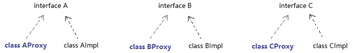

2. 在创建代理对象时，通过构造器塞入一个目标对象，然后在代理对象的方法内部调用目标对象同名方法，并在调用前后打印日志。也就是说，代理对象+增强代码+目标对象（原对象）。

有了代理对象后，就不用原对象了。


###静态代理的缺陷

程序员要手动为每一个目标类编写对应的代理类。如果当前系统已经有成百上千个类，工作量太大了。所以，现在我们的努力方向是：如何少写或者不写代理类，却能完成代理功能？

###复习对象的创建

很多初学Java的朋友眼中创建对象的过程

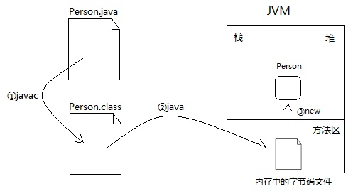

实际上可以换个角度，也说得通

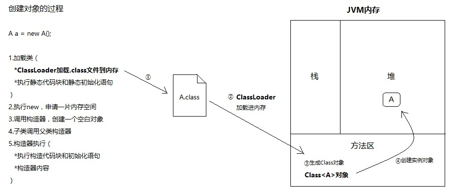

所谓的Class对象，是Class类的实例，而Class类是描述所有类的，比如Person类，Student类。

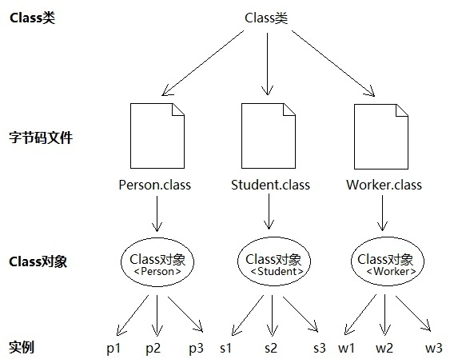

可以看出，要创建一个实例，最关键的就是得到对应的Class对象。只不过对于初学者来说，new这个关键字配合构造方法，实在太好用了，底层隐藏了太多细节，一句 Person p = new Person()直接把对象返回给你了。
我自己刚开始学Java时，也没意识到Class对象的存在。

分析到这里，貌似有了思路：

**能否不写代理类，而直接得到代理Class对象，然后根据它创建代理实例（反射）。**

Class对象包含了一个类的所有信息，比如构造器、方法、字段等。如果我们不写代理类，这些信息从哪获取呢？苦思冥想，突然灵光一现：代理类和目标类理应实现同一组接口。之所以实现相同接口，是为了尽可能保证代理对象的内部结构和目标对象一致，
这样我们对代理对象的操作最终都可以转移到目标对象身上，代理对象只需专注于增强代码的编写。还是上面这幅图：

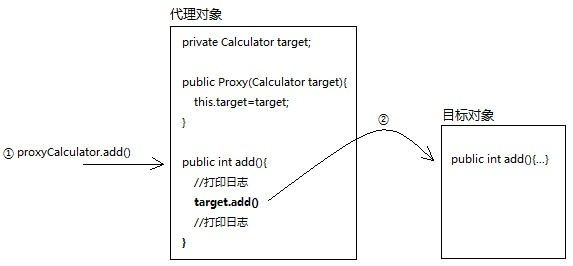

所以，可以这样说：接口拥有代理对象和目标对象共同的类信息。所以，我们可以从接口那得到理应由代理类提供的信息。但是别忘了，接口是无法创建对象的，怎么办？


###动态代理

JDK提供了java.lang.reflect.InvocationHandler接口和java.lang.reflect.Proxy类，这两个类相互配合，入口是Proxy，所以我们先聊它。

Proxy有个静态方法：getProxyClass(ClassLoader,interfaces)，只要你给它传入类加载器和一组接口，它就给你返回代理Class对象。

用通俗的话说，getProxyClass()这个方法，会从你传入的接口Class中，“拷贝”类结构信息到一个新的Class对象中，但新的Class对象带有构造器，是可以创建对象的。打个比方，
一个大内太监（接口Class），空有一身武艺（类信息），但是无法传给后人。现在江湖上有个妙手神医（Proxy类），发明了克隆大法（getProxyClass），不仅能克隆太监的一身武艺，
还保留了小DD（构造器）...（这到底是道德の沦丧，还是人性的扭曲，欢迎走进动态代理）

所以，一旦我们明确接口，完全可以通过接口的Class对象，创建一个代理Class，通过代理Class即可创建代理对象。

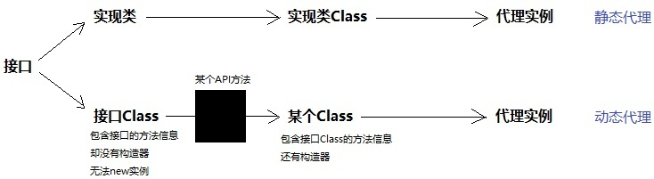

静态代理：
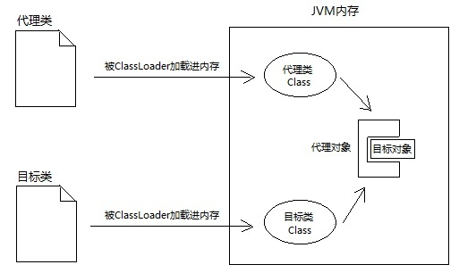

动态代理：
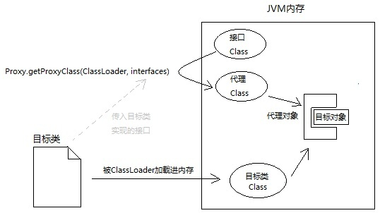


所以，按我理解，Proxy.getProxyClass()这个方法的本质就是：以Class造Class。

有了Class对象，就很好办了，具体看代码：

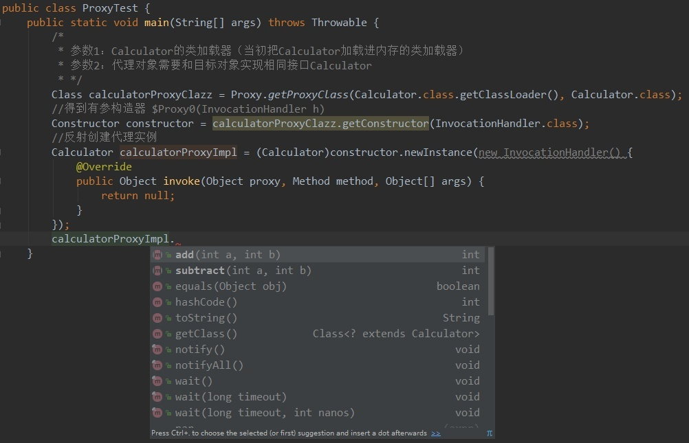

根据代理Class的构造器创建对象时，需要传入InvocationHandler。每次调用代理对象的方法，最终都会调用InvocationHandler的invoke()方法：

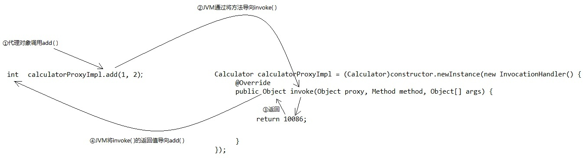

怎么做到的呢？

上面不是说了吗，根据代理Class的构造器创建对象时，需要传入InvocationHandler。通过构造器传入一个引用，那么必然有个成员变量去接收。没错，
代理对象的内部确实有个成员变量invocationHandler，而且代理对象的每个方法内部都会调用handler.invoke()！InvocationHandler对象成了
代理对象和目标对象的桥梁，不像静态代理这么直接。

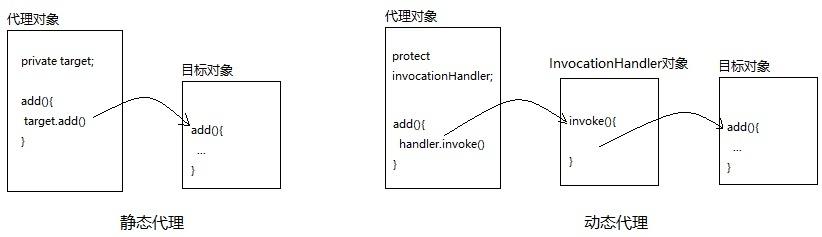

大家仔细看上图右侧的动态代理，我在invocationHandler的invoke()方法中并没有写目标对象。因为一开始invocationHandler的invoke()里确实
没有目标对象，需要我们手动new。

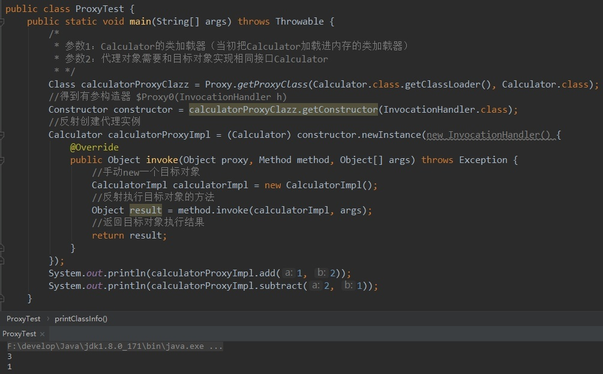


但这种写法不够优雅，属于硬编码。我这次代理A对象，下次想代理B对象还要进来改invoke()方法，太差劲了。改进一下，让调用者把目标对象作为参数传进来：
```c++
public class ProxyTest{
	public static void main(String[] args) throws Throwable {
		CalculatorImpl target = new CalculatorImpl()
		// 传入目标对象
		// 目的：1.根据它实现的接口生成代理对象 2.代理对象调用目标对象方法
		Calculator+calculatorProxy = (Calculator) getProxy(target)
		calculatorProxy.add(1,2);
		calculatorProxy.subtract(2,1);
		}
		private static Object getProxy(final Object target) throws Exception{
			// 参数1：随便找个类加载器给它，参数2：目标对象实现的接口，让代理对象实现相同接口
			Class proxyClazz = Proxy.getProxyClass(target.getClass().getClassLoader(), target.getClass().getInterfaces());
			Constructor constructor = proxyClazz.getConstructor(InvocationHandler.class);
			Object proxy = constructor.newInstance(new InvocationHandler(){
				@Override
				public Object invoke(Object proxy,Method method, Object[] args) throws Throwable{
					System.out.println(method.getName()+"方法开始执行...");
					Object result = method.invoke(target,args);
					System.out.println(result);
					System.out.println(method.getName()+"方法执行结束...");
					return result;
					}
			});
			return proxy;
			}
		}
	```
	这样就非常灵活，非常优雅了。无论现在系统有多少类，只要你把实例传进来，getProxy()都能给你返回对应的代理对象。就这样，我们完美地跳过了代理类，直接创建了代理对象！
	
	不过实际编程中，一般不用getProxyClass()，而是使用Proxy类的另一个静态方法：Proxy.newProxyInstance()，直接返回代理实例，连中间得到代理Class对象的过程都帮你隐藏：+
	
```c++
	public class ProxyTest{
		public static void main(String[] args) throws Throwable {
			CalculatorImpl target = new CalculatorImpl()
			// 传入目标对象
			// 目的：1.根据它实现的接口生成代理对象 2.代理对象调用目标对象方法
			Calculator+calculatorProxy = (Calculator) getProxy(target)
			calculatorProxy.add(1,2);
			calculatorProxy.subtract(2,1);
			}
			private static Object getProxy(final Object target) throws Exception{
				Object proxy = Proxy.newProxyInstance(target.getClass().getClassLoader(),/*类加载器*/
													  target.getClass().getInterfaces(),/*让代理对象和目标对象实现相同接口*/
													  new InvocationHandler(){/*代理对象的方法最终都会被JVM导向它的invoke方法
															public Object invoke(Object proxy, Method method, Object[] args) throws Throwable{
																System.out.println(method.getName()+"方法开始执行...");
																Object result = method.invoke(target, args);
																System.out.println(result);
																System.out.println(method.getName()+"方法执行结束...");
																return result;
																}
															}
														);
														return proxy;
												}
										}
```
现在，我想题主应该能看懂动态代理了。

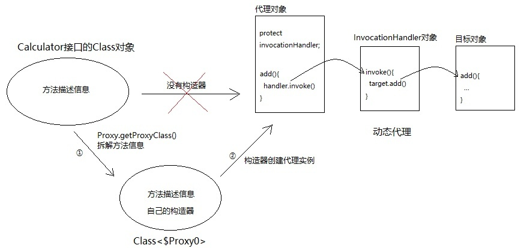

最后讨论一下代理对象是什么类型。

首先，请区分两个概念：代理Class对象和代理对象。

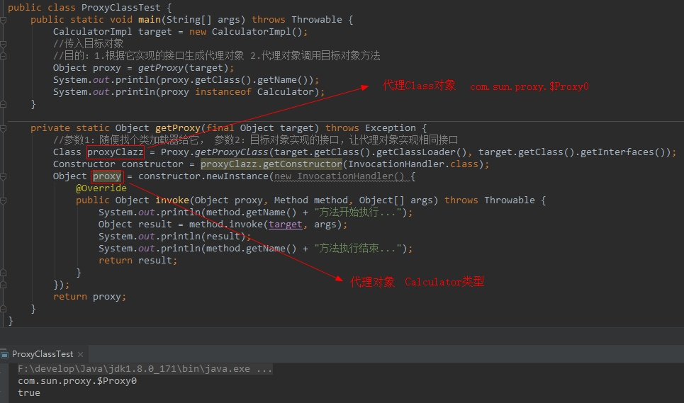

单从名字看，代理Class和Calculator的接口确实相去甚远，但是我们却能将代理对象赋值给接口类型：

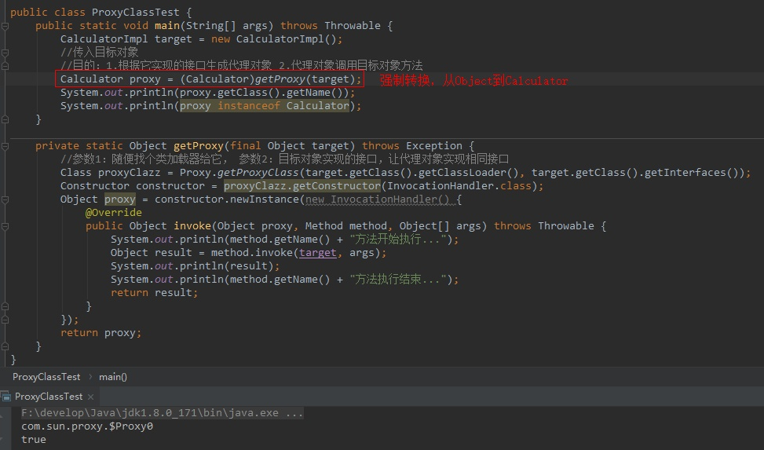

千万别觉得名字奇怪，就怀疑它不能用接口接收，只要实现该接口就是该类型。

代理对象的本质就是：和目标对象实现相同接口的实例。代理Class可以叫任何名字，whatever，只要它实现某个接口，就能成为该接口类型。

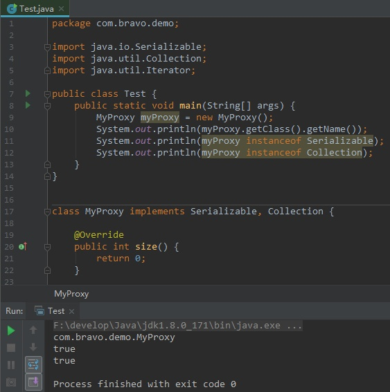

我写了一个MyProxy类，那么它的Class名字必然叫MyProxy。但这和能否赋值给接口没有任何关系。由于它实现了Serializable和Collection，所以myProxy（代理实例）同时是这两个接口的类型。

###小结

我想了个很骚的比喻，希望能解释清楚：

接口Class对象是大内太监，里面的方法和字段比做他的一身武艺，但是他没有小DD（构造器），所以不能new实例。一身武艺后继无人。那怎么办呢？

+ 正常途径（implements）：写一个类，实现该接口。这个就相当于大街上拉了一个人，认他做干爹。一身武艺传给他，只是比他干爹多了小DD，可以new实例。
+ 非正常途径（动态代理）：通过妙手圣医Proxy的克隆大法（Proxy.getProxyClass()），克隆一个Class，但是有小DD。所以这个克隆人Class可以创建实例，也就是代理对象。

代理Class其实就是附有构造器的接口Class，一样的类结构信息，却能创建实例。

JDK动态代理生成的实例:
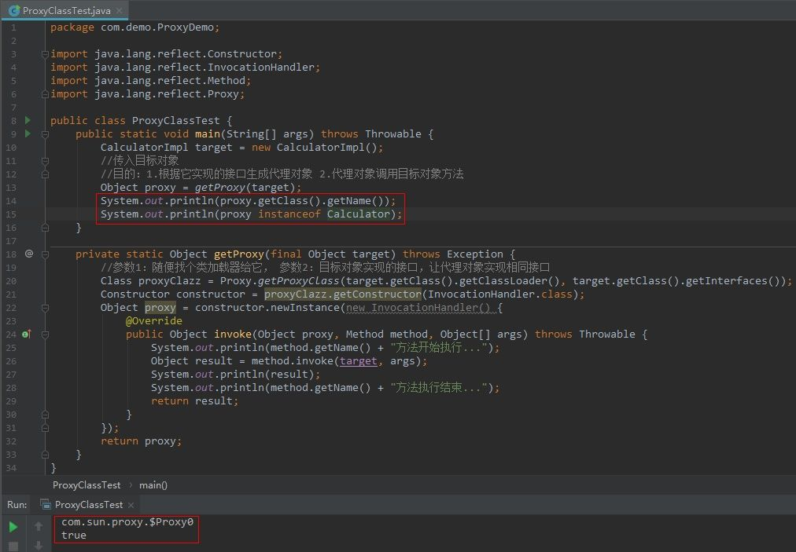


CGLib动态代理生成的实例:


如果说继承的父类是亲爹（只有一个），那么实现的接口是干爹（可以有多个）。

实现接口是一个类认干爹的过程。接口无法创建对象，但实现该接口的类可以。比如 
>class Student extends Person implements A,B

这个类new一个实例出来，你问它：你爸爸是谁啊？它会告诉你：我只有一个爸爸Person。但是student instanceof A interface，或者student instanceof B interface，它会告诉你两个都是它干爹（true），都可以用来接收它。

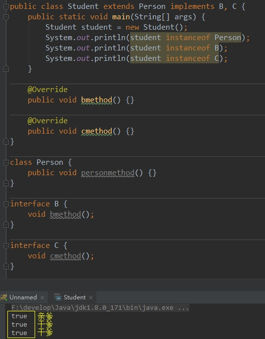

然而，凡是有利必有弊。

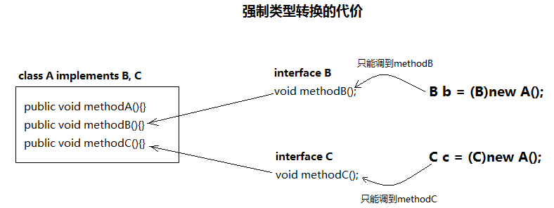

也就是说，动态代理生成的代理对象，最终都可以用接口接收，和目标对象一起形成了多态，可以随意切换展示不同的功能。但是切换的同时，只能使用该接口定义的方法。


为了保持行为的一致性，代理类和委托类通常会实现相同的接口，所以在访问者看来两者没有丝毫的区别。通过代理类这中间一层，能有效控制对委托类对象的直接访问，也可以很好地隐藏和保护委托类对象，同时也为实施不同控制策略预留了空间，从而在设计上获得了更大的灵活性。

更通俗的说，代理解决的问题当两个类需要通信时，引入第三方代理类，将两个类的关系解耦，让我们只了解代理类即可，而且代理的出现还可以让我们完成与另一个类之间的关系的统一管理，但是切记，代理类和委托类要实现相同的接口，因为代理真正调用的还是委托类的方法。

使用场合举例：

如果需要委托类处理某一业务，那么我们就可以先在代理类中统一处理然后在调用具体实现类按照代理的创建时期，代理类可以分为两种： 

静态：由程序员创建代理类或特定工具自动生成源代码再对其编译。在程序运行前代理类的.class文件就已经存在了。

动态：在程序运行时运用反射机制动态创建而成。

下面分别用静态代理与动态代理演示一个示例：

添加打印日志的功能，即每个方法调用之前和调用之后写入日志

静态代理：具体用户管理实现类

```java
public class UserManagerImpl implements UserManager {  
    @Override  
    public void addUser(String userId, String userName) {  
        System.out.println("UserManagerImpl.addUser");  
    }  
  
    @Override  
    public void delUser(String userId) {  
        System.out.println("UserManagerImpl.delUser");  
    }  
  
    @Override  
    public String findUser(String userId) {  
        System.out.println("UserManagerImpl.findUser");  
        return "张三";  
    }  
    @Override  
    public void modifyUser(String userId, String userName) {  
        System.out.println("UserManagerImpl.modifyUser");  
    }  
}  
```

代理类--代理用户管理实现类

```java
public class UserManagerImplProxy implements UserManager {  
    // 目标对象  
    private UserManager userManager;  
    // 通过构造方法传入目标对象  
    public UserManagerImplProxy(UserManager userManager){  
        this.userManager=userManager;  
    }  
    @Override  
    public void addUser(String userId, String userName) {  
        try{  
                //添加打印日志的功能  
                //开始添加用户  
                System.out.println("start-->addUser()");  
                userManager.addUser(userId, userName);  
                //添加用户成功  
                System.out.println("success-->addUser()");  
            }catch(Exception e){  
                //添加用户失败  
                System.out.println("error-->addUser()");  
            }  
    }  
    @Override  
    public void delUser(String userId) {  
        userManager.delUser(userId);  
    }  
    @Override  
    public String findUser(String userId) {  
        userManager.findUser(userId);  
        return "张三";  
    }  
    @Override  
    public void modifyUser(String userId, String userName) {  
        userManager.modifyUser(userId,userName);  
    }  
}  
``` 

客户端调用

```java
public class Client {  
    public static void main(String[] args){  
        //UserManager userManager=new UserManagerImpl();  
        UserManager userManager=new UserManagerImplProxy(new UserManagerImpl());  
        userManager.addUser("1111", "张三");  
    }  
}  
``` 

静态代理类优缺点

优点：

+ 代理使客户端不需要知道实现类是什么，怎么做的，而客户端只需知道代理即可（解耦合），对于如上的客户端代码，newUserManagerImpl()可以应用工厂将它隐藏，如上只是举个例子而已。

缺点：

1）代理类和委托类实现了相同的接口，代理类通过委托类实现了相同的方法。这样就出现了大量的代码重复。如果接口增加一个方法，除了所有实现类需要实现这个方法外，所有代理类也需要实现此方法。增加了代码维护的复杂度。

2）代理对象只服务于一种类型的对象，如果要服务多类型的对象。势必要为每一种对象都进行代理，静态代理在程序规模稍大时就无法胜任了。如上的代码是只为UserManager类的访问提供了代理，但是如果还要为其他类如Department类提供代理的话，就需要我们再次添加代理Department的代理类。

 

举例说明：代理可以对实现类进行统一的管理，如在调用具体实现类之前，需要打印日志等信息，这样我们只需要添加一个代理类，在代理类中添加打印日志的功能，然后调用实现类，这样就避免了修改具体实现类。满足我们所说的开闭原则。但是如果想让每个实现类都添加打印日志的功能的话，就需要添加多个代理类，以及代理类中各个方法都需要添加打印日志功能（如上的代理方法中删除，修改，以及查询都需要添加上打印日志的功能）

即静态代理类只能为特定的接口(Service)服务。如想要为多个接口服务则需要建立很多个代理类。

 

引入动态代理：

根据如上的介绍，你会发现每个代理类只能为一个接口服务，这样程序开发中必然会产生许多的代理类。所以我们就会想办法可以通过一个代理类完成全部的代理功能，那么我们就需要用动态代理
在上面的示例中，一个代理只能代理一种类型，而且是在编译器就已经确定被代理的对象。而动态代理是在运行时，通过反射机制实现动态代理，并且能够代理各种类型的对象

在Java中要想实现动态代理机制，需要java.lang.reflect.InvocationHandler接口和 java.lang.reflect.Proxy 类的支持

 

java.lang.reflect.InvocationHandler接口的定义如下：
```java
//Object proxy:被代理的对象  
//Method method:要调用的方法  
//Object[] args:方法调用时所需要参数  
public interface InvocationHandler {  
    public Object invoke(Object proxy, Method method, Object[] args) throws Throwable;  
}  

java.lang.reflect.Proxy类的定义如下：

//CLassLoader loader:类的加载器  
//Class<?> interfaces:得到全部的接口  
//InvocationHandler h:得到InvocationHandler接口的子类的实例  
public static Object newProxyInstance(ClassLoader loader, Class<?>[] interfaces, InvocationHandler h) throws IllegalArgumentException  
```

 
动态代理具体实现类
```java
public class UserManagerImpl implements UserManager {  
    @Override  
    public void addUser(String userId, String userName) {  
        System.out.println("UserManagerImpl.addUser");  
    }  
  
    @Override  
    public void delUser(String userId) {  
        System.out.println("UserManagerImpl.delUser");  
    }  
  
    @Override  
    public String findUser(String userId) {  
        System.out.println("UserManagerImpl.findUser");  
        return "张三";  
    }  
  
    @Override  
    public void modifyUser(String userId, String userName) {  
        System.out.println("UserManagerImpl.modifyUser");  
    }  
  
}  
```

 

动态创建代理对象的类

```java
//动态代理类只能代理接口（不支持抽象类），代理类都需要实现InvocationHandler类，实现invoke方法。该invoke方法就是调用被代理接口的所有方法时需要调用的，该invoke方法返回的值是被代理接口的一个实现类  
     
public class LogHandler implements InvocationHandler {  
    // 目标对象  
    private Object targetObject;  
    //绑定关系，也就是关联到哪个接口（与具体的实现类绑定）的哪些方法将被调用时，执行invoke方法。              
    public Object newProxyInstance(Object targetObject){  
        this.targetObject=targetObject;  
        //该方法用于为指定类装载器、一组接口及调用处理器生成动态代理类实例    
        //第一个参数指定产生代理对象的类加载器，需要将其指定为和目标对象同一个类加载器  
        //第二个参数要实现和目标对象一样的接口，所以只需要拿到目标对象的实现接口  
        //第三个参数表明这些被拦截的方法在被拦截时需要执行哪个InvocationHandler的invoke方法  
        //根据传入的目标返回一个代理对象  
        return Proxy.newProxyInstance(targetObject.getClass().getClassLoader(),  
                targetObject.getClass().getInterfaces(),this);  
    }  
    @Override  
    //关联的这个实现类的方法被调用时将被执行  
    /*InvocationHandler接口的方法，proxy表示代理，method表示原对象被调用的方法，args表示方法的参数*/  
    public Object invoke(Object proxy, Method method, Object[] args)  
            throws Throwable {  
        System.out.println("start-->>");  
        for(int i=0;i<args.length;i++){  
            System.out.println(args[i]);  
        }  
        Object ret=null;  
        try{  
            /*原对象方法调用前处理日志信息*/  
            System.out.println("satrt-->>");  
            //调用目标方法  
            ret=method.invoke(targetObject, args);  
            /*原对象方法调用后处理日志信息*/  
            System.out.println("success-->>");  
        }catch(Exception e){  
            e.printStackTrace();  
            System.out.println("error-->>");  
            throw e;  
        }  
        return ret;  
    }  
} 
```
 

被代理对象targetObject通过参数传递进来，我们通过targetObject.getClass().getClassLoader()获取ClassLoader对象，然后通过targetObject.getClass().getInterfaces()获取它实现的所有接口，
然后将targetObject包装到实现了InvocationHandler接口的LogHandler对象中。通过newProxyInstance函数我们就获得了一个动态代理对象。

客户端代码

```java
public class Client {  
    public static void main(String[] args){  
        LogHandler logHandler=new LogHandler();  
        UserManager userManager=(UserManager)logHandler.newProxyInstance(new UserManagerImpl());  
        //UserManager userManager=new UserManagerImpl();  
        userManager.addUser("1111", "张三");  
    }  
}  
```
可以看到，我们可以通过LogHandler代理不同类型的对象，如果我们把对外的接口都通过动态代理来实现，那么所有的函数调用最终都会经过invoke函数的转发，因此我们就可以在这里做一些自己想做的操作，比如日志系统、事务、拦截器、权限控制等。这也就是AOP(面向切面编程)的基本原理。

 

插曲：

AOP（AspectOrientedProgramming）：将日志记录，性能统计，安全控制，事务处理，异常处理等代码从业务逻辑代码中划分出来，通过对这些行为的分离，我们希望可以将它们独立到非指导业务逻辑的方法中，进而改变这些行为的时候不影响业务逻辑的代码---解耦。

动态代理优点：

动态代理与静态代理相比较，最大的好处是接口中声明的所有方法都被转移到调用处理器一个集中的方法中处理（InvocationHandler.invoke）。这样，在接口方法数量比较多的时候，我们可以进行灵活处理，而不需要像静态代理那样每一个方法进行中转。而且动态代理的应用使我们的类职责更加单一，复用性更强

 

总结：

其实所谓代理，就是一个人或者一个机构代表另一个人或者另一个机构采取行动。在一些情况下，一个客户不想或者不能够直接引用一个对象，而代理对象可以在客户端和目标对象之前起到中介的作用。

代理对象就是把被代理对象包装一层，在其内部做一些额外的工作，比如用户需要上facebook,而普通网络无法直接访问，网络代理帮助用户先翻墙，然后再访问facebook。这就是代理的作用了。

纵观静态代理与动态代理，它们都能实现相同的功能，而我们看从静态代理到动态代理的这个过程，我们会发现其实动态代理只是对类做了进一步抽象和封装，使其复用性和易用性得到进一步提升而这不仅仅符合了面向对象的设计理念，其中还有AOP的身影，这也提供给我们对类抽象的一种参考。

关于动态代理与AOP的关系，个人觉得AOP是一种思想，而动态代理是一种AOP思想的实现！