### 一、封装
**1、概念**：
将类的某些信息隐藏在类内部，不允许外部程序直接访问，而是通过该类提供的方法来实现对隐藏信息的操作和访问。
**2、好处**：

* 只能通过规定的方法访问数据。
* 隐藏类的实例细节，方便修改和实现。

**3、封装的实现步骤**：

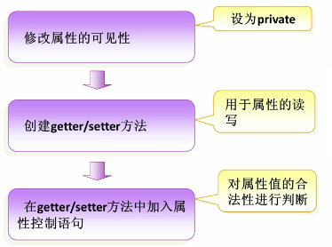

需要注意：对封装的属性不一定要通过get/set方法，其他方法也可以对封装的属性进行操作。当然最好使用get/set方法，比较标准。

**A、访问修饰符**

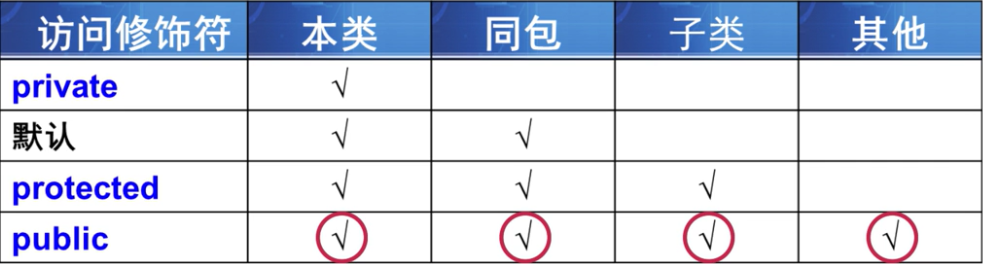

从表格可以看出从上到下封装性越来越差。
**B、this关键字**
1. this关键字代表当前对象
* this.属性 操作当前对象的属性
* this.方法 调用当前对象的方法。
2. 封装对象的属性的时候，经常会使用this关键字。
3. 当getter和setter函数参数名和成员函数名重合的时候，可以使用this区别。如：

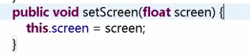

**C、Java 中的内部类**
内部类（ Inner Class ）就是定义在另外一个类里面的类。与之对应，包含内部类的类被称为外部类。
那么问题来了：那为什么要将一个类定义在另一个类里面呢？清清爽爽的独立的一个类多好啊！！
答：内部类的主要作用如下：
> 1. 内部类提供了更好的封装，可以把内部类隐藏在外部类之内，不允许同一个包中的其他类访问该类。
> 2. 内部类的方法可以直接访问外部类的所有数据，包括私有的数据。
> 3. 内部类所实现的功能使用外部类同样可以实现，只是有时使用内部类更方便。

内部类可分为以下几种： 

* 成员内部类
* 静态内部类
* 方法内部类
* 匿名内部类

### 二、继承
**1、继承的概念**
继承是类与类的一种关系，是一种“is a”的关系。比如“狗”继承“动物”，这里动物类是狗类的父类或者基类，狗类是动物类的子类或者派生类。如下图所示：

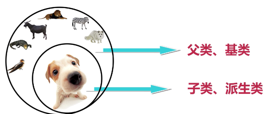

注：java中的继承是单继承，即一个类只有一个父类。
**2、继承的好处**
子类拥有父类的所有属性和方法（除了private修饰的属性不能拥有）从而实现了实现代码的复用；
**3、语法规则，只要在子类加上extends关键字继承相应的父类就可以了：**

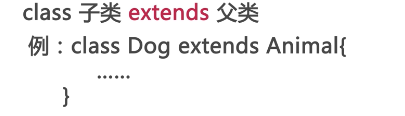

**A、方法的重写**
子类如果对继承的父类的方法不满意（不适合），可以自己编写继承的方法，这种方式就称为方法的重写。当调用方法时会优先调用子类的方法。
重写要注意：
> a、返回值类型
> b、方法名
> c、参数类型及个数

都要与父类继承的方法相同，才叫方法的重写。
**重载和重写的区别：**
> 方法重载：在同一个类中处理不同数据的多个相同方法名的多态手段。
> 方法重写：相对继承而言，子类中对父类已经存在的方法进行区别化的修改。

**B、继承的初始化顺序**
1、初始化父类再初始化子类
2、先执行初始化对象中属性，再执行构造方法中的初始化。
基于上面两点，我们就知道实例化一个子类，java程序的执行顺序是：
父类对象属性初始化---->父类对象构造方法---->子类对象属性初始化--->子类对象构造方法　　　
下面有个形象的图：

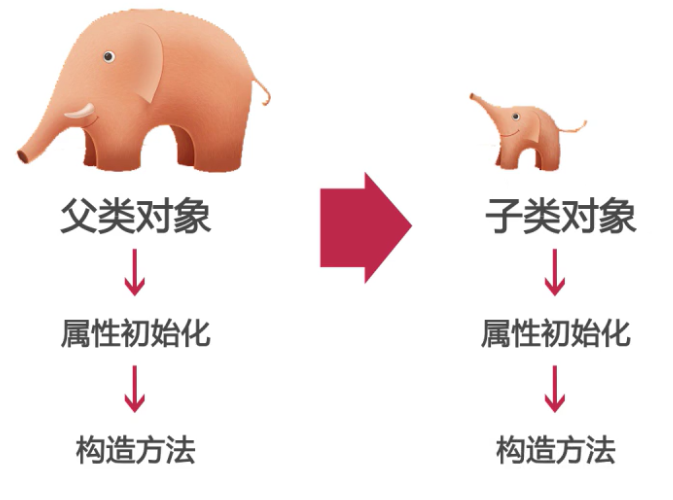

**C、final关键字**
使用final关键字做标识有“最终的”含义。
> 1. final 修饰类，则该类不允许被继承。
> 2. final 修饰方法，则该方法不允许被覆盖(重写)。
> 3. final 修饰属性，则该类的该属性不会进行隐式的初始化，所以 该final 属性的初始化属性必须有值，或在构造方法中赋值(但只能选其一，且必须选其一，因为没有默认值！)，且初始化之后就不能改了，只能赋值一次。
> 4. final 修饰变量，则该变量的值只能赋一次值，在声明变量的时候才能赋值，即变为常量。

**D、super关键字**
在对象的内部使用，可以代表父类对象。
> 1、访问父类的属性：super.age
> 2、访问父类的方法：super.eat()

**super的应用：**
首先我们知道子类的构造的过程当中必须调用父类的构造方法。其实这个过程已经隐式地使用了我们的super关键字。
这是因为如果子类的构造方法中没有显示调用父类的构造方法，则系统默认调用父类无参的构造方法。
那么如果自己用super关键字在子类里调用父类的构造方法，则必须在子类的构造方法中的第一行。
要注意的是：如果子类构造方法中既没有显示调用父类的构造方法，而父类没有无参的构造方法，则编译出错。
（补充说明，虽然没有显示声明父类的无参的构造方法，系统会自动默认生成一个无参构造方法，但是，如果你声明了一个有参的构造方法，而没有声明无参的构造方法，这时系统不会动默认生成一个无参构造方法，此时称为父类有没有无参的构造方法。）
**E、Object类**
Object类是所有类的父类，如果一个类没有使用extends关键字明确标识继承另一个类，那么这个类默认继承Object类。
Object类中的方法，适合所有子类！！！
那么Object类中有什么主要的方法呢？
**1、toString()**
a. 在Object类里面定义toString()方法的时候返回的对象的哈希code码(对象地址字符串)。
我们可以发现，如果我们直接用System.out.print（对象）输出一个对象，则运行结果输出的是对象的对象地址字符串，也称为哈希code码。如：


哈希码是通过哈希算法生成的一个字符串，它是用来唯一区分我们对象的地址码，就像我们的身份证一样。　　
b. 可以通过重写toString()方法表示出对象的属性。
如果我们希望输出一个对象的时候，不是它的哈希码，而是它的各个属性值，那我们可以通过重写toString()方法表示出对象的属性。
**2、equals()**
a、equals（）----返回值是布尔类型。
b、默认的情况下，比较的是对象的引用是否指向同一块内存地址-------对象实例化时，即给对象分配内存空间，该内存空间的地址就是内存地址。使用方法如：dog.equals(dog2);
c、 如果是两个对象，但想判断两个对象的属性是否相同，则重写equals（）方法。
以Dog类为例，重写后的equals（）方法如下（当然你可以根据自己想比较的属性来重写，这里我以age属性是否相同来重写equals（）方法）：

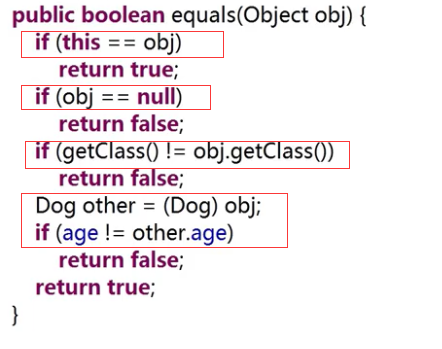

上面有四个判断，它们的含义分别是：
> 1. 判断地址是否相同----if (this == obj)，相同则返回true
> 2. 判断对象是否为空----if (obj == null)，为空则返回false
> 3. getClass（）可以得到类对象，判断类型是否一样-----if (getClass() != obj.getClass())，不一样则返回false
> 4. 判断属性值是否一样----if (age != other.age)，不一样返回false
> 5. 如果地址相同，对象不为空，类型一样，属性值一样则返回true

这里要注意的是，理解obj.getClass()得到的类对象和类的对象的区别，以下用图形表示：

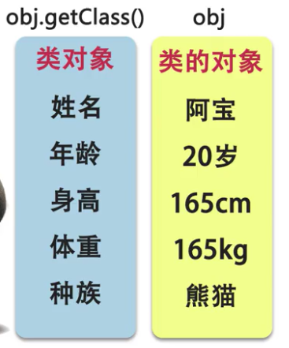

可以看到，对于类对象我们关心它属于哪个类，拥有什么属性和方法，比如我和你都是属于“人”这个类对象；而类的对象则是一个类的实例化的具体的一个对象。比如我和你是两个不同的人。
### 三、多态
面向对象的最后一个特性就是多态，那么什么是多态呢？多态就是对象的多种形态。
java里的多态主要表现在两个方面：
**1.引用多态**
父类的引用可以指向本类的对象；
父类的引用可以指向子类的对象；
这两句话是什么意思呢，让我们用代码来体验一下，首先我们创建一个父类Animal和一个子类Dog，在主函数里如下所示：

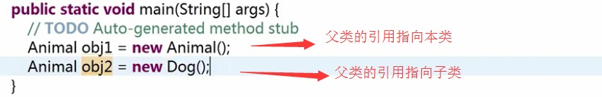

注意：我们不能使用一个子类的引用来指向父类的对象，如：

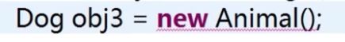

这里我们必须深刻理解引用多态的意义，才能更好记忆这种多态的特性。为什么子类的引用不能用来指向父类的对象呢？我在这里通俗给大家讲解一下：就以上面的例子来说，我们能说“狗是一种动物”，但是不能说“动物是一种狗”，狗和动物是父类和子类的继承关系，它们的从属是不能颠倒的。当父类的引用指向子类的对象时，该对象将只是看成一种特殊的父类（里面有重写的方法和属性），反之，一个子类的引用来指向父类的对象是不可行的！！
**2.方法多态**
根据上述创建的两个对象：本类对象和子类对象，同样都是父类的引用，当我们指向不同的对象时，它们调用的方法也是多态的。
创建本类对象时，调用的方法为本类方法；
创建子类对象时，调用的方法为子类重写的方法或者继承的方法；
使用多态的时候要注意：如果我们在子类中编写一个独有的方法（没有继承父类的方法），此时就不能通过父类的引用创建的子类对象来调用该方法！！！
注意： 继承是多态的基础。
**A、引用类型转换**
了解了多态的含义后，我们在日常使用多态的特性时经常需要进行引用类型转换。
引用类型转换
**1. 向上类型转换**(隐式/自动类型转换)，是小类型转换到大类型。
就以上述的父类Animal和一个子类Dog来说明，当父类的引用可以指向子类的对象时，就是向上类型转换。如：

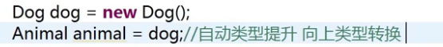

**2. 向下类型转换**(强制类型转换)，是大类型转换到小类型(有风险,可能出现数据溢出)。
将上述代码再加上一行，我们再次将父类转换为子类引用，那么会出现错误，编译器不允许我们直接这么做，虽然我们知道这个父类引用指向的就是子类对象，但是编译器认为这种转换是存在风险的。如：

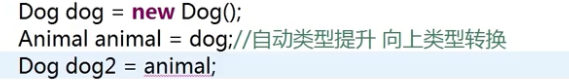

那么我们该怎么解决这个问题呢，我们可以在animal前加上（Dog）来强制类型转换。如：


但是如果父类引用没有指向该子类的对象，则不能向下类型转换，虽然编译器不会报错，但是运行的时候程序会出错，如：


其实这就是上面所说的子类的引用指向父类的对象，而强制转换类型也不能转换！！
还有一种情况是父类的引用指向其他子类的对象，则不能通过强制转为该子类的对象。如：

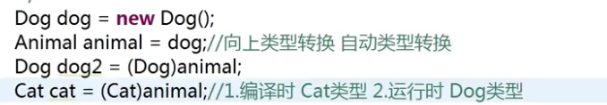

这是因为我们在编译的时候进行了强制类型转换，编译时的类型是我们强制转换的类型，所以编译器不会报错，而当我们运行的时候，程序给animal开辟的是Dog类型的内存空间，这与Cat类型内存空间不匹配，所以无法正常转换。这两种情况出错的本质是一样的，所以我们在使用强制类型转换的时候要特别注意这两种错误！！下面有个更安全的方式来实现向下类型转换。。。。
 **3. instanceof运算符**，来解决引用对象的类型，避免类型转换的安全性问题。
instanceof是Java的一个二元操作符，和==，>，<是同一类东东。由于它是由字母组成的，所以也是Java的保留关键字。它的作用是测试它左边的对象是否是它右边的类的实例，返回boolean类型的数据。
我们来使用instanceof运算符来规避上面的错误，代码修改如下：


利用if语句和instanceof运算符来判断两个对象的类型是否一致。
补充说明：在比较一个对象是否和另一个对象属于同一个类实例的时候，我们通常可以采用instanceof和getClass两种方法通过两者是否相等来判断，但是两者在判断上面是有差别的。Instanceof进行类型检查规则是:你属于该类吗？或者你属于该类的派生类吗？而通过getClass获得类型信息采用==来进行检查是否相等的操作是严格的判断,不会存在继承方面的考虑；
**总结**：在写程序的时候，如果要进行类型转换，我们最好使用instanceof运算符来判断它左边的对象是否是它右边的类的实例，再进行强制转换。
**B、抽象类**
定义：抽象类前使用abstract关键字修饰，则该类为抽象类。
使用抽象类要注意以下几点：
1. 抽象类是约束子类必须有什么方法，而并不关注子类如何实现这些方法。
2. 抽象类应用场景：
a. 在某些情况下，某个父类只是知道其子类应该包含怎样的方法，但无法准确知道这些子类如何实现这些方法(可实现动态多态)。
b. 从多个具有相同特征的类中抽象出一个抽象类，以这个抽象类作为子类的模板，从而避免子类设计的随意性。
3. 抽象类定义抽象方法，只有声明，不需要实现。抽象方法没有方法体以分号结束，抽象方法必须用abstract关键字来修饰。如:

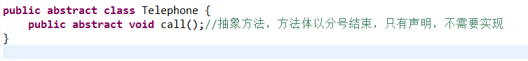

4. 包含抽象方法的类是抽象类。抽象类中可以包含普通的方法，也可以没有抽象方法。如：

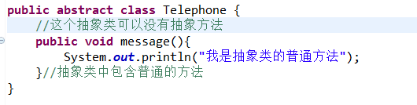

5. 抽象类不能直接创建，可以定义引用变量来指向子类对象，来实现抽象方法。以上述的Telephone抽象类为例:
```java
public abstract class Telephone {
    public abstract void call();//抽象方法，方法体以分号结束，只有声明，不需要实现
    public void message(){
        System.out.println("我是抽象类的普通方法");
    }//抽象类中包含普通的方法6 }
```
```java
public class Phone extends Telephone {
    public void call() {//继承抽象类的子类必须重写抽象方法
        // TODO Auto-generated method stub
        System.out.println("我重写了抽象类的方法");
    }
}
```
以上是Telephone抽象类和子类Phone的定义，下面我们看main函数里：

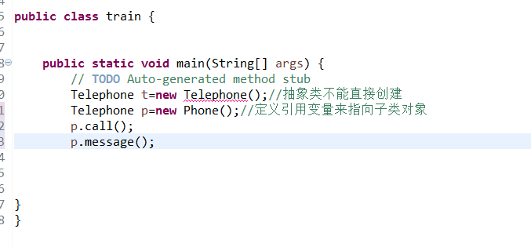

运行结果（排错之后）：

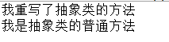

**C、接口**
**1、概念**
接口可以理解为一种特殊的类，由全局常量和公共的抽象方法所组成。也可理解为一个特殊的抽象类，因为它含有抽象方法。
如果说类是一种具体实现体，而接口定义了某一批类所需要遵守的规范，接口不关心这些类的内部数据，也不关心这些类里方法的实现细节，它只规定这些类里必须提供的某些方法。（这里与抽象类相似）
**2.接口定义的基本语法**
[修饰符] [abstract] interface 接口名 [extends父接口1,2....]（多继承）{
    0…n常量 (public static final)                                          　　　　　　　　
    0…n 抽象方法(public abstract)                                      　　　　　　
}        
其中[ ]里的内容表示可选项，可以写也可以不写;接口中的属性都是常量，即使定义时不添加public static final 修饰符，系统也会自动加上；接口中的方法都是抽象方法，即使定义时不添加public abstract修饰符，系统也会自动加上。
**3.使用接口**
一个类可以实现一个或多个接口，实现接口使用implements关键字。java中一个类只能继承一个父类，是不够灵活的，通过实现多个接口可以补充。
继承父类实现接口的语法为：
> [修饰符] class 类名 extends 父类 implements 接口1，接口2...{
> 　　　　类体部分 //如果继承了抽象类，需要实现继承的抽象方法；要实现接口中的抽象方法　　　　　
> }

注意：如果要继承父类，继承父类必须在实现接口之前,即extends关键字必须在implements关键字前
补充说明：通常我们在命名一个接口时，经常以I开头，用来区分普通的类。如：IPlayGame
以下我们来补充在上述抽象类中的例子，我们之前已经定义了一个抽象类Telephone和子类Phone，这里我们再创建一个IPlayGame的接口，然后在原来定义的两个类稍作修改，代码如下：
```java
public interface IPlayGame {
    public void paly(); //abstract 关键字可以省略，系统会自动加上
    public String name="游戏名字";  //static final关键字可以省略，系统会自动加上
 }
```
```java
public class Phone extends Telephone implements IPlayGame{
    public void call() {    //继承抽象类的子类必须重写抽象方法
        // TODO Auto-generated method stub
        System.out.println("我重写了抽象类的方法");
    }
    @Override
    public void paly() {
        // TODO Auto-generated method stub
        System.out.println("我重写了接口的方法");
    }
}
```
```java
public class train {
    public static void main(String[] args) {
        // TODO Auto-generated method stub
        IPlayGame i=new Phone();    //用接口的引用指向子类的对象
        i.paly();   //调用接口的方法
        System.out.println(i.name); //输出接口的常量
    }
}
```
运行结果：


**4.接口和匿名内部类配合使用**
接口在使用过程中还经常和匿名内部类配合使用。匿名内部类就是没有没名字的内部类，多用于关注实现而不关注实现类的名称。
语法格式：
```java
Interface i =new interface(){
    Public void method{
        System.out.println(“利用匿名内部类实现接口1”);
    }
};
i.method();
```
还有一种写法：（直接把方法的调用写在匿名内部类的最后）
```java
Interface i =new interface(){
    Public void method{
        System.out.println(“利用匿名内部类实现接口1”);
    }
 }.method();
```
### 四、抽象类和接口的区别
我们在多态的学习过程中认识到抽象类和接口都是实现java多态特性的关键部分，两者都包含抽象方法，只关注方法的声明而不关注方法的具体实现，那么这两者又有什么区别呢？？我们在编写java程序的时候又该如何抉择呢？
**（1）语法层面上的区别**
1.一个类只能继承一个抽象类，而一个类却可以实现多个接口。
2.抽象类中的成员变量可以是各种类型的，而接口中的成员变量只能是public static final类型的；且必须给其初值，所以实现类中不能重新定义，也不能改变其值；抽象类中的变量默认是 friendly 型，其值可以在子类中重新定义，也可以重新赋值。
3.抽象类中可以有非抽象方法，接口中则不能有非抽象方法。
4.接口可以省略abstract 关键字，抽象类不能。
5.接口中不能含有静态代码块以及静态方法，而抽象类可以有静态代码块和静态方法；
**（2）设计层面上的区别**
1）**抽象类是对一种事物的抽象，即对类抽象，而接口是对行为的抽象**。抽象类是对整个类整体进行抽象，包括属性、行为，但是接口却是对类局部（行为）进行抽象。举个简单的例子，飞机和鸟是不同类的事物，但是它们都有一个共性，就是都会飞。那么在设计的时候，可以将飞机设计为一个类Airplane，将鸟设计为一个类Bird，但是不能将 飞行 这个特性也设计为类，因此它只是一个行为特性，并不是对一类事物的抽象描述。此时可以将 飞行 设计为一个接口Fly，包含方法fly( )，然后Airplane和Bird分别根据自己的需要实现Fly这个接口。然后至于有不同种类的飞机，比如战斗机、民用飞机等直接继承Airplane即可，对于鸟也是类似的，不同种类的鸟直接继承Bird类即可。从这里可以看出，继承是一个 "是不是"的关系，而 接口 实现则是 "有没有"的关系。如果一个类继承了某个抽象类，则子类必定是抽象类的种类，而接口实现则是有没有、具备不具备的关系，比如鸟是否能飞（或者是否具备飞行这个特点），能飞行则可以实现这个接口，不能飞行就不实现这个接口。
2）**设计层面不同，抽象类作为很多子类的父类，它是一种模板式设计**。而接口是一种行为规范，它是一种辐射式设计。什么是模板式设计？最简单例子，大家都用过ppt里面的模板，如果用模板A设计了ppt B和ppt C，ppt B和ppt C公共的部分就是模板A了，如果它们的公共部分需要改动，则只需要改动模板A就可以了，不需要重新对ppt B和ppt C进行改动。而辐射式设计，比如某个电梯都装了某种报警器，一旦要更新报警器，就必须全部更新。也就是说对于抽象类，如果需要添加新的方法，可以直接在抽象类中添加具体的实现，子类可以不进行变更；而对于接口则不行，如果接口进行了变更，则所有实现这个接口的类都必须进行相应的改动。
下面看一个网上流传最广泛的例子：门和警报的例子：门都有open( )和close( )两个动作，此时我们可以定义通过抽象类和接口来定义这个抽象概念：
```java
abstract class Door {
    public abstract void open();
    public abstract void close();
}
```
或者：
```java
interface Door {
    public abstract void open();
    public abstract void close();
}
```
但是现在如果我们需要门具有报警alarm( )的功能，那么该如何实现？下面提供两种思路：
> 1）将这三个功能都放在抽象类里面，但是这样一来所有继承于这个抽象类的子类都具备了报警功能，但是有的门并不一定具备报警功能；
> 2）将这三个功能都放在接口里面，需要用到报警功能的类就需要实现这个接口中的open( )和close( )，也许这个类根本就不具备open( )和close( )这两个功能，比如火灾报警器。

从这里可以看出， Door的open() 、close()和alarm()根本就属于两个不同范畴内的行为，open()和close()属于门本身固有的行为特性，而alarm()属于延伸的附加行为。因此最好的解决办法是单独将报警设计为一个接口，包含alarm()行为,Door设计为单独的一个抽象类，包含open和close两种行为。再设计一个报警门继承Door类和实现Alarm接口。
```java
interface Alram {
    void alarm();
}
abstract class Door {
    void open();
    void close();
}
class AlarmDoor extends Door implements Alarm {
    void oepn() {
      //....
    }
    void close() {
      //....
    }
    void alarm() {
      //....
    }
}
```
