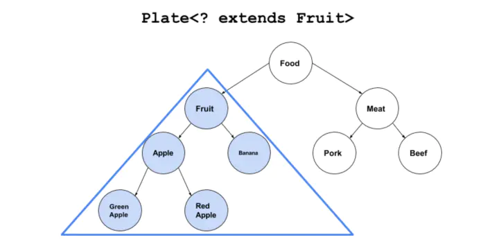
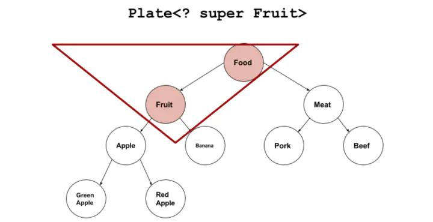

### 泛型是什么
代码里面有很多类似这样的语句：
```java
List<String> list=new ArrayList<>();
```
ArrayList就是个泛型类，我们通过设定不同的类型，可以往集合里面存储不同类型的数据类型（而且只能存储设定的数据类型，这是泛型的优势之一）。“泛型”简单的意思就是泛指的类型（参数化类型）。想象下这样的场景：如果我们现在要写一个容器类（支持数据增删查询的），我们写了支持String类型的，后面还需要写支持Integer类型的。然后呢？Doubel、Float、各种自定义类型？这样重复代码太多了，而且这些容器的算法都是一致的。我们可以通过泛指一种类型T,来代替我们之前需要的所有类型，把我们需要的类型作为参数传递到容器里面，这样我们算法只需要写一套就可以适应所有的类型。最典型的的例子就是ArrayList了，这个集合我们无论传递什么数据类型，它都能很好的工作。

写出了下面的代码：
```java
class MyList{
    private Object[] elements=new Object[10];
    private int size;
    
    public void add(Object item) {
    	elements[size++]=item;
    }
    
    public Object get(int index) {
    	return elements[index];
    }
}
```
这个代码灵活性很高，所有的类型都可以向上转型为Object类，这样我们就可以往里面存储各种类型的数据了。的确Java在泛型出现之前，也是这么做的。但是这样的有一个问题：如果集合里面数据很多，某一个数据转型出现错误，在编译期是无法发现的。但是在运行期会发生java.lang.ClassCastException。例如：
```java
MyList myList=new MyList();
myList.add("A");
myList.add(1);
System.out.println(myList.get(0));
System.out.println((String)myList.get(1));
```

我们在这个集合里面存储了多个类型（某些情况下容器可能会存储多种类型的数据），如果数据量较多，转型的时候难免会出现异常，而这些都是无法在编译期得知的。而泛型一方面让我们只能往集合中添加一种类型的数据，同时可以让我们在编译期就发现这些错误，避免运行时异常的发生，提升代码的健壮性。
### Java泛型介绍
#### Java泛型类
类结构是面向对象中最基本的元素，如果我们的类需要有很好的扩展性，那么我们可以将其设置成泛型的。假设我们需要一个数据的包装类，通过传入不同类型的数据，可以存储相应类型的数据。我们看看这个简单的泛型类的设计：
```java
class DataHolder<T>{
    T item;
    
    public void setData(T t) {
    	this.item=t;
    }
    
    public T getData() {
    	return this.item;
    }
}
```
泛型类定义时只需要在类名后面加上类型参数即可，当然你也可以添加多个参数，类似于<K,V>,<T,E,K>等。这样我们就可以在类里面使用定义的类型参数。

泛型类最常用的使用场景就是“元组”的使用。我们知道方法return返回值只能返回单个对象。如果我们定义一个泛型类，定义2个甚至3个类型参数，这样我们return对象的时候，构建这样一个“元组”数据，通过泛型传入多个对象，这样我们就可以一次性方法多个数据了。
#### Java泛型方法
前面我们介绍的泛型是作用于整个类的，现在我们来介绍泛型方法。泛型方法既可以存在于泛型类中，也可以存在于普通的类中。如果使用泛型方法可以解决问题，那么应该尽量使用泛型方法。下面我们通过例子来看一下泛型方法的使用：
```java
class DataHolder<T>{
    T item;
    
    public void setData(T t) {
    	this.item=t;
    }
    
    public T getData() {
    	return this.item;
    }
    
    /**
     * 泛型方法
     * @param e
     */
    public <E> void PrinterInfo(E e) {
    	System.out.println(e);
    }
}
```
从上面的例子中，我们看到我们是在一个泛型类里面定义了一个泛型方法printInfo。通过传入不同的数据类型，我们都可以打印出来。在这个方法里面，我们定义了类型参数E。这个E和泛型类里面的T两者之间是没有关系的。哪怕我们将泛型方法设置成这样：
```java
//注意这个T是一种全新的类型，可以与泛型类中声明的T不是同一种类型。
public <T> void PrinterInfo(T e) {
    System.out.println(e);
}
//调用方法
DataHolder<String> dataHolder=new DataHolder<>();
dataHolder.PrinterInfo(1);
dataHolder.PrinterInfo("AAAAA");
dataHolder.PrinterInfo(8.88f);
```
这个泛型方法依然可以传入Double、Float等类型的数据。泛型方法里面的类型参数T和泛型类里面的类型参数是不一样的类型，从上面的调用方式，我们也可以看出，泛型方法printInfo不受我们DataHolder中泛型类型参数是String的影响。 我们来总结下泛型方法的几个基本特征：

* public与返回值中间非常重要，可以理解为声明此方法为泛型方法。
* 只有声明了的方法才是泛型方法，泛型类中的使用了泛型的成员方法并不是泛型方法。
* 表明该方法将使用泛型类型T，此时才可以在方法中使用泛型类型T。
* 与泛型类的定义一样，此处T可以随便写为任意标识，常见的如T、E、K、V等形式的参数常用于表示泛型。

#### Java泛型接口
Java泛型接口的定义和Java泛型类基本相同，下面是一个例子：
```java
//定义一个泛型接口
public interface Generator<T> {
    public T next();
}
```
此处有两点需要注意：

* 泛型接口未传入泛型实参时，与泛型类的定义相同，在声明类的时候，需将泛型的声明也一起加到类中。例子如下：

```java
/* 即：class DataHolder implements Generator<T>{
 * 如果不声明泛型，如：class DataHolder implements Generator<T>，编译器会报错："Unknown class"
 */
class FruitGenerator<T> implements Generator<T>{
    @Override
    public T next() {
        return null;
    }
}
```

* 如果泛型接口传入类型参数时，实现该泛型接口的实现类，则所有使用泛型的地方都要替换成传入的实参类型。例子如下：

```java
class DataHolder implements Generator<String>{
    @Override
    public String next() {
    	return null;
    }
}
```

从这个例子我们看到，实现类里面的所有T的地方都需要实现为String。
### Java泛型擦除及其相关内容
看一个例子：
```java
Class<?> class1=new ArrayList<String>().getClass();
Class<?> class2=new ArrayList<Integer>().getClass();
System.out.println(class1);		//class java.util.ArrayList
System.out.println(class2);		//class java.util.ArrayList
System.out.println(class1.equals(class2));	//true
```

我们看输出发现，class1和class2居然是同一个类型ArrayList，在运行时我们传入的类型变量String和Integer都被丢掉了。Java语言泛型在设计的时候为了兼容原来的旧代码，Java的泛型机制使用了“擦除”机制。我们来看一个更彻底的例子：
```java
class Table {}
class Room {}
class House<Q> {}
class Particle<POSITION, MOMENTUM> {}
//调用代码及输出
List<Table> tableList = new ArrayList<Table>();
Map<Room, Table> maps = new HashMap<Room, Table>();
House<Room> house = new House<Room>();
Particle<Long, Double> particle = new Particle<Long, Double>();
System.out.println(Arrays.toString(tableList.getClass().getTypeParameters()));
System.out.println(Arrays.toString(maps.getClass().getTypeParameters()));
System.out.println(Arrays.toString(house.getClass().getTypeParameters()));
System.out.println(Arrays.toString(particle.getClass().getTypeParameters()));
/** 
[E]
[K, V]
[Q]
[POSITION, MOMENTUM]
 */
```
上面的代码里，我们想在运行时获取类的类型参数，但是我们看到返回的都是“形参”。在运行期我们是获取不到任何已经声明的类型信息的。

**注意：**

编译器虽然会在编译过程中移除参数的类型信息，但是会保证类或方法内部参数类型的一致性。 

泛型参数将会被擦除到它的第一个边界（边界可以有多个，重用 extends 关键字，通过它能给与参数类型添加一个边界）。编译器事实上会把类型参数替换为它的第一个边界的类型。如果没有指明边界，那么类型参数将被擦除到Object。下面的例子中，可以把泛型参数T当作HasF类型来使用。
```java
public interface HasF {
    void f();
}

public class Manipulator<T extends HasF> {
    T obj;
    public T getObj() {
        return obj;
    }
    public void setObj(T obj) {
        this.obj = obj;
    }
}
```
extend关键字后后面的类型信息决定了泛型参数能保留的信息。Java类型擦除只会擦除到HasF类型。
#### Java泛型擦除的原理
一个非泛型的版本：
```java
// SimpleHolder.java
public class SimpleHolder {
    private Object obj;
    public Object getObj() {
        return obj;
    }
    public void setObj(Object obj) {
        this.obj = obj;
    }
    public static void main(String[] args) {
        SimpleHolder holder = new SimpleHolder();
        holder.setObj("Item");
        String s = (String) holder.getObj();
    }
}
// SimpleHolder.class
public class SimpleHolder {
  public SimpleHolder();
    Code:
       0: aload_0       
       1: invokespecial #1                  // Method java/lang/Object."<init>":()V
       4: return        

  public java.lang.Object getObj();
    Code:
       0: aload_0       
       1: getfield      #2                  // Field obj:Ljava/lang/Object;
       4: areturn       

  public void setObj(java.lang.Object);
    Code:
       0: aload_0       
       1: aload_1       
       2: putfield      #2                  // Field obj:Ljava/lang/Object;
       5: return        

  public static void main(java.lang.String[]);
    Code:
       0: new           #3                  // class SimpleHolder
       3: dup           
       4: invokespecial #4                  // Method "<init>":()V
       7: astore_1      
       8: aload_1       
       9: ldc           #5                  // String Item
      11: invokevirtual #6                  // Method setObj:(Ljava/lang/Object;)V
      14: aload_1       
      15: invokevirtual #7                  // Method getObj:()Ljava/lang/Object;
      18: checkcast     #8                  // class java/lang/String
      21: astore_2      
      22: return        
}
```
一个泛型的版本，从字节码的角度来看看:
```java
//GenericHolder.java
public class GenericHolder<T> {
    T obj;
    public T getObj() {
        return obj;
    }
    public void setObj(T obj) {
        this.obj = obj;
    }
    public static void main(String[] args) {
        GenericHolder<String> holder = new GenericHolder<>();
        holder.setObj("Item");
        String s = holder.getObj();
    }
}

//GenericHolder.class
public class GenericHolder<T> {
  T obj;

  public GenericHolder();
    Code:
       0: aload_0       
       1: invokespecial #1                  // Method java/lang/Object."<init>":()V
       4: return        

  public T getObj();
    Code:
       0: aload_0       
       1: getfield      #2                  // Field obj:Ljava/lang/Object;
       4: areturn       

  public void setObj(T);
    Code:
       0: aload_0       
       1: aload_1       
       2: putfield      #2                  // Field obj:Ljava/lang/Object;
       5: return        

  public static void main(java.lang.String[]);
    Code:
       0: new           #3                  // class GenericHolder
       3: dup           
       4: invokespecial #4                  // Method "<init>":()V
       7: astore_1      
       8: aload_1       
       9: ldc           #5                  // String Item
      11: invokevirtual #6                  // Method setObj:(Ljava/lang/Object;)V
      14: aload_1       
      15: invokevirtual #7                  // Method getObj:()Ljava/lang/Object;
      18: checkcast     #8                  // class java/lang/String
      21: astore_2      
      22: return        
}
```
在编译过程中，类型变量的信息是能拿到的。所以，set方法在编译器可以做类型检查，非法类型不能通过编译。但是对于get方法，由于擦除机制，运行时的实际引用类型为Object类型。为了“还原”返回结果的类型，编译器在get之后添加了类型转换。所以，在GenericHolder.class文件main方法主体第18行有一处类型转换的逻辑。它是编译器自动帮我们加进去的。

所以在泛型类对象读取和写入的位置为我们做了处理，为代码添加约束。
#### Java泛型擦除的缺陷及补救措施
泛型类型不能显式地运用在运行时类型的操作当中，例如：转型、instanceof 和 new。因为在运行时，所有参数的类型信息都丢失了。类似下面的代码都是无法通过编译的：
```java
public class Erased<T> {
    private final int SIZE = 100;
    public static void f(Object arg) {
        // 编译不通过
        if (arg instanceof T) {
        }
        // 编译不通过
        T var = new T();
        // 编译不通过
        T[] array = new T[SIZE];
        // 编译不通过
        T[] array = (T) new Object[SIZE];
    }
}
```
那我们有什么办法来补救呢？下面介绍几种方法来一一解决上面出现的问题。

##### 类型判断问题
我们可以通过下面的代码来解决泛型的类型信息由于擦除无法进行类型判断的问题：
```java
/**
 * 泛型类型判断封装类
 * @param <T>
 */
class GenericType<T>{
    Class<?> classType;
    
    public GenericType(Class<?> type) {
        classType=type;
    }
    
    public boolean isInstance(Object object) {
        return classType.isInstance(object);
    }
}
```
在main方法我们可以这样调用：
```java
GenericType<A> genericType=new GenericType<>(A.class);
System.out.println("------------");
System.out.println(genericType.isInstance(new A()));
System.out.println(genericType.isInstance(new B()));
```
我们通过记录类型参数的Class对象，然后通过这个Class对象进行类型判断。
##### 创建类型实例
泛型代码中不能new T()的原因有两个，一是因为擦除，不能确定类型；二是无法确定T是否包含无参构造函数。

为了避免这两个问题，我们使用显式的工厂模式：
```java
/**
 * 使用工厂方法来创建实例
 *
 * @param <T>
 */
interface Factory<T>{
    T create();
}

class Creater<T>{
    T instance;
    public <F extends Factory<T>> T newInstance(F f) {
    	instance=f.create();
    	return instance;
    }
}

class IntegerFactory implements Factory<Integer>{
    @Override
    public Integer create() {
    	Integer integer=new Integer(9);
    	return integer;
    }
}
```
我们通过工厂模式+泛型方法来创建实例对象，上面代码中我们创建了一个IntegerFactory工厂，用来创建Integer实例，以后代码有变动的话，我们可以添加新的工厂类型即可。调用代码如下：
```java
Creater<Integer> creater=new Creater<>();
System.out.println(creater.newInstance(new IntegerFactory()));
```
##### 创建泛型数组
一般不建议创建泛型数组。尽量使用ArrayList来代替泛型数组。但是在这里还是给出一种创建泛型数组的方法。
```java
public class GenericArrayWithTypeToken<T> {
    private T[] array;

    @SuppressWarnings("unchecked")
    public GenericArrayWithTypeToken(Class<T> type, int sz) {
        array = (T[]) Array.newInstance(type, sz);
    }

    public void put(int index, T item) {
        array[index] = item;
    }

    public T[] rep() {
        return array;
    }

    public static void main(String[] args) {
        
    }
}
```
这里我们使用的还是传参数类型，利用类型的newInstance方法创建实例的方式。
### Java泛型的通配符
#### 上界通配符<? extends T>
一个例子：
```java
class Fruit {}
class Apple extends Fruit {}
```
定义一个盘子类：
```java
class Plate<T>{
    T item;
    public Plate(T t){
        item=t;
    }
    
    public void set(T t) {
        item=t;
    }
    
    public T get() {
        return item;
    }
}
```
下面，我们定义一个水果盘子，理论上水果盘子里，当然可以存在苹果
```java
Plate<Fruit> p=new Plate<Apple>(new Apple());
```
你会发现这段代码无法进行编译。装苹果的盘子”无法转换成“装水果的盘子：
```java
cannot convert from Plate<Apple> to Plate<Fruit>
```
从上面代码我们知道，就算容器中的类型之间存在继承关系，但是Plate和Plate两个容器之间是不存在继承关系的。 在这种情况下，Java就设计成Plate<? extend Fruit>来让两个容器之间存在继承关系。我们上面的代码就可以进行赋值了
```java
Plate<? extends Fruit> p=new Plate<Apple>(new Apple());
```
Plate<? extend Fruit>是Plate< Fruit >和Plate< Apple >的基类。

我们通过一个更加详细的例子来看一下上界的界限：
```java
class Food{}

class Fruit extends Food {}
class Meat extends Food {}

class Apple extends Fruit {}
class Banana extends Fruit {}
class Pork extends Meat{}
class Beef extends Meat{}

class RedApple extends Apple {}
class GreenApple extends Apple {}
```
在上面这个类层次中，Plate<? extend Fruit>，覆盖下面的蓝色部分：



如果我们往盘子里面添加数据，例如：
```java
p.set(new Fruit());
p.set(new Apple());
```

你会发现无法往里面设置数据，按道理说我们将泛型类型设置为? extend Fruit。按理说我们往里面添加Fruit的子类应该是可以的。但是Java编译器不允许这样操作。<? extends Fruit>会使往盘子里放东西的set()方法失效。但取东西get()方法还有效

**原因是：**

Java编译期只知道容器里面存放的是Fruit和它的派生类，具体是什么类型不知道，可能是Fruit？可能是Apple？也可能是Banana，RedApple，GreenApple？编译器在后面看到Plate< Apple >赋值以后，盘子里面没有标记为“苹果”。只是标记了一个占位符“CAP#1”，来表示捕获一个Fruit或者Fruit的派生类，具体是什么类型不知道。所有调用代码无论往容器里面插入Apple或者Meat或者Fruit编译器都不知道能不能和这个“CAP#1”匹配，所以这些操作都不允许。

但是上界通配符是允许读取操作的。例如代码：
```java
Fruit fruit=p.get();
Object object=p.get();
```
这个我们很好理解，由于上界通配符设定容器中只能存放Fruit及其派生类，那么获取出来的我们都可以隐式的转为其基类（或者Object基类）。所以上界描述符Extends适合频繁读取的场景。
#### 下界通配符<? super T>
下界通配符的意思是容器中只能存放T及其T的基类类型的数据。我们还是以上面类层次的来看，<? super Fruit>覆盖下面的红色部分：



下界通配符<? super T>不影响往里面存储，但是读取出来的数据只能是Object类型。

**原因是：**

下界通配符规定了元素最小的粒度，必须是T及其基类，那么我往里面存储T及其派生类都是可以的，因为它都可以隐式的转化为T类型。但是往外读就不好控制了，里面存储的都是T及其基类，无法转型为任何一种类型，只有Object基类才能装下。
#### PECS原则
最后简单介绍下Effective Java这本书里面介绍的PECS原则。

* 上界<? extends T>不能往里存，只能往外取，适合频繁往外面读取内容的场景。
* 下界<? super T>不影响往里存，但往外取只能放在Object对象里，适合经常往里面插入数据的场景。

#### <?>无限通配符
无界通配符 意味着可以使用任何对象，因此使用它类似于使用原生类型。但它是有作用的，原生类型可以持有任何类型，而无界通配符修饰的容器持有的是某种具体的类型。举个例子，在List<?>类型的引用中，不能向其中添加Object, 而List类型的引用就可以添加Object类型的变量。

最后提醒一下的就是，List<Object>与List<?>并不等同，List\Object>是List<?>的子类。还有不能往List<?> list里添加任意对象，除了null。
