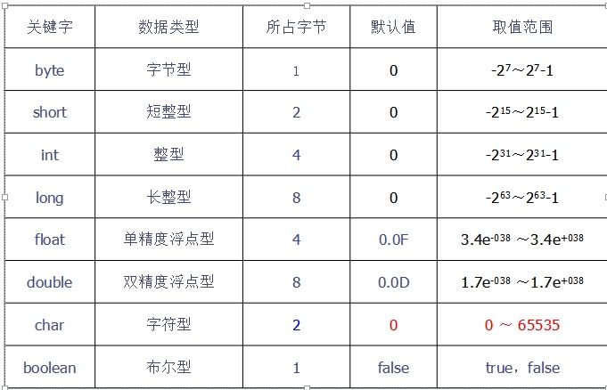

java语言中数据类型分为8中基本数据类型和3中引用数据类型。
#### 一、基本数据类型
因数据类型在内存中所占用的字节数不同，因此它们存储的取值范围也不同。如图所示：

##### 1.整数型
声明为整数类型的常量或变量用来存储整数，整数型包括字节型（byte）、短整型（short）、整型（int）和长整型（long）4个基本数据类型。

程序中出现的所有整数常量值默认都是int类型

在为long型常量或变量赋值时，需要在所赋值的后面加上一个字母“L”（或“l”），说明所赋的值为long型，如果所赋的值未超出int型取值范围，也可以省略字母“L”（或“l”）。例如：
```java
long a = 9876543210L;   //所赋值超出int的取值范围,必须加上字母"L"
long b = 987654321L;    //所赋值未超出int的取值范围,可以加上字母"L"
long b = 987654321;    //所赋值未出int的取值范围,也可以省略字母"L"
```
##### 2.浮点类型
声明为浮点类型的常量或变量用来存储小数（也可以存储整数）。浮点类型包括单精度型（float）和双精度型（double）2个基本数据类型。

程序中出现的所有浮点常量值默认都是double类型。

在为float型常量或变量赋值时，需要在所赋值的后面加上一个字母“F”（或“f”），说明所赋的值为float型，如果所赋的值为整数，并且未超出int型取值范围，也可以省略字母“F”（或“f”）。例如：
```java
float a = 9412.75f;                        //所赋值为小数，必须加上字母“f”
float b = 9876543210f;                     //所赋值超出了int型取值范围，必须加上字母“f”
float c = 9412f;                           //所赋值未超出int型取值范围，可以加上字母“f”
float d = 9412;                            //所赋值未超出int型取值范围，也可以省略字母“f”
```
##### 3.字符型
声明为字符型的常量或变量用来存储单个字符，它占用内存的两个字节来存储，字符型利用关键字“char”进行声明。

在为char型常量或变量赋值时，如果所赋的值为一个英文字母、符号或汉字，必须将所赋的值放在英文状态下的一对单引号中。例如：
```java
char a = 'M';                    //将大写字母"M"赋值给char型变量
char b = '*';                    //将符号"*"赋值给char型变量
char c = '男';                    //将汉字“男”赋值给char型变量
```
java采用Unicode字符编码，Unicode使用两个字节表示一个字符，并且Unicode字符集中的前128个字符与ASCII字符集兼容。

java与C、C++一样，同样把字符作为整数对待，在赋值时可以把0~65535的整数赋值给char型常量或变量，但在输出时并不是所赋的整数。例如：下面的代码把整数88赋值给char型变量c，在输出c时得到的是大写字母“X”：
```java
char c = 88;                        //将整数88赋值给char型变量c
System.out.println(c);                //输出变量c，将得到大写字母“X”
```
如果要将数字0到9以字符的形式赋值给char型变量或常量，赋值方式为将数字0到9放在英文状态下的一对单引号中。例如：
```java
char c = '6';                //将数字“6”赋值给char型变量
```
##### 4.布尔型
声明为布尔型的常量或变量用来存储逻辑值，逻辑值只有true和false，分别用来代表逻辑判断中的“真”和“假”，布尔型变量用关键字“boolean”进行声明

可以将逻辑值true和false直接赋给boolean变量，例如：
```java
public class Test {
	public static void main(String[] args) {
		boolean a = true;		//将逻辑值true赋值给boolean型变量
		boolean b = false;		//将逻辑值false赋值给boolean型变量
		System.out.println("a is "+a);	    // a is true
		System.out.println("b is "+b);  // b is false
	}
}
```
也可以将逻辑表达式赋值给boolean型变量，例如：
```java 
public class Test {
	public static void main(String[] args) {
		boolean a = 6<8;		//将逻辑表达式6<8赋值给boolean型变量
		boolean b = 6>8;		//将逻辑表达式6>8赋值给boolean型变量
		System.out.println("6<8 is "+a);	    // 6<7 is true
		System.out.println("6>8 is "+b);    // 6>8 is false
	}
}
```
#### 二、引用数据类型
引用数据类型包括类引用，接口引用和数组引用。例如：
```java
import java.util.List;
public class Test {
	public static void main(String[] args) {	
		Object object = null;	//声明一个java.lang.Object类的引用，并初始化为null
		List list = null;		//声明一个java.util.List接口的引用，并初始化为null
		int[] month = null;		//声明一个int型数组的引用，并初始化为null
		System.out.println("object is "+object);    // object is null
		System.out.println("list is "+list);    // list is null
		System.out.println("month is "+month);  // month is null
	}
}
```
在具体初始化引用数据类型时要注意，对接口引用的初始化需要通过接口的相应实现类实现。例如下面的代码在声明并具体初始化接口引用list时，是通过java.util.List的实现类import java.util.ArrayList实现的。
```java
import java.util.ArrayList;
import java.util.List;
public class Test {
	public static void main(String[] args) {	
		Object object = new Object();	//声明并具体初始化一个java.lang.Object类的引用
		List list = new ArrayList();	//声明并具体初始化一个java.util.List接口的引用
		int[] month = new int[12];		//声明并具体初始化一个int型数组的引用
		System.out.println("object is "+object);    // object is java.lang.Object@15db9742
		System.out.println("list is "+list);    // list is []
		System.out.println("month is "+month);  // month is [I@6d06d69c
	}
}
```
