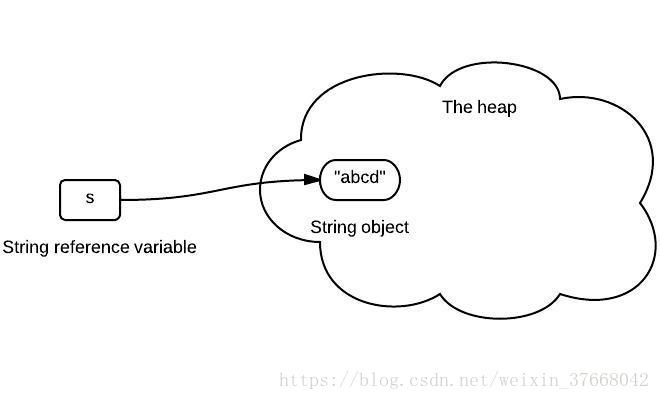
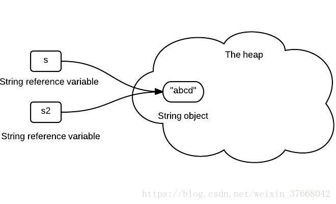
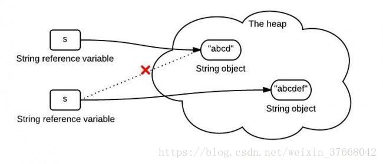
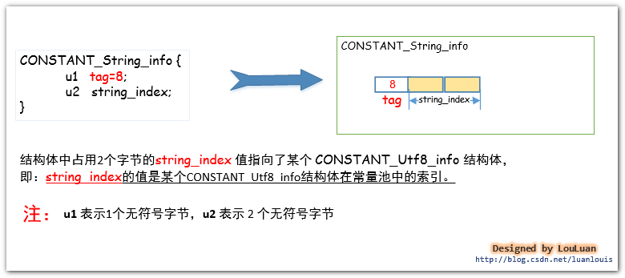
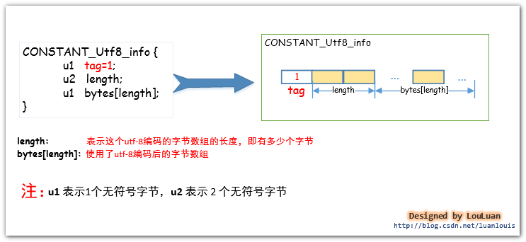
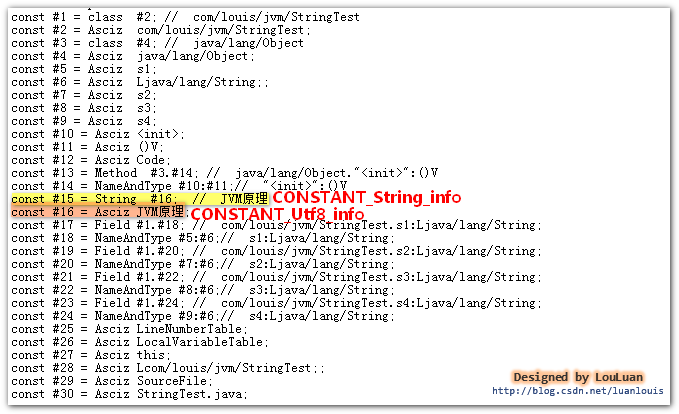
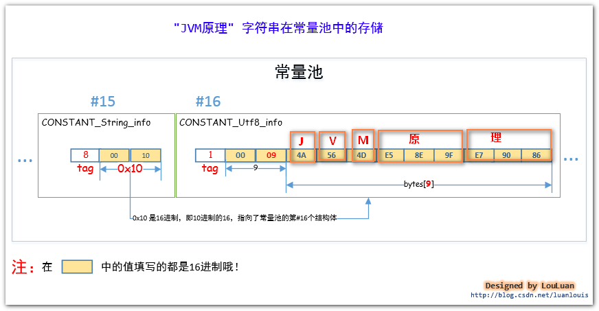

### String的不可变性
这里有一组图片来说明Java字符串的不可变性。
#### 1. 声明一个字符串
以下代码初始化了一个字符串s:
```java
String s = "abcd";
```
如下所示，变量s储存了一个字符串对象的引用。箭头可以被当做“储存引用”。



#### 2. 将一个字符串变量分配给另一个字符串变量
下面代码将s分配给了s2:
```java
String s2 = s;
```
s2储存了一个相同的引用值，因为它是同一个字符串对象。



#### 3. 合并字符串
当我们合并一个字符串“ef”到s：
```java
 s = s.concat("ef");
```
如下所示，s存储新创建的字符串对象的引用：



#### 总结：
综上所述： 一旦在内存（堆）中创建了一个字符串，它就不能被改变。所有字符串的方法都没有去改变字符串自己，而是返回了一个新对象。

如果我们需要一个可以修改的字符串，我们将需要使用StringBuffer 或 StringBuilder。否则，垃圾收集会浪费大量时间，因为每次创建一个新的字符串。
### 虚拟机的常量池中的String字符串
对于字符串而言，JVM会将字符串类型的字面量以UTF-8 编码格式存储到在class字节码文件中。这么说可能有点摸不着北，我们先从直观的Java源码中中出现的用双引号"" 括起来的字符串来看，在编译器编译的时候，都会将这些字符串转换成CONSTANT_String_info结构体，然后放置于常量池中。其结构如下所示：



如上图所示的结构体，CONSTANT_String_info结构体中的string_index的值指向了CONSTANT_Utf8_info结构体，而字符串的utf-8编码数据就在这个结构体之中。如下图所示：



请看一例，定义一个简单的StringTest.java类，然后在这个类里加一个"JVM原理" 字符串，然后，我们来看看它在class文件中是怎样组织的。
```java
package com.louis.jvm;
public class StringTest {
    private String s1 = "JVM原理";
    private String s2 = "JVM原理";
    private String s3 = "JVM原理";
    private String s4 = "JVM原理";
}
```
将Java源码编译成StringTest.class文件后，在此文件的目录下执行 javap -v StringTest 命令，会看到如下的常量池信息的轮廓：



(PS :使用javap -v 指令能看到易于我们阅读的信息，查看真正的字节码文件可以使用HEXWin、NOTEPAD++、UtraEdit 等工具。)

在面的图中，我们可以看到CONSTANT_String_info结构体位于常量池的第#15个索引位置。而存放"Java虚拟机原理" 字符串的 UTF-8编码格式的字节数组被放到CONSTANT_Utf8_info结构体中，该结构体位于常量池的第#16个索引位置。上面的图只是看了个轮廓，让我们再深入地看一下它们的组织吧。请看下图：



由上图可见：“56 E5 8E 9FCONSTANT_Utf8_info结构体中。
### String.intern()的底层原理
查看 Java String类源码，可以看到 intern()方法的定义如下：
```java
public native String intern();
```
String.intern()是一个Native方法，底层调用C++的 StringTable::intern方法实现。

当通过语句str.intern()调用intern()方法后，JVM 就会在当前类的常量池中查找是否存在与str等值的String，若存在则直接返回常量池中相应Strnig的引用；若不存在，则会在常量池中创建一个等值的String，然后返回这个String在常量池中的引用。因此，只要是等值的String对象，使用intern()方法返回的都是常量池中同一个String引用，所以，这些等值的String对象通过intern()后使用==是可以匹配的。
##### String.intern() in Java 6
Java 6中常量池位于PermGen（永久代）中，PermGen是一块主要用于存放已加载的类信息和字符串池的大小固定的区域。执行intern()方法时，若常量池中不存在等值的字符串，JVM就会在常量池中创建一个等值的字符串，然后返回该字符串的引用。除此以外，JVM 会自动在常量池中保存一份之前已使用过的字符串集合。

Java 6中使用intern()方法的主要问题就在于常量池被保存在PermGen中 

* 首先，PermGen是一块大小固定的区域，一般，不同的平台PermGen的默认大小也不相同，大致在32M到96M之间。所以不能对不受控制的运行时字符串（如用户输入信息等）使用intern()方法，否则很有可能会引发PermGen内存溢出；
* 其次，String对象保存在Java堆区，Java堆区与PermGen是物理隔离的，因此，如果对多个不等值的字符串对象执行intern操作，则会导致内存中存在许多重复的字符串，会造成性能损失。

##### String.intern() in Java 7
Java 7将常量池从PermGen区移到了Java堆区，执行intern操作时，如果常量池已经存在该字符串，则直接返回字符串引用，否则复制该字符串对象的引用到常量池中并返回。

堆区的大小一般不受限，所以将常量池从PremGen区移到堆区使得常量池的使用不再受限于固定大小。除此之外，位于堆区的常量池中的对象可以被垃圾回收。当常量池中的字符串不再存在指向它的引用时，JVM就会回收该字符串。

可以使用 -XX:StringTableSize 虚拟机参数设置字符串池的map大小。字符串池内部实现为一个HashMap，所以当能够确定程序中需要intern的字符串数目时，可以将该map的size设置为所需数目*2（减少hash冲突），这样就可以使得String.intern()每次都只需要常量时间和相当小的内存就能够将一个String存入字符串池中。

-XX:StringTableSize的默认值：Java 7u40以前为：1009，Java 7u40以后：60013
##### intern()适用场景
Java 6中常量池位于PermGen区，大小受限，所以不建议适用intern()方法，当需要字符串池时，需要自己使用HashMap实现。

Java7、8中，常量池由PermGen区移到了堆区，还可以通过-XX:StringTableSize参数设置StringTable的大小，常量池的使用不再受限，由此可以重新考虑使用intern()方法。
**intern(）方法优点：**

* 执行速度非常快，直接使用==进行比较要比使用equals(）方法快很多；
* 内存占用少。

虽然intern()方法的优点看上去很诱人，但若不是在恰当的场合中使用该方法的话，便非但不能获得如此好处，反而还可能会有性能损失。

下面程序对比了使用intern()方法和未使用intern()方法存储100万个String时的性能，从输出结果可以看出，若是单纯使用intern()方法进行数据存储的话，程序运行时间要远高于未使用intern()方法时：
```java
public class Intern {
    public static void main(String[] args) {
        print("noIntern: " + noIntern());   // noIntern: 48
        print("intern: " + intern());   // intern: 99 
    }

    private static long noIntern(){
        long start = System.currentTimeMillis();
        for (int i = 0; i < 1000000; i++) {
            int j = i % 100;
            String str = String.valueOf(j);
        }
        return System.currentTimeMillis() - start;
    }

    private static long intern(){
        long start = System.currentTimeMillis();
        for (int i = 0; i < 1000000; i++) {
            int j = i % 100;
            String str = String.valueOf(j).intern();
        }
        return System.currentTimeMillis() - start;
    }
}
```
由于intern(）操作每次都需要与常量池中的数据进行比较以查看常量池中是否存在等值数据，同时JVM需要确保常量池中的数据的唯一性，这就涉及到加锁机制，这些操作都是有需要占用CPU时间的，所以如果进行intern操作的是大量不会被重复利用的String的话，则有点得不偿失。由此可见，String.intern()主要适用于只有有限值，并且这些有限值会被重复利用的场景，如：数据库表中的列名、人的姓氏、编码类型等。
