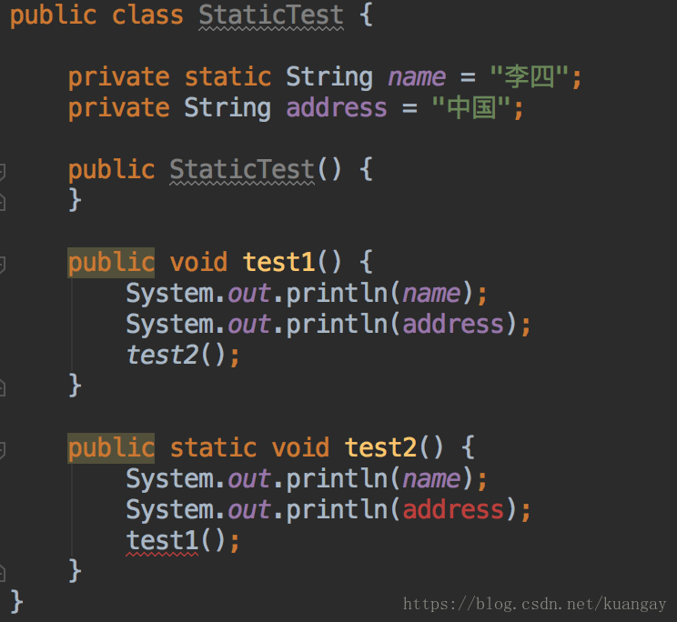
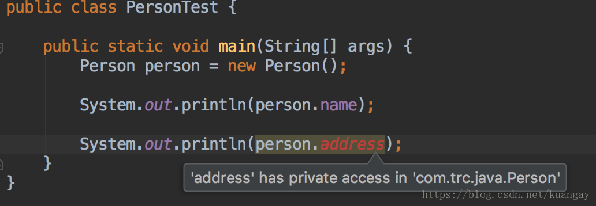

### static关键字
在类中，用static声明的成员变量为静态成员变量，也成为类变量。类变量的生命周期和类相同，在整个应用程序执行期间都有效。

这里要强调一下：

* static修饰的成员变量和方法，从属于类
* 普通变量和方法从属于对象
* 静态方法不能调用非静态成员，编译会报错

### static关键字的用途
一句话描述就是：方便在没有创建对象的情况下进行调用(方法/变量)。

显然，被static关键字修饰的方法或者变量不需要依赖于对象来进行访问，只要类被加载了，就可以通过类名去进行访问。

static可以用来修饰类的成员方法、类的成员变量，另外也可以编写static代码块来优化程序性能
### static方法
static方法也称为静态方法，由于静态方法不依赖于任何对象就可以直接访问，因此对于静态方法来说，是没有this的，因为不依附于任何对象，既然都没有对象，就谈不上this了，并且由于此特性，在静态方法中不能访问类的非静态成员变量和非静态方法，因为非静态成员变量和非静态方法都必须依赖于具体的对象才能被调用。
> 虽然在静态方法中不能访问非静态成员方法和非静态成员变量，但是在非静态成员方法中是可以访问静态成员方法和静态成员变量。

代码示例：

从上面代码里看出：

* 静态方法test2()中调用非静态成员变量address，编译失败。这是因为，在编译期并没有对象生成，address变量根本就不存在。
* 静态方法test2()中调用非静态方法test1()，编译失败。这是因为，编译器无法预知在非静态成员方法test1()中是否访问了非静态成员变量，所以也禁止在静态方法中调用非静态成员方法
* 非静态成员方法test1()访问静态成员方法test2()是没有限制的

所以，如果想在不创建对象的情况下调用某个方法，就可以将这个方法设置为static。最常见的静态方法就是main方法，这就是为什么main方法是静态方法就一目了然了，因为程序在执行main方法的时候没有创建任何对象，只有通过类名来访问。
> 特别说明：static方法是属于类的，非实例对象，在JVM加载类时，就已经存在内存中，不会被虚拟机GC回收掉，这样内存负荷会很大，但是非static方法会在运行完毕后被虚拟机GC掉，减轻内存压力

### static变量
static变量也称为静态变量，静态变量和非静态变量的区别：

* 静态变量被所有对象共享，在内存中只有一个副本，在类初次加载的时候才会初始化
* 非静态变量是对象所拥有的，在创建对象的时候被初始化，存在多个副本，各个对象拥有的副本互不影响

> static成员变量初始化顺序按照定义的顺序来进行初始化

### static块
构造方法用于对象的初始化。静态初始化块，用于类的初始化操作。

在静态初始化块中不能直接访问非staic成员。
#### static块的作用
静态初始化块的作用就是：提升程序性能。

为什么说静态初始化块能提升程序性能，代码示例如下：
```java
class Person{
    private Date birthDate;

    public Person(Date birthDate) {
        this.birthDate = birthDate;
    }

    boolean isBornBoomer() {
        Date startDate = Date.valueOf("1946");
        Date endDate = Date.valueOf("1964");
        return birthDate.compareTo(startDate)>=0 && birthDate.compareTo(endDate) < 0;
    }
}
```
isBornBoomer是用来这个人是否是1946-1964年出生的，而每次isBornBoomer被调用的时候，都会生成startDate和birthDate两个对象，造成了空间浪费，如果改成这样效率会更好：
```java
class Person{
    private Date birthDate;
    private static Date startDate,endDate;
    static{
        startDate = Date.valueOf("1946");
        endDate = Date.valueOf("1964");
    }

    public Person(Date birthDate) {
        this.birthDate = birthDate;
    }

    boolean isBornBoomer() {
        return birthDate.compareTo(startDate)>=0 && birthDate.compareTo(endDate) < 0;
    }
}
```
因此，很多时候会将一些只需要进行一次的初始化操作都放在static代码块中进行
> 静态初始化块可以置于类中的任何地方，类中可以有多个静态初始化块。 
> 在类初次被加载时，会按照静态初始化块的顺序来执行每个块，并且只会执行一次。

### static关键字的误区
#### static关键字会改变类中成员的访问权限吗？
有些初学的朋友会将java中的static与C/C++中的static关键字的功能混淆了。在这里只需要记住一点：与C/C++中的static不同，Java中的static关键字不会影响到变量或者方法的作用域。在Java中能够影响到访问权限的只有private、public、protected（包括包访问权限）这几个关键字。看下面的例子就明白了：
```java
public class Person {

    public String name = "李四";

    private static String address = "中国";
}
```

说明static关键字不能改变变量和方法的访问权限
#### 能通过this访问静态成员变量吗？
```java
public class Main {　　
    static int value = 33;

    public static void main(String[] args) throws Exception{
        new Main().printValue();
    }

    private void printValue(){
        int value = 3;
        System.out.println(this.value);
    }
}
```
这段代码输出结果为：33
this代表什么？this代表当前对象，那么通过new Main()来调用printValue的话，当前对象就是通过new Main()生成的对象。而static变量是被对象所享有的，因此在printValue中的this.value的值毫无疑问是33。在printValue方法内部的value是局部变量，根本不可能与this关联，所以输出结果是33。在这里永远要记住一点：静态成员变量虽然独立于对象，但是不代表不可以通过对象去访问，所有的静态方法和静态变量都可以通过对象访问（只要访问权限足够）。
#### static能作用于局部变量么？
static是不允许用来修饰局部变量。不要问为什么，这是Java语法的规定
### static常见笔试面试题
#### 下面这段代码的输出结果是什么？
```java
public class Test extends Base{

    static{
        System.out.println("test static");
    }

    public Test(){
        System.out.println("test constructor");
    }

    public static void main(String[] args) {
        new Test();
    }
}

class Base{

    static{
        System.out.println("base static");
    }

    public Base(){
        System.out.println("base constructor");
    }
}
```
输出结果为：
```java
base static
test static
base constructor
test constructor
```
分析下这段代码的执行过程：

* 找到main方法入口，main方法是程序入口，但在执行main方法之前，要先加载Test类
* 加载Test类的时候，发现Test类继承Base类，于是先去加载Base类
* 加载Base类的时候，发现Base类有static块，而是先执行static块，输出base static结果
* Base类加载完成后，再去加载Test类，发现Test类也有static块，而是执行Test类中的static块，输出test static结果
* Base类和Test类加载完成后，然后执行main方法中的new Test()，调用子类构造器之前会先调用父类构造器
* 调用父类构造器，输出base constructor结果
* 然后再调用子类构造器，输出test constructor结果

#### 这段代码的输出结果是什么？
```java
public class Test {
    Person person = new Person("Test");
    static{
        System.out.println("test static");
    }

    public Test() {
        System.out.println("test constructor");
    }

    public static void main(String[] args) {
        new MyClass();
    }
}

class Person{
    static{
        System.out.println("person static");
    }
    public Person(String str) {
        System.out.println("person "+str);
    }
}


class MyClass extends Test {
    Person person = new Person("MyClass");
    static{
        System.out.println("myclass static");
    }

    public MyClass() {
        System.out.println("myclass constructor");
    }
}
```
输出结果为：
```java
test static
myclass static
person static
person Test
test constructor
person MyClass
myclass constructor
```
为什么输出结果是这样的？我们来分析下这段代码的执行过程：

* 找到main方法入口，main方法是程序入口，但在执行main方法之前，要先加载Test类
* 加载Test类的时候，发现Test类有static块，而是先执行static块，输出test static结果
* 然后执行new MyClass(),执行此代码之前，先加载MyClass类，发现MyClass类继承Test类，而是要先加载Test类，Test类之前已加载
* 加载MyClass类，发现MyClass类有static块，而是先执行static块，输出myclass static结果
* 然后调用MyClass类的构造器生成对象，在生成对象前，需要先初始化父类Test的成员变量，而是执行Person person = new Person("Test")代码，发现Person类没有加载
* 加载Person类，发现Person类有static块，而是先执行static块，输出person static结果
* 接着执行Person构造器，输出person Test结果
* 然后调用父类Test构造器，输出test constructor结果，这样就完成了父类Test的初始化了
* 再初始化MyClass类成员变量，执行Person构造器，输出person MyClass结果
* 最后调用MyClass类构造器，输出myclass constructor结果，这样就完成了MyClass类的初始化了

#### 这段代码的输出结果是什么？
```java
public class Test {

    static{
        System.out.println("test static 1");
    }
    public static void main(String[] args) {

    }

    static{
        System.out.println("test static 2");
    }
}
```
输出结果为：
```java
test static 1
test static 2
```
虽然在main方法中没有任何语句，但是还是会输出，原因上面已经讲述过了。另外，static块可以出现类中的任何地方（只要不是方法内部，记住，任何方法内部都不行），并且执行是按照static块的顺序执行的。
