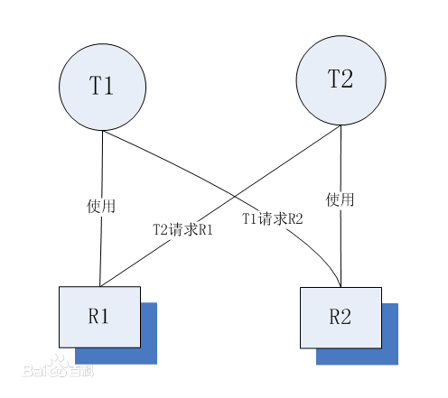
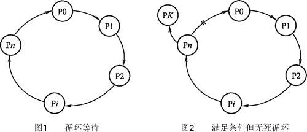
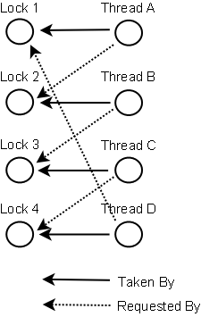

### 一、死锁的定义
多线程以及多进程改善了系统资源的利用率并提高了系统 的处理能力。然而，并发执行也带来了新的问题——死锁。所谓死锁是指多个线程因竞争资源而造成的一种僵局（互相等待），若无外力作用，这些进程都将无法向前推进。

先看生活中的一个实例，两个人面对面过独木桥，甲和乙都已经在桥上走了一段距离，即占用了桥的资源，甲如果想通过独木桥的话，乙必须退出桥面让出桥的资源，让甲通过，但是乙不服，为什么让我先退出去，我还想先过去呢，于是就僵持不下，导致谁也过不了桥，这就是死锁。

在计算机系统中也存在类似的情况。例如，某计算机系统中只有一台打印机和一台输入 设备，进程P1正占用输入设备，同时又提出使用打印机的请求，但此时打印机正被进程P2 所占用，而P2在未释放打印机之前，又提出请求使用正被P1占用着的输入设备。这样两个进程相互无休止地等待下去，均无法继续执行，此时两个进程陷入死锁状态。
### 二、死锁产生的原因
#### 1、系统资源的竞争
通常系统中拥有的不可剥夺资源，其数量不足以满足多个进程运行的需要，使得进程在运行过程中，会因争夺资源而陷入僵局，如磁带机、打印机等。只有对不可剥夺资源的竞争才可能产生死锁，对可剥夺资源的竞争是不会引起死锁的。
#### 2、进程推进顺序非法
进程在运行过程中，请求和释放资源的顺序不当，也同样会导致死锁。例如，并发进程 P1、P2分别保持了资源R1、R2，而进程P1申请资源R2，进程P2申请资源R1时，两者都会因为所需资源被占用而阻塞。

Java中死锁最简单的情况是，一个线程T1持有锁L1并且申请获得锁L2，而另一个线程T2持有锁L2并且申请获得锁L1，因为默认的锁申请操作都是阻塞的，所以线程T1和T2永远被阻塞了。导致了死锁。这是最容易理解也是最简单的死锁的形式。但是实际环境中的死锁往往比这个复杂的多。可能会有多个线程形成了一个死锁的环路，比如：线程T1持有锁L1并且申请获得锁L2，而线程T2持有锁L2并且申请获得锁L3，而线程T3持有锁L3并且申请获得锁L1，这样导致了一个锁依赖的环路：T1依赖T2的锁L2，T2依赖T3的锁L3，而T3依赖T1的锁L1。从而导致了死锁。

从上面两个例子中，我们可以得出结论，产生死锁可能性的最根本原因是：线程在获得一个锁L1的情况下再去申请另外一个锁L2，也就是锁L1想要包含了锁L2，也就是说在获得了锁L1，并且没有释放锁L1的情况下，又去申请获得锁L2，这个是产生死锁的最根本原因。另一个原因是默认的锁申请操作是阻塞的。


#### 3、死锁产生的必要条件：
产生死锁必须同时满足以下四个条件，只要其中任一条件不成立，死锁就不会发生。

>（1）互斥条件：进程要求对所分配的资源（如打印机）进行排他性控制，即在一段时间内某资源仅为一个进程所占有。此时若有其他进程请求该资源，则请求进程只能等待。
>
>（2）不剥夺条件：进程所获得的资源在未使用完毕之前，不能被其他进程强行夺走，即只能由获得该资源的进程自己来释放（只能是主动释放)。
>
>（3）请求和保持条件：进程已经保持了至少一个资源，但又提出了新的资源请求，而该资源已被其他进程占有，此时请求进程被阻塞，但对自己已获得的资源保持不放。
>
>（4）循环等待条件：存在一种进程资源的循环等待链，链中每一个进程已获得的资源同时被链中下一个进程所请求。即存在一个处于等待状态的进程集合{Pl, P2, ..., pn}，其中Pi等 待的资源被P(i+1)占有（i=0, 1, ..., n-1)，Pn等待的资源被P0占有，如图1所示。

直观上看，循环等待条件似乎和死锁的定义一样，其实不然。按死锁定义构成等待环所 要求的条件更严，它要求Pi等待的资源必须由P(i+1)来满足，而循环等待条件则无此限制。 例如，系统中有两台输出设备，P0占有一台，PK占有另一台，且K不属于集合{0, 1, ..., n}。

Pn等待一台输出设备，它可以从P0获得，也可能从PK获得。因此，虽然Pn、P0和其他 一些进程形成了循环等待圈，但PK不在圈内，若PK释放了输出设备，则可打破循环等待, 如图2-16所示。因此循环等待只是死锁的必要条件。



资源分配图含圈而系统又不一定有死锁的原因是同类资源数大于1。但若系统中每类资 源都只有一个资源，则资源分配图含圈就变成了系统出现死锁的充分必要条件。

下面再来通俗的解释一下死锁发生时的条件：
>（1）互斥条件：一个资源每次只能被一个进程使用。独木桥每次只能通过一个人。
>
>（2）请求与保持条件：一个进程因请求资源而阻塞时，对已获得的资源保持不放。乙不退出桥面，甲也不退出桥面。
>
>（3）不剥夺条件: 进程已获得的资源，在未使用完之前，不能强行剥夺。甲不能强制乙退出桥面，乙也不能强制甲退出桥面。
>
>（4）循环等待条件：若干进程之间形成一种头尾相接的循环等待资源关系。如果乙不退出桥面，甲不能通过，甲不退出桥面，乙不能通过。

### 三、死锁实例
#### 例子1：
```java
package com.demo.test;

/**
 * 一个简单的死锁类
 * t1先运行，这个时候flag==true,先锁定obj1,然后睡眠1秒钟
 * 而t1在睡眠的时候，另一个线程t2启动，flag==false,先锁定obj2,然后也睡眠1秒钟
 * t1睡眠结束后需要锁定obj2才能继续执行，而此时obj2已被t2锁定
 * t2睡眠结束后需要锁定obj1才能继续执行，而此时obj1已被t1锁定
 * t1、t2相互等待，都需要得到对方锁定的资源才能继续执行，从而死锁。 
 */
public class DeadLock implements Runnable{
    
    private static Object obj1 = new Object();
    private static Object obj2 = new Object();
    private boolean flag;
    
    public DeadLock(boolean flag){
        this.flag = flag;
    }
    
    @Override
    public void run(){
        System.out.println(Thread.currentThread().getName() + "运行");
        
        if(flag){
            synchronized(obj1){
                System.out.println(Thread.currentThread().getName() + "已经锁住obj1");
                try {  
                    Thread.sleep(1000);  
                } catch (InterruptedException e) {  
                    e.printStackTrace();  
                }  
                synchronized(obj2){
                    // 执行不到这里
                    System.out.println("1秒钟后，"+Thread.currentThread().getName()
                                + "锁住obj2");
                }
            }
        }else{
            synchronized(obj2){
                System.out.println(Thread.currentThread().getName() + "已经锁住obj2");
                try {  
                    Thread.sleep(1000);  
                } catch (InterruptedException e) {  
                    e.printStackTrace();  
                }  
                synchronized(obj1){
                    // 执行不到这里
                    System.out.println("1秒钟后，"+Thread.currentThread().getName()
                                + "锁住obj1");
                }
            }
        }
    }

}
```
```java
package com.demo.test;

public class DeadLockTest {

     public static void main(String[] args) {
         
         Thread t1 = new Thread(new DeadLock(true), "线程1");
         Thread t2 = new Thread(new DeadLock(false), "线程2");

         t1.start();
         t2.start();
    }
}
```
运行结果：
```java
线程1运行
线程1已经锁住obj1
线程2运行
线程2已经锁住obj2
```
线程1锁住了obj1（甲占有桥的一部分资源），线程2锁住了obj2（乙占有桥的一部分资源），线程1企图锁住obj2（甲让乙退出桥面，乙不从），进入阻塞，线程2企图锁住obj1（乙让甲退出桥面，甲不从），进入阻塞，死锁了。

从这个例子也可以反映出，死锁是因为多线程访问共享资源，由于访问的顺序不当所造成的，通常是一个线程锁定了一个资源A，而又想去锁定资源B；在另一个线程中，锁定了资源B，而又想去锁定资源A以完成自身的操作，两个线程都想得到对方的资源，而不愿释放自己的资源，造成两个线程都在等待，而无法执行的情况。
##### 例子2：
```java
package com.demo.test;

public class SyncThread implements Runnable{
    
    private Object obj1;
    private Object obj2;
 
    public SyncThread(Object o1, Object o2){
        this.obj1=o1;
        this.obj2=o2;
    }
    
    @Override
    public void run() {
        String name = Thread.currentThread().getName();
        synchronized (obj1) {
            System.out.println(name + " acquired lock on "+obj1);
            work();
            synchronized (obj2) {
                System.out.println("After, "+name + " acquired lock on "+obj2);
                work();
            }
            System.out.println(name + " released lock on "+obj2);
        }
        System.out.println(name + " released lock on "+obj1);
        System.out.println(name + " finished execution.");
    }
    
    private void work() {
        try {
            Thread.sleep(3000);
        } catch (InterruptedException e) {
            e.printStackTrace();
        }
    }
}
```
```java
package com.demo.test;

public class ThreadDeadTest {

    public static void main(String[] args) throws InterruptedException {
        Object obj1 = new Object();
        Object obj2 = new Object();
        Object obj3 = new Object();
 
        Thread t1 = new Thread(new SyncThread(obj1, obj2), "t1");
        Thread t2 = new Thread(new SyncThread(obj2, obj3), "t2");
        Thread t3 = new Thread(new SyncThread(obj3, obj1), "t3");
 
        t1.start();
        Thread.sleep(1000);
        t2.start();
        Thread.sleep(1000);
        t3.start();
 
    }
}
```
运行结果：
```java
t1 acquired lock on java.lang.Object@5e1077
t2 acquired lock on java.lang.Object@1db05b2
t3 acquired lock on java.lang.Object@181ed9e
```
在这个例子中，形成了一个锁依赖的环路。以t1为例，它先将第一个对象锁住，但是当它试着向第二个对象获取锁时，它就会进入等待状态，因为第二个对象已经被另一个线程锁住了。这样以此类推，t1依赖t2锁住的对象obj2，t2依赖t3锁住的对象obj3，而t3依赖t1锁住的对象obj1，从而导致了死锁。在线程引起死锁的过程中，就形成了一个依赖于资源的循环。
### 四、如何避免死锁
在有些情况下死锁是可以避免的。下面介绍三种用于避免死锁的技术：

* 加锁顺序（线程按照一定的顺序加锁）
* 加锁时限（线程尝试获取锁的时候加上一定的时限，超过时限则放弃对该锁的请求，并释放自己占有的锁）
* 死锁检测

#### 1、加锁顺序
当多个线程需要相同的一些锁，但是按照不同的顺序加锁，死锁就很容易发生。如果能确保所有的线程都是按照相同的顺序获得锁，那么死锁就不会发生。看下面这个例子：
```java
Thread 1:
  lock A 
  lock B

Thread 2:
   wait for A
   lock C (when A locked)

Thread 3:
   wait for A
   wait for B
   wait for C
```
如果一个线程（比如线程3）需要一些锁，那么它必须按照确定的顺序获取锁。它只有获得了从顺序上排在前面的锁之后，才能获取后面的锁。

例如，线程2和线程3只有在获取了锁A之后才能尝试获取锁C(获取锁A是获取锁C的必要条件)。因为线程1已经拥有了锁A，所以线程2和3需要一直等到锁A被释放。然后在它们尝试对B或C加锁之前，必须成功地对A加了锁。

按照顺序加锁是一种有效的死锁预防机制。但是，这种方式需要你事先知道所有可能会用到的锁(并对这些锁做适当的排序)，但总有些时候是无法预知的。

**下面对例子1进行改造：**

将
```java
Thread t2 = new Thread(new DeadLock(false), "线程2");
```
改为：
```java
Thread t2 = new Thread(new DeadLock(true), "线程2");
```
现在应该不会出现死锁了，因为线程1和线程2都是先对obj1加锁，然后再对obj2加锁，当t1启动后，锁住了obj1，而t2也启动后，只有当t1释放了obj1后t2才会执行，从而有效的避免了死锁。

运行结果：
```java
线程1运行
线程1已经锁住obj1
线程2运行
1秒钟后，线程1锁住obj2
线程2已经锁住obj1
1秒钟后，线程2锁住obj2
```
**例子2改造：**
```java
package com.demo.test;

public class SyncThread1 implements Runnable{

    private Object obj1;
    private Object obj2;
 
    public SyncThread1(Object o1, Object o2){
        this.obj1=o1;
        this.obj2=o2;
    }
    
    @Override
    public void run() {
        String name = Thread.currentThread().getName();
        synchronized (obj1) {
            System.out.println(name + " acquired lock on "+obj1);
            work();
        }
        System.out.println(name + " released lock on "+obj1);
        synchronized(obj2){
            System.out.println("After, "+ name + " acquired lock on "+obj2);
            work();
        }
        System.out.println(name + " released lock on "+obj2);
        System.out.println(name + " finished execution.");
    }
    
    private void work() {
        try {
            Thread.sleep(3000);
        } catch (InterruptedException e) {
            e.printStackTrace();
        }
    }
}
```
```java
package com.demo.test;

public class ThreadDeadTest1 {

    public static void main(String[] args) throws InterruptedException {
        Object obj1 = new Object();
        Object obj2 = new Object();
        Object obj3 = new Object();
 
        Thread t1 = new Thread(new SyncThread1(obj1, obj2), "t1");
        Thread t2 = new Thread(new SyncThread1(obj2, obj3), "t2");
        Thread t3 = new Thread(new SyncThread1(obj3, obj1), "t3");
 
        t1.start();
        Thread.sleep(1000);
        t2.start();
        Thread.sleep(1000);
        t3.start();
 
    }
}
```
运行结果：
```java
t1 acquired lock on java.lang.Object@60e128
t2 acquired lock on java.lang.Object@18b3364
t3 acquired lock on java.lang.Object@76fba0
t1 released lock on java.lang.Object@60e128
t2 released lock on java.lang.Object@18b3364
After, t1 acquired lock on java.lang.Object@18b3364
t3 released lock on java.lang.Object@76fba0
After, t2 acquired lock on java.lang.Object@76fba0
After, t3 acquired lock on java.lang.Object@60e128
t1 released lock on java.lang.Object@18b3364
t1 finished execution.
t2 released lock on java.lang.Object@76fba0
t3 released lock on java.lang.Object@60e128
t3 finished execution.
t2 finished execution.
```
从结果中看，没有出现死锁的局面。因为在run()方法中，不存在嵌套封锁。
**避免嵌套封锁**：这是死锁最主要的原因的，如果你已经有一个资源了就要避免封锁另一个资源。如果你运行时只有一个对象封锁，那是几乎不可能出现一个死锁局面的。

再举个生活中的例子，比如银行转账的场景下，我们必须同时获得两个账户上的锁，才能进行操作，两个锁的申请必须发生交叉。这时我们也可以打破死锁的那个闭环，在涉及到要同时申请两个锁的方法中，总是以相同的顺序来申请锁，比如总是先申请 id 大的账户上的锁 ，然后再申请 id 小的账户上的锁，这样就无法形成导致死锁的那个闭环。
```java
public class Account {
    private int id;    // 主键
    private String name;
    private double balance;
    
    public void transfer(Account from, Account to, double money){
        if(from.getId() > to.getId()){
            synchronized(from){
                synchronized(to){
                    // transfer
                }
            }
        }else{
            synchronized(to){
                synchronized(from){
                    // transfer
                }
            }
        }
    }

    public int getId() {
        return id;
    }
}
```
这样的话，即使发生了两个账户比如 id=1的和id=100的两个账户相互转账，因为不管是哪个线程先获得了id=100上的锁，另外一个线程都不会去获得id=1上的锁(因为他没有获得id=100上的锁)，只能是哪个线程先获得id=100上的锁，哪个线程就先进行转账。这里除了使用id之外，如果没有类似id这样的属性可以比较，那么也可以使用对象的hashCode()的值来进行比较。
#### 2、加锁时限
另外一个可以避免死锁的方法是在尝试获取锁的时候加一个超时时间，这也就意味着在尝试获取锁的过程中若超过了这个时限该线程则放弃对该锁请求。若一个线程没有在给定的时限内成功获得所有需要的锁，则会进行回退并释放所有已经获得的锁，然后等待一段随机的时间再重试。这段随机的等待时间让其它线程有机会尝试获取相同的这些锁，并且让该应用在没有获得锁的时候可以继续运行(加锁超时后可以先继续运行干点其它事情，再回头来重复之前加锁的逻辑)。

以下是一个例子，展示了两个线程以不同的顺序尝试获取相同的两个锁，在发生超时后回退并重试的场景：
```java
Thread 1 locks A
Thread 2 locks B

Thread 1 attempts to lock B but is blocked
Thread 2 attempts to lock A but is blocked

Thread 1's lock attempt on B times out
Thread 1 backs up and releases A as well
Thread 1 waits randomly (e.g. 257 millis) before retrying.

Thread 2's lock attempt on A times out
Thread 2 backs up and releases B as well
Thread 2 waits randomly (e.g. 43 millis) before retrying.
```
在上面的例子中，线程2比线程1早200毫秒进行重试加锁，因此它可以先成功地获取到两个锁。这时，线程1尝试获取锁A并且处于等待状态。当线程2结束时，线程1也可以顺利的获得这两个锁（除非线程2或者其它线程在线程1成功获得两个锁之前又获得其中的一些锁）。

需要注意的是，由于存在锁的超时，所以我们不能认为这种场景就一定是出现了死锁。也可能是因为获得了锁的线程（导致其它线程超时）需要很长的时间去完成它的任务。此外，如果有非常多的线程同一时间去竞争同一批资源，就算有超时和回退机制，还是可能会导致这些线程重复地尝试但却始终得不到锁。如果只有两个线程，并且重试的超时时间设定为0到500毫秒之间，这种现象可能不会发生，但是如果是10个或20个线程情况就不同了。因为这些线程等待相等的重试时间的概率就高的多（或者非常接近以至于会出现问题）。(超时和重试机制是为了避免在同一时间出现的竞争，但是当线程很多时，其中两个或多个线程的超时时间一样或者接近的可能性就会很大，因此就算出现竞争而导致超时后，由于超时时间一样，它们又会同时开始重试，导致新一轮的竞争，带来了新的问题。)

这种机制存在一个问题，在Java中不能对synchronized同步块设置超时时间。你需要创建一个自定义锁，或使用Java5中java.util.concurrent包下的工具。
#### 3、死锁检测
死锁检测是一个更好的死锁预防机制，它主要是针对那些不可能实现按序加锁并且锁超时也不可行的场景。

每当一个线程获得了锁，会在线程和锁相关的数据结构中（map、graph等等）将其记下。除此之外，每当有线程请求锁，也需要记录在这个数据结构中。当一个线程请求锁失败时，这个线程可以遍历锁的关系图看看是否有死锁发生。例如，线程A请求锁7，但是锁7这个时候被线程B持有，这时线程A就可以检查一下线程B是否已经请求了线程A当前所持有的锁。如果线程B确实有这样的请求，那么就是发生了死锁（线程A拥有锁1，请求锁7；线程B拥有锁7，请求锁1）。

当然，死锁一般要比两个线程互相持有对方的锁这种情况要复杂的多。线程A等待线程B，线程B等待线程C，线程C等待线程D，线程D又在等待线程A。线程A为了检测死锁，它需要递进地检测所有被B请求的锁。从线程B所请求的锁开始，线程A找到了线程C，然后又找到了线程D，发现线程D请求的锁被线程A自己持有着。这是它就知道发生了死锁。

下面是一幅关于四个线程（A,B,C和D）之间锁占有和请求的关系图。像这样的数据结构就可以被用来检测死锁。



 那么当检测出死锁时，这些线程该做些什么呢？
 
一个可行的做法是释放所有锁，回退，并且等待一段随机的时间后重试。这个和简单的加锁超时类似，不一样的是只有死锁已经发生了才回退，而不会是因为加锁的请求超时了。虽然有回退和等待，但是如果有大量的线程竞争同一批锁，它们还是会重复地死锁（原因同超时类似，不能从根本上减轻竞争）。

一个更好的方案是给这些线程设置优先级，让一个（或几个）线程回退，剩下的线程就像没发生死锁一样继续保持着它们需要的锁。如果赋予这些线程的优先级是固定不变的，同一批线程总是会拥有更高的优先级。为避免这个问题，可以在死锁发生的时候设置随机的优先级。
### 总结：避免死锁的方式
1、让程序每次至多只能获得一个锁。当然，在多线程环境下，这种情况通常并不现实。

2、设计时考虑清楚锁的顺序，尽量减少嵌在的加锁交互数量。

3、既然死锁的产生是两个线程无限等待对方持有的锁，那么只要等待时间有个上限不就好了。当然synchronized不具备这个功能，但是我们可以使用Lock类中的tryLock方法去尝试获取锁，这个方法可以指定一个超时时限，在等待超过该时限之后便会返回一个失败信息。

我们可以使用ReentrantLock.tryLock()方法，在一个循环中，如果tryLock()返回失败，那么就释放以及获得的锁，并睡眠一小段时间。这样就打破了死锁的闭环。比如：线程T1持有锁L1并且申请获得锁L2，而线程T2持有锁L2并且申请获得锁L3，而线程T3持有锁L3并且申请获得锁L1。此时如果T3申请锁L1失败，那么T3释放锁L3，并进行睡眠，那么T2就可以获得L3了，然后T2执行完之后释放L2, L3，所以T1也可以获得L2了执行完然后释放锁L1, L2，然后T3睡眠醒来，也可以获得L1, L3了。打破了死锁的闭环。
