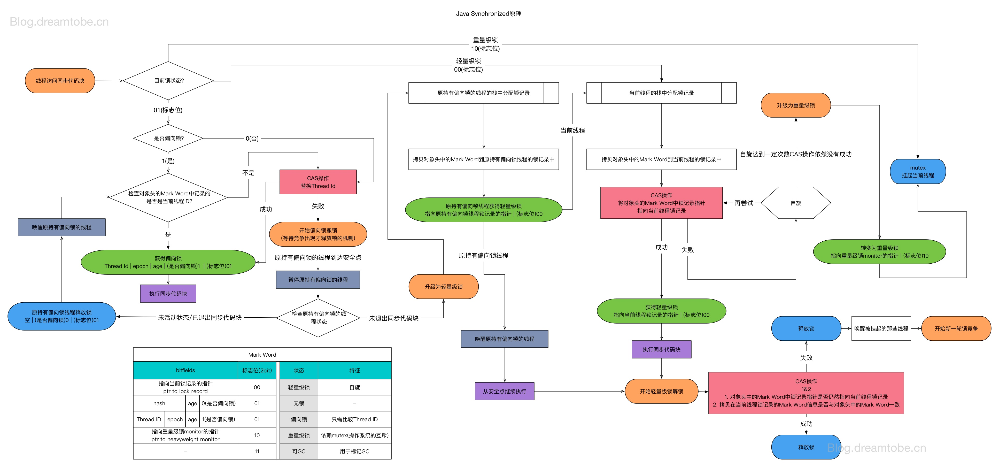

### 偏向锁
通过观察发现两个很重要的特性：不但大量的锁不存在竞争，而且更倾向于被相同的线程获取和解锁。因此称之为：锁具有线程的局部性。

在Java HotSpot VM中，每个对象都有2个字（32位或者64位）的对象头。第一个字叫作mark word，该字包含了多个信息：对象状态、同步信息、垃圾回收信息、hashcode信息。第二个字指向该对象所属的类。

当创建一个对象时，如果该对象类型开启了偏向锁，那么就设置该对象的mark word的低三位为101。当一个线程想要获取一个可偏向的对象锁时，会通过原子操作CAS把当前线程的id设置到对象的mark word字段中。如果CAS操作成功了，那么就说明该对象被锁定，并且该对象会偏向于此线程。只要偏向位一直存在，那么随后被偏向的线程获取锁和释放锁只需要检查对象的mark word即可，这样就减少了很多昂贵的原子操作。

当CAS操作失败时，那就意味着已经有线程拥有了该偏向锁，此时就需要移除偏向锁，启用轻量级锁。完成这些操作有以下情形：

* 到达全局安全点时，挂起所有持有偏向锁的线程。
* 遍历拥有偏向锁的线程的堆栈（主要是遍历lock records），与该锁对象相关的lock record将被填充成轻量级锁的相关值。
* 对象的mark word被更新，指向相关联的lock record栈中最近的一个lock record。
* 唤醒被阻塞在全局安全点的线程。

### 批量重偏向和撤销
偏向锁定可以优化锁不竞争且通常由单个线程锁定的情况。在此基础上扩展，实践中发现的一个普遍情况：锁通常是不存在竞争的，但是拥有对象锁的线程会改变对象的生命周期。一个例子就是有些线程初始化一个对象并把该对象传递给另一线程并继续工作，为了优化这种情况，我们就需要一种新的机制把偏向锁“传递”给一个新的线程。

类似地，在可预期的存在锁竞争情况下，例如生产者消费者模式，在这种情况下，禁用偏向锁是有益处的，这样可以避免由于停止线程而带来偏向锁撤销的昂贵操作。

这两种情况通过批量重偏向和撤销机制来处理的。批量重偏向意味着T类型的所有对象状态将被重置，所以下一个获取锁的线程将会成为新的偏向锁拥有者-高效的转换偏向锁。批量撤销意味着同时禁用一些类的所有实例的偏向锁。这些类的对象通常是存在竞争的。

批量重偏向通过添加一个时间戳（epoch-每个对象和类的mark word都有该字段）来实现的，如果一个对象的mark word中偏向拥有者是线程T，并且该实例的epoch等于类的epoch值，那么该对象就会偏向于线程T，重偏向通过下述流程进行：

* 到达全局安全点，挂起所有持有偏向锁的线程。
* 增加C类的epoch值。
* 在阻塞的线程中，找到被锁的所有C类型的对象，更新这些对象的epoch信息，或者基于启发式的撤销偏向锁。
* 唤醒被阻塞在全局安全点的线程。

批量撤销是通过改变数据类型来实现的，可以比较容易的实现。在数据类型中添加一个是否偏向位，该位会在每次锁操作时都会检查的。下面是支持偏向锁的重偏向和撤销操作的伪代码：
```java
void lock ( Object* obj , Thread* t ) {
    int lw = obj−>lock_word ;
    if ( lock_state(lw) == Biased
    && biasable (lw) ==obj−>class−>biasable
    && bias_epoch (lw) ==obj−>class−>bias_epoch ) {
      if ( lock_or_bias_owner (lw) == t−>id ) {
        return ; //t is the bias owner .
      } else {
        revoke_bias ( obj , t ) ;
      }
    } else {
      // normal locking protocol
      // possibly with bias acquisition
    }
}
```
### 实践总结


通过上述图解，简单总结描述一下偏向锁获取和释放的流程：
#### 获取偏向锁和释放锁

* 1.线程访问到同步代码块的代码。
* 2.判断锁对象的锁状态（mark word的低2位），如果为01，证明此时锁为偏向锁
* 3.判断偏向锁的状态，如果为0进入步骤4，否则进入步骤5。
* 4.通过CAS操作替换对象头mark word中的线程id，如果CAS操作成功进入操作6，否则进入操作7。
* 5.检查对象头中的mark word中的线程id是否是当前线程的线程id，如果不是，进入步骤4，否则进入步骤8
* 6.成功获取偏向锁（mark word状态为：[thread_id|epoch|age|1|01]）。
* 7.开始执行偏向锁的撤销。
* 8.当原持有偏向锁的线程到达安全点时，暂停原有偏向锁的线程。
* 9.检查持有锁的状态，如果原有锁已经退出同步代码块或者未处于活动状态，进入步骤10，未退出代码块，进入步骤12。
* 10.原持有偏向锁的线程释放锁（mark word状态为[NULL|0|01]，
* 11.唤醒原持有偏向锁的线程。进入步骤5
* 12.升级为轻量级锁。

### 总结及疑问解答
当处于偏向锁时，hashcode值存在何处？

> 当一个对象已经计算过identity hash code，它就无法进入偏向锁状态；
> 
> 因为偏向锁需要使用hash位来保存线程id，这样的话，就没有额外的空间用来保存hashcode值。
> 
> 当一个对象当前正处于偏向锁状态，并且需要计算其identity hash code的话，则它的偏向锁会被撤销，并且锁会膨胀为重量锁；

