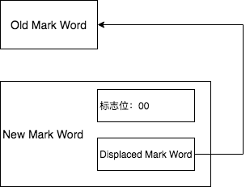

### 概念
在某些场景下，去获取对象锁的时候使用CAS的方式，而不是阻塞。

轻量级锁能够提升程序同步性能的一句是“对于绝大部分的锁，在整个同步周期内都是不存在竞争的”，这是一个经验数据。

在 Java Object头文件中，有一个“Mark Word”对象，它是实现轻量级锁的关键。

Mark Word的数据结构非固定，根据不同的状态会有不同的结构。

比如在32位的HotSpot虚拟机中对象未被锁定的状态下，Mark Word的32bit空间中的25bit用于存储对象哈希码，4bit用于存储对象分代年龄，2bit用于存储锁标志位，1bit固定为0。

其主要的几个状态如下：

| 状态 | 标志位 | 存储内容 |
| --- | --- | --- |
| 未锁定 | 01 | 对象哈希码、对象分代年龄 |
| 轻量级锁定 | 00 | 指向锁记录的指针 |
| 重量级锁定 | 10 | 指向重量级锁的指针 |
| GC标志 | 11 | 空，不需要记录信息 |
| 可偏向 | 01 | 偏向线程ID、偏向时间戳，对象分代年龄 |
### 轻量级锁加锁过程
（1）在代码进入同步块的时候，如果同步对象锁状态为无锁状态（锁标志位为“01”状态），虚拟机首先将在当前线程的栈帧中建立一个名为锁记录（Lock Record）的空间，用于存储旧的Mark Word的拷贝，官方称其为Displaced Mark Word。(锁记录解锁的时候会用到)

（2）虚拟机将使用CAS操作尝试将对象的Mark Word更新为轻量级锁的标志位和指向锁记录（Lock Record）的指针。

（3）如果这个更新动作成功了，那么这个线程就拥有了该对象的锁。

（4）如果这个更新操作失败了，虚拟机首先会检查当前线程是否已经拥有了这个对象的锁，如果已经拥有，那就可以直接进入同步块继续执行。否则就说明这个锁度一项已经被其他线程抢占了。一旦发生这种情况，那么轻量级锁就会膨胀为重量级锁。Mark Word中存储的就会指向重量级锁的指针，后面等待锁的线程也会进入阻塞状态。
### 轻量级锁解锁过程
（1）通过CAS操作尝试把线程中复制的Displaced Mark Word对象替换当前的Mark Word。

（2）如果替换成功，整个同步过程就完成了。

（3）如果替换失败，说明有其他线程尝试过获取该锁，并导致该锁变成了重量级锁，那就要在释放锁的同时，唤醒被挂起的线程。
### 画图理解

#### 加锁
用New Mark Word替换Old Mark Word。
#### 解锁
用Displaced Mark Word替换New Mark Word。
