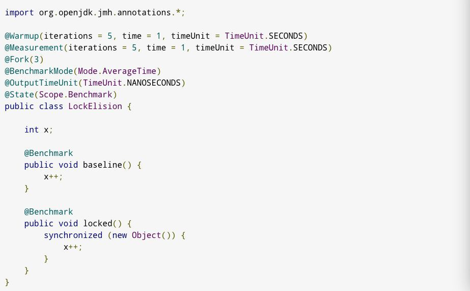
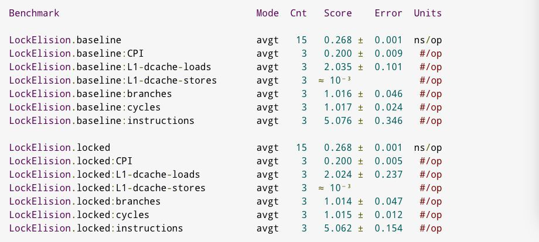
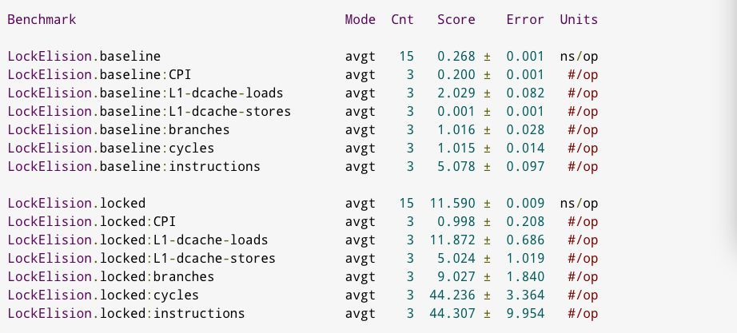

### 锁消除
#### 导语
锁消除是Java虚拟机在JIT编译期间，通过对运行上下文的扫描，去除不可能存在共享资源竞争的锁，通过锁消除，可以节省毫无意义的请求锁时间。本文举例说明了锁消除，并分析了锁消除的条件。
#### 问题
我听说JVM会对锁进行优化，所以如果我写了synchronized，JVM会帮我做优化！对吗？
#### 理论
在当前Java内存模型中，未观察到的锁不能保证具有任何效果。另外，这意味着在非共享对象上进行同步是无效的，因此runtime可以啥也不做。同步有可能是不需要的，这为优化提供了机会。

因此，如果逃逸分析发现对象是非逃逸的，编译器就可以自行消除同步。
#### 测试
考虑如下JMH基准测试：



如果我们运行此测试并启用-prof perfnorm profiler，将看到：



执行结果完全相同。这意味着生成的代码是相同的。生成的代码是这样：


锁完全被消除了。如果我们使用jvm参数-xx:-eliminateLocks，或者使用-xx:-doescapeanalysis禁用EA（这会破坏依赖EA的每个优化，包括锁消除），则锁计数器将膨胀：



显示了两种方式的开销对比。
#### 结论
锁消除是由于逃逸分析带来的优化，它消除了多余的同步。当内部同步代码没有逃逸到外部时，runtime就可以完全消除同步了。
### 锁粗化
通常情况下，为了保证多线程间的有效并发，会要求每个线程持有锁的时间尽可能短，但是大某些情况下，一个程序对同一个锁不间断、高频地请求、同步与释放，会消耗掉一定的系统资源，因为锁的讲求、同步与释放本身会带来性能损耗，这样高频的锁请求就反而不利于系统性能的优化了，虽然单次同步操作的时间可能很短。锁粗化就是告诉我们任何事情都有个度，有些情况下我们反而希望把很多次锁的请求合并成一个请求，以降低短时间内大量锁请求、同步、释放带来的性能损耗。

一种极端的情况如下：
```java
public void doSomethingMethod(){
    synchronized(lock){
        // do some thing
    }
    //这是还有一些代码，做其它不需要同步的工作，但能很快执行完毕
    synchronized(lock){
        // do other thing
    }
}
```
上面的代码是有两块需要同步操作的，但在这两块需要同步操作的代码之间，需要做一些其它的工作，而这些工作只会花费很少的时间，那么我们就可以把这些工作代码放入锁内，将两个同步代码块合并成一个，以降低多次锁请求、同步、释放带来的系统性能消耗，合并后的代码如下:
```java
public void doSomethingMethod(){
    // 进行锁粗化：整合成一次锁请求、同步、释放
    synchronized(lock){
        // do some thing
        // 做其它不需要同步但能很快执行完的工作
        // do other thing
    }
}
```
> 注意：这样做是有前提的，就是中间不需要同步的代码能够很快速地完成，如果不需要同步的代码需要花很长时间，就会导致同步块的执行需要花费很长的时间，这样做也就不合理了。

另一种需要锁粗化的极端的情况是：
```java
for(int i=0;i<size;i++){
    synchronized(lock){
    }
}
```
上面代码每次循环都会进行锁的请求、同步与释放，看起来貌似没什么问题，且在jdk内部会对这类代码锁的请求做一些优化，但是还不如把加锁代码写在循环体的外面，这样一次锁的请求就可以达到我们的要求，除非有特殊的需要：循环需要花很长时间，但其它线程等不起，要给它们执行的机会。

锁粗化后的代码如下：
```java
synchronized(lock){
    for(int i=0;i<size;i++){
    }
}
```
