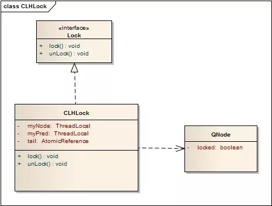
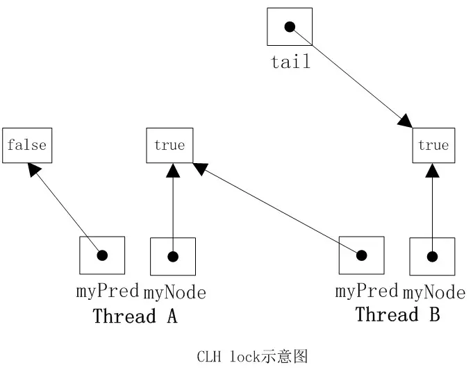
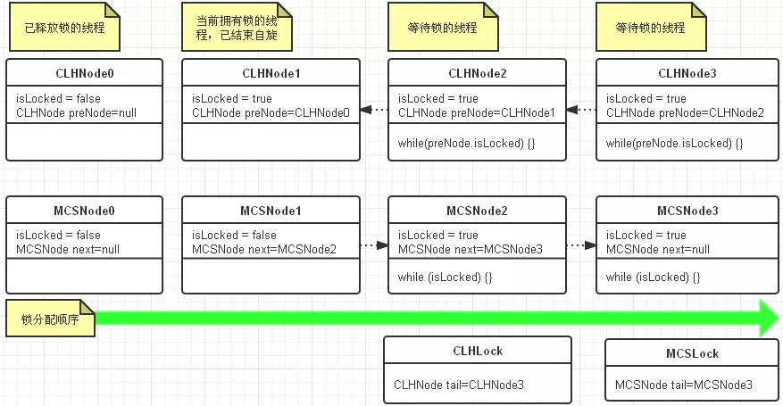

### 简单自旋锁
自旋锁是指当一个线程尝试获取某个锁时，如果该锁已被其他线程占用，就一直循环检测锁是否被释放，而不是进入线程挂起或睡眠状态。

自旋锁适用于锁保护的临界区很小的情况，临界区很小的话，锁占用的时间就很短。
```java
public class SpinLock implements Lock {
    /**
     *  use thread itself as  synchronization state
     *  使用Owner Thread作为同步状态，比使用一个简单的boolean flag可以携带更多信息
     */
    private AtomicReference<Thread> owner = new AtomicReference<>();
    /**
     * reentrant count of a thread, no need to be volatile
     */
    private int count = 0;

    @Override
    public void lock() {
        Thread t = Thread.currentThread();
        // if re-enter, increment the count.
        if (t == owner.get()) {
            ++count;
            return;
        }
        //spin
        while (owner.compareAndSet(null, t)) {
        }
    }

    @Override
    public void unlock() {
        Thread t = Thread.currentThread();
        //only the owner could do unlock;
        if (t == owner.get()) {
            if (count > 0) {
                // reentrant count not zero, just decrease the counter.
                --count;
            } else {
                // compareAndSet is not need here, already checked
                owner.set(null);
            }
        }
    }
}
```
SimpleSpinLock里有一个owner属性持有锁当前拥有者的线程的引用，如果该引用为null，则表示锁未被占用，不为null则被占用。

这里用AtomicReference是为了使用它的原子性的compareAndSet方法（CAS操作），解决了多线程并发操作导致数据不一致的问题，确保其他线程可以看到锁的真实状态。

#### 缺点：
1. CAS操作需要硬件的配合；
2. 保证各个CPU的缓存（L1、L2、L3、跨CPU Socket、主存）的数据一致性，通讯开销很大，在多处理器系统上更严重；
3. 没法保证公平性，不保证等待进程/线程按照FIFO顺序获得锁。

### TicketLock
Ticket Lock 是为了解决上面的公平性问题，类似于现实中银行柜台的排队叫号：锁拥有一个服务号，表示正在服务的线程，还有一个排队号；每个线程尝试获取锁之前先拿一个排队号，然后不断轮询锁的当前服务号是否是自己的排队号，如果是，则表示自己拥有了锁，不是则继续轮询。

当线程释放锁时，将服务号加1，这样下一个线程看到这个变化，就退出自旋。
```java
public class TicketLock implements Lock {
    private AtomicInteger serviceNum = new AtomicInteger(0);
    private AtomicInteger ticketNum = new AtomicInteger(0);
    private final ThreadLocal<Integer> myNum = new ThreadLocal<>();

    @Override
    public void lock() {
        myNum.set(ticketNum.getAndIncrement());
        while (serviceNum.get() != myNum.get()) {
        }
    }

    @Override
    public void unlock() {
        serviceNum.compareAndSet(myNum.get(), myNum.get() + 1);
        myNum.remove();
    }
}
```
#### 缺点：
Ticket Lock 虽然解决了公平性的问题，但是多处理器系统上，每个进程/线程占用的处理器都在读写同一个变量serviceNum ，每次读写操作都必须在多个处理器缓存之间进行缓存同步，这会导致繁重的系统总线和内存的流量，大大降低系统整体的性能。

下面介绍的CLH锁和MCS锁都是为了解决这个问题的。
### CLHLock
CLH的发明人是：Craig，Landin and Hagersten。是一种基于链表的可扩展、高性能、公平的自旋锁，申请线程只在本地变量上自旋，它不断轮询前驱的状态，如果发现前驱释放了锁就结束自旋。

CLH队列中的结点QNode中含有一个locked字段，该字段若为true表示该线程需要获取锁，且不释放锁，为false表示线程释放了锁。结点之间是通过隐形的链表相连，之所以叫隐形的链表是因为这些结点之间没有明显的next指针，而是通过preNode所指向的结点的变化情况来影响myNode的行为。CLHLock上还有一个尾指针，始终指向队列的最后一个结点。CLHLock的类图如下所示：



当一个线程需要获取锁时，会创建一个新的QNode，将其中的locked设置为true表示需要获取锁，然后线程对tail域调用getAndSet方法，使自己成为队列的尾部，同时获取一个指向其前趋的引用preNode,然后该线程就在前趋结点的locked字段上自旋，直到前趋结点释放锁。当一个线程需要释放锁时，将当前结点的locked域设置为false，同时回收前趋结点。如下图所示，线程A需要获取锁，其myNode域为true，些时tail指向线程A的结点，然后线程B也加入到线程A后面，tail指向线程B的结点。然后线程A和B都在它的preNode域上旋转，一旦它的preNode结点的locked字段变为false，它就可以获取锁。明显线程A的preNode locked域为false，此时线程A获取到了锁。



实现如下：
```java
public class CLHLock implements Lock {
    /**
     * 锁等待队列的尾部
     */
    private AtomicReference<QNode> tail;
    private ThreadLocal<QNode> preNode;
    private ThreadLocal<QNode> myNode;

    public CLHLock() {
        tail = new AtomicReference<>(null);
        myNode = ThreadLocal.withInitial(QNode::new);
        preNode = ThreadLocal.withInitial(() -> null);
    }

    @Override
    public void lock() {
        QNode qnode = myNode.get();
        // 设置自己的状态为locked=true表示需要获取锁
        qnode.locked = true;
        // 链表的尾部设置为本线程的qNode，并将之前的尾部设置为当前线程的preNode
        QNode pre = tail.getAndSet(qnode);
        preNode.set(pre);
        if(pre != null) {
            // 当前线程在前驱节点的locked字段上旋转，直到前驱节点释放锁资源
            while (pre.locked) {
            }
        }
    }

    @Override
    public void unlock() {
        QNode qnode = myNode.get();
        // 释放锁操作时将自己的locked设置为false，可以使得自己的后继节点可以结束自旋
        qnode.locked = false;
        // 回收自己这个节点，从虚拟队列中删除
        // 将当前节点引用置为自己的preNode，那么下一个节点的preNode就变为了当前节点的preNode，这样就将当前节点移出了队列
        myNode.set(preNode.get());
    }

    private class QNode {
        /**
         * true表示该线程需要获取锁，且不释放锁，为false表示线程释放了锁，且不需要锁
         */
        private volatile boolean locked = false;
    }
}
```
CLH队列锁的优点是空间复杂度低（如果有n个线程，L个锁，每个线程每次只获取一个锁，那么需要的存储空间是O（L+n），n个线程有n个myNode，L个锁有L个tail），CLH的一种变体被应用在了JAVA并发框架中。唯一的缺点是在NUMA系统结构下性能很差，在这种系统结构下，每个线程有自己的内存，如果前趋结点的内存位置比较远，自旋判断前趋结点的locked域，性能将大打折扣，但是在SMP系统结构下该法还是非常有效的。一种解决NUMA系统结构的思路是MCS队列锁。
### MCSLock
MCS 来自于其发明人名字的首字母： John Mellor-Crummey和Michael Scott。是一种基于链表的可扩展、高性能、公平的自旋锁，申请线程只在本地变量上自旋，直接前驱负责通知其结束自旋，从而极大地减少了不必要的处理器缓存同步的次数，降低了总线和内存的开销。
```java
public class MCSLock implements Lock {
    private AtomicReference<QNode> tail;
    private ThreadLocal<QNode> myNode;

    public MCSLock() {
        tail = new AtomicReference<>(null);
        myNode = ThreadLocal.withInitial(QNode::new);
    }

    @Override
    public void lock() {
        QNode qnode = myNode.get();
        QNode preNode = tail.getAndSet(qnode);
        if (preNode != null) {
            qnode.locked = false;
            preNode.next = qnode;
            //wait until predecessor gives up the lock
            while (!qnode.locked) {
            }
        }
        qnode.locked = true;
    }

    @Override
    public void unlock() {
        QNode qnode = myNode.get();
        if (qnode.next == null) {
            // 后面没有等待线程的情况
            if (tail.compareAndSet(qnode, null)) {
                //真的没有等待线程，则直接返回，不需要通知
                return;
            }
            // wait until predecessor fills in its next field
            // 突然有人排在自己后面了，可能还不知道是谁，下面是等待后续者
            while (qnode.next == null) {
            }
        }
        // 后面有等待线程，则通知后面的线程
        qnode.next.locked = true;
        qnode.next = null;
    }

    private class QNode {
        /**
         * 是否被qNode所属线程锁定
         */
        private volatile boolean locked = false;
        /**
         * 与CLHLock相比，多了这个真正的next
         */
        private volatile QNode next = null;
    }
}
```
#### CLH锁 与 MCS锁 的比较


**差异：**

1. 从代码实现来看，CLH比MCS要简单得多。
2. 从自旋的条件来看，CLH是在前驱节点的属性上自旋，而MCS是在本地属性变量上自旋。
3. 从链表队列来看，CLHNode不直接持有前驱节点，CLH锁释放时只需要改变自己的属性；MCSNode直接持有后继节点，MCS锁释放需要改变后继节点的属性。
4. CLH锁释放时只需要改变自己的属性，MCS锁释放则需要改变后继节点的属性。
