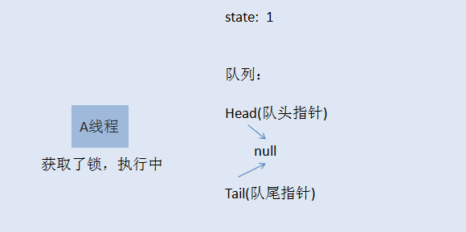
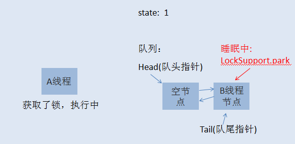
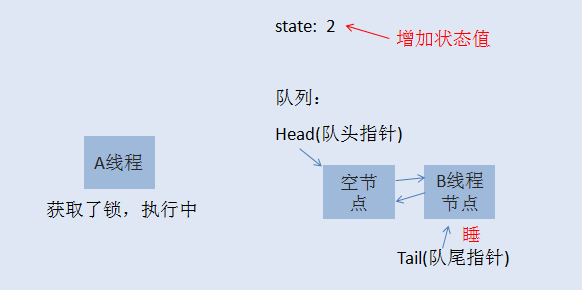
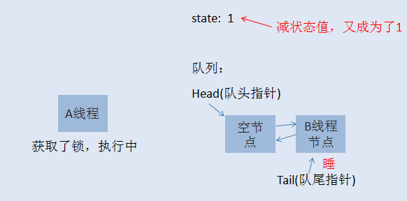

### 前言
相信学过java的人都知道 synchronized 这个关键词，也知道它用于控制多线程对并发资源的安全访问，兴许，你还用过Lock相关的功能，但你可能从来没有想过java中的锁底层的机制是怎么实现的。如果真是这样，而且你有兴趣了解，今天我将带领你轻松的学习下java中非常重要，也非常基础的可重入锁-ReentrantLock的实现机制。
### 听故事把知识掌握了
在一个村子里面，有一口井水，水质非常的好，村民们都想打井里的水。这井只有一口，村里的人那么多，所以得出个打水的规则才行。村长绞尽脑汁，最终想出了一个比较合理的方案，咱们来仔细的看看聪明的村长大人的智慧。

井边安排一个看井人，维护打水的秩序。

打水时，以家庭为单位，哪个家庭任何人先到井边，就可以先打水，而且如果一个家庭占到了打水权，其家人这时候过来打水不用排队。而那些没有抢占到打水权的人，一个一个挨着在井边排成一队，先到的排在前面。

是不是感觉很和谐，如果打水的人打完了，他会跟看井人报告，看井人会让第二个人接着打水。这样大家总都能够打到水。是不是看起来挺公平的，先到的人先打水，当然不是绝对公平的。

看着，一个有娃的父亲正在打水，他的娃也到井边了，所以女凭父贵直接排到最前面打水，羡煞旁人了。 

以上这个故事模型就是所谓的公平锁模型，当一个人想到井边打水，而现在打水的人又不是自家人，这时候就得乖乖在队列后面排队。

事情总不是那么一帆风顺的，总会有些人想走捷径，话说看井人年纪大了，有时候，眼力不是很好，这时候，人们开始打起了新主意。新来打水的人，他们看到有人排队打水的时候，他们不会那么乖巧的就排到最后面去排队，反之，他们会看看现在有没有人正在打水，如果有人在打水，没辄了，只好排到队列最后面，但如果这时候前面打水的人刚刚打完水，正在交接中，排在队头的人还没有完成交接工作，这时候，新来的人可以尝试抢打水权，如果抢到了，呵呵，其他人也只能睁一只眼闭一只眼，因为大家都默认这个规则了。这就是所谓的非公平锁模型。新来的人不一定总得乖乖排队，这也就造成了原来队列中排队的人可能要等很久很久。 
### java可重入锁-ReentrantLock实现细节
ReentrantLock支持两种获取锁的方式，一种是公平模型，一种是非公平模型。在继续之前，咱们先把故事元素转换为程序元素。

#### 公平锁模型

初始化时， state=0，表示无人抢占了打水权。这时候，村民A来打水(A线程请求锁)，占了打水权，把state+1，如下所示：

线程A取得了锁，把 state原子性+1,这时候state被改为1，A线程继续执行其他任务，然后来了村民B也想打水（线程B请求锁），线程B无法获取锁，生成节点进行排队，如下图所示：

初始化的时候，会生成一个空的头节点，然后才是B线程节点，这时候，如果线程A又请求锁，是否需要排队？答案当然是否定的，否则就直接死锁了。当A再次请求锁，就相当于是打水期间，同一家人也来打水了，是有特权的，这时候的状态如下图所示：

到了这里，相信大家应该明白了什么是可重入锁了吧。就是一个线程在获取了锁之后，再次去获取了同一个锁，这时候仅仅是把状态值进行累加。如果线程A释放了一次锁，就成这样了：

仅仅是把状态值减了，只有线程A把此锁全部释放了，状态值减到0了，其他线程才有机会获取锁。当A把锁完全释放后，state恢复为0，然后会通知队列唤醒B线程节点，使B可以再次竞争锁。当然，如果B线程后面还有C线程，C线程继续休眠，除非B执行完了，通知了C线程。注意，当一个线程节点被唤醒然后取得了锁，对应节点会从队列中删除。 
#### 非公平锁模型
如果你已经明白了前面讲的公平锁模型，那么非公平锁模型也就非常容易理解了。当线程A执行完之后，要唤醒线程B是需要时间的，而且线程B醒来后还要再次竞争锁，所以如果在切换过程当中，来了一个线程C，那么线程C是有可能获取到锁的，如果C获取到了锁，B就只能继续乖乖休眠了。这里就不再画图说明了。 
