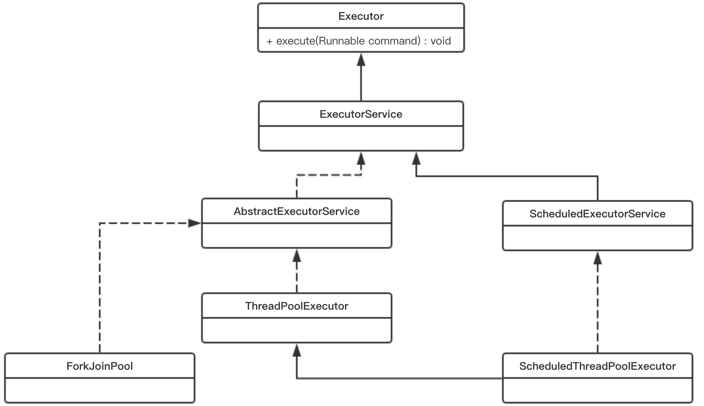
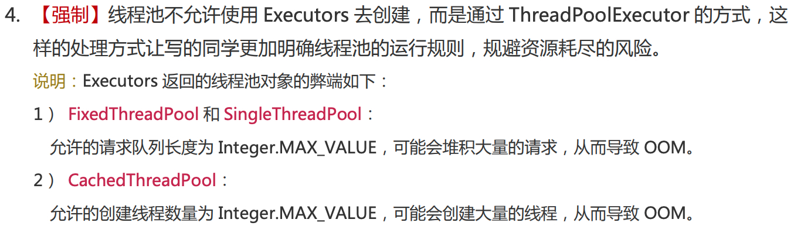

### 带着问题
1. 阿里Java代码规范为什么不允许使用Executors快速创建线程池？

2. 下面的代码输出是什么？
```java
ThreadPoolExecutor executor = new ThreadPoolExecutor(
        1, // corePoolSize
        100, // maximumPoolSize
        100, // keepAliveTime
        TimeUnit.SECONDS, // unit
        new LinkedBlockingDeque<>(100));    // workQueue

for (int i = 0; i < 5; i++) {
    final int taskIndex = i;
    executor.execute(() -> {
        System.out.println(taskIndex);
        try {
            Thread.sleep(Long.MAX_VALUE);
        } catch (InterruptedException e) {
            e.printStackTrace();
        }
    });
}
```
> A) 0 1 2 3 4 5
> 
> B) 0~5 顺序不一致输出5行
> 
> C) 0

### 基础
#### 什么是线程池？
线程池可以通过池看出来是一个资源集，任何池的作用都大同小异，主要是用来减少资源创建、初始化的系统开销。
#### 创建线程很“贵”吗？
是的。创建线程的代价是昂贵的。

我们都知道系统中的每个进程有自己独立的内存空间，而被称为轻量级进程的线程也是需要的。

在JVM中默认一个线程需要使用256k~1M（取决于32位还是64位操作系统）的内存。（具体的数组我们不深究，因为随着JVM版本的变化这个默认值随时可能发生变更，我们只需要知道线程是需要占用内存的）

**除了内存还有更多吗？**

许多文章会将上下文切换、CPU调度列入其中，这边不将线程调度列入是因为睡眠中的线程不会被调度（OS控制），如果不是睡眠中的线程那么是一定需要被调度的。

但在JVM中除了创建时的内存消耗，还会给GC带来压力，如果频繁创建线程那么相对的GC的时候也需要回收对应的线程。
#### 线程池的机制？
可以看到线程池是一种重复利用线程的技术，线程池的主要机制就是保留一定的线程数在没有事情做的时候使之睡眠，当有活干的时候拿一个线程去运行。

这些牵扯到线程池实现的具体策略。
#### 还有哪些常见的池？

* 线程池
* 连接池（数据库连接、TCP连接等）
* BufferPool
* ......
### Java中的线程池
#### UML图（Java 8）


可以看到真正的实现类有
> 1. ThreadPoolExecutor (1.5)
> 
> ForkJoinPool (1.7)
> 
> ScheduledThreadPoolExecutor (1.5)

今天我们主要谈谈 `ThreadPoolExecutor` 也是使用率较高的一个实现。
#### Executors提供的工厂方法
1. newCachedThreadPool (ThreadPoolExecutor)
> 创建一个可缓存的线程池。如果线程池的大小超过了处理任务所需要的线程,那么就会回收部分空闲（60秒不执行任务）的线程，当任务数增加时，此线程池又可以智能的添加新线程来处理任务。此线程池不会对线程池大小做限制，线程池大小完全依赖于操作系统（或者说JVM）能够创建的最大线程大小。
2. newFixedThreadPool (ThreadPoolExecutor)
> 创建固定大小的线程池。每次提交一个任务就创建一个线程，直到线程达到线程池的最大大小。线程池的大小一旦达到最大值就会保持不变，如果某个线程因为执行异常而结束，那么线程池会补充一个新线程。
3. newSingleThreadExecutor (ThreadPoolExecutor)
> 创建一个单线程的线程池。这个线程池只有一个线程在工作，也就是相当于单线程串行执行所有任务。如果这个唯一的线程因为异常结束，那么会有一个新的线程来替代它。此线程池保证所有任务的执行顺序按照任务的提交顺序执行。
4. newScheduledThreadPool (ScheduledThreadPoolExecutor)
> 创建一个大小无限的线程池。此线程池支持定时以及周期性执行任务的需求。
5. newSingleThreadScheduledExecutor (ScheduledThreadPoolExecutor)
> 创建一个单线程用于定时以及周期性执行任务的需求。
6. newWorkStealingPool (1.8 ForkJoinPool)
> 创建一个工作窃取

可以看到各种不同的工厂方法中使用的线程池实现类最终只有3个，对应关系如下：

| 工厂方法 | 实现类 |
| --- | --- |
| newCachedThreadPool | ThreadPoolExecutor |
| newFixedThreadPool | ThreadPoolExecutor |
| newSingleThreadExecutor | ThreadPoolExecutor |
| newScheduledThreadPool | ScheduledThreadPoolExecutor |
| newSingleThreadScheduledExecutor | ScheduledThreadPoolExecutor |
| newWorkStealingPool | ForkJoinPool |
#### ThreadPoolExecutor
首先我们看下 `ThreadPoolExecutor` 的完全构造函数
```java
public ThreadPoolExecutor(int corePoolSize,
                              int maximumPoolSize,
                              long keepAliveTime,
                              TimeUnit unit,
                              BlockingQueue<Runnable> workQueue,
                              ThreadFactory threadFactory,
                              RejectedExecutionHandler handler)
```
1. corePoolSize
> 核心池大小，除非设置了 allowCoreThreadTimeOut 否则哪怕线程超过空闲时间，池中也要最少要保留这个数目的线程。
> 
> 需要注意的是，corePoolSize所需的线程并不是立即创建的，需要在提交任务之后进行创建，所以如果有大量的缓存线程数可以先提交一个空任务让线程池将线程先创建出来，从而提升后续的执行效率。
2. maximumPoolSize
> 允许的最大线程数。
3. keepAliveTime
> 空闲线程空闲存活时间，核心线程需要 allowCoreThreadTimeOut 为true才会退出。
4. unit
> 与 keepAliveTime 配合，设置 keepAliveTime 的单位，如：毫秒、秒。
5. workQueue
> 线程池中的任务队列。上面提到线程池的主要作用是复用线程来处理任务，所以我们需要一个队列来存放需要执行的任务，在使用池中的线程来处理这些任务，所以我们需要一个任务队列。
6. threadFactory
> 当线程池判断需要新的线程时通过线程工程创建线程。
7. handler
> 执行被阻止时的处理程序，线程池无法处理。这个与任务队列相关，比如队列中可以指定队列大小，如果超过了这个大小该怎么办呢？JDK已经为我们考虑到了，并提供了4个默认实现。
> 下列是JDK中默认携带的策略:
> 
> 1. AbortPolicy (默认)
> 
> > 抛出 RejectedExecutionException 异常。
> 
> 2. CallerRunsPolicy
> 
> > 调用当前线程池所在的线程去执行。
> 
> 3. DiscardPolicy
> 
> > 直接丢弃当前任务。
> 
> 4. DiscardOldestPolicy
> 
> > 将最旧的任务丢弃，将当前任务添加到队列。

容易混淆的参数：corePoolSize maximumPoolSize workQueue
#### 任务队列、核心线程数、最大线程数的逻辑关系
1. 当线程数小于核心线程数时，创建线程。
2. 当线程数大于等于核心线程数，且任务队列未满时，将任务放入任务队列。
3. 当线程数大于等于核心线程数，且任务队列已满
    1) 若线程数小于最大线程数，创建线程
    2) 若线程数等于最大线程数，调用拒绝执行处理程序（默认效果为：抛出异常，拒绝任务）

#### 那么这三个参数推荐如何设置，有最优值吗？
由于java对于协程的支持不友好，所以会大量依赖于线程池和线程。

从而这个值没有最优推荐，需要根据业务需求情况来进行设置。

不同的需求类型可以创建多个不同的线程池来执行。
### 问题1：阿里开发规范为什么不允许Executors快速创建线程池？


可以看到原因很简单
> 1. newSingleThreadExecutor
> 
> 2. newFixedThreadPool

在 `workQueue` 参数直接 使用了 `new LinkedBlockingQueue<Runnable>()` 理论上可以无限添加任务到线程池。
```java
public static ExecutorService newFixedThreadPool(int nThreads) {
    return new ThreadPoolExecutor(nThreads, nThreads,
                                    0L, TimeUnit.MILLISECONDS,
                                    new LinkedBlockingQueue<Runnable>();
}

public static ExecutorService newSingleThreadExecutor() {
    return new FinalizableDelegatedExecutorService(new ThreadPoolExecutor(1,
    1,
    0L,
    TimeUnit.MILLISECONDS,
    new LinkedBlockingQueue<Runnable>()));
}
```
如果提交到线程池的任务由问题，比如 sleep 永久，会造成内存泄漏，最终导致OOM。

同时 阿里还推荐自定义 `threadFactory` 设置线程名称便于以后排查问题。
### 问题2：下面的代码输出是什么？
应该选C。

虽然最大线程数有100但核心线程数为1，任务队列由100。

满足了 '当线程数大于等于核心线程数，且任务队列未满时，将任务放入任务队列。' 这个条件。

所以后续添加的任务都会被堵塞。
### 最后
关于 ThreadPoolExecutor 的逻辑在实际使用的时候会有点奇怪，因为线程池中的线程并没有超过最大线程数，有没有一种可能当任务被堵塞很久的时候创建新的线程池来处理呢？

这边推荐大家使用 newWorkStealingPool，也就是ForkJoinPool。采取了工作窃取的模式。
