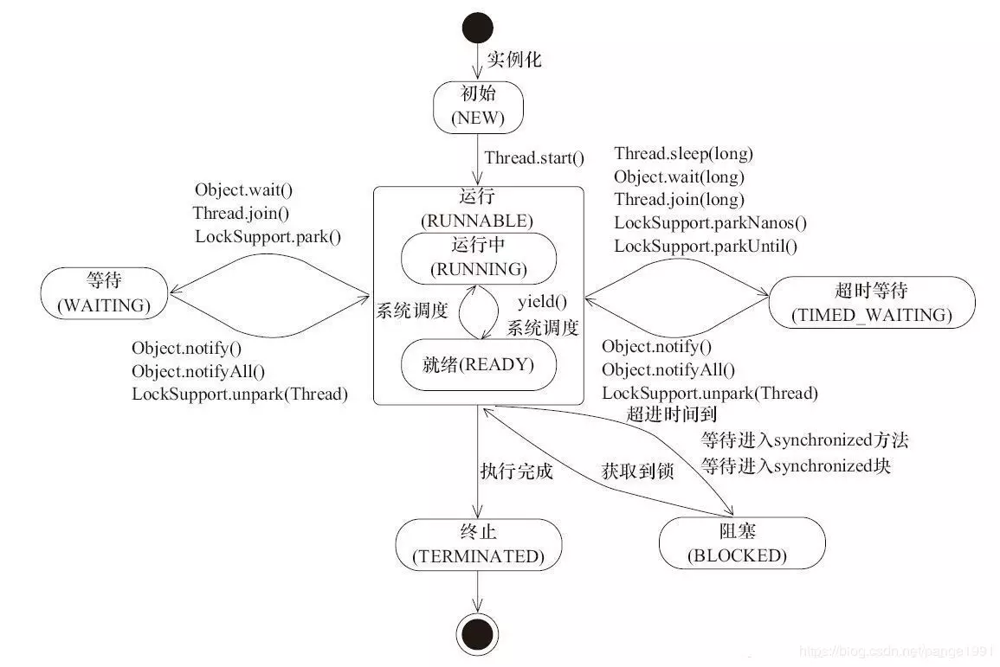

### 线程的6种状态
Java线程`Thread`在`package java.lang;`中可以找到，通过源码，我们可以看到其状态有如下6种
* NEW
* RUNNABLE
* BLOCKED
* WAITING
* TIMED_WAITING
* TERMINATED

下面分别解释一下各种状态
### NEW
顾名思义，这个状态，只存在于线程刚创建，未`start`之前，例如
```java
MyThread thread = new MyThread();
System.out.println(thread.getState());
```
此时打印出来的状态就是NEW
### RUNNABLE
这个状态的线程，其正在JVM中执行，但是这个"执行"，不一定是真的在运行， 也有可能是在等待CPU资源。所以，在网上，有人把这个状态区分为READY和RUNNING两个，一个表示的start了，资源一到位随时可以执行，另一个表示真正的执行中，例如
```java
MyThread thread = new MyThread(lock);
thread.start();
System.out.println(thread.getState());
```
### BLOCKED
这个状态，一般是线程等待获取一个锁，来继续执行下一步的操作，比较经典的就是synchronized关键字，这个关键字修饰的代码块或者方法，均需要获取到对应的锁，在未获取之前，其线程的状态就一直未BLOCKED，如果线程长时间处于这种状态下，我们就是当心看是否出现死锁的问题了。例如
```java
public class MyThread extends Thread {
    private byte[] lock = new byte[0];

    public MyThread(byte[] lock) {
        this.lock = lock;
    }

    @Override
    public void run() {
        synchronized (lock){
            try {
                Thread.sleep(10000);
            } catch (InterruptedException e) {
                e.printStackTrace();
            }
            System.out.println("done");

        }
    }
}
```
```java
public static void main(String[] args) throws InterruptedException {
    byte[] lock = new byte[0];
    MyThread thread1 = new MyThread(lock);
    thread1.start();
    MyThread thread2 = new MyThread(lock);
    thread2.start();
    Thread.sleep(1000); // 等一会再检查状态
    System.out.println(thread2.getState());
}
```
此时我们看到的输出的第二个线程的状态就是BLOCKED
### WAITING
一个线程会进入这个状态，一定是执行了如下的一些代码，例如
* Object.wait()
* Thread.join()
* LockSupport.park()

当一个线程执行了Object.wait()的时候，它一定在等待另一个线程执行Object.notify()或者Object.notifyAll()。

或者一个线程thread，其在主线程中被执行了thread.join()的时候，主线程即会等待该线程执行完成。当一个线程执行了LockSupport.park()的时候，其在等待执行LockSupport.unpark(thread)。当该线程处于这种等待的时候，其状态即为WAITING。需要关注的是，这边的等待是没有时间限制的，当发现有这种状态的线程的时候，若其长时间处于这种状态，也需要关注下程序内部有无逻辑异常。例如
#### LockSupport.park()
```java
public class MyThread extends Thread {
    private byte[] lock = new byte[0];

    public MyThread(byte[] lock) {
        this.lock = lock;
    }

    @Override
    public void run() {
        LockSupport.park();
    }
}
```
```java
public static void main(String[] args) throws InterruptedException {
    byte[] lock = new byte[0];
    MyThread thread1 = new MyThread(lock);
    thread1.start();
    Thread.sleep(100);
    System.out.println(thread1.getState());
    LockSupport.unpark(thread1);
    Thread.sleep(100);
    System.out.println(thread1.getState());
}
```
输出WAITING和TERMINATED
#### Object.wait()
```java
public class MyThread extends Thread {
    private byte[] lock = new byte[0];

    public MyThread(byte[] lock) {
        this.lock = lock;
    }

    @Override
    public void run() {
        synchronized (lock){
            try {
                lock.wait(); // wait并允许其他线程同步lock
            } catch (InterruptedException e) {
                e.printStackTrace();
            }
        }
    }
}
```
```java
public static void main(String[] args) throws InterruptedException {
    byte[] lock = new byte[0];
    MyThread thread1 = new MyThread(lock);
    thread1.start();
    Thread.sleep(100);
    System.out.println(thread1.getState()); // 这时候线程状态应为WAITING
    synchronized (lock){
        lock.notify(); // notify通知wait的线程
    }
    Thread.sleep(100);
    System.out.println(thread1.getState());
}
```
输出WAITING和TERMINATED
#### Thread.join()
```java
public class MyThread extends Thread {
    private byte[] lock = new byte[0];

    public MyThread(byte[] lock) {
        this.lock = lock;
    }

    @Override
    public void run() {
        try {
            Thread.sleep(10000);
        } catch (InterruptedException e) {
            e.printStackTrace();
        }
    }
}
```
```java
public class MyThread1 extends Thread {

    Thread thread;

    public MyThread1(Thread thread) {
        this.thread = thread;
    }

    @Override
    public void run() {
        try {
            thread.join();
        } catch (InterruptedException e) {
            e.printStackTrace();
        }
    }
}
```
```java
public class Main {

    public static void main(String[] args)
        throws InterruptedException {
        byte[] lock = new byte[0];
        MyThread thread = new MyThread(lock);
        thread.start();
        MyThread1 thread1 = new MyThread1(thread);
        thread1.start();
        Thread.sleep(100);
        System.out.println(thread1.getState());
    }
}
```
输出为WAITING
### TIMED_WAITING
这个状态和WAITING状态的区别就是，这个状态的等待是有一定时效的，即可以理解为WAITING状态等待的时间是永久的，即必须等到某个条件符合才能继续往下走，否则线程不会被唤醒。但是TIMED_WAITING，等待一段时间之后，会唤醒线程去重新获取锁。当执行如下代码的时候，对应的线程会进入到TIMED_WAITING状态。
* Thread.sleep(long)
* Object.wait(long)
* Thread.join(long)
* LockSupport.parkNanos()
* LockSupport.parkUntil()
#### 代码示例
##### Thread.sleep
```java
public class MyThread3 extends Thread {
    @Override
    public void run() {
        try {
            Thread.sleep(10000);
        } catch (InterruptedException e) {
            e.printStackTrace();
        }
    }
}
```
```java
Thread thread = new MyThread3();
thread.start();
Thread.sleep(100);
System.out.println(thread.getState());
```
输出为TIMED_WAITING
##### Object.wait
```java
public class MyThread4 extends Thread {
    private Object lock;

    public MyThread4(Object lock) {
        this.lock = lock;
    }

    @Override
    public void run() {

        synchronized (lock){
            try {
                lock.wait(1000);    // 注意，此处1s之后线程醒来，会重新尝试去获取锁，如果拿不到，后面的代码也不执行
            } catch (InterruptedException e) {
                e.printStackTrace();
            }
            System.out.println("lock end");
        }
    }
}
```
```java
 byte[] lock = new byte[0];
MyThread4 thread = new MyThread4(lock);
thread.start();
Thread.sleep(100);
System.out.println(thread.getState());
Thread.sleep(2000);
System.out.println(thread.getState());
```
输出
```java
TIMED_WAITING
lock end
TERMINATED
```
其余方法类似
### TERMINATED
即为线程执行结束之后的状态
### 状态之间的切换


以上这张图，能够较好的说明线程之前的状态切换
