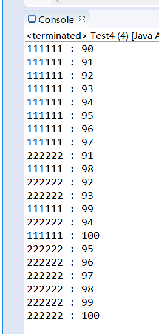

① static Thread currentThread() : 返回对当前正在执行的线程对象的引用。

② void setName(String name) : 给线程名称赋值

③ String getName() : 获取线程的名称

线程的优先级 : 理论上优先级高的线程获取CPU分配时间片的几率更大，但是受操作系统以及jvm版本的影响

优先级的范围：1~10 10为最大，1为最小

int getPriority() : 返回线程的优先级

void setPriority(int newPriority) : 更改线程的优先级

**例子**：
```java

public class Demo{
    public static void main(String[] args) {
        // 创建两个线程对象
        PriorityThread t1 = new PriorityThread();
        PriorityThread t2 = new PriorityThread();
        // 把第一个线程的优先级设置为1 (Thread.MIN_PRIORITY=1)
        // 把第二个线程的优先级设置为10 (Thread.MAX_PRIORITY=10)
        t1.setPriority(Thread.MIN_PRIORITY);    // 1
        t2.setPriority(Thread.MAX_PRIORITY);    // 2
        t1.setName("111111");
        t2.setName("222222");
        // 启动线程
        t1.start();
        t2.start();
    }
}
/*
 * 测试思路：创建两个线程对象，每个线程对象都输出100次任意内容。 
 * 把第一个线程的优先级设置为1。
 * 把第二个线程的优先级设置为10.
 * 理论上第二个线程应该先输出结束
 */
class PriorityThread extends Thread{
    //每个线程对象都输出100次任意内容。 
    public void run() {
        for (int i = 1; i <= 100; i++) {
            System.out.println(Thread.currentThread().getName()+" : "+i);
        }
    }
}
```
运行结果图：


