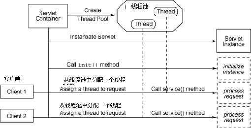

在Java中有两类线程：User Thread(用户线程)、Daemon Thread(守护线程) 

用个比较通俗的比如，任何一个守护线程都是整个JVM中所有非守护线程的保姆：

只要当前JVM实例中尚存在任何一个非守护线程没有结束，守护线程就全部工作；只有当最后一个非守护线程结束时，守护线程随着JVM一同结束工作。

Daemon的作用是为其他线程的运行提供便利服务，守护线程最典型的应用就是 GC (垃圾回收器)，它就是一个很称职的守护者。

User和Daemon两者几乎没有区别，唯一的不同之处就在于虚拟机的离开：如果 User Thread已经全部退出运行了，只剩下Daemon Thread存在了，虚拟机也就退出了。 因为没有了被守护者，Daemon也就没有工作可做了，也就没有继续运行程序的必要了。

值得一提的是，守护线程并非只有虚拟机内部提供，用户在编写程序时也可以自己设置守护线程。下面的方法就是用来设置守护线程的。 
```java
Thread daemonTread = new Thread();
 
  // 设定 daemonThread 为 守护线程，default false(非守护线程)
 daemonThread.setDaemon(true);
 
 // 验证当前线程是否为守护线程，返回 true 则为守护线程
 daemonThread.isDaemon();
```
这里有几点需要**注意**： 
> (1) thread.setDaemon(true)必须在thread.start()之前设置，否则会跑出一个IllegalThreadStateException异常。你不能把正在运行的常规线程设置为守护线程。
> 
> (2) 在Daemon线程中产生的新线程也是Daemon的。
> 
> (3) 不要认为所有的应用都可以分配给Daemon来进行服务，比如读写操作或者计算逻辑。 

因为你不可能知道在所有的User完成之前，Daemon是否已经完成了预期的服务任务。一旦User退出了，可能大量数据还没有来得及读入或写出，计算任务也可能多次运行结果不一样。这对程序是毁灭性的。造成这个结果理由已经说过了：一旦所有User Thread离开了，虚拟机也就退出运行了。 
```java
// 完成文件输出的守护线程任务
import java.io.*;   
  
class TestRunnable implements Runnable{   
    public void run(){   
               try{   
                  Thread.sleep(1000);   // 守护线程阻塞1秒后运行   
                  File f=new File("daemon.txt");   
                  FileOutputStream os=new FileOutputStream(f,true);   
                  os.write("daemon".getBytes());   
           }   
               catch(IOException e1){   
          e1.printStackTrace();   
               }   
               catch(InterruptedException e2){   
                  e2.printStackTrace();   
           }   
    }   
}   
public class TestDemo2{   
    public static void main(String[] args) throws InterruptedException   
    {   
        Runnable tr=new TestRunnable();   
        Thread thread=new Thread(tr);   
                thread.setDaemon(true); // 设置守护线程   
        thread.start(); // 开始执行分进程   
    }   
}   
// 运行结果：文件daemon.txt中没有"daemon"字符串。
```
看到了吧，把输入输出逻辑包装进守护线程多么的可怕，字符串并没有写入指定文件。原因也很简单，直到主线程完成，守护线程仍处于1秒的阻塞状态。这个时候主线程很快就运行完了，虚拟机退出，Daemon停止服务，输出操作自然失败了。
```java
public class Test {
　　public static void main(String args) {
　　Thread t1 = new MyCommon();
　　Thread t2 = new Thread(new MyDaemon());
　　t2.setDaemon(true); // 设置为守护线程
　　t2.start();
　　t1.start();
　　}
}
class MyCommon extends Thread {
　　public void run() {
          for (int i = 0; i < 5; i++) {
            System.out.println("线程1第" + i + "次执行！");
            try {
                Thread.sleep(7);
            } catch (InterruptedException e) {
                e.printStackTrace();
            }
          }
    }
}
```
```java
class MyDaemon implements Runnable {
　　public void run() {
　　  for (long i = 0; i < 9999999L; i++) {
　　      System.out.println("后台线程第" + i + "次执行！");
　　      try {
　　          Thread.sleep(7);
　　      } catch (InterruptedException e) {
　　          e.printStackTrace();
　　      }
　　  }
　　}
}
```
```java
台线程第0次执行！　　
线程1第0次执行！ 　　
线程1第1次执行！ 　　
后台线程第1次执行！ 　　
后台线程第2次执行！ 　　
线程1第2次执行！ 　　
线程1第3次执行！ 　　
后台线程第3次执行！ 　　
线程1第4次执行！ 　　
后台线程第4次执行！ 　　
后台线程第5次执行！ 　　
后台线程第6次执行！ 　　
后台线程第7次执行！ 　　
Process finished with exit code 0 
```
从上面的执行结果可以看出： 

前台线程是保证执行完毕的，后台线程还没有执行完毕就退出了。 

**实际上**：JRE判断程序是否执行结束的标准是所有的前台执线程行完毕了，而不管后台线程的状态，因此，在使用后台线程时候一定要注意这个问题。

**补充说明**：

**定义**：守护线程--也称“服务线程”，在没有用户线程可服务时会自动离开。

**优先级**：守护线程的优先级比较低，用于为系统中的其它对象和线程提供服务。

**设置**：通过setDaemon(true)来设置线程为“守护线程”；将一个用户线程设置为守护线程的方式是在 线程对象创建 之前 用线程对象的setDaemon方法。

**example**: 垃圾回收线程就是一个经典的守护线程，当我们的程序中不再有任何运行的Thread,程序就不会再产生垃圾，垃圾回收器也就无事可做，所以当垃圾回收线程是JVM上仅剩的线程时，垃圾回收线程会自动离开。它始终在低级别的状态中运行，用于实时监控和管理系统中的可回收资源。

**生命周期**：守护进程（Daemon）是运行在后台的一种特殊进程。它独立于控制终端并且周期性地执行某种任务或等待处理某些发生的事件。也就是说守护线程不依赖于终端，但是依赖于系统，与系统“同生共死”。那Java的守护线程是什么样子的呢。当JVM中所有的线程都是守护线程的时候，JVM就可以退出了；如果还有一个或以上的非守护线程则JVM不会退出。

**实际应用例子**：

在使用长连接的comet服务端推送技术中，消息推送线程设置为守护线程，服务于ChatServlet的servlet用户线程，在servlet的init启动消息线程，servlet一旦初始化后，一直存在服务器，servlet摧毁后,消息线程自动退出。

容器收到一个Servlet请求，调度线程从线程池中选出一个工作者线程,将请求传递给该工作者线程，然后由该线程来执行Servlet的 service方法。当这个线程正在执行的时候,容器收到另外一个请求,调度线程同样从线程池中选出另一个工作者线程来服务新的请求,容器并不关心这个请求是否访问的是同一个Servlet。当容器同时收到对同一个Servlet的多个请求的时候，那么这个Servlet的service()方法将在多线程中并发执行。

Servlet容器默认采用单实例多线程的方式来处理请求，这样减少产生Servlet实例的开销，提升了对请求的响应时间，对于Tomcat可以在server.xml中通过<Connector>元素设置线程池中线程的数目。

如图： 



为什么要用守护线程？

我们知道静态变量是ClassLoader级别的，如果Web应用程序停止，这些静态变量也会从JVM中清除。但是线程则是JVM级别的，如果你在Web 应用中启动一个线程，这个线程的生命周期并不会和Web应用程序保持同步。也就是说，即使你停止了Web应用，这个线程依旧是活跃的。正是因为这个很隐晦 的问题，所以很多有经验的开发者不太赞成在Web应用中私自启动线程。

如果我们手工使用JDK Timer（Quartz的Scheduler），在Web容器启动时启动Timer，当Web容器关闭时，除非你手工关闭这个Timer，否则Timer中的任务还会继续运行！

下面通过一个小例子来演示这个“诡异”的现象，我们通过ServletContextListener在Web容器启动时创建一个Timer并周期性地运行一个任务：  
```java
// 代码清单StartCycleRunTask：容器监听器
package com.baobaotao.web;
import java.util.Date;
import java.util.Timer;
import java.util.TimerTask;
import javax.servlet.ServletContextEvent;
import javax.servlet.ServletContextListener;
public class StartCycleRunTask implements ServletContextListener ...{
    private Timer timer;
    public void contextDestroyed(ServletContextEvent arg0) ...{
        // ②该方法在Web容器关闭时执行
        System.out.println("Web应用程序启动关闭...");
    }
    public void contextInitialized(ServletContextEvent arg0) ...{
         // ②在Web容器启动时自动执行该方法
        System.out.println("Web应用程序启动...");
        timer = new Timer();    // ②-1:创建一个Timer，Timer内部自动创建一个背景线程
        TimerTask task = new SimpleTimerTask();
        timer.schedule(task, 1000L, 5000L); // ②-2:注册一个5秒钟运行一次的任务
    }
}
class SimpleTimerTask extends TimerTask ...{    // ③任务
    private int count;
    public void run() ...{
        System.out.println((++count)+"execute task..."+(new Date()));
    }
}
```
在web.xml中声明这个Web容器监听器：
```xml
<?xml version="1.0" encoding="UTF-8"?>
<web-app>
    … 
    <listener>
        <listener-class>
            com.baobaotao.web.StartCycleRunTask
        </listener-class>
    </listener> 
</web-app> 
```

在Tomcat中部署这个Web应用并启动后，你将看到任务每隔5秒钟执行一次。 

运行一段时间后，登录Tomcat管理后台，将对应的Web应用（chapter13）关闭。 

转到Tomcat控制台，你将看到虽然Web应用已经关闭，但Timer任务还在我行我素地执行如故——舞台已经拆除，戏子继续表演： 

我们可以通过改变清单StartCycleRunTask的代码，在contextDestroyed(ServletContextEvent arg0)中添加timer.cancel()代码，在Web容器关闭后手工停止Timer来结束任务。

Spring为JDK Timer和Quartz Scheduler所提供的TimerFactoryBean和SchedulerFactoryBean能够和Spring容器的生命周期关联，在 Spring容器启动时启动调度器，而在Spring容器关闭时，停止调度器。所以在Spring中通过这两个FactoryBean配置调度器，再从 Spring IoC中获取调度器引用进行任务调度将不会出现这种Web容器关闭而任务依然运行的问题。而如果你在程序中直接使用Timer或Scheduler，如不进行额外的处理，将会出现这一问题。 
