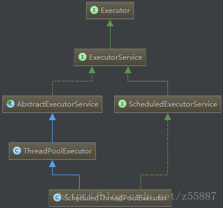

### 1. 如何实现一个线程池？
线程池的概念这里不多说，在讲它的原理前，我们先自己想一下，如果我来写，那如何实现一个线程池？
#### 1.1 线程池的重要变量
首先要定义一个存放所有线程的集合； 

另外，每有一个任务分配给线程池，我们就从线程池中分配一个线程处理它。但当线程池中的线程都在运行状态，没有空闲线程时，我们还需要一个队列来存储提交给线程池的任务。
```java
/**存放线程的集合*/
private ArrayList<MyThead> threads;
/**任务队列*/
private ArrayBlockingQueue<Runnable> taskQueue;
```
初始化一个线程池时，要指定这个线程池的大小；另外，我们还需要一个变量来保存已经运行的线程数目。
```java
/**线程池初始限定大小*/
private int threadNum;
/**已经工作的线程数目*/
private int workThreadNum;
```
#### 1.2 线程池的核心方法
##### 线程池执行任务
接下来就是线程池的核心方法，每当向线程池提交一个任务时。如果 已经运行的线程<线程池大小，则创建一个线程运行任务，并把这个线程放入线程池；否则将任务放入缓冲队列中。
```java
public void execute(Runnable runnable) {
        try {
            mainLock.lock();
            // 线程池未满，每加入一个任务则开启一个线程
            if(workThreadNum < threadNum) {
                MyThead myThead = new MyThead(runnable);
                myThead.start();
                threads.add(myThead);
                workThreadNum++;
            }
            // 线程池已满，放入任务队列，等待有空闲线程时执行
            else {
                // 队列已满，无法添加时，拒绝任务
                if(!taskQueue.offer(runnable)) {
                    rejectTask();
                }
            }
        } finally {
            mainLock.unlock();
        }
    }
```
到这里，一个线程池已经实现的差不多了，我们还有最后一个难点要解决：从任务队列中取出任务，分配给线程池中“空闲”的线程完成。
##### 分配任务给线程的第一种思路
很容易想到一种解决思路：额外开启一个线程，时刻监控线程池的线程空余情况，一旦有线程空余，则马上从任务队列取出任务，交付给空余线程完成。

这种思路理解起来很容易，但仔细思考，实现起来很麻烦（1. 如何检测到线程池中的空闲线程 (2. 如何将任务交付给一个.start()运行状态中的空闲线程。而且使线程池的架构变的更复杂和不优雅。
##### 分配任务给线程的第二种思路
现在我们来讲第二种解决思路：线程池中的所有线程一直都是运行状态的，线程的空闲只是代表此刻它没有在执行任务而已；我们可以让运行中的线程，一旦没有执行任务时，就自己从队列中取任务来执行。

为了达到这种效果，我们要重写`run`方法，所以要写一个自定义`Thread`类，然后让线程池都放这个自定义线程类。
```java
class MyThead extends Thread{
        private Runnable task;

        public MyThead(Runnable runnable) {
            this.task = runnable;
        }
        @Override
        public void run() {
            // 该线程一直启动着，不断从任务队列取出任务执行
            while (true) {
                // 如果初始化任务不为空，则执行初始化任务
                if(task != null) {
                    task.run();
                    task = null;
                }
                // 否则去任务队列取任务并执行
                else {
                    Runnable queueTask = taskQueue.poll();
                    if(queueTask != null)
                        queueTask.run();    
                }
            }
        }
    }
```
#### 1.3 最后生成的简单线程池
```java
/**
 * 自定义简单线程池
 */
public class MyThreadPool{
    /**存放线程的集合*/
    private ArrayList<MyThead> threads;
    /**任务队列*/
    private ArrayBlockingQueue<Runnable> taskQueue;
    /**线程池初始限定大小*/
    private int threadNum;
    /**已经工作的线程数目*/
    private int workThreadNum;

    private final ReentrantLock mainLock = new ReentrantLock();

    public MyThreadPool(int initPoolNum) {
        threadNum = initPoolNum;
        threads = new ArrayList<>(initPoolNum);
        // 任务队列初始化为线程池线程数的四倍
        taskQueue = new ArrayBlockingQueue<>(initPoolNum*4);

        threadNum = initPoolNum;
        workThreadNum = 0;
    }

    public void execute(Runnable runnable) {
        try {
            mainLock.lock();
            // 线程池未满，每加入一个任务则开启一个线程
            if(workThreadNum < threadNum) {
                MyThead myThead = new MyThead(runnable);
                myThead.start();
                threads.add(myThead);
                workThreadNum++;
            }
            // 线程池已满，放入任务队列，等待有空闲线程时执行
            else {
                // 队列已满，无法添加时，拒绝任务
                if(!taskQueue.offer(runnable)) {
                    rejectTask();
                }
            }
        } finally {
            mainLock.unlock();
        }
    }

    private void rejectTask() {
        System.out.println("任务队列已满，无法继续添加，请扩大您的初始化线程池！");
    }
    public static void main(String[] args) {
        MyThreadPool myThreadPool = new MyThreadPool(5);
        Runnable task = new Runnable() {
            @Override
            public void run() {
                System.out.println(Thread.currentThread().getName()+"执行中");
            }
        };

        for (int i = 0; i < 20; i++) {
            myThreadPool.execute(task);
        }
    }

    class MyThead extends Thread{
        private Runnable task;

        public MyThead(Runnable runnable) {
            this.task = runnable;
        }
        @Override
        public void run() {
            // 该线程一直启动着，不断从任务队列取出任务执行
            while (true) {
                // 如果初始化任务不为空，则执行初始化任务
                if(task != null) {
                    task.run();
                    task = null;
                }
                // 否则去任务队列取任务并执行
                else {
                    Runnable queueTask = taskQueue.poll();
                    if(queueTask != null)
                        queueTask.run();    
                }
            }
        }
    }
}
```
现在我们来总结一下，这个自定义线程池的整个工作过程：
> 1. 初始化线程池，指定线程池的大小。
> 
> 2. 向线程池中放入任务执行。
> 
> 3. 如果线程池中创建的线程数目未到指定大小，则创建我们自定义的线程类放入线程池集合，并执行任务。执行完了后该线程会一直监听队列。
> 
> 4. 如果线程池中创建的线程数目已满，则将任务放入缓冲任务队列
> 
> 5. 线程池中所有创建的线程，都会一直从缓存任务队列中取任务，取到任务马上执行

### 2. Java中的线程池实现
自己实现一个线程池后，接下来我们来结合源码，看下Java中线程池是怎么实现的。
#### 2.1 线程池框架

* `Executor`：最顶部接口，提供了`execute()`方法将任务提交和任务执行分离。当你把一个`Runnable`任务提交给`Executor`后，如何执行任务要看它的实现类。
* `ExecutorService`： 继承`Executor`，增加了对线程池中任务生命周期的管理，可强制取消正在执行的任务，拒绝再接受任务。提供了`submit()`方法来扩展`Executor.execute()`，使任务执行有返回值。
* `AbstractExecutorService`： `ExecutorService`接口的默认实现，线程池的大部分功能已在这个类中被编写。
* `ThreadPoolExecutor`：线程池最核心的一个类，继承了`AbstractExecutorService`，完整的实现了一个线程池。
* `ScheduledExecutorService`：继承`ExecutorService`接口，在其基础上增加了定时执行任务的功能。
* `ScheduledThreadPoolExecutor`： 拥有定时调度任务功能的线程池，实现了`ScheduledExecutorService`接口，以及继承了`ThreadPoolExecutor`类
#### 2.2 `ThreadPoolExecutor`源码分析
通过类图框架，我们已经知道，Java线程池最关键的一个类就是`ThreadPoolExecutor`。

那这个类是如何实现线程池的呢？其实大致原理跟第一节我们手动写的简单线程池差不多，下面我们结合源码来完整的走一遍。
##### 构造方法
首先看一下它的构造方法：
```java
public ThreadPoolExecutor(int corePoolSize,int maximumPoolSize,long keepAliveTime,TimeUnit unit,BlockingQueue<Runnable> workQueue) {
     // 构造方法
     ……
}
```
* `corePoolSize`：即线程池大小，线程池中默认线程数目。
* `maximumPoolSize`：线程池中最大线程数目。注意，当线程池运行的任务过多时，允许线程池额外创建线程。此额外线程在任务变少后会被线程池关闭。
* `keepAliveTime`：线程空闲时间超过该值时，会被关闭。默认只有当线程数目>`corePoolSize`时才会生效。也可配置线程数目<`corePoolSize`就生效。
* `unit`：`keepAliveTime`的时间单位。
* `workQueue`：任务缓存队列的实现。
##### 重要变量
线程池的重要变量主要两个：`runState`（线程池运行状态：运行还是关闭）和`workerCount`（线程池中的线程数目）。

在JDK1.8中，这两个变量被放入了一个线程安全的int类型变量中。
```java
private final AtomicInteger ctl = new AtomicInteger(ctlOf(RUNNING, 0));
```
这里可以好好讲一下，貌似网上查到的线程池源码资料也没有好好分析过为什么要把两个变量合并成一个变量。

首先，我们来看看它是如何将两个变量存在一起的。
```java
private static int ctlOf(int rs, int wc) { return rs | wc; }
private static int runStateOf(int c)     { return c & ~CAPACITY; }
private static int workerCountOf(int c)  { return c & CAPACITY; }
```
这段代码声明很神奇，我还是第一次知道int类型的变量还可以进行构造器式的声明。`ctlOf`就是合并变量`ctl`的值。它通过“或运算”，将`runState`和`workerCount`合并成了一个数字。

为什么“或运算“可以将两个数字合并成一个呢？实际上，`ctlOf`是一个32位的数字，前三位存的是`runState`， 后27位存的是`workerCount`。类似1110000……（27个0）与00000000……001进行或运算，两个值就存在了同一个int变量中。取出来也只要通过位运算获取前3位和后27位数字即可（也就是`runStateOf(int c)`和`workerCountOf(int c)）`。源码里面也有部分提示：
```java
// runState is stored in the high-order bits（runState存在高位中）
private static final int RUNNING    = -1 << COUNT_BITS;
```
好，了解了两个变量合并成一个的实现，我们再来想想，为什么要这么麻烦的进行变量合并？我的思考答案是：为了不加锁实现线程安全。

我们可以声明两个线程安全的int类型来分别存储`runState`和`workerCount`。对它们单独加减时确实是线程安全的，但如果一段代码有两个变量的共同参与呢？举个简单例子：
```java
// 当运行状态是运行中时,增加线程数
if(runState == RUNNING) {
     workCount.incrementAndGet();
}
```
这段代码显然是线程不安全的，假设线程A判断成功后进入方法块，挂起；这时线程B修改了`runState`的状态为`SHUTDOWN`。当线程A重新恢复执行时，虽然`runState`不是运行状态，但仍会对`workCount`进行增加操作。

通过将两个变量合并成了一个线程安全变量，即完美的解决了这个问题，再有两个变量一起的代码时，也不需要加锁就实现了线程安全。
##### 核心方法
最后看一下重头戏，`ThreadPoolExecutor`的核心方法`execute()`。这个方法其实就是实现了`Executor`接口中的`execute`方法，执行你丢入线程池的任务。
```java
public void execute(Runnable command) {
    if (command == null)
        throw new NullPointerException();
    /*
     * Proceed in 3 steps:
     *
     * 1. If fewer than corePoolSize threads are running, try to
     * start a new thread with the given command as its first
     * task.  The call to addWorker atomically checks runState and
     * workerCount, and so prevents false alarms that would add
     * threads when it shouldn't, by returning false.
     *
     * 2. If a task can be successfully queued, then we still need
     * to double-check whether we should have added a thread
     * (because existing ones died since last checking) or that
     * the pool shut down since entry into this method. So we
     * recheck state and if necessary roll back the enqueuing if
     * stopped, or start a new thread if there are none.
     *
     * 3. If we cannot queue task, then we try to add a new
     * thread.  If it fails, we know we are shut down or saturated
     * and so reject the task.
     */
    int c = ctl.get();
    if (workerCountOf(c) < corePoolSize) {
        if (addWorker(command, true))
            return;
        c = ctl.get();
    }
    if (isRunning(c) && workQueue.offer(command)) {
        int recheck = ctl.get();
        if (! isRunning(recheck) && remove(command))
            reject(command);
        else if (workerCountOf(recheck) == 0)
            addWorker(null, false);
    }
    else if (!addWorker(command, false))
        reject(command);
}
```
其实源码注释已经写的很清楚，当你将一个任务Runnable提交给线程池执行时，主要分三步：
> 1. 如果线程池中的线程数（`workCount`）< 线程池大小（`corePoolSize`），则创建一个线程，执行这个任务，并把这个线程放入线程池。添加任务时会对线程池状态进行检查，以防止线程池状态为关闭时还添加线程。
> 
> 2. 如果线程池中的线程数（`workCount`）>= 线程池大小（`corePoolSize`），或者上一步添加任务最后失败，将任务放入缓存队列中。当任务成功加入缓存队列，仍需要对线程池状态进行二次检查，防止线程池状态改为关闭或线程池中已经没有可以运行的线程。
> 
> 3. 如果上一步将任务放入缓存队列失败，试着去增加一个新的线程来执行它（超过线程池大小的额外线程）。如果添加新线程失败（可能是线程数已到达`maximumPoolSize`），则抛出异常拒绝执行该任务。

接下来，我们跟着这三个步骤来看看源码。

当线程池中的线程数（`workCount`）< 线程池大小（`corePoolSize`），会执行`addWorker()`方法来增加一个线程，执行任务并放入线程池。
```java
private boolean addWorker(Runnable firstTask, boolean core) {
    retry:
    for (;;) {
        int c = ctl.get();
        int rs = runStateOf(c);

        // Check if queue empty only if necessary.
        if (rs >= SHUTDOWN &&
            ! (rs == SHUTDOWN &&
               firstTask == null &&
               ! workQueue.isEmpty()))
            return false;

        for (;;) {
            int wc = workerCountOf(c);
            if (wc >= CAPACITY ||
                wc >= (core ? corePoolSize : maximumPoolSize))
                return false;
            if (compareAndIncrementWorkerCount(c))
                break retry;
            c = ctl.get();  // Re-read ctl
            if (runStateOf(c) != rs)
                continue retry;
            // else CAS failed due to workerCount change; retry inner loop
        }
    }

    boolean workerStarted = false;
    boolean workerAdded = false;
    Worker w = null;
    try {
        w = new Worker(firstTask);
        final Thread t = w.thread;
        if (t != null) {
            final ReentrantLock mainLock = this.mainLock;
            mainLock.lock();
            try {
                // Recheck while holding lock.
                // Back out on ThreadFactory failure or if
                // shut down before lock acquired.
                int rs = runStateOf(ctl.get());

                if (rs < SHUTDOWN ||
                    (rs == SHUTDOWN && firstTask == null)) {
                    if (t.isAlive()) // precheck that t is startable
                        throw new IllegalThreadStateException();
                    workers.add(w);
                    int s = workers.size();
                    if (s > largestPoolSize)
                        largestPoolSize = s;
                    workerAdded = true;
                }
            } finally {
                mainLock.unlock();
            }
            if (workerAdded) {
                t.start();
                workerStarted = true;
            }
        }
    } finally {
        if (! workerStarted)
            addWorkerFailed(w);
    }
    return workerStarted;
}
```
这个方法分为了两个部分。

第一部分，也就是for循环里面的代码，主要是检查线程池运行状态（关闭或其他状态则添加失败），以及线程数目是否超过了指定值（超过最大线程数则添加失败）。

为了保持线程安全，在检查的最后都会重新获取一遍`runState`和`workCount`，与for循环最开始取到的两个值进行对比，如果不一样，则证明别的线程修改了它们，重新循环进行校验。

第二部分，for循环校验完毕后，证明此时是可以添加线程的，然后我们可以发现代码中创建了一个新对象：`w = new Worker(firstTask)`。这个`Worker`是什么呢？

我们看下`Workder`的代码会发现，它其实就是前面我们写的自定义线程池里面的自定义线程类。
```java
private final class Worker extends AbstractQueuedSynchronizer implements Runnable{
        // 构造方法
        Worker(Runnable firstTask) {
            setState(-1); // inhibit interrupts until runWorker
            this.firstTask = firstTask;
            this.thread = getThreadFactory().newThread(this);
        }

        ……
 }
 
```
在`Worker`的构造方法中，它会保存传进来的任务`firstTask`，并且创建一个包裹自身的线程`thread`，然后暴露给`addWorker()`方法。
```java
 w = new Worker(firstTask);
 final Thread t = w.thread;
```
如上面这段`addWorker()`中的代码，其实等同于：
```java
w = new Worker(firstTask);
final Thread t = new Thread(w);
```
`addWorker()`中获取到线程t后，会将t放入线程池，以及启动它：
```java
// 添加进线程池
workers.add(w);
……
// 添加成功后，启动线程
if (workerAdded) {
    t.start();
    workerStarted = true;
}
```
启动线程t其实最后执行的是`Worker`中的`run()`方法，而`run()`方法又执行的`runWorker（w）`方法：
```java
public void run() {
    runWorker(this);
}
```
我们观察`runWorker(w)`方法可以发现，和第一节提到的自定义线程一样，实际这个方法就是执行提交给它的第一个任务后，继续持续的去缓存队列中取任务执行。
```java
final void runWorker(Worker w) {
    Thread wt = Thread.currentThread();
    Runnable task = w.firstTask;
    w.firstTask = null;
    w.unlock(); // allow interrupts
    boolean completedAbruptly = true;
    try {
        while (task != null || (task = getTask()) != null) {
            w.lock();
            // If pool is stopping, ensure thread is interrupted;
            // if not, ensure thread is not interrupted.  This
            // requires a recheck in second case to deal with
            // shutdownNow race while clearing interrupt
            if ((runStateAtLeast(ctl.get(), STOP) ||
                 (Thread.interrupted() &&
                  runStateAtLeast(ctl.get(), STOP))) &&
                !wt.isInterrupted())
                wt.interrupt();
            try {
                beforeExecute(wt, task);
                Throwable thrown = null;
                try {
                    task.run();
                } catch (RuntimeException x) {
                    thrown = x; throw x;
                } catch (Error x) {
                    thrown = x; throw x;
                } catch (Throwable x) {
                    thrown = x; throw new Error(x);
                } finally {
                    afterExecute(task, thrown);
                }
            } finally {
                task = null;
                w.completedTasks++;
                w.unlock();
            }
        }
        completedAbruptly = false;
    } finally {
        processWorkerExit(w, completedAbruptly);
    }
}
```
参照第一节，相信你很容易理解`runWorker()`方法以及`Worker`类的本质。

到这里，线程池源码的分析也就差不多了，有了上面的基础，`execute()`的剩下两步也很简单，这里不多讲了。
### 3. 线程池的使用
通过第二节，我们已经知道，通过`ThreadPoolExecutor`类，可以构造出各种需求的线程池。

在实际应用中，我们不采取每次自己根据需求分析new一个`ThreadPoolExecutor`的做法，有一个类已经帮我们做好了一切：`Executors`。

想要创建什么样性质的线程池，直接调用`Executors`中的静态方法就行了。
```java
Executors.newCachedThreadPool();        // 创建一个缓冲池，缓冲池容量大小为Integer.MAX_VALUE
Executors.newSingleThreadExecutor();   // 创建容量为1的缓冲池
Executors.newFixedThreadPool(int);    // 创建固定容量大小的缓冲池
```
