#### 前言
线程是稀缺资源，如果被无限制的创建，不仅会消耗系统资源，还会降低系统的稳定性，合理的使用线程池对线程进行统一分配、调优和监控，有以下好处：
> 1、降低资源消耗；
> 
> 2、提高响应速度；
> 
> 3、提高线程的可管理性。

Java1.5中引入的Executor框架把任务的提交和执行进行解耦，只需要定义好任务，然后提交给线程池，而不用关心该任务是如何执行、被哪个线程执行，以及什么时候执行。
#### demo
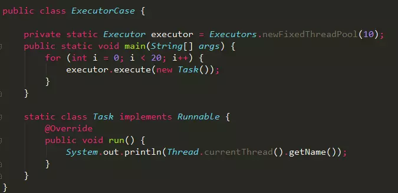

1、`Executors.newFixedThreadPool(10)`初始化一个包含10个线程的线程池executor；

2、通过`executor.execute`方法提交20个任务，每个任务打印当前的线程名；

3、负责执行任务的线程的生命周期都由`Executor`框架进行管理；
#### ThreadPoolExecutor
`Executors`是java线程池的工厂类，通过它可以快速初始化一个符合业务需求的线程池，如`Executors.newFixedThreadPool`方法可以生成一个拥有固定线程数的线程池。

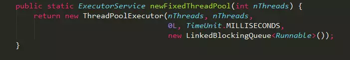

其本质是通过不同的参数初始化一个ThreadPoolExecutor对象，具体参数描述如下：
##### corePoolSize

线程池中的核心线程数，当提交一个任务时，线程池创建一个新线程执行任务，直到当前线程数等于corePoolSize；如果当前线程数为corePoolSize，继续提交的任务被保存到阻塞队列中，等待被执行；如果执行了线程池的prestartAllCoreThreads()方法，线程池会提前创建并启动所有核心线程。
##### maximumPoolSize
线程池中允许的最大线程数。如果当前阻塞队列满了，且继续提交任务，则创建新的线程执行任务，前提是当前线程数小于maximumPoolSize；
##### keepAliveTime
线程空闲时的存活时间，即当线程没有任务执行时，继续存活的时间；默认情况下，该参数只在线程数大于corePoolSize时才有用；
##### unit
keepAliveTime的单位；
##### workQueue
用来保存等待被执行的任务的阻塞队列，且任务必须实现Runable接口，在JDK中提供了如下阻塞队列：
> 1、ArrayBlockingQueue：基于数组结构的有界阻塞队列，按FIFO排序任务；
> 
> 2、LinkedBlockingQuene：基于链表结构的阻塞队列，按FIFO排序任务，吞吐量通常要高于ArrayBlockingQuene；
> 
> 3、SynchronousQuene：一个不存储元素的阻塞队列，每个插入操作必须等到另一个线程调用移除操作，否则插入操作一直处于阻塞状态，吞吐量通常要高于LinkedBlockingQuene；
> 
> 4、priorityBlockingQuene：具有优先级的无界阻塞队列；

##### threadFactory
创建线程的工厂，通过自定义的线程工厂可以给每个新建的线程设置一个具有识别度的线程名。

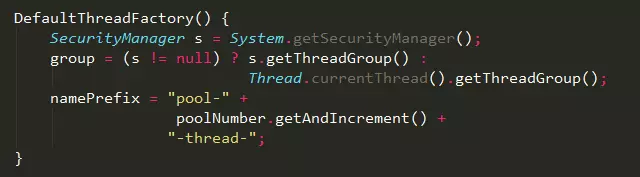
##### handler
线程池的饱和策略，当阻塞队列满了，且没有空闲的工作线程，如果继续提交任务，必须采取一种策略处理该任务，线程池提供了4种策略：
> 1、AbortPolicy：直接抛出异常，默认策略；
> 
> 2、CallerRunsPolicy：用调用者所在的线程来执行任务；
> 
> 3、DiscardOldestPolicy：丢弃阻塞队列中靠最前的任务，并执行当前任务；
> 
> 4、DiscardPolicy：直接丢弃任务；

当然也可以根据应用场景实现RejectedExecutionHandler接口，自定义饱和策略，如记录日志或持久化存储不能处理的任务。
#### Exectors
Exectors工厂类提供了线程池的初始化接口，主要有如下几种：
##### newFixedThreadPool

初始化一个指定线程数的线程池，其中corePoolSize == maximumPoolSize，使用LinkedBlockingQuene作为阻塞队列，不过当线程池没有可执行任务时，也不会释放线程。
##### newCachedThreadPool
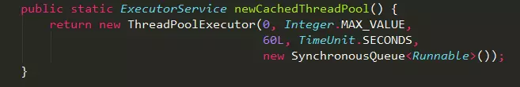

1、初始化一个可以缓存线程的线程池，默认缓存60s，线程池的线程数可达到Integer.MAX_VALUE，即2147483647，内部使用SynchronousQueue作为阻塞队列；

2、和newFixedThreadPool创建的线程池不同，newCachedThreadPool在没有任务执行时，当线程的空闲时间超过keepAliveTime，会自动释放线程资源，当提交新任务时，如果没有空闲线程，则创建新线程执行任务，会导致一定的系统开销；

所以，使用该线程池时，一定要注意控制并发的任务数，否则创建大量的线程可能导致严重的性能问题。
##### newSingleThreadExecutor
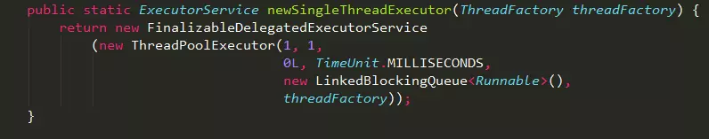

初始化的线程池中只有一个线程，如果该线程异常结束，会重新创建一个新的线程继续执行任务，唯一的线程可以保证所提交任务的顺序执行，内部使用LinkedBlockingQueue作为阻塞队列。
##### newScheduledThreadPool
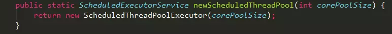

初始化的线程池可以在指定的时间内周期性的执行所提交的任务，在实际的业务场景中可以使用该线程池定期的同步数据。
#### 实现原理
除了newScheduledThreadPool的内部实现特殊一点之外，其它几个线程池都是基于ThreadPoolExecutor类实现的。
##### 线程池内部状态
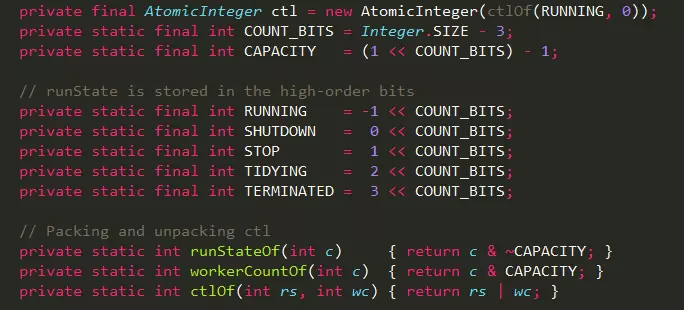

其中AtomicInteger变量ctl的功能非常强大：利用低29位表示线程池中线程数，通过高3位表示线程池的运行状态：
> 1、**RUNNING**：`-1 << COUNT_BITS`，即高3位为111，该状态的线程池会接收新任务，并处理阻塞队列中的任务；
> 
> 2、**SHUTDOWN**：` 0 << COUNT_BITS`，即高3位为000，该状态的线程池不会接收新任务，但会处理阻塞队列中的任务；
> 
> 3、**STOP** ： `1 << COUNT_BITS`，即高3位为001，该状态的线程不会接收新任务，也不会处理阻塞队列中的任务，而且会中断正在运行的任务；
> 
> 4、**TIDYING** ： `2 << COUNT_BITS`，即高3位为010；
> 
> 5、**TERMINATED**： `3 << COUNT_BITS`，即高3位为011；

#### 任务提交
线程池框架提供了两种方式提交任务，根据不同的业务需求选择不同的方式。

##### Executor.execute()
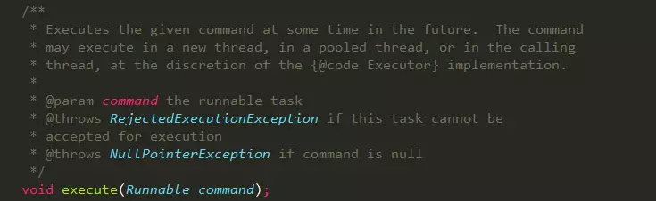

通过Executor.execute()方法提交的任务，必须实现Runnable接口，该方式提交的任务不能获取返回值，因此无法判断任务是否执行成功。
##### ExecutorService.submit()
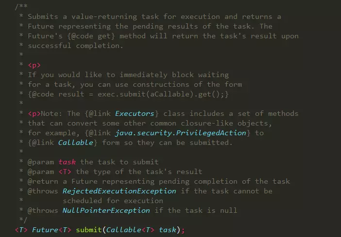

通过ExecutorService.submit()方法提交的任务，可以获取任务执行完的返回值。
#### 任务执行
当向线程池中提交一个任务，线程池会如何处理该任务？
##### execute实现
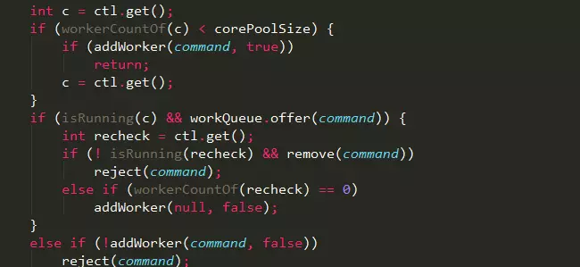

具体的执行流程如下：
> 1、workerCountOf方法根据ctl的低29位，得到线程池的当前线程数，如果线程数小于corePoolSize，则执行addWorker方法创建新的线程执行任务；否则执行步骤（2）；
> 
> 2、如果线程池处于RUNNING状态，且把提交的任务成功放入阻塞队列中，则执行步骤（3），否则执行步骤（4）；
> 
> 3、再次检查线程池的状态，如果线程池没有RUNNING，且成功从阻塞队列中删除任务，则执行reject方法处理任务；
> 
> 4、执行addWorker方法创建新的线程执行任务，如果addWoker执行失败，则执行reject方法处理任务；

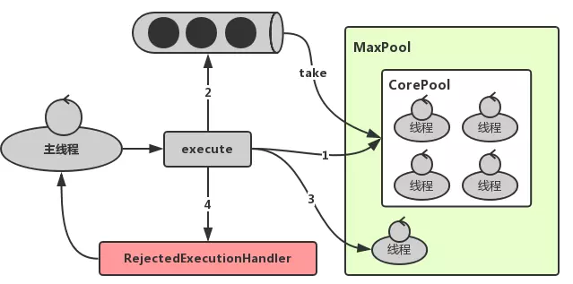
##### addWorker实现
从方法execute的实现可以看出：addWorker主要负责创建新的线程并执行任务，代码实现如下：

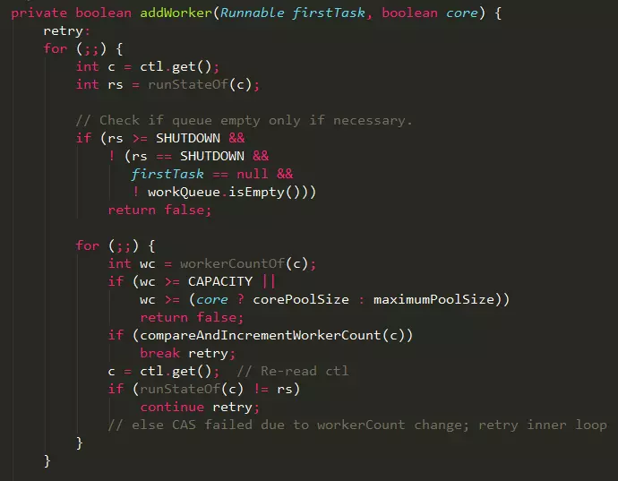

这只是addWoker方法实现的前半部分：
> 1、判断线程池的状态，如果线程池的状态值大于或等于SHUTDOWN，则不处理提交的任务，直接返回；
> 
> 2、通过参数core判断当前需要创建的线程是否为核心线程，如果core为true，且当前线程数小于corePoolSize，则跳出循环，开始创建新的线程，具体实现如下：

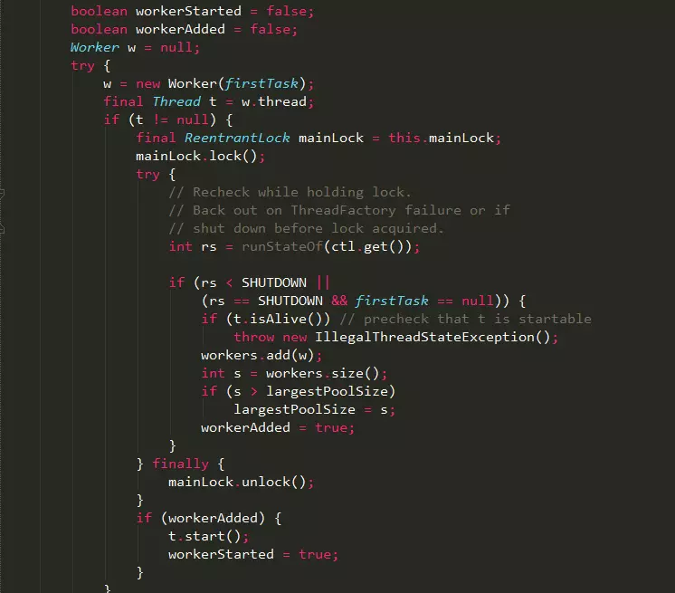

线程池的工作线程通过Woker类实现，在ReentrantLock锁的保证下，把Woker实例插入到HashSet后，并启动Woker中的线程，其中Worker类设计如下：
> 1、继承了AQS类，可以方便的实现工作线程的中止操作；
> 
> 2、实现了Runnable接口，可以将自身作为一个任务在工作线程中执行；
> 
> 3、当前提交的任务firstTask作为参数传入Worker的构造方法；

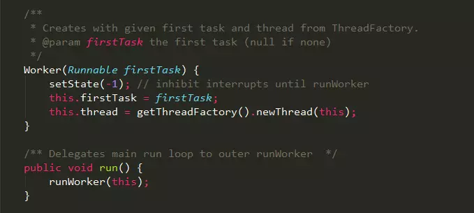

从Woker类的构造方法实现可以发现：线程工厂在创建线程thread时，将Woker实例本身this作为参数传入，当执行start方法启动线程thread时，本质是执行了Worker的`runWorker`方法。
##### `runWorker`实现
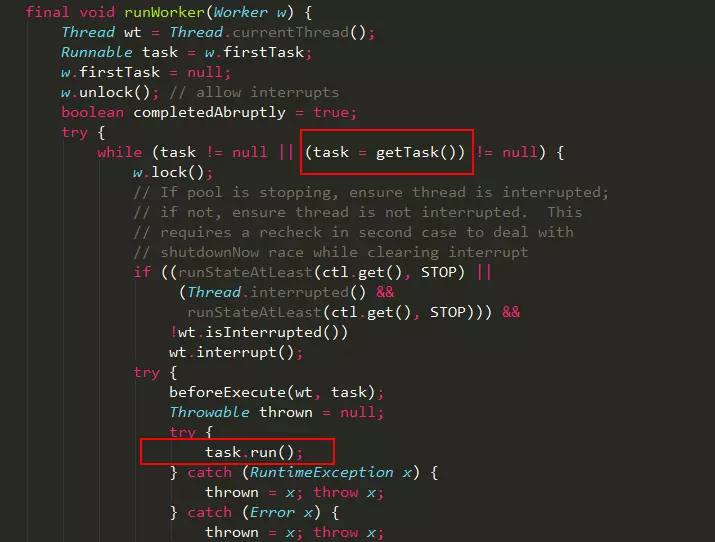

`runWorker`方法是线程池的核心：
> 1、线程启动之后，通过unlock方法释放锁，设置AQS的state为0，表示运行中断；
> 
> 2、获取第一个任务firstTask，执行任务的run方法，不过在执行任务之前，会进行加锁操作，任务执行完会释放锁；
> 
> 3、在执行任务的前后，可以根据业务场景自定义beforeExecute和afterExecute方法；
> 
> 4、firstTask执行完成之后，通过getTask方法从阻塞队列中获取等待的任务，如果队列中没有任务，getTask方法会被阻塞并挂起，不会占用cpu资源；

##### `getTask`实现
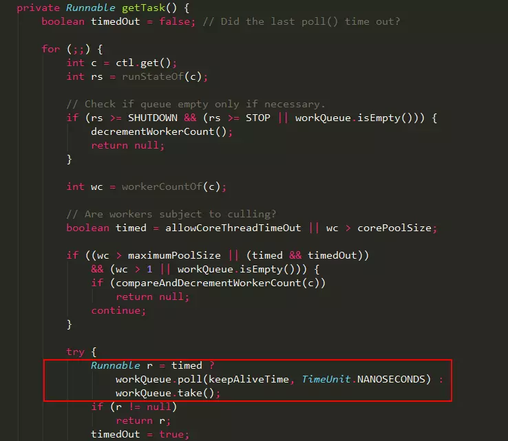

整个getTask操作在自旋下完成：
> 1、workQueue.take：如果阻塞队列为空，当前线程会被挂起等待；当队列中有任务加入时，线程被唤醒，take方法返回任务，并执行；
> 
> 2、workQueue.poll：如果在keepAliveTime时间内，阻塞队列还是没有任务，则返回null；

所以，线程池中实现的线程可以一直执行由用户提交的任务。
#### Future和Callable实现
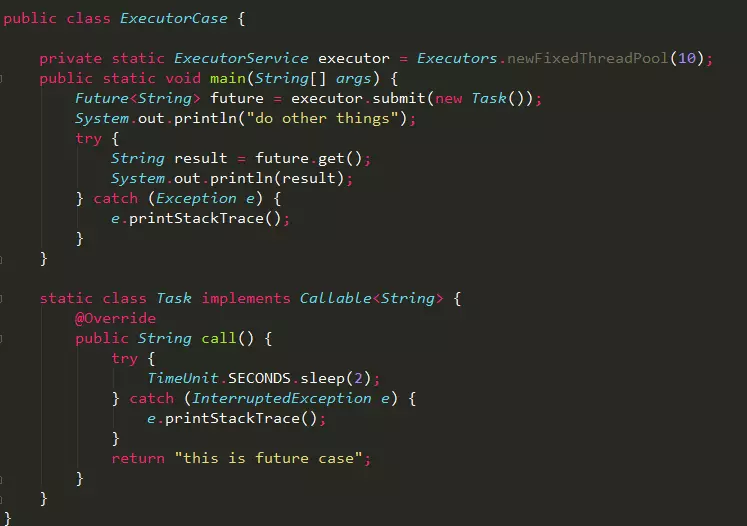

在实际业务场景中，Future和Callable基本是成对出现的，Callable负责产生结果，Future负责获取结果。
> 1、Callable接口类似于Runnable，只是Runnable没有返回值。
> 
> 2、Callable任务除了返回正常结果之外，如果发生异常，该异常也会被返回，即Future可以拿到异步执行任务各种结果；
> 
> 3、Future.get方法会导致主线程阻塞，直到Callable任务执行完成；

##### submit实现
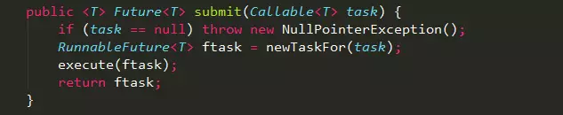

通过submit方法提交的Callable任务会被封装成了一个FutureTask对象。
#### FutureTask
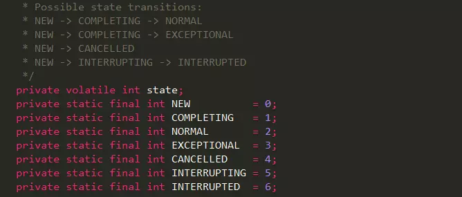

1、FutureTask在不同阶段拥有不同的状态state，初始化为NEW；

2、FutureTask类实现了Runnable接口，这样就可以通过Executor.execute方法提交FutureTask到线程池中等待被执行，最终执行的是FutureTask的run方法；
##### FutureTask.get实现
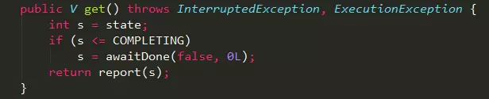

内部通过`awaitDone`方法对主线程进行阻塞，具体实现如下：

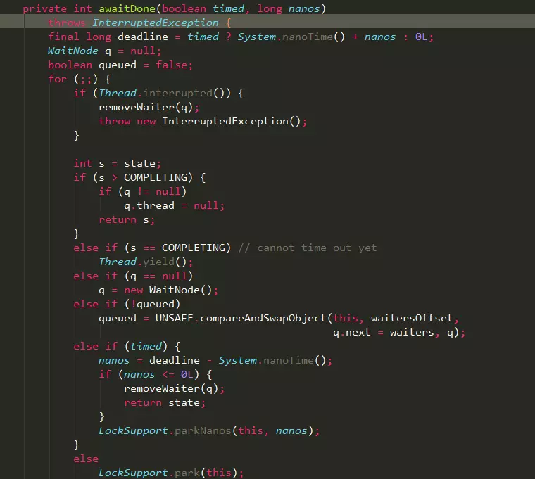

1、如果主线程被中断，则抛出中断异常；

2、判断FutureTask当前的state，如果大于COMPLETING，说明任务已经执行完成，则直接返回；

3、如果当前state等于COMPLETING，说明任务已经执行完，这时主线程只需通过yield方法让出cpu资源，等待state变成NORMAL；

4、通过WaitNode类封装当前线程，并通过UNSAFE添加到waiters链表；

5、最终通过LockSupport的park或parkNanos挂起线程；
##### FutureTask.run实现
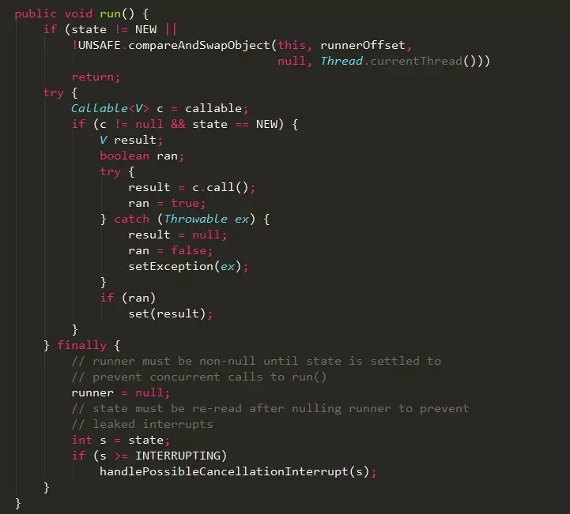

FutureTask.run方法是在线程池中被执行的，而非主线程
> 1、通过执行Callable任务的call方法；
> 
> 2、如果call执行成功，则通过set方法保存结果；
> 
> 3、如果call执行有异常，则通过setException保存异常；

##### set
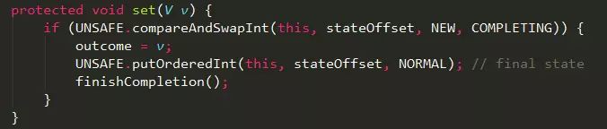
##### setException
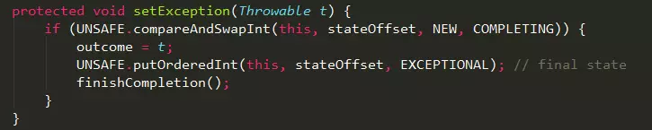

set和setException方法中，都会通过UnSAFE修改FutureTask的状态，并执行finishCompletion方法通知主线程任务已经执行完成；
##### finishCompletion
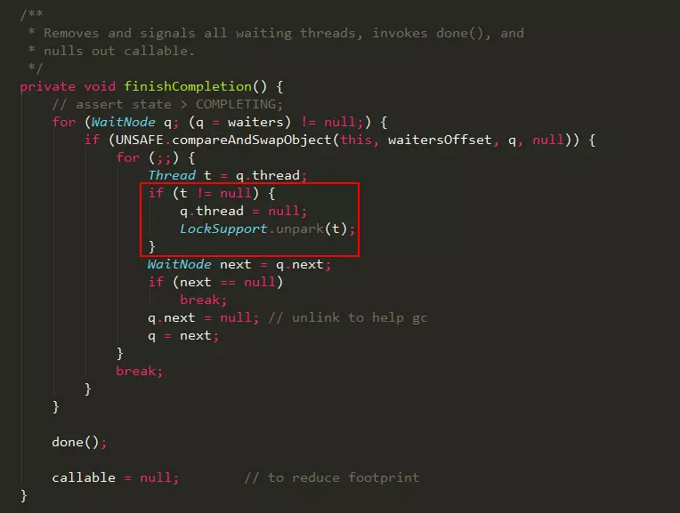

1、执行FutureTask类的get方法时，会把主线程封装成WaitNode节点并保存在waiters链表中；

2、FutureTask任务执行完成后，通过UNSAFE设置waiters的值，并通过LockSupport类unpark方法唤醒主线程；
