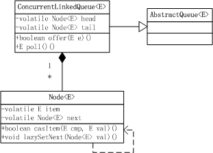

### 概述
ConcurrentLinkedQueue是一种基于链表实现的无界非阻塞线程安全队列，遵循先入先出规则。

线程安全队列有两种实现方式：

* 阻塞方式：对入队和出队操作加锁。阻塞队列。
* 非阻塞方式：通过自旋CAS实现。例如：ConcurrentLinkedQueue

下面从源代码中分析ConcurrentLinkedQueue的实现方法。
### 类关系图


从类图可以看出，ConcurrentLinkedQueue有head和tail两个volatile域，节点是用静态内部类Node表示，每个Node含有元素item和指向下一个节点的指针next，都是volatile变量。
### 源码分析
#### Node源码
Node的item和next两个域都是volatile变量，保证可见性。casItem和casNext方法使用了UNSAFE提供的CAS方法保证操作的原子性。
```java
// Node代码中使用了UNSAFE提供的CAS方法保证操作的原子性，
// UNSAFE.compareAndSwapObject(this, nextOffset, cmp, val); 
// 第一个参数表示要更新的对象，第二个参数nextOffset是Field的偏移量，第三个参数表示期望值，最后一个参数更新后的值。若next域的值等于cmp，则把next域更新为val并返回true；否则不更新并返回false。
private static class Node<E> {
    volatile E item;    // Node值，volatile保证可见性
    volatile Node<E> next;    // Node的下一个元素，volatile保证可见性

    /**
     * Constructs a new node.  Uses relaxed write because item can
     * only be seen after publication via casNext.
     */
    Node(E item) {
        UNSAFE.putObject(this, itemOffset, item);
    }

    boolean casItem(E cmp, E val) {
        return UNSAFE.compareAndSwapObject(this, itemOffset, cmp, val);
    }

    void lazySetNext(Node<E> val) {
        UNSAFE.putOrderedObject(this, nextOffset, val);
    }

    boolean casNext(Node<E> cmp, Node<E> val) {
        return UNSAFE.compareAndSwapObject(this, nextOffset, cmp, val);
    }

    // Unsafe mechanics

    private static final sun.misc.Unsafe UNSAFE;
    private static final long itemOffset;
    private static final long nextOffset;

    static {
        // 初始化UNSAFE和各个域在类中的偏移量
        try {
            UNSAFE = sun.misc.Unsafe.getUnsafe();   // 初始化UNSAFE
            Class k = Node.class;
            // itemOffset是指类中item字段在Node类中的偏移量，先通过反射获取类的item域，然后通过UNSAFE获取item域在内存中相对于Node类首地址的偏移量。
            itemOffset = UNSAFE.objectFieldOffset
                (k.getDeclaredField("item"));
            // nextOffset是指类中next字段在Node类中的偏移量
            nextOffset = UNSAFE.objectFieldOffset
                (k.getDeclaredField("next"));
        } catch (Exception e) {
            throw new Error(e);
        }
    }
}
```
Node类中的lazySetNext(Node<E> val)方法，可以理解为延迟设置Next，内部是使用UNSAFE类的putOrderedObject方法实现，putOrderedXXX方法是putXXXVolatile方法的延迟实现，不保证值的改变被其他线程立即看到。为什么要lazySetNext这个方法呢？其实它是一种低级别的优化手段，就是在不需要让共享变量的修改立刻让其他线程可见的时候，以设置普通变量的方式来修改共享状态，可以减少不必要的内存屏障，从而提高程序执行的效率。

《Java内存模型中》提到volatile变量可以实现可见性，其原理就是插入内存屏障以保证不会重排序指令，使用的是store-load内存屏障，开销较大。UNSAFE类的putOrderedXXX方法则是在指令中插入StoreStore内存屏障，避免发生写操作重排序，由于StoreStore屏障的性能损耗小于StoreLoad屏障，所以lazySetNext方法比直接写volatile变量的性能要高。需要注意的是，StoreStore屏障仅可以避免写写重排序，不保证内存可见性。

在出队操作中更新Queue的Head节点时用到了lazySetNext(Node<E> val)方法，将旧head节点的next指向自己。
#### 初始化
创建一个空的Queue，head节点为null且tail节点等于head节点。
```java
//创建一个空的Queue，head节点为null且tail节点等于head节点2             
public ConcurrentLinkedQueue() {
    head = tail = new Node<E>(null);
}
```
#### 入队
入队的方法为offer，向队列的尾部插入指定的元素，由于ConcurrentLinkedQueue是无界的，所以offer永远返回true，不能通过返回值来判断是否入队成功。

入队大致有以下几个步骤：
> 1）根据tail节点定位出尾节点（last node）；
> 
> 2）将新节点置为尾节点的下一个节点；
> 
> 3）更新尾节点casTail。

```java
// 向队列的尾部插入指定的元素
public boolean offer(E e) {
    checkNotNull(e);
    final Node<E> newNode = new Node<E>(e); // 构造新Node
    // 循环CAS直到入队成功。1、根据tail节点定位出尾节点（last node）；2、将新节点置为尾节点的下一个节点，3、更新尾节点casTail。
    for (Node<E> t = tail, p = t;;) {
        Node<E> q = p.next;
        if (q == null) {    // 判断p是不是尾节点，tail节点不一定是尾节点，判断是不是尾节点的依据是该节点的next是不是null
            // p is last node
            if (p.casNext(null, newNode)) {    
            // 设置P节点的下一个节点为新节点，如果p的next为null，说明p是尾节点，casNext返回true；如果p的next不为null，说明有其他线程更新过队列的尾节点，casNext返回false。
                // Successful CAS is the linearization point
                // for e to become an element of this queue,
                // and for newNode to become "live".
                if (p != t) // hop two nodes at a time
                    casTail(t, newNode);  // Failure is OK.
                return true;
            }
            // Lost CAS race to another thread; re-read next
        }
        else if (p == q)
            // p节点是null的head节点刚好被出队，更新head节点时h.lazySetNext(h)把旧的head节点指向自己
            // We have fallen off list.  If tail is unchanged, it
            // will also be off-list, in which case we need to
            // jump to head, from which all live nodes are always
            // reachable.  Else the new tail is a better bet.
            p = (t != (t = tail)) ? t : head;
        else
            // Check for tail updates after two hops.
            p = (p != t && t != (t = tail)) ? t : q;
            // 判断tail节点有没有被更新，如果没被更新，1）p=q：p指向p.next继续寻找尾节点;
            // 如果被更新了，2)p=t:P赋值为新的tail节点
            // p != t && t != (t = tail)是怎么执行的？见随笔附录《通过字节码指令分析 p != t && t != (t = tail) 语句的执行》
            // 什么情况下p!=t.只有本分支和else if (p == q)分支含有更新变量p和t的语句，所以在p!=t出现之前已经循环过这两个分支至少一次。

    }
}

private boolean casTail(Node<E> cmp, Node<E> val) {
    return UNSAFE.compareAndSwapObject(this, tailOffset, cmp, val);
}
```
需要注意的是：tail不总是尾节点（last node）。DougLea大师为什么这么设计呢？把tail节点永远作为Queue的尾节点实现起来不是更简单吗？

下面是tail节点永远作为Queue的尾节点的入队方法代码：
```java
public boolean offer(E e) {
    if (e == null)
        throw new NullPointerException();
    Node<E> n = new Node<E>(e);
    for (;;) {
        Node<E> t = tail;
        // 此处如果casNext成功，那么casTail可能会成功。因为在这两个原子操作期间，其他线程的casNext操作都会失败，之后的casTail不会被执行，即tail节点不变。
        if (t.casNext(null, n) && casTail(t, n)) {
            return true;
        }
    }
}
```
这么做的缺点是每次入队都会自旋CAS更新tail节点，入队效率会降低，而DougLea的设计通过hops变量来减少入队时减少更新tail节点的次数，默认情况下hops为1。当tail节点与尾节点的距离大于等于hops值时才更新Queue的tail节点。这样带来的坏处是入队时需要根据tail定位尾节点，hops的值越大，定位时间就越长。DougLea的设计思想是通过增加对volatile变量的读来减少对volatile变量的写，而写操作的开销远远大于读操作。所以从总体上来说入队效率是提升的。
#### 出队
和入队相似，出队时也不是每次都会更新head节点，当head节点的item不为null时，直接弹出item；否则会更新head节点。更新head节点成功时，会把旧的head节点指向自己。
```java
public E poll() {
    restartFromHead:
    // 两层循环
    for (;;) {
        for (Node<E> h = head, p = h, q;;) {
            E item = p.item;

            if (item != null && p.casItem(item, null)) {
                // Successful CAS is the linearization point
                // for item to be removed from this queue.
                if (p != h) // hop two nodes at a time
                    updateHead(h, ((q = p.next) != null) ? q : p);
                return item;
            }
            // 队列为空，更新head节点
            else if ((q = p.next) == null) {
                updateHead(h, p);
                return null;
            }
            else if (p == q)
                // p节点是null的head节点刚好被出队，更新head节点时h.lazySetNext(h);把旧的head节点指向自己。
                // 重新从head节点开始
                continue restartFromHead;
            else
                p = q;    // 将p执行p的下一个节点
        }
    }
}

// 更新head节点
final void updateHead(Node<E> h, Node<E> p) {
    // 通过CAS将head更新为P
    if (h != p && casHead(h, p))
        h.lazySetNext(h);   // 把旧的head节点指向自己
}

void lazySetNext(Node<E> val) {
    UNSAFE.putOrderedObject(this, nextOffset, val);
}
```
#### 队列大小
注意：size()需要遍历队列中的所有元素，时间复杂度为O(n)，开销较大。并且如果在遍历的过程中，Queue有入队或出队的操作，会导致该方法统计的结果不准确。所以size()方法不太有用。那如何判断Queue是否为空呢？使用isEmpty()方法，判断第一个节点是否为null，时间复杂度为O(1)
```java
public int size() {
    int count = 0;
    for (Node<E> p = first(); p != null; p = succ(p))
        if (p.item != null)
            // Collection.size() spec says to max out
            if (++count == Integer.MAX_VALUE)
                break;
    return count;
}
```
#### 附录：通过字节码指令分析 p != t && t != (t = tail) 语句的执行
在读ConcurrentLinkedQueue源代码时，在入队方法的定位尾节点中读到 p = (p != t && t != (t = tail)) ? t : q; 语句，不太理解 p != t && t != (t = tail) 的执行顺序，遂通过反汇编语句仔细研究一下。

我们都知道 A && B 运算，在A不满足条件的情况下，B将不会执行。那在字节码指令中是怎么实现的呢？

通过以下代码模拟：
```java
public class Test {
    public static void main(String[] args) {
        int t = 8;
        int p = t;
        int tail = 9;
        boolean result = (p != t && t != (t = tail));
        System.out.println("p=" + p + ", t=" + t + ", result=" + result);
    }
}
```
不出所料，运行结果为p=8, t=8, result=false。t=8说明没有执行t != (t = tail)语句。

看反汇编后的字节码指令：
```java
public class Test {
  public static void main(java.lang.String[] args);
     0  bipush 8                // 将单字节常量（-128~127）压入栈顶
     2  istore_1 [t]            // 将栈顶int型数值存入第二个本地变量，即赋值给变量t，同时常量8出栈
     3  iload_1 [t]                // 将第二个int型本地变量（t）压入栈顶 
     4  istore_2 [p]            // 将栈顶int型数值存入第三个本地变量，即赋值给变量P，同时t出栈
     5  bipush 9                
     7  istore_3 [tail]
     8  iload_2 [p]
     9  iload_1 [t]
    10  if_icmpeq 24            // 比较栈顶两int型数值大小，当结果等于0时跳转。即比较p!=t，结果为false（0），跳转到24行，同时p和t出栈
    13  iload_1 [t]
    14  iload_3 [tail]
    15  dup
    16  istore_1 [t]
    17  if_icmpeq 24
    20  iconst_1
    21  goto 25
    24  iconst_0                // 将int型0压入栈顶。
    25  istore 4 [result]        // 将栈顶int型数值存入指定本地变量。即将result赋值为0（false）
    27  return
}
```
接下来再看一下第一个条件成立时的情况。代码将p != t改为p == t：
```java
public class Test {
    public static void main(String[] args) {
        int t = 8;
        int p = t;
        int tail = 9;
        boolean result = (p == t && t != (t = tail));
        System.out.println("p=" + p + ", t=" + t + ", result=" + result);
    }
}
```
先来看运行结果p=8, t=9, result=true。说明执行了t != (t = tail)语句。

看反汇编后的字节码指令：
```java
public class Test {
  public static void main(java.lang.String[] args);
     0  bipush 8
     2  istore_1 [t]
     3  iload_1 [t]
     4  istore_2 [p]
     5  bipush 9
     7  istore_3 [tail]
     8  iload_2 [p]
     9  iload_1 [t]
    10  if_icmpne 24            // 比较栈顶两int型数值大小，当结果不等于0时跳转。即比较p == t，结果为true（1）。所以不会跳转到24行，继续执行下一行。
    13  iload_1 [t]                // 将变量t压入栈顶，此时t=8
    14  iload_3 [tail]            // 将变量tail压入栈顶，tail=9
    15  dup                        // 复制栈顶数值并将复制值压入栈顶。即复制tail变量值并压入栈顶，tail=9
    16  istore_1 [t]            // 将栈顶数值存入t变量，同时出栈
    17  if_icmpeq 24            // 比较栈顶两int型数值大小，当结果等于0时跳转。此时栈顶有9、8。比较9!=8,结果为true（1）。所以不会跳转到24行，继续执行下一行。
    20  iconst_1                // 将int型1压入栈顶
    21  goto 25                    // 无条件跳转到25行
    24  iconst_0
    25  istore 4 [result]        // 将栈顶1存入result，同时出栈。即result返回true
    27  return
}
```
通过字节码指令分析可知，编译器是通过if_icmpeq和if_icmpne比较并条件跳转指令实现&&短路与运算的。在第二种情况中，还分析了t != (t = tail)语句的执行过程，理解会更加深入。
