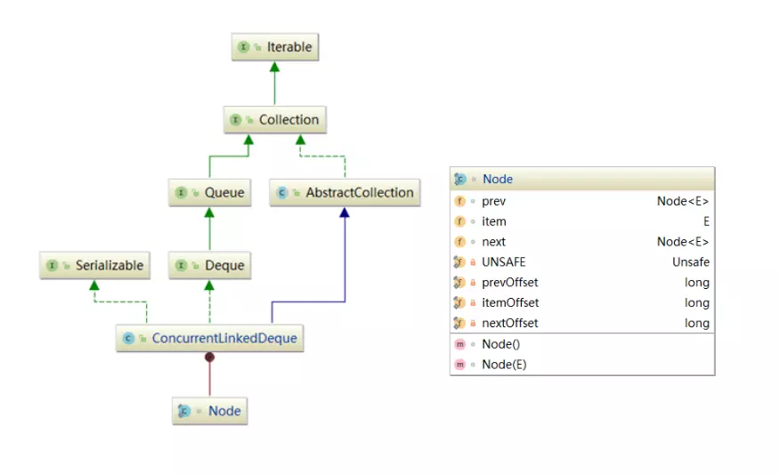

> ConcurrentLinkedDeque 是双向链表结构的无界并发队列。从JDK 7开始加入到J.U.C的行列中。使用CAS实现并发安全，与 ConcurrentLinkedQueue 的区别是该阻塞队列同时支持FIFO和FILO两种操作方式，即可以从队列的头和尾同时操作(插入/删除)。适合“多生产，多消费”的场景。内存一致性遵循对 ConcurrentLinkedDeque 的插入操作先行发生于(happen-before)访问或移除操作。相较于 ConcurrentLinkedQueue，ConcurrentLinkedDeque 由于是双端队列，所以在操作和概念上会更加复杂，来一起看下。

### 概述
ConcurrentLinkedDeque（后面称CLD） 的实现方式继承了 ConcurrentLinkedQueue 和 LinkedTransferQueue的思想，在非阻塞算法的实现方面与 ConcurrentLinkedQueue 基本一致。
### 数据结构

#### 重要属性：
```java
// 头节点
pr ivate transient volatile Node<E> head;
//尾节点
private transient volatile Node<E> tail;
// 终止节点
private static final Node<Object> PREV_TERMINATOR, NEXT_TERMINATOR;
// 移除节点时更新链表属性的阀值
private static final int HOPS = 2;
```
和ConcurrentLinkedQueue一样，CLD 内部也只维护了head和tail属性，对 head/tail 节点也使用了“不变性”和“可变性”约束，不过跟 ConcurrentLinkedQueue 有些许差异，我们来看一下：
##### head/tail 的不变性：
> 1. 第一个节点总是能以O(1)的时间复杂度从 head 通过 prev 链接到达；
> 
> 2. 最后一个节点总是能以O(1)的时间复杂度从 tail 通过 next 链接到达；
> 
> 3. 所有live节点（item不为null的节点），都能从第一个节点通过调用 succ() 方法遍历可达；
> 
> 4. 所有live节点（item不为null的节点），都能从最后一个节点通过调用 pred() 方法遍历可达；
> 
> 5. head/tail 不能为 null；
> 
> 6. head 节点的 next 域不能引用到自身；
> 
> 7. head/tail 不会是GC-unlinked节点（但它可能是unlink节点）。

##### head/tail的可变性：
> 1. head/tail 节点的 item 域可能为 null，也可能不为 null；
> 
> 2. head/tail 节点可能从first/last/tail/head 节点访问时不可达；
> 
> 3. tail 节点的 next 域可以引用到自身。


**注**：CLD中也对 head/tail 的更新也使用了“松弛阀值”的概念，除此之外，CLD设定了一个“跳跃阀值”-HOPS（指在查找活动节点时跳过的已删除节点数），在执行出队操作时，跳跃节点数大于2或者操作的节点不是 first/last 节点时才会更新链表（后面源码中详细分析）。

除此之外，再来看看CLD中另外两个属性：

* **PREV_TERMINATOR**：prev的终止节点，next指向自身，即PREV_TERMINATOR.next = PREV_TERMINATOR。在 first 节点出列后，会把first.next指向自身(first.next=first)，然后把prev设为PREV_TERMINATOR。
* **NEXT_TERMINATOR**：next的终止节点，prev指向自身，即NEXT_TERMINATOR.pre = NEXT_TERMINATOR。在 last 节点出列后，会把last.prev指向自身(last.prev=last)，然后把next设为NEXT_TERMINATOR。

### 源码解析
在开始源码分析之前，我们先来看一下CLD中对Node的定义：
1. **live node**：节点的 item!=null 被称为live节点。当节点的 item 被 CAS 改为 null，逻辑上来讲这个节点已经从链表中移除；一个新的元素通过 CAS 添加到一个包含空 prev 或空 next 的 first 或 last 节点，这个元素的节点在这时是 live节点。

2. **first node & last node**：首节点(first node)总会有一个空的 prev 引用，终止任何从 live 节点开始的 prev 引用链；同样的最后一个节点(last node)是 next 的终止节点。first/last 节点的 item 可以为 null。并且 first 和 last 节点总是相互可达的。

3. **active node**：live节点、first/last 节点也被称为活跃节点(active node)，活跃节点一定是被链接的，如果p节点为active节点，则：p.item != null || (p.prev == null && p.next != p) || (p.next == null && p.prev != p)

4. **self-node**：自链接节点，prev 或 next 指向自身的节点，自链接节点用在解除链接操作中，并且它们都不是active node。

5. **head/tail节点**：head/tail 也可能不是 first/last 节点。从 head 节点通过 prev 引用总是可以找到 first 节点，从 tail 节点通过 next 引用总是可以找到 last 节点。允许 head 和 tail 引用已删除的节点，这些节点没有链接，因此可能无法从 live 节点访问到。

节点删除时经历三个阶段：逻辑删除(logical deletion)，未链接( unlinking)，和gc未链接( gc-unlinking)：

* **logical deletion**：通过 CAS 修改节点 item 为 null 来完成，表示当前节点可以被解除链接(unlinking)。
* **unlinking**： 这种状态下的节点与其他 active 节点有链接，但是其他 active 节点与之都没有链接，也就是说从这个状态下的节点可以达到 active 节点，但是从 active 节点不可达到这种状态的节点。在任何时候，从 first 通过 next 找到的 live 节点和从 last 通过 prev 找到的节点总是相等的。但是，在节点被逻辑删除时上述结论不成立，这些被逻辑删除的节点也可能只从一端是可达的。
* **gc-unlinking**： GC未链接使已删除节点不可达到 active 节点，使GC更容易回收被删除的节点。通过让节点自链接或链接到终止节点（PREV_TERMINATOR 或 NEXT_TERMINATOR）来实现。 gc-unlinking 节点从 head/tail 访问不可达。这一步是为了使数据结构保持GC健壮性(gc-robust)，防止保守式GC（conservative GC，目前已经很少使用）对这些边界空间的使用。对保守式GC来说，使数据结构保持GC健壮性会消除内存无限滞留的问题，同时也提高了分代收机器的性能。

#### 添加（入列）
CLD的添加方法包括：offer(E)、add(E)、push(E)、addFirst(E)、addLast(E)、offerFirst(E)、offerLast(E)，所有这些操作都是通过linkFirst(E)或linkLast(E)来实现的。
##### linkFirst(E) / linkLast(E)
```java
/**
 * Links e as first element.
 */
private void linkFirst(E e) {
    checkNotNull(e);
    final Node<E> newNode = new Node<E>(e);

    restartFromHead:
    for (;;)
        // 从head节点往前寻找first节点
        for (Node<E> h = head, p = h, q;;) {
            if ((q = p.prev) != null &&
                (q = (p = q).prev) != null)
                // Check for head updates every other hop.
                // If p == q, we are sure to follow head instead.
                // 如果head被修改，返回head重新查找
                p = (h != (h = head)) ? h : q;
            else if (p.next == p) // 自链接节点，重新查找
                continue restartFromHead;
            else {
                // p is first node
                newNode.lazySetNext(p); // CAS piggyback
                if (p.casPrev(null, newNode)) {
                    // Successful CAS is the linearization point
                    // for e to become an element of this deque,
                    // and for newNode to become "live".
                    if (p != h) // hop two nodes at a time 跳两个节点时才修改head
                        casHead(h, newNode);  // Failure is OK.
                    return;
                }
                // Lost CAS race to another thread; re-read prev
            }
        }
}

/**
 * Links e as last element.
 */
private void linkLast(E e) {
    checkNotNull(e);
    final Node<E> newNode = new Node<E>(e);

    restartFromTail:
    for (;;)
        // 从tail节点往后寻找last节点
        for (Node<E> t = tail, p = t, q;;) {
            if ((q = p.next) != null &&
                (q = (p = q).next) != null)
                // Check for tail updates every other hop.
                // If p == q, we are sure to follow tail instead.
                // 如果tail被修改，返回tail重新查找
                p = (t != (t = tail)) ? t : q;
            else if (p.prev == p) // 自链接节点，重新查找
                continue restartFromTail;
            else {
                // p is last node
                newNode.lazySetPrev(p); // CAS piggyback
                if (p.casNext(null, newNode)) {
                    // Successful CAS is the linearization point
                    // for e to become an element of this deque,
                    // and for newNode to become "live".
                    if (p != t) // hop two nodes at a time 跳两个节点时才修改tail
                        casTail(t, newNode);  // Failure is OK.
                    return;
                }
                // Lost CAS race to another thread; re-read next
            }
        }
}
```
**说明**：linkFirst是插入新节点到队列头的主函数，执行流程如下：

首先从 head 节点开始向前循环找到 first 节点(p.prev==null&&p.next!=p)；然后通过lazySetNext设置新节点的 next 节点为 first；然后 CAS 修改 first 的 prev 为新节点。注意这里 CAS 指令成功后会判断 first 节点是否已经跳了两个节点，只有在跳了两个节点才会 CAS 更新 head，这也是为了节省 CAS 指令执行开销。linkLast是插入新节点到队列尾，执行流程与linkFirst一致，不多赘述，具体见源码。
#### 获取(出列)
CLD的获取方法分两种：

**获取节点**：peek、peekFirst 、peekLast、getFirst、getLast，都是通过peekFirst 、peekLast实现。
获取并移除节点： poll、pop、remove、pollFirst、pollLast、removeFirst、removeLast，都是通过pollFirst、pollLast实现。

pollFirst、pollLast包括了peekFirst 、peekLast的实现，都是找到并返回 first/last 节点，不同的是，pollFirst、pollLast比peekFirst 、peekLast多了 unlink 这一步。所以这里我们只对pollFirst和pollLast两个方法进行解析。

首先来看一下pollFirst() ：
##### pollFirst()
```java
/**获取并移除队列首节点*/
public E pollFirst() {
    for (Node<E> p = first(); p != null; p = succ(p)) {
        E item = p.item;
        if (item != null && p.casItem(item, null)) {
            unlink(p);
            return item;
        }
    }
    return null;
}
```
**说明**： pollFirst()用于找到链表中首个 item 不为 null 的节点（注意并不是first节点，因为first节点的item可以为null），并返回节点的item。涉及的内部方法较多，不过都很简单，我们通过穿插代码方式分析：

1. 首先通过first()方法找到 first 节点，first 节点必须为 active 节点(p.prev==null&&p.next!=p)。first()源码如下：
```java
Node<E> first() {
    restartFromHead:
    for (;;)
        // 从head开始往前找
        for (Node<E> h = head, p = h, q;;) {
            if ((q = p.prev) != null &&
                (q = (p = q).prev) != null)
                // Check for head updates every other hop.
                // If p == q, we are sure to follow head instead.
                // 如果head被修改则返回新的head重新查找，否则继续向前(prev)查找
                p = (h != (h = head)) ? h : q;
            else if (p == h
                     // It is possible that p is PREV_TERMINATOR,
                     // but if so, the CAS is guaranteed to fail.
                    // 找到的节点不是head节点，CAS修改head
                     || casHead(h, p))
                return p;
            else
                continue restartFromHead;
        }
}
```
2. 如果first.item==null（这里是允许的，具体见上面我们对 first/last 节点的介绍），则继续调用succ方法寻找后继节点。succ源码如下：
```java
/**返回指定节点的的后继节点，如果指定节点的next指向自己，返回first节点*/
final Node<E> succ(Node<E> p) {
    // TODO: should we skip deleted nodes here?
    Node<E> q = p.next;
    return (p == q) ? first() : q;
}
```
3. CAS 修改节点的 item 为 null（即 “逻辑删除-logical deletion”），然后调用unlink(p)方法解除节点链接，最后返回 item。unlink(p)是移除节点的主方法，逻辑较为复杂，后面我们单独分析。
#### unlink(Node<E> x)
```java
/**
 * Unlinks non-null node x.
 */
void unlink(Node<E> x) {
    // assert x != null;
    // assert x.item == null;
    // assert x != PREV_TERMINATOR;
    // assert x != NEXT_TERMINATOR;

    final Node<E> prev = x.prev;
    final Node<E> next = x.next;
    if (prev == null) { // 操作节点为first节点
        unlinkFirst(x, next);
    } else if (next == null) {  // 操作节点为last节点
        unlinkLast(x, prev);
    } else {    // common case
        Node<E> activePred, activeSucc;
        boolean isFirst, isLast;
        int hops = 1;

        // Find active predecessor
        // 从被操作节点的prev节点开始找到前继活动节点
        for (Node<E> p = prev; ; ++hops) {          
            if (p.item != null) {
                activePred = p;
                isFirst = false;
                break;
            }
            Node<E> q = p.prev;
            if (q == null) {
                if (p.next == p)
                    return; // 自链接节点
                activePred = p;
                isFirst = true;
                break;
            }
            else if (p == q)    // 自链接节点
                return;
            else
                p = q;
        }

        // Find active successor
        for (Node<E> p = next; ; ++hops) {          
            if (p.item != null) {
                activeSucc = p;
                isLast = false;
                break;
            }
            Node<E> q = p.next;
            if (q == null) {
                if (p.prev == p)
                    return;
                activeSucc = p;
                isLast = true;
                break;
            }
            else if (p == q)    // 自链接节点
                return;
            else
                p = q;
        }

        // TODO: better HOP heuristics
        // 无节点跳跃并且操作节点有first或last节点时不更新链表
        if (hops < HOPS
            // always squeeze out interior deleted nodes
            && (isFirst | isLast))          
            return;

        // Squeeze out deleted nodes between activePred and
        // activeSucc, including x.
        // 连接两个活动节点
        skipDeletedSuccessors(activePred);            
        skipDeletedPredecessors(activeSucc);

        // Try to gc-unlink, if possible
        if ((isFirst | isLast) &&

            // Recheck expected state of predecessor and successor
            (activePred.next == activeSucc) &&
            (activeSucc.prev == activePred) &&
            (isFirst ? activePred.prev == null : activePred.item != null) &&
            (isLast  ? activeSucc.next == null : activeSucc.item != null)) {          

            updateHead(); // Ensure x is not reachable from head
            updateTail(); // Ensure x is not reachable from tail

            // Finally, actually gc-unlink
            x.lazySetPrev(isFirst ? prevTerminator() : x);
            x.lazySetNext(isLast  ? nextTerminator() : x);
        }
    }
}
```
说明：unlink(Node<E> x)方法用于解除已弹出节点的链接，分三种情况：
1. 首先说一下通常的情况（源码中标注 common case 处），这种情况下，入列和出列非同端操作，即操作节点 x 非 first 和 last 节点， 就执行如下流程：

* 首先找到给定节点 x 的活跃（active）前继和后继节点。然后修整它们之间的链接，让它们指向对方（通过skipDeletedSuccessors和skipDeletedPredecessors方法），留下一个从活跃(active)节点不可达的 x 节点（即“unlinking”）。
* 如果成功执行，或者 x 节点没有 live 的前继/后继节点，再尝试 gc 解除链接(gc-unlink)，在设置 x 节点的 prev/next 指向它们自己或 TERMINATOR 之前（即“gc-unlink”），需要检查 x 的前继和后继节点的状态未被改变，并保证 x 节点从 head/tail 不可达（通过updateHead()和updateTail()方法）。

2. 如果操作节点为 first 节点（入列和出列都发生在 first 端），则调用unlinkFirst解除已删除节点的链接，并链接 first 节点到下一个 active 节点（注意，在执行完此方法之后 first 节点是没有改变的）。unlinkFirst源码如下：
```java
/**
 * Unlinks non-null first node.
 */
private void unlinkFirst(Node<E> first, Node<E> next) {
    // assert first != null;
    // assert next != null;
    // assert first.item == null;
    // 从next节点开始向后寻找有效节点，o：已删除节点(item为null)
    for (Node<E> o = null, p = next, q;;) {
        if (p.item != null || (q = p.next) == null) {
            // 跳过已删除节点，CAS替换first的next节点为一个active节点p
            if (o != null && p.prev != p && first.casNext(next, p)) {
                // 更新p的prev节点
                skipDeletedPredecessors(p);
                if (first.prev == null &&
                    (p.next == null || p.item != null) &&
                    p.prev == first) {
                    // 更新head节点，确保已删除节点o从head不可达(unlinking)
                    updateHead(); // Ensure o is not reachable from head
                    // 更新tail节点，确保已删除节点o从tail不可达(unlinking)
                    updateTail(); // Ensure o is not reachable from tail

                    // Finally, actually gc-unlink
                    // 使unlinking节点next指向自身
                    o.lazySetNext(o);
                    // 设置移除节点的prev为PREV_TERMINATOR
                    o.lazySetPrev(prevTerminator());
                }
            }
            return;
        }
        else if (p == q)    // 自链接节点
            return;
        else {
            o = p;
            p = q;
        }
    }
}
```
3. 如果操作节点为 last 节点（入列和出列都发生在 last 端），则调用unlinkLast解除已删除节点的链接，并链接 last 节点到上一个 active 节点。unlinkLast与unlinkFirst方法执行流程一致，只是操作的是 last 端，在此不多赘述。
### 小结
本章与 ConcurrentLinkedQueue 一篇中的非阻塞算法基本一致，只是为双端操作定义了几个可供操作的节点类型。
