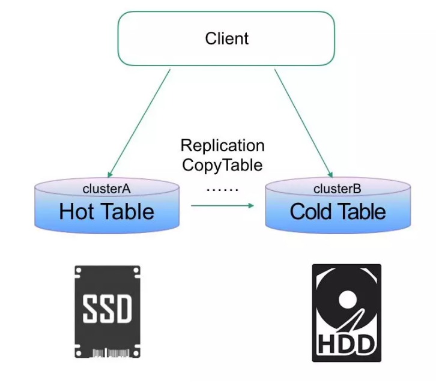
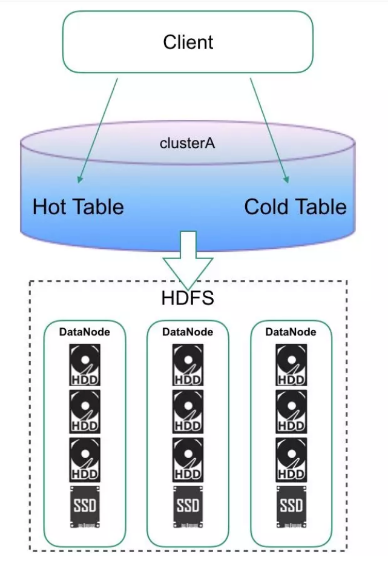
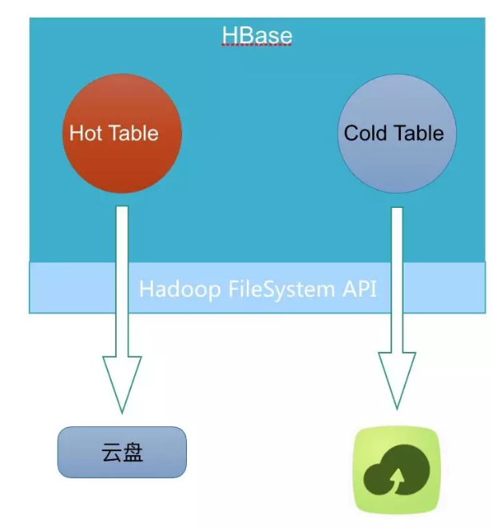

## 一、简介

HBase是当下流行的一款海量数据存储的分布式数据库。往往海量数据存储会涉及到一个成本问题，如何降低成本。常见的方案就是通过冷热分离来治理数据。冷数据可以用更高的压缩比算法（ZSTD），更低副本数算法（Erasure Coding），更便宜存储设备（HDD，高密集型存储机型）。

## 二、HBase冷热分离常见解决方案

### 2.1、主备集群

备（冷）集群用更廉价的硬件，主集群设置TTL，这样当数据热度退去，冷数据自然只在冷集群有。

+ 优点：方案简单，现成内核版本都能搞
+ 缺点：维护开销大，冷集群CPU存在浪费

1.x版本的HBase在不改内核情况下，基本只能有这种方案。

HDFS Archival Storage + HBase CF-level Storage Policy需要在2.x之后的版本才能使用。结合HDFS分层存储能力 + 在Table层面指定数据存储策略，实现同集群下，不同表数据的冷热分离。

+ 优点：同一集群冷热分离，维护开销少，更灵活的配置不同业务表的策略
+ 缺点：磁盘配比是个很大的问题，不同业务冷热配比是不一样的，比较难整合在一起，一旦业务变动，集群硬件配置是没法跟着变的。

## 2.2、云HBase冷热分离解决方案

上述2套方案都不是最好的方案，对于云上来说。第一套方案就不说了，客户搞2个集群，对于数据量不大的客户其实根本降不了成本。第二套方案，云上客户千千万，业务各有各样，磁盘配置是很难定制到合适的状态。

云上要做 cloud native 的方案，必须满足同集群下，极致的弹性伸缩，才能真正意义上做到产品化。云上低成本，弹性存储，只有OSS了。所以很自然的想到如下架构：

实现这样的架构，最直接的想法是直接改HBase内核：

1）增加冷表数据标记 

2）根据标记增加写OSS的IO路径。

这样做的缺陷非常明显，你的外部系统（如：备份恢复，数据导入导出）很难兼容这些改动，他们需要感知哪些是冷文件得去OSS哪个位置读，哪些是热文件得去部署在云盘上的HDFS上读。

这些本质上都是一些重复的工作，所以从架构设计角度来看必须抽象出一层。这一层能读写HDFS文件，读写OSS文件，感知冷热文件。这一层也就是我最后设计出的ApsaraDB FileSystem，实现了Hadoop FileSystem API。对于HBase，备份恢复，数据导入导出等系统只要替换原先FileSystem的实现即可获得冷热分离的功能。
下面将详细阐述，这套FileSystem设计的细节与难点。

阿里云对象存储服务（Object Storage Service，简称 OSS），是阿里云提供的海量、安全、低成本、高可靠的云存储服务。

对象/文件（Object）
对象是 OSS 存储数据的基本单元，也被称为 OSS 的文件。对象由元信息（Object Meta）、用户数据（Data）和文件名（Key）组成。对象由存储空间内部唯一的 Key 来标识。对象元信息是一组键值对，表示了对象的一些属性，比如最后修改时间、大小等信息，同时您也可以在元信息中存储一些自定义的信息。

