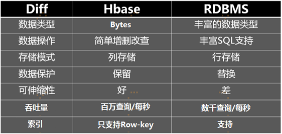
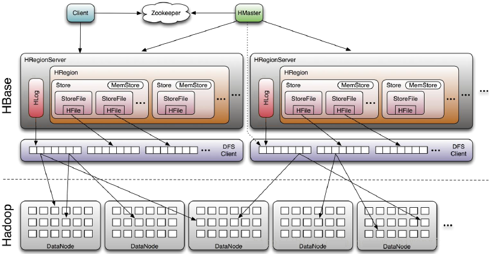
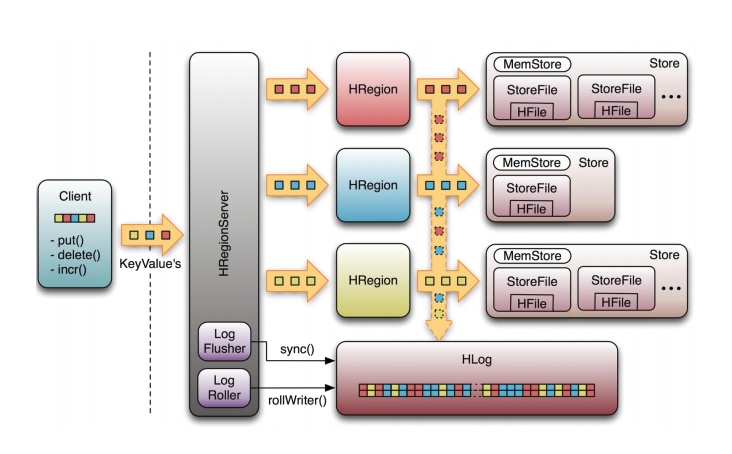
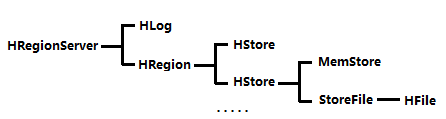
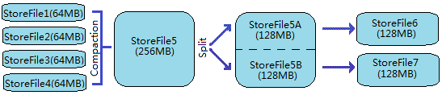

# Hbase系统架构及数据结构

## 一、基本概念

一个典型的 Hbase Table 表如下：

HBase是一个面向列的数据库，在表中它由行排序。表模式定义只能列族，也就是键值对。一个表有多个列族以及每一个列族可以有任意数量的列。后续列的值连续存储在磁盘上。表中的每个单元格值都具有时间戳。总之，在一个HBase：

+ 表是行的集合。
+ 行是列族的集合。
+ 列族是列的集合。
+ 列是键值对的集合。

这里的列式存储或者说面向列，其实说的是列族存储，HBase是根据列族来存储数据的。列族下面可以有非常多的列，列族在创建表的时候就必须指定。

**RDBMS**

|Primary key | column1 | column2 |
|:------| :------ | :------ | 
|记录1 | xxx | xxx |
|记录2 | xxx| xxx |
|记录3| xxx |xxx |

**HBase**

|Rowkey | CF1 | CF2 |
|:------| :------ | :------ | 
|记录1 | xxx | xxx |
|记录2 | xxx| xxx |
|记录3| xxx |xxx |

### 1.1 Row Key (行键)

与nosql数据库一样，row key是用来表示唯一一行记录的主键，HBase的数据时按照RowKey的字典顺序进行全局排序的，所有的查询都只能依赖于这一个排序维度。`Row Key` 是用来检索记录的主键。想要访问 HBase Table 中的数据(行)，只有以下三种方式：

+ 通过指定的 `Row Key` 进行访问；

+ 通过 Row Key 的 range 进行访问，即访问指定范围内的行；

+ 进行全表扫描。

`Row Key` 可以是任意字符串，存储时数据按照 `Row Key` 的字典序进行排序。这里需要注意以下两点：

+ 因为字典序对 Int 排序的结果是 1,10,100,11,12,13,14,15,16,17,18,19,2,20,21,…,9,91,92,93,94,95,96,97,98,99。如果你使用整型的字符串作为行键，那么为了保持整型的自然序，行键必须用 0 作左填充。

+ 行的一次读写操作时原子性的 (不论一次读写多少列)。

Row  key 行键（Row key）可以是任意字符串(最大长度是64KB，实际应用中长度一般为10-1000bytes)，在HBASE内部，row  key保存为字节数组。存储时，数据按照Row  key的字典序(byte  order)排序存储。设计key时，要充分排序存储这个特性，将经常一起读取的行存储放到一起。(位置相关性)。相当于把每一行的每一列拆开，然后通过rowkey关联起来，rowkey相同的这些数据其实就是原来的一行

HBase是只能通过rowkey来查询的，并不能像sql一样方便查询。（注：当然，有些中间件把sql翻译成hbase的查询规则，从而支持了sql查hbase，不在本文讨论范围内）注意：首先，rowkey是按照字符串字典序来组织成B+树的，所以数字的话需要补齐，不然的话会出现123w小于20w的情况，但是补齐的话，你就会发现020w小于123w。rowkey必须唯一，并且尽可能短，rowkey越短，越能节省存储空间。（注意，如果rowkey复杂且查询条件复杂，hbase还针对rowkey提供了自定义Filter，所以只要数据在rowkey中有体现，能解析，就能根据自己的条件进行查询）。

### 1.2 Column Family（列族）

HBase 表中的每个列，都归属于某个列族。列族是表的 Schema 的一部分，所以列族需要在创建表时进行定义。列族的所有列都以列族名作为前缀，例如 `courses:history`，`courses:math` 都属于 `courses` 这个列族。

列簇：HBASE表中的每个列，都归属于某个列族。列族是表的schema的一部分(而列不是)，必须在使用表之前定义。列名都以列族作为前缀。例如courses：history，courses：math 都属于courses这个列族。

但是如果我就要查我的所有信息，这是一行数据，hbase查询起来是不是反而更慢了呢？
列簇，顾名思义，就是把一些列放在一起咯，在hbase中，会把列簇中的列存储在一起，比如我们把和工作相关的salary和job都放在work这个列簇下。

一个列簇中的列会存储在一起：一个列簇中的列会被一次就拿出来，如果我要查所有列的信息的话，把所有信息都放在一个列簇就好了。（注意：hbase中，其实所有列都是在列簇中，定义表的时候就需要指定列簇。生产环境由于性能考虑和数据均衡考虑，一般只会用一个列簇，最多两个列簇）在hbase中，列是可以随时添加的，但是列簇要在定义表的时候就定义好。

### 1.3 Column Qualifier (列限定符)

列限定符，你可以理解为是具体的列名，例如 `courses:history`，`courses:math` 都属于 `courses` 这个列族，它们的列限定符分别是 `history` 和 `math`。需要注意的是列限定符不是表 Schema 的一部分，你可以在插入数据的过程中动态创建列。

### 1.4 Column(列)

HBase 中的列由列族和列限定符组成，它们由 `:`(冒号) 进行分隔，即一个完整的列名应该表述为 ` 列族名 ：列限定符 `。

### 1.5 Cell

`Cell` 是行，列族和列限定符的组合，并包含值和时间戳。你可以等价理解为关系型数据库中由指定行和指定列确定的一个单元格，但不同的是 HBase 中的一个单元格是由多个版本的数据组成的，每个版本的数据用时间戳进行区分。cell中的数据是没有类型的，全部是字节码形式存储。

### 1.6 Timestamp(时间戳)

HBase 中通过 `row key` 和 `column` 确定的为一个存储单元称为 `Cell`。每个 `Cell` 都保存着同一份数据的多个版本。版本通过时间戳来索引，时间戳的类型是 64 位整型，时间戳可以由 HBase 在数据写入时自动赋值，也可以由客户显式指定。每个 `Cell` 中，不同版本的数据按照时间戳倒序排列，即最新的数据排在最前面。

时间戳的类型是64位整型。时间戳可以由HBASE(在数据写入时自动)赋值，此时时间戳是精确到毫秒的当前系统时间。时间戳也可以由客户显示赋值。如果应用程序要避免数据版本冲突，就必须自己生成具有唯一性的时间戳。每个cell中，不同版本的数据按照时间倒序排序，即最新的数据排在最前面。

为了避免数据存在过多版本造成的管理(包括存储和索引)负担，HBASE提供了两种数据版本回收方式。一是保存数据的最后n个版本，而是保存最近一段时间内的版本(比如最近7天)。用户可以针对每个列族进行设置。

## 二、存储结构

### 2.1 Regions

HBase Table 中的所有行按照 `Row Key` 的字典序排列。HBase Tables 通过行键的范围 (row key range) 被水平切分成多个 `Region`, 一个 `Region` 包含了在 start key 和 end key 之间的所有行。

每个表一开始只有一个 `Region`，随着数据不断增加，`Region` 会不断增大，当增大到一个阀值的时候，`Region` 就会等分为两个新的 `Region`。当 Table 中的行不断增多，就会有越来越多的 `Region`。

`Region` 是 HBase 中**分布式存储和负载均衡的最小单元**。这意味着不同的 `Region` 可以分布在不同的 `Region Server` 上。但一个 `Region` 是不会拆分到多个 Server 上的。

### 2.2 Region Server

`Region Server` 运行在 HDFS 的 DataNode 上。它具有以下组件：

- **WAL(Write Ahead Log，预写日志)**：用于存储尚未进持久化存储的数据记录，以便在发生故障时进行恢复。
- **BlockCache**：读缓存。它将频繁读取的数据存储在内存中，如果存储不足，它将按照 ` 最近最少使用原则 ` 清除多余的数据。
- **MemStore**：写缓存。它存储尚未写入磁盘的新数据，并会在数据写入磁盘之前对其进行排序。每个 Region 上的每个列族都有一个 MemStore。
- **HFile** ：将行数据按照 Key/Values 的形式存储在文件系统上。

Region Server 存取一个子表时，会创建一个 Region 对象，然后对表的每个列族创建一个 `Store` 实例，每个 `Store` 会有 0 个或多个 `StoreFile` 与之对应，每个 `StoreFile` 则对应一个 `HFile`，HFile 就是实际存储在 HDFS 上的文件。

## 三、Hbase系统架构

### 3.1 系统架构

HBase 系统遵循 Master/Salve 架构，由三种不同类型的组件组成：Zookeeper、Master、Region Server

**Zookeeper**

1. 保证任何时候，集群中只有一个 Master；

2. 存贮所有 Region 的寻址入口；

3. 实时监控 Region Server 的状态，将 Region Server 的上线和下线信息实时通知给 Master；

4. 存储 HBase 的 Schema，包括有哪些 Table，每个 Table 有哪些 Column Family 等信息。

**Master**

1. 为 Region Server 分配 Region ；

2. 负责 Region Server 的负载均衡 ；

3. 发现失效的 Region Server 并重新分配其上的 Region； 

4. GFS 上的垃圾文件回收；

5. 处理 Schema 的更新请求。

**Region Server**

1. Region Server 负责维护 Master 分配给它的 Region ，并处理发送到 Region 上的 IO 请求；

2. Region Server 负责切分在运行过程中变得过大的 Region。

HBase中最核心的模块，主要负责响应用户I/O请求，向HDFS文件系统中读写
HRegionServer管理一系列HRegion对象；
每个HRegion对应Table中一个Region，HRegion由多个HStore组成；
每个HStore对应Table中一个Column Family的存储；
Column Family就是一个集中的存储单元，故将具有相同IO特性的Column放在一个Column Family会更高效。

可以看到，client访问hbase上的数据并不需要master参与（寻址访问zookeeper和region server，数据读写访问region server），master仅仅维护table和region的元数据信息（table的元数据信息保存在zookeeper上），负载很低。HRegionServer存取一个子表时，会创建一个HRegion对象，然后对表的每个列族创建一个Store实例，每个Store都会有一个MemStore和0个或多个StoreFile与之对应，每个StoreFile都会对应一个HFile，HFile就是实际的存储文件。因此，一个HRegion（表）有多少个列族就有多少个Store。一个HRegionServer会有多个HRegion和一个HLog。

**HRegion**：

table在行的方向上分隔为多个Region。Region是HBase中分布式存储和负载均衡的最小单元，即不同的region可以分别在不同的Region Server上，但同一个Region是不会拆分到多个server上。

Region按大小分隔，每个表一般是只有一个region。随着数据不断插入表，region不断增大，当region的某个列族达到一个阀值（默认256M）时就会分成两个新的region。

每个region由以下信息标识：

+ <表名，startRowKey，创建时间>

+ 由目录表(-ROOT-和.META.)记录该region的endRowKey

HRegion定位：Region被分配给哪个RegionServer是完全动态的，所以需要机制来定位Region具体在哪个region server。

HBase使用三层结构来定位region：

1. 通过zookeeper里的文件/hbase/rs得到-ROOT-表的位置。-ROOT-表只有一个region。
2. 通过-ROOT-表查找.META.表的第一个表中相应的region的位置。其实-ROOT-表是.META.表的第一个region；.META.表中的每一个region在-ROOT-表中都是一行记录。
3. 通过.META.表找到所要的用户表region的位置。用户表中的每个region在.META表中都是一行记录。

注意：

 -ROOT-表永远不会被分隔为多个region，保证了最多需要三次跳转，就能定位到任意的region。client会将查询的位置信息缓存起来，缓存不会主动失效，因此如果client上的缓存全部失效，则需要进行6次网络来回，才能定位到正确的region，其中三次用来发现缓存失效，另外三次用来获取位置信息。

**table和region的关系**

table默认最初只有一个region，随着记录数的不断增加而变大，起初的region会逐渐分裂成多个region，一个region有【startKey, endKey】表示，不同的region会被master分配给相应的regionserver管理。

region是hbase分布式存储和负载均衡的最小单元，不同的region分不到不同的regionServer。

注意：region虽然是分布式存储的最小单元，但并不是存储的最小单元。region是由一个或者多个store组成的，每个store就是一个column family。每个store又由memStore和1至多个store file 组成(memstore到一个阀值会刷新，写入到storefile，由Hlog来保证数据的安全性，一个regionServer有且只有一个Hlog)　　　　　　　　　　　　　　　　　　　　　　　　　　　　　　　　　　　　　

**HStore**：

HBase存储的核心。由MemStore和StoreFile组成。MemStore是Stored Memory Buffer。

**HLog**：

引入HLog原因：在分布式系统环境中，无法避免系统出错或者宕机，一旦HRegionServer意外退出，MemStore中的内存数据就会丢失，引入HLog就是防止这种情况。

工作机制：
每个HRegionServer中都会有一个HLog对象，HLog是一个实现Write Ahead Log的类，每次用户操作写入MemStore的同时，也会写一份数据到HLog文件，HLog文件定期会滚动出新，并删除旧的文件(已持久化到StoreFile中的数据)。当HRegionServer意外终止后，HMaster会通过Zookeeper感知，HMaster首先处理遗留的HLog文件，将不同region的log数据拆分，分别放到相应region目录下，然后再将失效的region重新分配，领取到这些region的HRegionServer在Load Region的过程中，会发现有历史HLog需要处理，因此会Replay HLog中的数据到MemStore中，然后flush到StoreFiles，完成数据恢复。

**Client**：

+ 使用HBase RPC机制与HMaster和HRegionServer进行通信
+ 与HMaster进行管理类操作
+ Client与HRegionServer进行数据读写类操作

**Zookeeper**：

Zookeeper Quorum存储-ROOT-表地址、HMaster地址
HRegionServer把自己以Ephedral方式注册到Zookeeper中，HMaster随时感知各个HRegionServer的健康状况
Zookeeper避免HMaster单点问题

Zookeeper的主要作用：客户端首先联系ZooKeeper子集群（quorum）（一个由ZooKeeper节点组成的单独集群）查找行健。上述过程是通过ZooKeeper获取含有-ROOT-的region服务器名来完成的。通过含有-ROOT-的region服务器可以查询到含有.META.表中对应的region服务器名，其中包含请求的行键信息。这两处的主要内容都被缓存下来了，并且都只查询一次。最终，通过查询.META服务器来获取客户端查询的行健数据所在region的服务器名。一旦知道了数据的实际位置，即region的位置，HBase会缓存这次查询的信息，同时直接联系管理实际数据的HRegionServer。所以，之后客户端可以通过缓存信息很好地定位所需的数据位置，而不用再次查找.META.表。

### 3.2 组件间的协作

 HBase 使用 ZooKeeper 作为分布式协调服务来维护集群中的服务器状态。 Zookeeper 负责维护可用服务列表，并提供服务故障通知等服务：

+ 每个 Region Server 都会在 ZooKeeper 上创建一个临时节点，Master 通过 Zookeeper 的 Watcher 机制对节点进行监控，从而可以发现新加入的 Region Server 或故障退出的 Region Server；

+ 所有 Masters 会竞争性地在 Zookeeper 上创建同一个临时节点，由于 Zookeeper 只能有一个同名节点，所以必然只有一个 Master 能够创建成功，此时该 Master 就是主 Master，主 Master 会定期向 Zookeeper 发送心跳。备用 Masters 则通过 Watcher 机制对主 HMaster 所在节点进行监听；

+ 如果主 Master 未能定时发送心跳，则其持有的 Zookeeper 会话会过期，相应的临时节点也会被删除，这会触发定义在该节点上的 Watcher 事件，使得备用的 Master Servers 得到通知。所有备用的 Master Servers 在接到通知后，会再次去竞争性地创建临时节点，完成主 Master 的选举。

## 四、数据的读写流程简述

### 4.1 写入数据的流程

1) Client通过Zookeeper的调度，向RegionServer发出写数据请求，在Region中写数据；

2) 数据被写入Region的MemStore，直到MemStore达到预设阀值(即MemStore满)；

3) MemStore中的数据被Flush成一个StoreFile；

4) 随着StoreFile文件的不断增多，当其数量增长到一定阀值后，触发Compact合并操作，将多个StoreFile合并成一个StoreFile，同时进行版本合并和数据删除；

5) StoreFiles通过不断的Compact合并操作，逐步形成越来越大的StoreFile；

6) 单个StoreFile大小超过一定阀值后，触发Split操作，把当前Region Split成2个新的Region。父Region会下线，新Split出的2个子Region会被HMaster分配到相应的RegionServer上，使得原先1个Region的压力得以分流到2个Region上。

可以看出HBase只有增添数据，所有的更新和删除操作都是在后续的Compact历程中举行的，使得用户的写操作只要进入内存就可以立刻返回，实现了HBase I/O的高性能。

1. Client 向 Region Server 提交写请求；

2. Region Server 找到目标 Region；

3. Region 检查数据是否与 Schema 一致；

4. 如果客户端没有指定版本，则获取当前系统时间作为数据版本；

5. 将更新写入 WAL Log；

6. 将更新写入 Memstore；

7. 判断 Memstore 存储是否已满，如果存储已满则需要 flush 为 Store Hfile 文件。

> 更为详细写入流程可以参考：[HBase － 数据写入流程解析](http://hbasefly.com/2016/03/23/hbase_writer/)

### 4.2 读取数据的流程

以下是客户端首次读写 HBase 上数据的流程：

1. 客户端从 Zookeeper 获取 `META` 表所在的 Region Server；

2. 客户端访问 `META` 表所在的 Region Server，从 `META` 表中查询到访问行键所在的 Region Server，之后客户端将缓存这些信息以及 `META` 表的位置；

3. 客户端从行键所在的 Region Server 上获取数据。

4. RegionServer的内存分为MemStore和BlockCache两部分，MemStore主要用于写数据，BlockCache主要用于读数据。读请求先到MemStore中查数据，查不到就到BlockCache中查，再查不到就会到StoreFile上读，并把读的结果放入BlockCache。

如果再次读取，客户端将从缓存中获取行键所在的 Region Server。这样客户端就不需要再次查询 `META` 表，除非 Region 移动导致缓存失效，这样的话，则将会重新查询并更新缓存。

注：`META` 表是 HBase 中一张特殊的表，它保存了所有 Region 的位置信息，META 表自己的位置信息则存储在 ZooKeeper 上。

寻址过程：client—>Zookeeper—>ROOT表—>.META. 表—>RegionServer—>Region—>client

> 更为详细读取数据流程参考：
>
> [HBase 原理－数据读取流程解析](http://hbasefly.com/2016/12/21/hbase-getorscan/)
>
> [HBase 原理－迟到的‘数据读取流程部分细节](http://hbasefly.com/2017/06/11/hbase-scan-2/)

### 4.3 修改和删除数据

HBase 数据都有一个通过timestamp标识的版本号，修改数据的时候，并不是真正把数据修改了，而是追加了一条版本最新的数据。hbase通过timestamp来标识数据的版本，修改的时候，只是添加了一条时间更新的数据。删除同样是追加一条版本最新的纪录，只不过标记这个数据被删除而已。删除同样是追加一条版本最新的记录，只不过标记这个数据被删除而已，查询的时候，看到版本最新的记录是数据删除，就知道这个数据被删了。对于经常修改的数据，hbase会在合并的时候，将这些用不到的记录删除掉，节省存储空间。

### 4.4 HBase数据合并

HBase合并分为两种，一种是小合并minor compact，这种方式只会将少数文件进行简单合并，不会进行数据的清理，还有一种是大合并major compact，这种方式会将大部分文件进行合并，并且清理数据。

大合并需要把要合并的文件都遍历一遍，读取其内容，然后把同一rowkey中老版本的数据清除。如果数据量大，这个过程是非常耗性能的，一般在生产环境都禁止大合并，否则在正常服务的时候突然来个大合并，整个集群可能资源被耗光，没法正常服务。一般大合并都是在业务低峰期进行。

## 五、HBase的存储格式

HBase中的所有数据文件都存储在Hadoop HDFS文件系统上，格式主要有两种：

1. HFile，HBase中Key-Value数据的存储格式，HFile是Hadoop的二进制格式文件，实际上StoreFile就是对HFile做了轻量级包装，即StoreFile底层就是HFile。

2. HLog File，HBase中WAL(Write Ahead Log)的存储格式，物理上是Hadoop的Sequence File

### 5.1 HFile

+ HFile文件不定长，长度固定的块只有两个：Trailer和FileInfo

+ Trailer中指针指向其他数据块的起始点，File Info、Data Index、Meta Index 的起点

+ File Info中记录了文件的一些Meta信息，例如：AVG_KEY_LEN, AVG_VALUE_LEN, LAST_KEY, COMPARATOR, MAX_SEQ_ID_KEY等

+ Data Index和Meta Index块记录了每个Data块和Meta块的起始点

+ Data Block是HBase I/O的基本单元，为了提高效率，HRegionServer中有基于LRU的Block Cache机制

+ 每个Data块的大小可以在创建一个Table的时候通过参数指定，大号的Block有利于顺序Scan，小号Block利于随机查询 

+ 每个Data块除了开头的Magic以外就是一个个KeyValue对拼接而成, Magic内容就是一些随机数字，目的是防止数据损坏

HFile里面的每个KeyValue对就是一个简单的byte数组。这个byte数组里面包含了很多项，并且有固定的结构。

+ KeyLength和ValueLength：两个固定的长度，分别代表Key和Value的长度 

+ Key部分：
 
Row Length是固定长度的数值，表示RowKey的长度，Row 就是RowKey 

Column Family Length是固定长度的数值，表示Family的长度 

接着就是Column Family，再接着是Qualifier（具体的列限定词），然后是两个固定长度的数值，表示Time Stamp和Key Type（Put/Delete） 

Value部分没有这么复杂的结构，就是纯粹的二进制数据，只是一个表格内容（自己理解的）

每个key-value对只保存一个row一个列数据。

### 5.2 HLog File

HLog文件就是一个普通的Hadoop Sequence File，Sequence File 的Key是HLogKey对象，HLogKey中记录了写入数据的归属信息，除了table和region名字外，同时还包括 sequence number和timestamp，timestamp是“写入时间”，sequence number的起始值为0，或者是最近一次存入文件系统中sequence number。 

HLog Sequece File的Value是HBase的KeyValue对象，即对应HFile中的KeyValue

## 参考资料

本篇文章内容主要参考自官方文档和以下两篇博客，图片也主要引用自以下两篇博客：

+ [HBase Architectural Components](https://mapr.com/blog/in-depth-look-hbase-architecture/#.VdMxvWSqqko)

+ [Hbase 系统架构及数据结构](https://www.open-open.com/lib/view/open1346821084631.html)

官方文档：

+ [Apache HBase ™ Reference Guide](https://hbase.apache.org/2.1/book.html)

