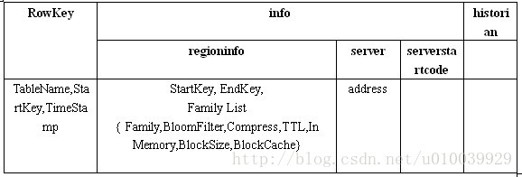
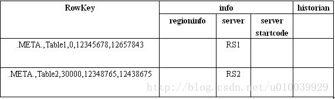

### region定位机制
 
#### 1、旧版本

region是HBase架构的关键，大部分的工作都围绕着region展开。在0.96.0版本之前，region的查询通过三层架构来定位：
-ROOT- ——> .META. ——> Region

1. Region：就是要查找的数据所在的Region

2. .META.：是一张元数据表，记录了用户表的Region信息以及RegionServer的服务器地址，.META.可以有多个regoin。.META.表中的一行记录就是一个Region，记录了该Region的起始行、结束行和该Region的连接信息。

3. -ROOT-：是一张存储.META.表的表，记录了.META.表的Region信息，-ROOT-只有一个region

4. Client访问用户数据之前需要首先访问zookeeper，然后访问-ROOT-表，接着访问.META.表，最后才能找到用户数据的位置去访问，中间需要多次网络操作，不过client端会做cache缓存。

#### 1.1 -ROOT-和.META.表结构




每条Row记录了一个Region的信息。

+ 首先是RowKey，RowKey由三部分组成：TableName, StartKey 和 TimeStamp。RowKey存储的内容我们又称之为Region的Name。用来存放Region的文件夹的名字是RegionName的Hash值，因为RegionName可能包含某些非法字符。现在你应该知道为什么RegionName会包含非法字符了吧，因为StartKey是被允许包含任何值的。将组成RowKey的三个部分用逗号连接就构成了整个RowKey，这里TimeStamp使用十进制的数字字符串来表示的。这里有一个RowKey的例子：**Table1,RK10000,12345678**  

+ 然后是表中最主要的Family：info，info里面包含三个Column：regioninfo, server, serverstartcode。其中regioninfo就是Region的详细信息，包括StartKey, EndKey 以及每个Family的信息等等。server存储的就是管理这个Region的RegionServer的地址。所以当Region被拆分、合并或者重新分配的时候，都需要来修改这张表的内容。


#### 1.2 RegionServer的整个寻找过程
我们构建了假想的-ROOT-表和.META.表。我们先来看.META.表，假设HBase中只有两张用户表：Table1和Table2，Table1非常大，被划分成了很多Region，因此在.META.表中有很多条Row用来记录这些Region。而Table2很小，只是被划分成了两个Region，因此在.META.中只有两条Row用来记录。这个表的内容看上去是这个样子的：


现在假设我们要从Table2里面查询一条RowKey是RK10000的数据。那么我们应该遵循以下步骤：

1. 从.META.表里面查询哪个Region包含这条数据。

2. 获取管理这个Region的RegionServer地址。

3. 连接这个RegionServer, 查到这条数据。


好，我们先来第一步。问题是.META.也是一张普通的表，我们需要先知道哪个RegionServer管理了.META.表，怎么办？有一个方法，我们把管理.META.表的RegionServer的地址放到ZooKeeper上面不就行了，这样大家都知道了谁在管理.META.。

貌似问题解决了，但对于这个例子我们遇到了一个新问题。因为Table1实在太大了，它的Region实在太多了，.META.为了存储这些Region信息，花费了大量的空间，自己也需要划分成多个Region。这就意味着可能有多个RegionServer在管理.META.。怎么办？在ZooKeeper里面存储所有管理.META.的RegionServer地址让Client自己去遍历？HBase并不是这么做的。

HBase的做法是用另外一个表来记录.META.的Region信息，就和.META.记录用户表的Region信息一模一样。这个表就是-ROOT-表。这也解释了为什么-ROOT-和.META.拥有相同的表结构，因为他们的原理是一模一样的。

假设.META.表被分成了两个Region，那么-ROOT-的内容看上去大概是这个样子的：


**-ROOT-行记录结构**：




这么一来Client端就需要先去访问-ROOT-表。所以需要知道管理-ROOT-表的RegionServer的地址。这个地址被存在ZooKeeper中。默认的路径是：/hbase/root-region-server  

等等，如果-ROOT-表太大了，要被分成多个Region怎么办？嘿嘿，HBase认为-ROOT-表不会大到那个程度，因此-ROOT-只会有一个Region，这个Region的信息也是被存在HBase内部的。

现在让我们从头来过，我们要查询Table2中RowKey是RK10000的数据。整个路由过程的主要代码在`org.apache.Hadoop.hbase.client.HConnectionManager.TableServers`中：

```java
private HRegionLocation locateRegion(final byte[] tableName,  
         final byte[] row, boolean useCache) throws IOException {  
    if (tableName == null || tableName.length == 0) {  
        throw new IllegalArgumentException("table name cannot be null or zero length");  
    }  
    if (Bytes.equals(tableName, ROOT_TABLE_NAME)) {  
       synchronized (rootRegionLock) {  
            // This block guards against two threads trying to find the root  
           // region at the same time. One will go do the find while the  
           // second waits. The second thread will not do find.  
            if (!useCache || rootRegionLocation == null) {  
               this.rootRegionLocation = locateRootRegion();  
            }  
             return this.rootRegionLocation;  
        }  
    } else if (Bytes.equals(tableName, META_TABLE_NAME)) {  
       return locateRegionInMeta(ROOT_TABLE_NAME, tableName, row, useCache, metaRegionLock);  
     } else {  
       // Region not in the cache – have to go to the meta RS  
      return locateRegionInMeta(META_TABLE_NAME, tableName, row, useCache, userRegionLock);  
    }  
}  
```
这是一个递归调用的过程：
```
获取Table2，RowKey为RK10000的RegionServer
 => 获取.META.，RowKey为Table2,RK10000的RegionServer
 => 获取-ROOT-，RowKey为.META.,Table2,RK10000,的RegionServer
 => 获取-ROOT-的RegionServer
 => 从ZooKeeper得到-ROOT-的RegionServer
 => 从-ROOT-表中查到RowKey最接近（小于） .META.,Table2,RK10000的一条Row，并得到.META.的RegionServer
 => 从.META.表中查到RowKey最接近（小于）Table2,RK10000的一条Row，并得到Table2的RegionServer
 => 从Table2中查到RK10000的Row  
```
到此为止Client完成了路由RegionServer的整个过程，最后要提醒大家注意两件事情：

+ 在整个路由过程中并没有涉及到MasterServer，也就是说HBase日常的数据操作并不需要MasterServer，不会造成MasterServer的负担。

+ Client端并不会每次数据操作都做这整个路由过程，很多数据都会被Cache起来。至于如何Cache，则不在本文的讨论范围之内。


-ROOT-表永远不会被分隔为多个region，保证了最多需要三次跳转，就能定位到任意的region。client会讲查询的位置信息保存缓存起来，缓存不会主动失效，因此如果client上的缓存全部失效，则需要进行6次网络来回，才能定位到正确的region，其中三次用来发现缓存失效，另外三次用来获取位置信息。


##### 1.3 定位查询步骤：

（1）用户通过查找zk（zookeeper）的/hbase/root-region-server节点来知道-ROOT-表在什么RegionServer上。

（2）访问-ROOT-表，查看需要的数据在哪个.META.表上，这个.META.表在什么RegionServer上。

（3）访问.META.表查看查询的行健在什么Region范围里面。

（4）连接具体的数据所在的RegionServer，这回就真的开始用Scan来遍历row了。

说明：

+ .META.表每行保存一个region的位置信息，row key 采用表名+表的最后一样编码而成。

+ 为了加快访问，.META.表的全部region都保存在内存中。

#### 2、新版定位

##### 2.1 旧版定位缺陷

假设，.META.表的一行在内存中大约占用1KB。并且每个region限制为128MB。那么上面的三层结构可以保存的region数目为：

(128MB/1KB) * (128MB/1KB) = = 2^32个region

实际上.META.表一直就只有一个，所以-ROOT-中的记录一直都只有一行，-ROOT-表形同虚设。而且，三层机构增加了代码的复杂度，容易产生BUG。

虽然客户端缓存了region的地址，但是初始化需求的时候需要重新查找region，例如：当缓存过期了，并发生了region的拆分、合并或者移动。客户端使用递归查找的方式从目录中重新定位当前region的位置，它从对应的meta表region中查找对应行键的地址。如果对应的meta的region地址无效，它就向root请求当前对应meta表的位置，最后，如果连root都没有用了，就会向zookeeper节点查询root表的新地址。

在最坏的情况下，客户端需要6次网络往返请求来定位一个用户region(其中三次用来发现缓存失效，另外三次用来获取位置信息)，这也是三层架构的一个弊端之一。少了一层root，网络请求次数会减少。


##### 2.2 新HBase版本的 Region定位

从0.96版本以后，三层架构被改为二层架构，-ROOT-表被去掉了，同时zk中的/hbase/root-region-server也被去掉了。直接把.META.表所在的RegionServer信息存储到了zk中的/hbase/meta-region-server去了。再后来引入了namespace，.META.表这样别扭的名字被修改成了hbase:meta。

二层架构的定位步骤如下：

（1）用户通过查找zk（zookeeper）的/hbase/meta-region-server节点查询哪台RegionServer上有hbase:meta表。

（2）客户端连接含有hbase:meta表的RegionServer。Hbase:meta表存储了所有Region的行健范围信息，通过这个表就可以查询出你要存取的rowkey属于哪个Region的范围里面，以及这个Region又是属于哪个RegionServer。

（3）获取这些信息后，客户端就可以直连其中一台拥有你要存取的rowkey的RegionServer，并直接对其操作。

（4）客户端会把meta信息缓存起来，下次操作就不需要进行以上加载HBase:meta的步骤了。


