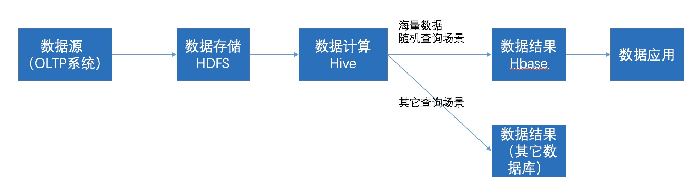

Hbase和Hive在大数据架构中处在不同位置，Hbase主要解决实时数据查询问题，Hive主要解决数据处理和计算问题，一般是配合使用。

#### 1、区别

##### 1. RDBMS

	让数据集保持在一台单一的机器上是RDBMS提供ACID特性和丰富查询模型的最好方式。但数据集变大时，垂直扩展（scaling up）带来诸多限制。企业慢慢发现，通过增加多节点的服务器进行横向扩展（scaling out）是一种更经济和更可行的方式。DBA们对RDBMS采用的横向扩展的方法主要有主从复制（Master-slave）、分片（Sharding）。
	
1. 横向扩展RDBMS – Master/Slave
	
+ 利用数据库的复制或镜像功能，同时在多台数据库上保存相同的数据，并且将读操作和写操作分开，写操作集中在一台主数据库上，读操作集中在多台从数据库上。复制过程的速度与系统中的从节点数量成反比。
	
+ 关键的读取可能不正确，因为写可能没有来得及被向下传播；
	
+ 大数据集可能会造成问题，因为主节点需要将数据复制到从节点；

2.  横向扩展RDBMS - Sharding

+ 通常来说，在满足ACID特性的数据库中进行扩展是非常难的。基于这个原因，对数据进行扩展，这个数据库本身就必须拥有简单的模型，将数据分割为N片，然后在单独的片中执行查询。数据分割的单元被称为“shard”。将N片数据分配个M个DBMS进行操作。DBMS并不会去管理数据片，这需由服务开发者自行完成。

+ 不同的分片方法有：  
    
垂直分区（Vertical Partitioning）：将不需要进行联合查询的数据表分散到不同的数据库服务器上。  

水平分区(sharding/分表) 将同一个表的记录拆分到不同的表甚至是服务器上，这往往需要一个稳定的算法来保证读取时能正确从不同的服务器上取得数据。比如，将ZIP codes小于50000的客户存储在CustomersEast，将ZIP codes大于或等于50000的客户存储在CustomersWest。CustomersEast和CustomersWest就成为两个分区表。方法有 Range-Based Partitioning, Key or Hash-Based partitioning等。

3. 优点与不足      

+ 对读取和写入都有很好的扩展  
 
+ 不透明，应用需要做到可识别分区 

+ 不再有跨分区的关系/joins       

+ 跨片参照完整性损失

4. 其他RDBMS扩展方法:
 
+ Multi-Master replication：所有成员都响应客户端数据查询。多主复制系统负责将任意成员做出的数据更新传播给组内其他成员，并解决不同成员间并发修改可能带来的冲突。
+ INSERT only, not UPDATES/DELETES：数据进行版本化处理。
+ No JOINs, thereby reducing query time：Join的开销很大,而且频繁访问会使开销随着时间逐渐增加。非规范化（Denormalization）可以降低数据仓库的复杂性，以提高效率和改善性能。
+ In-memory databases：磁盘数据库解决的是大容量存储和数据分析问题，内存数据库解决的是实时处理和高并发问题。主流常规的RDBMS更多的是磁盘密集型，而不是内存密集型。

##### 2.NoSQL

NoSQL现在被理解为 Not Only SQL 的缩写，是对非关系型的数据库管理系统的统称（正因为此，人们通常理解 NoSQL 是 anti-RDBMS）。

NoSQL 与 RDBMS 存在许多不同点，

- 最重要的是NoSQL不使用SQL作为查询语言。
- NoSQL 不需要固定的表模式(table schema)，也经常会避免使用SQL的JOIN操作，一般有可水平扩展的特征。
- NoSQL产品会放宽一个或多个 ACID 属性（CAP定理）

1. CAP 理论

CAP理论是数据系统设计的基本理论，目前几乎所有的数据系统的设计都遵循了这个理论。CAP理论指出，分布式系统只能满足以下三项中的两项而不可能满足全部三项，
+ 一致性（Consistency)（所有节点在同一时间具有相同的数据）
+ 可用性（Availability）（保证每个请求不管成功或者失败都有响应）
+ 分区容忍性（Partition tolerance）（系统中任意信息的丢失或失败不会影响系统的继续运作）

2. 一致性——两种类型  

strong consistency – ACID(Atomicity Consistency Isolation Durability)：对于关系型数据库，要求更新过的数据能被后续所有的访问都看到，这是强一致性。  

weak consistency – BASE(Basically Available Soft-state Eventual consistency )

- Basically Available - system seems to work all the time  (基本可用)
- Soft State - it doesn't have to be consistent all the time （不要求所有时间都一致）
- Eventually Consistent - becomes consistent at some later time （最终一致性）

对于分布式数据系统(scale out)，分区容忍性是基本要求，否则就失去了价值。因此只能在一致性和可用性上做取舍，如何处理这种取舍正是目前NoSQL数据库的核心焦点。几乎所有的情况都是牺牲一致性而换取高可用性。当然，牺牲一致性，只是不再要求关系数据库中的强一致性，而是只要系统能达到最终一致性即可。考虑到客户体验，这个最终一致的时间窗口，要尽可能的对用户透明，也就是需要保障“用户感知到的一致性”。通常是通过数据的多份异步复制来实现系统的高可用和数据的最终一致性的。

##### 3. HBase

Hbase： Hadoop database 的简称，也就是基于Hadoop数据库，是一种NoSQL数据库，主要适用于海量明细数据（十亿、百亿）的随机实时查询，如日志明细、交易清单、轨迹行为等。由于是key-value型数据库，可以再扩展到各种key-value应用场景，如日志信息的存储，对于内容信息不需要完全结构化出来的类CMS应用等。注意hbase针对的仍然是OLTP应用(传统数据库场景，实时应用)为主。

按照CAP理论，HBase属于C+P类型的系统。HBase是强一致性的（仅支持单行事务）。每一行由单个区域服务器（region server）host，行锁（row locks）和多版本并发控制(multiversion concurrency control)的组合被用来保证行的一致性。

##### 4. Hive	
	
	Hive：Hive是Hadoop数据仓库，严格来说，不是数据库，只是一个ql引擎处理解析sql语句。主要是让开发人员能够通过SQL来计算和处理HDFS上的结构化数据，适用于离线的批量数据计算。通过元数据来描述Hdfs上的结构化文本数据，通俗点来说，就是定义一张表来描述HDFS上的结构化文本，包括各列数据名称，数据类型是什么等，方便我们处理数据，当前很多SQL ON Hadoop的计算引擎均用的是hive的元数据，如Spark SQL、Impala等；基于第一点，通过SQL来处理和计算HDFS的数据，Hive会将SQL翻译为Mapreduce来处理数据；
	
	对于hive主要针对的是OLAP应用，注意其底层不是hbase，而是hdfs分布式文件系统，重点是基于一个统一的查询分析层，支撑OLAP应用中的各种关联，分组，聚合类SQL语句。hive一般只用于查询分析统计，而不能是常见的CUD(CURD : 增加(Create)、查询(Retrieve)、更新(Update)和删除(Delete))操作，要知道HIVE是需要从已有的数据库或日志进行同步最终入到hdfs文件系统中，当前要做到增量实时同步都相当困难。Hive的作用是把SQL翻译成MapReduce程序，从而减少分析人员每次都要写冗长Java程序的工作量。单次Hive查询都需要耗费分钟级以上的时间（哪怕一个再小的表），因此无法作为web后端的数据库使用。Hive可以用hdfs做存储，也可以用hbase做数据存储引擎。与hive对等的是类似kylin这样的。
	
#### 2、关系

在大数据架构中，Hive和HBase是协作关系，数据流一般如下图：

1. 通过ETL工具将数据源抽取到HDFS存储；
2. 通过Hive清洗、处理和计算原始数据；
3. HIve清洗处理后的结果，如果是面向海量数据随机查询场景的可存入Hbase
4. 数据应用从HBase查询数据；

#### 3、数据流程

1. 数据可以直接存放到hdfs。如果是日志文件可以用flume等工具传输，如果数据存在关系型数据库中可以选择使用sqoop导入hdfs

2. 数据在hdfs上就好办了，你可以写mr或者干脆用hive计算统计结果，最后的结果数据应该是很少的。
 
3. 将上面的结果数据倒回到MySQL（这里有很多方法可以选择），用来做在线查询

