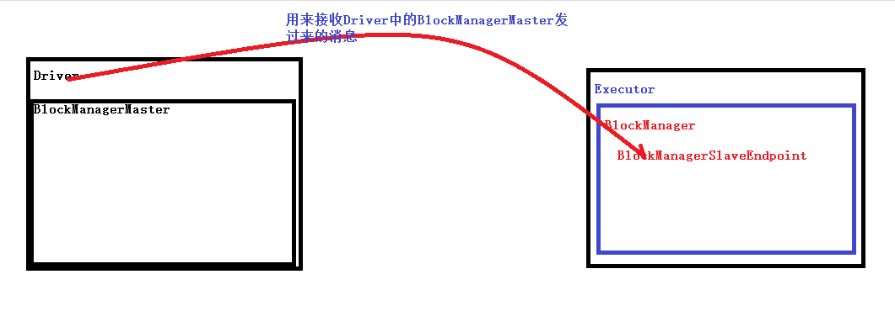
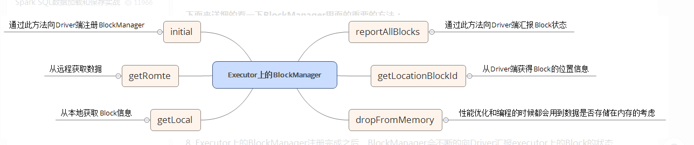
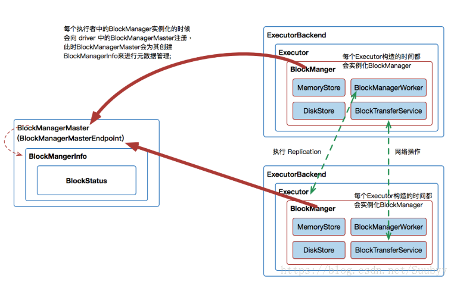

## Spark BlockManager
[](https://blog.csdn.net/jiaojiao521765146514/article/details/86065061?utm_medium=distribute.pc_relevant_t0.none-task-blog-BlogCommendFromBaidu-1.nonecase&depth_1-utm_source=distribute.pc_relevant_t0.none-task-blog-BlogCommendFromBaidu-1.nonecase)

###一、简介

BlockManager：spark底层负责数据管理的组件。

BlockManager运行在每个节点上（包括Driver和Executor），提供对本地或远端节点上的内存、磁盘及堆外内存中Block的管理。存储体系从狭义上来说指的就是BlockManager，从广义上来说，则包括整个Spark集群中的各个 BlockManager、BlockInfoManager、DiskBlockManager、DiskStore、MemoryManager、MemoryStore、对集群中的所有BlockManager进行管理的BlockManagerMaster及各个节点上对外提供Block上传与下载服务的BlockTransferService


每一个节点上都有BlockManager，而Driver有BlockManagerMaster（Driver有DAGScheduler，DAGScheduler有BlockManagerMaster，BlockManagerMaster内有BlockManagerInfo，BlockManagerInfo内有BlockStatus），BlockManagerMaster负责对各个节点上的BlockManager内部管理的数据进行维护，如Block的增删改操作，都会在这里维护元数据的变更。每个BlockManager创建完之后，会向BlockManagerMaster进行注册，此时BlockManagerMaster会为其创建对应的BlockManagerInfo。

 

BlockManagerMaster包含四个主要的组件：DiskStore、MemoryStore、BlockManagerWorker、ConnectionManager

1.DiskStore负责对磁盘中的数据进行读写;

2.MemoryStore负责对内存中的数据进行读写;

3.ConnectionManager负责建立远程BlockManager的连接;

4.BlockManagerWorker负责对远程其它节点的BlockManager进行读写。

可将DiskStore、MemoryStore看为本地的操作，而将ConnectionManager、BlockManagerWorker作为远程操作。

从BlockManager读取数据时，如果本地有数据，就使用DiskStore或MemoryStore从本地的磁盘或内存中读取所需的数据，如果本地没数据时，通过ConnectionManager连接其它BlockManager，使用BlockManagerWorker从远程的BlockManager中进行数据读取。

###Spark blockmanager架构

从Application启动的角度来观察BlockManager运行

1.在Application启动的时候，会在SparkEnv中注册BlockManagerMaster以及MapOutputTracker，其中

 a>BlockManagerMaster：对整个集群的Block数据进行管理

 b>MapOutputTrackerMaster：跟踪所有的Mapper的输出的

2.BlockManagerMasterEndpoint本身是一个消息体，会负责通过远程消息通信的方式去管理所有节点的BlockManager；

3.每启动一个ExecutorBankend都会实例化BlockManager并通过远程通信的方式注册给BlockManagerMaster。实质上是Executor中的BlockManager在启动的时候注册给了Driver上的BlockManagerMasterEndpoint。  一个worker上多个executor。

4.MemoryStore是BlockManager中专门负责内存数据存储和读写的类

5.DiskStore：是BlockManager中专门负责基于磁盘的数据存储和读写的类

6.DiskStoreManager：管理Logical Block与Disk上的Physical Block之间的映射关系并负责磁盘的文件的创建、读写等


从Job运行时的角度来观察BlockManager运行

1.首先通过MemoreStore来存储广播变量

2.在Driver中通过BlockManagerInfo来管理集群中的每个ExecutorBackend中的BlockManager中的元数据信息

3.当改变了具体的ExecutorBackend上的Block信息后就必须发消息给Driver中的BlockManager来更新相应的BlockManagerInfo

4.当执行第二个Stage的时候，第二个Stage会向Driver中的MapOutputTrackerMasterEndpoint发消息请求上一个Stage中的相应的输出，此时MapOutputTrackerMaster会把上一个Stage的输出数据的元数据信息发送给当前请求的Stage


###二、源码解读

BlockManager是对外提供的统一访问block的接口，在Master和Slave上都有一个实例，他提供读写数据的方法，并且根据不同StorageLevel调用不同的BlockStore来读写数据。

在应用程序启动的时候，SparkContext会创建Driver端的SpakEnv，在该SparkEnv中实例化BlockManager和BlockManagerMaster，在其内部创建消息通信的终端BlockManagerMasterEndpoint.

在Executor启动的时候，也会创建其SparkEnv，在该SparkEnv中实例化BlockManager和BlockTransferService. 在BlockManager初始化的过程一方面会加入BlockManagerSlaveEndpoint的消息终端，并把该BlockManagerSlaveEndpoint的该终端引用注册到Driver中，这样Driver和Executor就可以相互持有通信终端的引用。

BlockManager是Spark的分布式存储系统，与我们平常说的分布式存储系统是有区别的，区别就是这个分布式存储系统只会管理Block块数据，它运行在所有节点上。BlockManager的结构是Maser-Slave架构，Master就是Driver上的BlockManagerMaster，Slave就是每个Executor上的BlockManager。BlockManagerMaster负责接受Executor上的BlockManager的注册以及管理BlockManager的元数据信息。

###2.0 BlockManager初始化





1. BlockManager是分布式的，运行在各个节点上的。从BlockManager的创建过程来看，其实Block是运行在Driver和每个Executor的。因为在创建SparkContext的时候，会调用SparkEnv.blockManager.initialize方法实例化BlockManager对象，这个BlockManager就是Driver上的BlockManager，它负责管理集群中Executor上的BlockManager。在创建Executor对象的时候也会创建BlockManager。


SparkContext里创建BlockManager代码片段:

```scala
//为Driver创建BlockManager
_env.blockManager.initialize(_applicationId)
```
创建Executor的时候，Executor内部会调用_env.blockManager.initialize(conf.getAppId)方法创建BlockManager

```scala
if (!isLocal) {
    env.metricsSystem.registerSource(executorSource)
    env.blockManager.initialize(conf.getAppId)
  }
```

2. 在初始化BlockManager的时候，第一步会初始化BlockTransferService的init方法（子类NettyBlockTransferService实现了init方法），这个方法的作用就是初始化Netty服务，为拉取block数据提供服务。第二步是调用shuffleClient的init方法，shuffleClient这个引用有可能是BlockTransferService有可能是ExternalShuffleClient，取决于我们的配置文件是否配置了externalShuffleServiceEnabled未开启状态，其实无论是哪种，都是为了对外提供服务，能够使block数据再节点之间流动起来。


BlockManager在启动的时候都会向BlockManagerMaster注册。

>master.registerBlockManager(blockManagerId, maxMemory, slaveEndpoint)

并且创建BlockManagerSlaveEndpoint这个消息循环体来接受Driver中的BlockManagerMaster发过来的指令，例如删除Block等；

```scala
private val slaveEndpoint = rpcEnv.setupEndpoint(
  "BlockManagerEndpoint" + BlockManager.ID_GENERATOR.next,
  new BlockManagerSlaveEndpoint(rpcEnv, this, mapOutputTracker))
  
/**
 * An RpcEndpoint to take commands from the master to execute options. For example,
 * this is used to remove blocks from the slave's BlockManager.
 */
```
下面就具体看一下BlockManagerSlaveEndpoint，从注释里面可以看到， BlockManagerSlaveEndpoint接收BlockManagerMaster发过来的信息。


3. BlockManager调用registerBlockManager方法，向BlockManagerMaster（其实BlockManagerMasterEndpoint）发送BlockManager的注册请求。

```scala
def registerBlockManager(blockManagerId: BlockManagerId,maxMemSize: Long,slaveEndpoint: RpcEndpointRef): BlockManagerId = {
    logInfo(s"Registering BlockManager $blockManagerId")
    //向Driver发送注册BlockManager请求
    //blockManagerId：块存储的唯一标识，里边封装了该BlockManager所在的executorId，提供Netty服务的主机名和端口
    //maxMemSize最大的内存
    val updatedId = driverEndpoint.askWithRetry[BlockManagerId](
      RegisterBlockManager(blockManagerId, maxMemSize, slaveEndpoint))
    logInfo(s"Registered BlockManager $updatedId")
    updatedId
  }
```

4. BlockManagerMaster（其实BlockManagerMasterEndpoint）接受到BlockManager的注册请求后。会调用register方法，开始注册Executor上的BlockManager，注册完成以后将BlockManagerId返回给对应Executor上的BlockManager

BlockManagerMasterEndpoint类里的receiveAndReply方法，这个方法就是接受请求的消息，然后并处理请求
```scala
def receiveAndReply(context: RpcCallContext): PartialFunction[Any, Unit] = {
    //BlocManagerMasterEndPoint接收到来自Executor上的BlockManager注册请求的时候，
    //调用register方法开始注册BlockManager，
    case RegisterBlockManager(blockManagerId, maxMemSize, slaveEndpoint) =>
      context.reply(register(blockManagerId, maxMemSize, slaveEndpoint))
    //....其余代码省略
  }
```

ManagerMasterEndpoint类里的register方法，该方法的作用就是开始注册executor上的BlockManager

```scala
参数blockManagerInfo，blockManagerMaster会为每一个executor创建一个blockManagerInfo，blockManagerInfo是Driver端为了管理ExecutorBackend中的BlockManager上面的所有元数据而设立的。 

负责维护各个executor和BlockManager的元数据 BlockManagerInfo、BlockStatus

private[spark]
class BlockManagerMasterEndpoint(
    override val rpcEnv: RpcEnv,
    val isLocal: Boolean,
    conf: SparkConf,
    listenerBus: LiveListenerBus)
  extends ThreadSafeRpcEndpoint with Logging {
  
  // Mapping from block manager id to the block manager's information.
  // BlockManagerId->BlockManagerInfo的映射
  private val blockManagerInfo = new mutable.HashMap[BlockManagerId, BlockManagerInfo]

  // Mapping from executor ID to block manager ID.
  //executorId->BlockManagerId的映射
  private val blockManagerIdByExecutor = new mutable.HashMap[String, BlockManagerId]

......

  /**
   * Returns the BlockManagerId with topology information populated, if available.
   * 
   * 开始注册executor上的BlockManager
   * 
   */
  private def register(
      idWithoutTopologyInfo: BlockManagerId,
      maxOnHeapMemSize: Long,
      maxOffHeapMemSize: Long,
      slaveEndpoint: RpcEndpointRef): BlockManagerId = {
    // the dummy id is not expected to contain the topology information.
    // we get that info here and respond back with a more fleshed out block manager id
    //利用从Executor上传过来的BlockManagerId信息重新封装BlockManagerId，并且
    //之前传过来没有拓扑信息，这次直接将拓扑信息也封装进去，得到一个更完整的BlockManagerId
    val id = BlockManagerId(
      idWithoutTopologyInfo.executorId,
      idWithoutTopologyInfo.host,
      idWithoutTopologyInfo.port,
      topologyMapper.getTopologyForHost(idWithoutTopologyInfo.host))

    val time = System.currentTimeMillis()
    //判断当前这个BlockManagerId是否注册过，注册结构为：HashMap[BlockManagerId, BlockManagerInfo]
    //如果没注册过就向下执行开始注册
    if (!blockManagerInfo.contains(id)) {
      /**
       * 首先会根据executorId查找内存缓存结构中是否有对应的BlockManagerId,如果为存在那么就将调用removeExecutor方法,将executor从BlockManagerMaster中移除
       * 首先会移除executorId对应的BlockManagerId,然后在移除该旧的BlockManager。
       * 其实就是移除以前的注册过的旧数据
       */
      blockManagerIdByExecutor.get(id.executorId) match {
        case Some(oldId) =>
          // A block manager of the same executor already exists, so remove it (assumed dead)
          logError("Got two different block manager registrations on same executor - "
              + s" will replace old one $oldId with new one $id")
          removeExecutor(id.executorId)
        case None =>
      }
      logInfo("Registering block manager %s with %s RAM, %s".format(
        id.hostPort, Utils.bytesToString(maxOnHeapMemSize + maxOffHeapMemSize), id))

      //将executorId与BlockManagerId映射起来，放到内存缓存中
      blockManagerIdByExecutor(id.executorId) = id

      //将BlockManagerId与BlockManagerInfo映射起来，放入内存缓存中
     //BlockManagerInfo封住了BlockMangerId，当前注册的事件，最大的内存
      blockManagerInfo(id) = new BlockManagerInfo(
        id, System.currentTimeMillis(), maxOnHeapMemSize, maxOffHeapMemSize, slaveEndpoint)
    }
    listenerBus.post(SparkListenerBlockManagerAdded(time, id, maxOnHeapMemSize + maxOffHeapMemSize,
        Some(maxOnHeapMemSize), Some(maxOffHeapMemSize)))
    id
  }

..... 
 
}

new mutable.HashMap[BlockManagerId, BlockManagerInfo]的BlockManagerInfo相当于是BlockManager的元数据

/**
 * 每个BlockManager的BlockManagerInfo,相当于是BlockManager的元数据
 */
private[spark] class BlockManagerInfo(
    val blockManagerId: BlockManagerId,
    timeMs: Long,
    val maxOnHeapMem: Long,
    val maxOffHeapMem: Long,
    val slaveEndpoint: RpcEndpointRef)
  extends Logging {

  val maxMem = maxOnHeapMem + maxOffHeapMem

  private var _lastSeenMs: Long = timeMs
  private var _remainingMem: Long = maxMem

  // Mapping from block id to its status.
  //BlockManagerInfo 管理了每个BlockManager内部的BlockId->BlockStatus映射
  private val _blocks = new JHashMap[BlockId, BlockStatus]

......

}
```

5. BlockManagerMasterEndpoint类里的removeExecutor方法，该方法的作用就是移除掉之前注册过的旧数据

```scala
  private def removeExecutor(execId: String) {
    logInfo("Trying to remove executor " + execId + " from BlockManagerMaster.")
    //根据当前的executorId获取对应的BlockManager，这个BlockManager已经是旧数据了
    //然后调用removeBlockManager方法继续移除其他的旧数据
    blockManagerIdByExecutor.get(execId).foreach(removeBlockManager)
  }
```

6. BlockManagerMasterEndpoint类里的removeBlockManager方法，该方法的作用就是开始移除之前注册过的并且冲突的旧数据

```scala
  private def removeBlockManager(blockManagerId: BlockManagerId) {
    //根据就得BlockManagerId找到对应的BlockManagerInfo
    val info = blockManagerInfo(blockManagerId)

    // Remove the block manager from blockManagerIdByExecutor.
   //将旧的BlockManager里的executorId对应的BlockManagerId移除掉 
    blockManagerIdByExecutor -= blockManagerId.executorId

    // Remove it from blockManagerInfo and remove all the blocks.
    // 然后移除掉BlockManagerId对应的BlockManagerInfo
    blockManagerInfo.remove(blockManagerId)

    val iterator = info.blocks.keySet.iterator
    //遍历BlockManagerInfo内部所有的block块的BlockId
    while (iterator.hasNext) {
      //清空BlockManagerInfo内部的block的BlockStatus信息
      val blockId = iterator.next
      val locations = blockLocations.get(blockId)
      locations -= blockManagerId
      // De-register the block if none of the block managers have it. Otherwise, if pro-active
      // replication is enabled, and a block is either an RDD or a test block (the latter is used
      // for unit testing), we send a message to a randomly chosen executor location to replicate
      // the given block. Note that we ignore other block types (such as broadcast/shuffle blocks
      // etc.) as replication doesn't make much sense in that context.
      if (locations.size == 0) {
        blockLocations.remove(blockId)
        logWarning(s"No more replicas available for $blockId !")
      } else if (proactivelyReplicate && (blockId.isRDD || blockId.isInstanceOf[TestBlockId])) {
        // As a heursitic, assume single executor failure to find out the number of replicas that
        // existed before failure
        val maxReplicas = locations.size + 1
        val i = (new Random(blockId.hashCode)).nextInt(locations.size)
        val blockLocations = locations.toSeq
        val candidateBMId = blockLocations(i)
        blockManagerInfo.get(candidateBMId).foreach { bm =>
          val remainingLocations = locations.toSeq.filter(bm => bm != candidateBMId)
          val replicateMsg = ReplicateBlock(blockId, remainingLocations, maxReplicas)
          bm.slaveEndpoint.ask[Boolean](replicateMsg)
        }
      }
    }

    listenerBus.post(SparkListenerBlockManagerRemoved(System.currentTimeMillis(), blockManagerId))
    logInfo(s"Removing block manager $blockManagerId")

  }
```

7. 更新BlockInfo

```scala
  /**
   * 更新BlockInfo，每个BlockManager上如果block发生了变化
   * 那么都要发送updateBlockInfo请求,进行BlockInfo更新
   */
  private def updateBlockInfo(
      blockManagerId: BlockManagerId,
      blockId: BlockId,
      storageLevel: StorageLevel,
      memSize: Long,
      diskSize: Long): Boolean = {

    // 如果该blockManagerId还没有注册，则返回
    if (!blockManagerInfo.contains(blockManagerId)) {
      if (blockManagerId.isDriver && !isLocal) {
        // 如果blockManagerId是driver上的BlockManager而且又不在本地，意思就是这个BlockManager是其他节点的
        // We intentionally do not register the master (except in local mode),
        // so we should not indicate failure.
        return true
      } else {
        return false
      }
    }
    // 如果没有block，也不用更新block，所以返回
    if (blockId == null) {
      blockManagerInfo(blockManagerId).updateLastSeenMs()
      return true
    }
    // 调用BlockManagerInfo的updateBlockInfo方法，更新block
    blockManagerInfo(blockManagerId).updateBlockInfo(blockId, storageLevel, memSize, diskSize)

    /**
     * 每一个block可能会在多个BlockManager上
     * 根据block的存储级别StoreLevel，设置为_2的，就需要将block 备份到其他BlockManager上
     * blockLocations map 保存了每个blockId的对应的BlockManagerId集合
     * 因为使用的是set存储BlockManagerId，所以自动去重
     */
    var locations: mutable.HashSet[BlockManagerId] = null
    if (blockLocations.containsKey(blockId)) {
      locations = blockLocations.get(blockId)
    } else {
      locations = new mutable.HashSet[BlockManagerId]
      blockLocations.put(blockId, locations)
    }

     // 存储级别有效，则向block对应的BlockManger集合里添加该blockManagerId
    if (storageLevel.isValid) {
      locations.add(blockManagerId)
    } else {
      // 如果无效，则移除之
      locations.remove(blockManagerId)
    }

    // Remove the block from master tracking if it has been removed on all slaves.
    // 如果block对应的BlockManger集合为空，则没有BlockManager与之对应，则从blockLocations删除这个blockId
    if (locations.size == 0) {
      blockLocations.remove(blockId)
    }
    true
  }
```
8. 调用BlockManagerInfo的updateBlockInfo方法，更新block
```scala
  def updateBlockInfo(
      blockId: BlockId,
      storageLevel: StorageLevel,
      memSize: Long,
      diskSize: Long) {

    updateLastSeenMs()
    
    val blockExists = _blocks.containsKey(blockId)
    var originalMemSize: Long = 0
    var originalDiskSize: Long = 0
    var originalLevel: StorageLevel = StorageLevel.NONE
     //判断内部是否有block
    if (blockExists) {
      // The block exists on the slave already.
      val blockStatus: BlockStatus = _blocks.get(blockId)
      originalLevel = blockStatus.storageLevel
      originalMemSize = blockStatus.memSize
      originalDiskSize = blockStatus.diskSize
      // 判断storeLevel是否使用内存，是 就给剩余内存数量加上当前内存数量
      if (originalLevel.useMemory) {
        _remainingMem += originalMemSize
      }
    }
     // 给block创建一个BlockStatus，然后根据持久化级别，对相应的内存资源进行计算
    if (storageLevel.isValid) {
      /* isValid means it is either stored in-memory or on-disk.
       * The memSize here indicates the data size in or dropped from memory,
       * externalBlockStoreSize here indicates the data size in or dropped from externalBlockStore,
       * and the diskSize here indicates the data size in or dropped to disk.
       * They can be both larger than 0, when a block is dropped from memory to disk.
       * Therefore, a safe way to set BlockStatus is to set its info in accurate modes. */
      var blockStatus: BlockStatus = null
      if (storageLevel.useMemory) {
        blockStatus = BlockStatus(storageLevel, memSize = memSize, diskSize = 0)
        _blocks.put(blockId, blockStatus)
        _remainingMem -= memSize
        if (blockExists) {
          logInfo(s"Updated $blockId in memory on ${blockManagerId.hostPort}" +
            s" (current size: ${Utils.bytesToString(memSize)}," +
            s" original size: ${Utils.bytesToString(originalMemSize)}," +
            s" free: ${Utils.bytesToString(_remainingMem)})")
        } else {
          logInfo(s"Added $blockId in memory on ${blockManagerId.hostPort}" +
            s" (size: ${Utils.bytesToString(memSize)}," +
            s" free: ${Utils.bytesToString(_remainingMem)})")
        }
      }
      if (storageLevel.useDisk) {
        blockStatus = BlockStatus(storageLevel, memSize = 0, diskSize = diskSize)
        _blocks.put(blockId, blockStatus)
        if (blockExists) {
          logInfo(s"Updated $blockId on disk on ${blockManagerId.hostPort}" +
            s" (current size: ${Utils.bytesToString(diskSize)}," +
            s" original size: ${Utils.bytesToString(originalDiskSize)})")
        } else {
          logInfo(s"Added $blockId on disk on ${blockManagerId.hostPort}" +
            s" (size: ${Utils.bytesToString(diskSize)})")
        }
      }
      if (!blockId.isBroadcast && blockStatus.isCached) {
        _cachedBlocks += blockId
      }
    //如果storageLevel是非法的，而且之前保存过blockId，那么就将blockId从内存中删除
    } else if (blockExists) {
      // If isValid is not true, drop the block.
      _blocks.remove(blockId)
      _cachedBlocks -= blockId
      if (originalLevel.useMemory) {
        logInfo(s"Removed $blockId on ${blockManagerId.hostPort} in memory" +
          s" (size: ${Utils.bytesToString(originalMemSize)}," +
          s" free: ${Utils.bytesToString(_remainingMem)})")
      }
      if (originalLevel.useDisk) {
        logInfo(s"Removed $blockId on ${blockManagerId.hostPort} on disk" +
          s" (size: ${Utils.bytesToString(originalDiskSize)})")
      }
    }
  }
```




####2.1、 BlockManager的初始化

每个Driver或Executor在创建自身的SparkEnv时都会创建BlockManager，BlockManager只有在其initialize方法被调用后才能发挥作用

```scala
//org.apache.spark.storage.BlockManager
def initialize(appId: String): Unit = {
  blockTransferService.init(this)
  shuffleClient.init(appId)
  blockManagerId = BlockManagerId(
    executorId, blockTransferService.hostName, blockTransferService.port)
  shuffleServerId = if (externalShuffleServiceEnabled) {
    logInfo(s"external shuffle service port = $externalShuffleServicePort")
    BlockManagerId(executorId, blockTransferService.hostName, externalShuffleServicePort)
  } else {
    blockManagerId
  }
  master.registerBlockManager(blockManagerId, maxMemory, slaveEndpoint)
  // Register Executors' configuration with the local shuffle service, if one should exist.
  if (externalShuffleServiceEnabled && !blockManagerId.isDriver) {
    registerWithExternalShuffleServer()
  }
}


BlockManager类里的initialize方法，该方法作用是创建BlockManager，并且向BlockManagerMaster进行注册

def initialize(appId: String): Unit = {
    //初始化BlockTransferService，其实是它的子类NettyBlockTransferService是下了init方法，
    //该方法的作用就是初始化传输服务，通过传输服务可以从不同的节点上拉取Block数据
    blockTransferService.init(this)
    shuffleClient.init(appId)
 
    //设置block的复制分片策略，由spark.storage.replication.policy指定
    blockReplicationPolicy = {
      val priorityClass = conf.get(
        "spark.storage.replication.policy", classOf[RandomBlockReplicationPolicy].getName)
      val clazz = Utils.classForName(priorityClass)
      val ret = clazz.newInstance.asInstanceOf[BlockReplicationPolicy]
      logInfo(s"Using $priorityClass for block replication policy")
      ret
    }
    //根据给定参数为对对应的Executor封装一个BlockManagerId对象（块存储的唯一标识）
    //executorID：executor的Id，blockTransferService.hostName：传输Block数据的服务的主机名
    //blockTransferService.port：传输Block数据的服务的主机名
    val id = BlockManagerId(executorId, blockTransferService.hostName, blockTransferService.port, None)
 
    //调用BlockManagerMaster的registerBlockManager方法向Driver上的BlockManagerMaster注册
    val idFromMaster = master.registerBlockManager(
      id,
      maxMemory,
      slaveEndpoint)
    //更新BlockManagerId
    blockManagerId = if (idFromMaster != null) idFromMaster else id
 
    //判断是否开了外部shuffle服务
    shuffleServerId = if (externalShuffleServiceEnabled) {
      logInfo(s"external shuffle service port = $externalShuffleServicePort")
      BlockManagerId(executorId, blockTransferService.hostName, externalShuffleServicePort)
    } else {
      blockManagerId
    }
    // 如果开启了外部shuffle服务，并且该节点是Driver的话就调用registerWithExternalShuffleServer方法
    //将BlockManager注册在本地
    if (externalShuffleServiceEnabled && !blockManagerId.isDriver) {
      registerWithExternalShuffleServer()
    }
    logInfo(s"Initialized BlockManager: $blockManagerId")
  }

```
1）初始化BlockTransferService

2）初始化Shuffle客户端

3）生成当前BlockManager的BlockManagerId。BlockManager在本地创建的BlockManagerId实际只是在向BlockManagerMaster注册时，给BlockMangaerMaster提供参考，BlockManagerMaster将会创建一个包含了拓扑信息的新BlockManagerId作为正式分配给BlockManager的身份标识

4）生成shuffleServerId。当启用了外部Shuffle服务时将新建一个BlockManagerId作为shuffleServerId，否则是BlockManager自身的BlockManagerId

5）当启用了外部Shuffle服务，并且当前BlockManager所在节点不是Driver时，需要注册外部的Shuffle服务


####2.2、 BlockManager提供的方法

2.1 reregister

用于向BlockManagerMaster重新注册BlockManager，并向BlockManagerMaster报告所有的Block信息

```scala
//org.apache.spark.storage.BlockManager
def reregister(): Unit = {
  logInfo(s"BlockManager $blockManagerId re-registering with master")
  master.registerBlockManager(blockManagerId, maxMemory, slaveEndpoint)
  reportAllBlocks()
}
```

1）调用BlockManagerMaster的registerBlockManager方法向BlockManagerMaster注册BlockManager

2）调用reportAllBlocks方法报告所有的Block信息, Executor上的BlockManager注册完成之后，BlockManager会不断的向Driver汇报executor上的Block的状态。

```scala
//org.apache.spark.storage.BlockManager
private def reportAllBlocks(): Unit = {
  logInfo(s"Reporting ${blockInfoManager.size} blocks to the master.")
  for ((blockId, info) <- blockInfoManager.entries) {
    val status = getCurrentBlockStatus(blockId, info)
    if (info.tellMaster && !tryToReportBlockStatus(blockId, status)) {
      logError(s"Failed to report $blockId to master; giving up.")
      return
    }
  }
}
```
1）调用getCurrentBlockStatus方法，获取Block的状态信息BlockStatus

2）如果需要将Block的BlockStatus汇报给BlockManagerMaster，则调用tryToReportBlockStatus方法，向BlockManagerMaster汇报Block的状态信息

```scala
//org.apache.spark.storage.BlockManager
private def getCurrentBlockStatus(blockId: BlockId, info: BlockInfo): BlockStatus = {
  info.synchronized {
    info.level match {
      case null =>
        BlockStatus.empty
      case level =>
        val inMem = level.useMemory && memoryStore.contains(blockId)
        val onDisk = level.useDisk && diskStore.contains(blockId)
        val deserialized = if (inMem) level.deserialized else false
        val replication = if (inMem  || onDisk) level.replication else 1
        val storageLevel = StorageLevel(
          useDisk = onDisk,
          useMemory = inMem,
          useOffHeap = level.useOffHeap,
          deserialized = deserialized,
          replication = replication)
        val memSize = if (inMem) memoryStore.getSize(blockId) else 0L
        val diskSize = if (onDisk) diskStore.getSize(blockId) else 0L
        BlockStatus(storageLevel, memSize, diskSize)
    }
  }
}
 
private def tryToReportBlockStatus(
    blockId: BlockId,
    status: BlockStatus,
    droppedMemorySize: Long = 0L): Boolean = {
  val storageLevel = status.storageLevel
  val inMemSize = Math.max(status.memSize, droppedMemorySize)
  val onDiskSize = status.diskSize
  master.updateBlockInfo(blockManagerId, blockId, storageLevel, inMemSize, onDiskSize)
}
```
根据上述代码可知，向BlockManagerMaster汇报Block的状态信息是通过调用BlockManagerMaster的updateBlockInfo方法完成的。BlockManagerMaster的updateBlockInfo方法将向BlockManagerMasterEndpoint发送UpdateBlockInfo消息。

2.2 getLocalBytes

用于存储体系获取BlockId所对应Block的数据，并封装为ChunkedByteBuffer后返回。
```scala
def getLocalBytes(blockId: BlockId): Option[ChunkedByteBuffer] = {
  logDebug(s"Getting local block $blockId as bytes")
  if (blockId.isShuffle) {
    val shuffleBlockResolver = shuffleManager.shuffleBlockResolver
    Option(
      new ChunkedByteBuffer(
        shuffleBlockResolver.getBlockData(blockId.asInstanceOf[ShuffleBlockId]).nioByteBuffer()))
  } else {
    blockInfoManager.lockForReading(blockId).map { info => doGetLocalBytes(blockId, info) }
  }
}
```

1）如果当前Block是ShuffleBlock，那么调用ShuffleManager的ShuffleBlockResolver组件的getBlockData方法获取Block数据，并封装为ChunkedByteBuffer返回

2）如果当前Block不是ShuffleBlock，那么首先获取Block的读锁，然后调用doGetLocalBytes方法获取Block数据

```scala
//org.apache.spark.storage.BlockManager
private def doGetLocalBytes(blockId: BlockId, info: BlockInfo): ChunkedByteBuffer = {
  val level = info.level  //获取Block的存储级别
  logDebug(s"Level for block $blockId is $level")
  if (level.deserialized) {//BLock没有被序列化，按照DiskStore、MemoryStore的顺序获取Block数据
    if (level.useDisk && diskStore.contains(blockId)) {
      diskStore.getBytes(blockId)
    } else if (level.useMemory && memoryStore.contains(blockId)) {
      serializerManager.dataSerializeWithExplicitClassTag(
        blockId, memoryStore.getValues(blockId).get, info.classTag)
    } else {
      handleLocalReadFailure(blockId)
    }
  } else {  // Block被序列化了，那么按照MemoryStore、DiskStore的顺序获取Block数据
    if (level.useMemory && memoryStore.contains(blockId)) {
      memoryStore.getBytes(blockId).get
    } else if (level.useDisk && diskStore.contains(blockId)) {
      val diskBytes = diskStore.getBytes(blockId)
      maybeCacheDiskBytesInMemory(info, blockId, level, diskBytes).getOrElse(diskBytes)
    } else {
      handleLocalReadFailure(blockId)
    }
  }
}
```
doGetLocalBytes的执行步骤如下：

1）获取Block的存储级别

2）如果Block的存储级别说明Block没有被序列化，那么按照DiskStore、MemoryStore的顺序，获取Block数据

3）如果Block存储级别说明Block被序列化，那么按照MemoryStore、DiskStore的顺序，获取Block数据

2.3 getBlockData

此方法用于获取本地Block的数据。

```scala
//org.apache.spark.storage.BlockManager
override def getBlockData(blockId: BlockId): ManagedBuffer = {
  if (blockId.isShuffle) {
    shuffleManager.shuffleBlockResolver.getBlockData(blockId.asInstanceOf[ShuffleBlockId])
  } else {
    getLocalBytes(blockId) match {
      case Some(buffer) => new BlockManagerManagedBuffer(blockInfoManager, blockId, buffer)
      case None =>
        reportBlockStatus(blockId, BlockStatus.empty)
        throw new BlockNotFoundException(blockId.toString)
    }
  }
}
```
1）如果当前Block是ShuffleBlock，那么调用ShuffleManager的ShuffleBlockResolver组件的getBlockData方法获取Block数据

2）如果当前Block不是ShuffleBlock，那么调用getLocalBytes获取Block数据。如果调用getLocalBytes能够获取到Block数据，则封装为BlockManagerManagedBuffer，否则调用reportBlockStatus方法通知BlockManagerMaster，此Block不存在

```scala
//org.apache.spark.storage.BlockManager
private def reportBlockStatus(
    blockId: BlockId,
    status: BlockStatus,
    droppedMemorySize: Long = 0L): Unit = {
  val needReregister = !tryToReportBlockStatus(blockId, status, droppedMemorySize)
  if (needReregister) {
    logInfo(s"Got told to re-register updating block $blockId")
    asyncReregister()
  }
  logDebug(s"Told master about block $blockId")
}
```
reportBlockStatus的执行步骤如下：

1）调用tryToReportBlockStatus方法向BlockManagerMaster汇报BlockStatus

2）如果返回的needReregister为true，则说明需要重新向BlockManagerMaster注册当前BlockManager，因而调用asyncReregister方法向BlockManagerMaster异步注册BlockManager

asyncReregister方法实际另起线程调用 reregister，来实现异步注册BlockManager。

```scala
private def asyncReregister(): Unit = {
  asyncReregisterLock.synchronized {
    if (asyncReregisterTask == null) {
      asyncReregisterTask = Future[Unit] {
        // This is a blocking action and should run in futureExecutionContext which is a cached
        // thread pool
        reregister()
        asyncReregisterLock.synchronized {
          asyncReregisterTask = null
        }
      }(futureExecutionContext)
    }
  }
}
```
2.4 putBytes

要介绍putBytes，需要首先介绍doPut。doPut用于执行Block的写入

```scala
private def doPut[T](
    blockId: BlockId,
    level: StorageLevel,
    classTag: ClassTag[_],
    tellMaster: Boolean,
    keepReadLock: Boolean)(putBody: BlockInfo => Option[T]): Option[T] = {
  require(blockId != null, "BlockId is null")
  require(level != null && level.isValid, "StorageLevel is null or invalid")
  val putBlockInfo = {
    val newInfo = new BlockInfo(level, classTag, tellMaster)
    if (blockInfoManager.lockNewBlockForWriting(blockId, newInfo)) {//获取Block的写锁
      newInfo
    } else {
      logWarning(s"Block $blockId already exists on this machine; not re-adding it")
      if (!keepReadLock) {
        releaseLock(blockId)
      }
      return None
    }
  }
  val startTimeMs = System.currentTimeMillis
  var exceptionWasThrown: Boolean = true
  val result: Option[T] = try {
    val res = putBody(putBlockInfo) //执行Block写入
    exceptionWasThrown = false
    if (res.isEmpty) { //Block成功存储，执行锁降级或释放锁
      if (keepReadLock) { 
        blockInfoManager.downgradeLock(blockId)
      } else {
        blockInfoManager.unlock(blockId)
      }
    } else { //Block存储失败，移除此BLock
      removeBlockInternal(blockId, tellMaster = false)
      logWarning(s"Putting block $blockId failed")
    }
    res
  } finally {
    if (exceptionWasThrown) {
      logWarning(s"Putting block $blockId failed due to an exception")
      removeBlockInternal(blockId, tellMaster = tellMaster)
      addUpdatedBlockStatusToTaskMetrics(blockId, BlockStatus.empty)
    }
  }
  if (level.replication > 1) {
    logDebug("Putting block %s with replication took %s"
      .format(blockId, Utils.getUsedTimeMs(startTimeMs)))
  } else {
    logDebug("Putting block %s without replication took %s"
      .format(blockId, Utils.getUsedTimeMs(startTimeMs)))
  }
  result
}
```
上述代码中，doPut有一个函数参数putBody，putBody将执行真正的Block数据写入。doPut的执行步骤如下：

1）获取Block的写锁。如果Block已经存在且不需要持有读锁，则需要当前线程释放持有的读锁

2）调用putBody，执行写入

3）如果写入成功，则在需要保持读锁的情况下将写锁降级为读锁，在不需要保持读锁的情况，释放所有锁

4）如果写入失败，则调用removeBlockInternal方法移除此Block

5）如果写入时发生异常，也需要调用removeBlockInternal方法移除除此Block。此外，还需要调用addUptedBlockStatusToTaskMetrics方法更新任务度量信息

在doPut方法调用了removeBlockInternal方法来移除Block
```scala
private def removeBlockInternal(blockId: BlockId, tellMaster: Boolean): Unit = {
  val removedFromMemory = memoryStore.remove(blockId)
  val removedFromDisk = diskStore.remove(blockId)
  if (!removedFromMemory && !removedFromDisk) {
    logWarning(s"Block $blockId could not be removed as it was not found on disk or in memory")
  }
  blockInfoManager.removeBlock(blockId)
  if (tellMaster) {
    reportBlockStatus(blockId, BlockStatus.empty)
  }
}
```
1）从MemoryStore中移除Block

2）从DiskStore中移除Block

3）从BlockInfoManager中移除Block对应的BlockInfo

4）如果需要向BlockManagerMaster汇报Block状态，则调用reportBlockStatus方法

了解了doPut，现在来看看putBytes的实现。

```scala
def putBytes[T: ClassTag](
    blockId: BlockId,
    bytes: ChunkedByteBuffer,
    level: StorageLevel,
    tellMaster: Boolean = true): Boolean = {
  require(bytes != null, "Bytes is null")
  doPutBytes(blockId, bytes, level, implicitly[ClassTag[T]], tellMaster)
}
```
根据上述代码可知， putBytes实际调用的是doPutBytes方法

```scala
private def doPutBytes[T](
    blockId: BlockId,
    bytes: ChunkedByteBuffer,
    level: StorageLevel,
    classTag: ClassTag[T],
    tellMaster: Boolean = true,
    keepReadLock: Boolean = false): Boolean = {
  doPut(blockId, level, classTag, tellMaster = tellMaster, keepReadLock = keepReadLock) { info =>
    val startTimeMs = System.currentTimeMillis
    val replicationFuture = if (level.replication > 1) {
      Future {//创建异步线程，通过调用replicate方法复制Block数据到其它节点的存储体系中
        replicate(blockId, bytes, level, classTag)
      }(futureExecutionContext)
    } else {
      null
    }
    val size = bytes.size
    if (level.useMemory) { //优先写入内存
      val putSucceeded = if (level.deserialized) {
        val values =
          serializerManager.dataDeserializeStream(blockId, bytes.toInputStream())(classTag)
        memoryStore.putIteratorAsValues(blockId, values, classTag) match {
          case Right(_) => true
          case Left(iter) =>
            iter.close()
            false
        }
      } else {
        memoryStore.putBytes(blockId, size, level.memoryMode, () => bytes)
      }
      if (!putSucceeded && level.useDisk) { //内存不足，写入磁盘
        logWarning(s"Persisting block $blockId to disk instead.")
        diskStore.putBytes(blockId, bytes)
      }
    } else if (level.useDisk) { //不能使用内存时，写入磁盘
      diskStore.putBytes(blockId, bytes)
    }
    val putBlockStatus = getCurrentBlockStatus(blockId, info)
    val blockWasSuccessfullyStored = putBlockStatus.storageLevel.isValid
    if (blockWasSuccessfullyStored) {
      info.size = size
      if (tellMaster && info.tellMaster) {
        reportBlockStatus(blockId, putBlockStatus) //向BlockManagerMaster报告Block的状态
      }
      addUpdatedBlockStatusToTaskMetrics(blockId, putBlockStatus)
    }
    logDebug("Put block %s locally took %s".format(blockId, Utils.getUsedTimeMs(startTimeMs)))
    if (level.replication > 1) {
      //等待异步的复制线程完成
      try {
        Await.ready(replicationFuture, Duration.Inf)
      } catch {
        case NonFatal(t) =>
          throw new Exception("Error occurred while waiting for replication to finish", t)
      }
    }
    if (blockWasSuccessfullyStored) {
      None
    } else {
      Some(bytes)
    }
  }.isEmpty
}
```
根据doPutBytes的实现，其首先定义了偏函数，这个偏函数将作为doPut的putBody参数，然后调用doPut方法，doPut方法将调用此偏函数，偏函数写入数据的步骤如下：

1）如果Block的StorageLevel的复制数量大于1，则创建异步线程通过调用replicate方法复制Block数据到其它节点的存储体系中

2）如果Block的StorageLevel允许数据写入内存，首先写入内存。如果内存不足且Block的StorageLevel允许数据写入磁盘，则写入磁盘

3）如果Block的StorageLevel允许数据写入磁盘，则写入磁盘

4）调用getCurrentBlockStatus方法获取当前Block的状态。如果此状态说明 Block数据成功存储到存储体系，那么调用reportBlockStatus向BlockManagerMaster报告Block的状态，还调用addUpdatedBlockStatusToTaskMetrics方法更新任务度量信息。

2.5 putBlockData

用于将Block数据写入本地
```scala
override def putBlockData(
    blockId: BlockId,
    data: ManagedBuffer,
    level: StorageLevel,
    classTag: ClassTag[_]): Boolean = {
  putBytes(blockId, new ChunkedByteBuffer(data.nioByteBuffer()), level)(classTag)
}
```
2.6 getStatus

用于获取Block的状态

```scala
def getStatus(blockId: BlockId): Option[BlockStatus] = {
  blockInfoManager.get(blockId).map { info =>
    val memSize = if (memoryStore.contains(blockId)) memoryStore.getSize(blockId) else 0L
    val diskSize = if (diskStore.contains(blockId)) diskStore.getSize(blockId) else 0L
    BlockStatus(info.level, memSize = memSize, diskSize = diskSize)
  }
}
```
2.7 getMatchingBlockIds

用于获取匹配过滤器条件的BlockId 的序列
```scala
def getMatchingBlockIds(filter: BlockId => Boolean): Seq[BlockId] = {
  (blockInfoManager.entries.map(_._1) ++ diskBlockManager.getAllBlocks())
    .filter(filter)
    .toArray
    .toSeq
}
```
代码中除了从BlockInfoManager的entries缓存中获取BlockId外，还需要从DiskBlockManager中获取，这是因为DiskBlockManager中可能存在BlockInfoManager不知道的Block

2.8 getLocalValues

用于从本地的BlockManager中获取Block数据
```scala
def getLocalValues(blockId: BlockId): Option[BlockResult] = {
  logDebug(s"Getting local block $blockId")
  blockInfoManager.lockForReading(blockId) match {
    case None =>
      logDebug(s"Block $blockId was not found")
      None
    case Some(info) =>
      val level = info.level
      logDebug(s"Level for block $blockId is $level")
      if (level.useMemory && memoryStore.contains(blockId)) {
        //优先从MemoryStore中读取Block数据
        val iter: Iterator[Any] = if (level.deserialized) {
          memoryStore.getValues(blockId).get
        } else {
          serializerManager.dataDeserializeStream(
            blockId, memoryStore.getBytes(blockId).get.toInputStream())(info.classTag)
        }
        val ci = CompletionIterator[Any, Iterator[Any]](iter, releaseLock(blockId))
        Some(new BlockResult(ci, DataReadMethod.Memory, info.size))
      } else if (level.useDisk && diskStore.contains(blockId)) {
        //从DiskStore中读取Block数据
        val iterToReturn: Iterator[Any] = {
          val diskBytes = diskStore.getBytes(blockId)
          if (level.deserialized) {
            val diskValues = serializerManager.dataDeserializeStream(
              blockId,
              diskBytes.toInputStream(dispose = true))(info.classTag)
            maybeCacheDiskValuesInMemory(info, blockId, level, diskValues)
          } else {
            val stream = maybeCacheDiskBytesInMemory(info, blockId, level, diskBytes)
              .map {_.toInputStream(dispose = false)}
              .getOrElse { diskBytes.toInputStream(dispose = true) }
            serializerManager.dataDeserializeStream(blockId, stream)(info.classTag)
          }
        }
        val ci = CompletionIterator[Any, Iterator[Any]](iterToReturn, releaseLock(blockId))
        Some(new BlockResult(ci, DataReadMethod.Disk, info.size))
      } else {
        handleLocalReadFailure(blockId)
      }
  }
}
```
1）获取BlockId所对应的读锁

2）优先从MemoryStore中读取Block数据

3）从DiskStore中读取Block数据

2.9 getRemoteBytes

getRemoteBytes方法的作用为:从远端的BlockManager以序列化的字节形式获取Block数据。但在此之前，首先介绍获取Block位置信息的方法getLocations， 获得Block的位置，就要发消息给DriverEndpoint，向Driver端索取Block的位置信息。
```scala
private def getLocations(blockId: BlockId): Seq[BlockManagerId] = {
  val locs = Random.shuffle(master.getLocations(blockId))
  val (preferredLocs, otherLocs) = locs.partition { loc => blockManagerId.host == loc.host }
  preferredLocs ++ otherLocs
}
```
其执行步骤如下：

1）调用BlockManagerMaster的getLocations方法获取所需Block所在的所有位置信息（即BlockManagerId）序列，并随机打乱

2）将BlockManagerId序列划分为preferredLocs与otherLocs。preferredLocs中的BlockManagerId所标识的BlockManager与当前Blockmanager位于同一机器上，而otherLocs中的BlockManagerId所标识的BlockManager与当前BlockManager位于不同机器上.

3）将preferredLocs中的BlockManagerId放置在otherLocs中的BlockManagerId前面，构成一个新的序列返回。这一步骤涉及Block的本地性选择


有了对getLocations方法的了解，现在来看看getRemoteBytes的实现：

```scala
def getRemoteBytes(blockId: BlockId): Option[ChunkedByteBuffer] = {
  logDebug(s"Getting remote block $blockId")
  require(blockId != null, "BlockId is null")
  var runningFailureCount = 0
  var totalFailureCount = 0
  val locations = getLocations(blockId)
  val maxFetchFailures = locations.size
  var locationIterator = locations.iterator
  while (locationIterator.hasNext) {
    val loc = locationIterator.next()
    logDebug(s"Getting remote block $blockId from $loc")
    val data = try { //以同步方式从远端下载Block
      blockTransferService.fetchBlockSync(
        loc.host, loc.port, loc.executorId, blockId.toString).nioByteBuffer()
    } catch {
      case NonFatal(e) =>
        runningFailureCount += 1
        totalFailureCount += 1
        if (totalFailureCount >= maxFetchFailures) { //没能下载成功
          logWarning(s"Failed to fetch block after $totalFailureCount fetch failures. " +
            s"Most recent failure cause:", e)
          return None
        }
        logWarning(s"Failed to fetch remote block $blockId " +
          s"from $loc (failed attempt $runningFailureCount)", e)
         //刷新Block所在的所有位置信息
        if (runningFailureCount >= maxFailuresBeforeLocationRefresh) {
          locationIterator = getLocations(blockId).iterator
          logDebug(s"Refreshed locations from the driver " +
            s"after ${runningFailureCount} fetch failures.")
          runningFailureCount = 0
        }
        null
    }
    if (data != null) {
      return Some(new ChunkedByteBuffer(data))
    }
    logDebug(s"The value of block $blockId is null")
  }
  logDebug(s"Block $blockId not found")
  None
}
```
1）调用getLocations方法获取Block所在的所有位置信息序列locations

2）设置maxFetchFailures等于locations的大小（即最大获取失败次数）

3）从locations序列中顺序取出一个BlockManagerId，并调用BlockTransferService的fetchBlockSync方法，以同步方式从远端下载Block

4）如果调用fetchBlockSync方法时发生了异常，则增加下载失败次数（runningFailureCount）和下载失败总数（totalFailureCount）。当totalFailureCount大于等于maxFetchFailures时，说明已经作了最大努力。当runningFailureCount大于等于maxFailuresBeforeLocationRefresh时，则会重新调用getLocations方法刷新Block所在的所有位置信息，并将runningFailureCount清零

5）如果第3）步获取到数据，那么将得到的数据封装为ChunkedByteBuffer并返回，否则回到第3）步继续执行

6）如果没有获取到数据，则返回None

2.10 get

用于优先从本地获取Block数据，当本地获取不到所需的Block数据，再从远端获取Block数据
```scala
def get[T: ClassTag](blockId: BlockId): Option[BlockResult] = {
  val local = getLocalValues(blockId)
  if (local.isDefined) {
    logInfo(s"Found block $blockId locally")
    return local
  }
  val remote = getRemoteValues[T](blockId)
  if (remote.isDefined) {
    logInfo(s"Found block $blockId remotely")
    return remote
  }
  None
}
```
2.11 downgradeLock

将当前线程持有的Block的写锁降级为读锁
```scala
def downgradeLock(blockId: BlockId): Unit = {
  blockInfoManager.downgradeLock(blockId)
}
```
实际代理了BlockInfoManager的downgradeLock方法

2.12 releaseLock

用于当前线程对持有的Block的锁进行释放
```scala
def releaseLock(blockId: BlockId): Unit = {
  blockInfoManager.unlock(blockId)
}
```
实际调用了BlockInfoManager的unlock方法

2.13 registerTask

用于将任务尝试线程注册到BlockInfoManager
```scala
def registerTask(taskAttemptId: Long): Unit = {
  blockInfoManager.registerTask(taskAttemptId)
}
```
实际代理了BlockInfoManager的registerTask方法

2.14 releaseAllLocksForTask

用于任务尝试线程对持有的所有Block的锁进行释放
```scala
 def releaseAllLocksForTask(taskAttemptId: Long): Seq[BlockId] = {
   blockInfoManager.releaseAllLocksForTask(taskAttemptId)
 }
 ```
2.15 getOrElseUpdate

用于获取Block。如果Block存在，则获取此Block并返回BlockResult，否则调用makeIterator方法计算Block，并持久化后返回BlockResult或Iterator
```scala
def getOrElseUpdate[T](
    blockId: BlockId,
    level: StorageLevel,
    classTag: ClassTag[T],
    makeIterator: () => Iterator[T]): Either[BlockResult, Iterator[T]] = {
  get[T](blockId)(classTag) match { //从本地或远端的BlockManager获取Block
    case Some(block) =>
      return Left(block)
    case _ =>
  }
  doPutIterator(blockId, makeIterator, level, classTag, keepReadLock = true) match {
    case None => //Block已经成功存储到内存
      val blockResult = getLocalValues(blockId).getOrElse {
        releaseLock(blockId)
        throw new SparkException(s"get() failed for block $blockId even though we held a lock")
      }
      releaseLock(blockId)
      Left(blockResult)
    case Some(iter) => //Block存储到内存时发生了错误
     Right(iter)
  }
}
```
执行步骤如下：

1）从本地或远端的BlockManager获取Block。如果能够获取到Block，则返回Left

2）调用doPutIterator方法计算、持久化Block。doPutIterator方法的实现与doPutBytes十分相似，都定义了计算、持久化Block的偏函数，并以此偏函数作为putBody参数调用doPut

3）doPutIterator方法的返回结果为None，说明计算得到的Block已经成功存储到内存，因此再次读取此Block

4）doPutIterator方法的返回结果匹配Some，说明计算得到的Block存储到内存时发生了错误

2.16 putIterator

此方法用于将Block数据写入存储体系
```scala
def putIterator[T: ClassTag](
    blockId: BlockId,
    values: Iterator[T],
    level: StorageLevel,
    tellMaster: Boolean = true): Boolean = {
  require(values != null, "Values is null")
  doPutIterator(blockId, () => values, level, implicitly[ClassTag[T]], tellMaster) match {
    case None =>
      true
    case Some(iter) =>
      iter.close()
      false
  }
}
```
putIterator内部实际也调用了doPutIterator方法，当doPutIterator返回None，说明计算得到的Block已经成功存储到内存，因此再次读取此Block。doPutIterator方法的返回结果匹配Some，则说明计算得到的Block存储到内存时发生了错误。

2.17 getDiskWriter

用于创建并获取DiskBlockObjectWriter，通过DiskBlockObjectWriter可以跳过对DiskStore的使用，直接将数据写入磁盘
```scala
def getDiskWriter(
    blockId: BlockId,
    file: File,
    serializerInstance: SerializerInstance,
    bufferSize: Int,
    writeMetrics: ShuffleWriteMetrics): DiskBlockObjectWriter = {
  val compressStream: OutputStream => OutputStream =
    serializerManager.wrapForCompression(blockId, _)
  val syncWrites = conf.getBoolean("spark.shuffle.sync", false)
  new DiskBlockObjectWriter(file, serializerInstance, bufferSize, compressStream,
    syncWrites, writeMetrics, blockId)
}
```
属性spark.shuffle.sync将决定DiskBlockObjectWrite把数据写入磁盘时是采用同步方式还是异步方式，默认是异步方式。

2.18 dropFromMemory

用于从内存中删除Block，当Block的存储级别允许写入磁盘，Block将被写入磁盘。此方法主要在内存不足，需要从内存腾出空闲空间时使用。
```scala
private[storage] override def dropFromMemory[T: ClassTag](
    blockId: BlockId,
    data: () => Either[Array[T], ChunkedByteBuffer]): StorageLevel = {
  logInfo(s"Dropping block $blockId from memory")
  //确认当前任务尝试线程是否已经持有BlockId对应的写锁
  val info = blockInfoManager.assertBlockIsLockedForWriting(blockId)
  var blockIsUpdated = false
  val level = info.level
  // 将Block写入磁盘
  if (level.useDisk && !diskStore.contains(blockId)) {
    logInfo(s"Writing block $blockId to disk")
    data() match {
      case Left(elements) =>
        diskStore.put(blockId) { fileOutputStream =>
          serializerManager.dataSerializeStream(
            blockId,
            fileOutputStream,
            elements.toIterator)(info.classTag.asInstanceOf[ClassTag[T]])
        }
      case Right(bytes) =>
        diskStore.putBytes(blockId, bytes)
    }
    blockIsUpdated = true
  }
  // 将内存中的Block删除
  val droppedMemorySize =
    if (memoryStore.contains(blockId)) memoryStore.getSize(blockId) else 0L
  val blockIsRemoved = memoryStore.remove(blockId)
  if (blockIsRemoved) {
    blockIsUpdated = true
  } else {
    logWarning(s"Block $blockId could not be dropped from memory as it does not exist")
  }
  val status = getCurrentBlockStatus(blockId, info)
  if (info.tellMaster) {
    reportBlockStatus(blockId, status, droppedMemorySize) //向BlockManagerMaster报告Block状态
  }
  if (blockIsUpdated) {
    addUpdatedBlockStatusToTaskMetrics(blockId, status) //更新任务度量信息
  }
  status.storageLevel //返回Block的存储级别
}
```
执行步骤如下：

1）确认当前任务线程是否已经持有BlockId对应的写锁

2）如果Block对应的存储级别允许Block使用磁盘，并且Block尚未写入磁盘，则调用DiskStore的put方法或putBytes方法将Block写入磁盘

3）如果MemoryStore中存在Block，则调用MemoryStore的getSize方法获取将要从内存中删除的Block的大小droppedMemorySize

4）调用MemoryStore的remove方法将内存中的Block删除

5）调用getCurrentBlockStatus方法获取Block的当前状态

6）如果BlockInfo的tellMaster属性为true，则调用reportBlockStatus方法向BlockManagerMaster报告Block状态

7）当Block写入了磁盘或Block从内存中删除，则调用addUpdatedBlockStatusToTaskMetrics方法更新任务度量信息

8）返回Block的存储级别

2.19 removeRdd

移除属于指定RDD的所有Block
```scala
def removeRdd(rddId: Int): Int = {
  // TODO: Avoid a linear scan by creating another mapping of RDD.id to blocks.
  logInfo(s"Removing RDD $rddId")
  val blocksToRemove = blockInfoManager.entries.flatMap(_._1.asRDDId).filter(_.rddId == rddId)
  blocksToRemove.foreach { blockId => removeBlock(blockId, tellMaster = false) }
  blocksToRemove.size
}
```
执行步骤：

1）从BlockInfoManager的entries中找出所有的RDDBlockId，并过滤出其rddId属性等于指定rddId的所有RDDBlockId

2）调用removeBlock方法删除过滤出来的所有RDDBlockId

2.20 removeBroadcast

移除属于指定Broadcast的所有Block
```scala
def removeBroadcast(broadcastId: Long, tellMaster: Boolean): Int = {
  logDebug(s"Removing broadcast $broadcastId")
  val blocksToRemove = blockInfoManager.entries.map(_._1).collect {
    case bid @ BroadcastBlockId(`broadcastId`, _) => bid
  }
  blocksToRemove.foreach { blockId => removeBlock(blockId, tellMaster) }
  blocksToRemove.size
}
```


###二、BlockManager原理

1.Driver上有BlockManagerMaster，负责对各个节点上的BlockManager内部管理的元数据进行维护。

2.每个节点的BlockManager有几个关键组件，DiskStore负责对磁盘上的数据进行读写，MemoryStore负责对内存中的数据进行读写，ConnectionManager负责建立BlockManager到远程其他节点的BlockManager的网络连接，BlockTransferService负责对远程其他节点的BlockManager的数据读写。

3.每个BlockManager创建之后，会向BlockManangerMaster进行注册，BlockManagerMaster会为其创建对应的BlockManagerInfo。

4.BlockManager进行写操作时，比如RDD运行过程中的一些中间数据，或者指定的persist()，会优先将数据写入内存，内存大小不够，再将内存部分数据写入磁盘。

5.如果persist()指定了要replica，那么会使用BlockTransferService将数据replica一份到其他节点的BlockManager上去。

6.BlockManager进行读操作时，比如ShuffleRead操作，如果能从本地读取数据，那么就利用DiskStore或MemoryStore从本地读取数据。如果本地没有数据，就会用ConnectionManager与有数据的BlockManager建立连接，然后用BlockTransferService从远程BlockManager读取数据。

7.只要使用了BlockManager执行了数据增删改的操作，那么就必须将block的BlockStatus上报到BlockManagerInfo内部的BlockStatus进行增删改操作，从而对元数据进行维护。


Spark性能优化：数据本地化优化


1. 数据本地化背景
数据本地化对于Spark Job性能有着巨大的影响。如果数据以及要计算它的代码是在一起的，那么性能当然会非常高。但是，如果数据和计算它的代码是分开的，那么其中之一必须到另外一方的机器上。通常来说，移动代码到其他节点，会比移动数据到代码所在的节点上去，速度要快得多，因为代码比较小。Spark也正是基于这个数据本地化的原则来构建task调度算法的。

数据本地化，指的是，数据离计算它的代码有多近。基于数据距离代码的距离，有几种数据本地化级别：

1、PROCESS_LOCAL：数据和计算它的代码在同一个JVM进程中。

2、NODE_LOCAL：数据和计算它的代码在一个节点上，但是不在一个进程中，比如在不同的executor进程中，或者是数据在HDFS文件的block中。

3、NO_PREF：数据从哪里过来，性能都是一样的。

4、RACK_LOCAL：数据和计算它的代码在一个机架上。

5、ANY：数据可能在任意地方，比如其他网络环境内，或者其他机架上。

2.数据本地化优化
Spark倾向于使用最好的本地化级别来调度task，但是这是不可能的。如果没有任何未处理的数据在空闲的executor上，那么Spark就会放低本地化级别。这时有两个选择：第一，等待，直到executor上的cpu释放出来，那么就分配task过去；第二，立即在任意一个executor上启动一个task。

Spark默认会等待一会儿，来期望task要处理的数据所在的节点上的executor空闲出一个cpu，从而将task分配过去。只要超过了时间，那么Spark就会将task分配到其他任意一个空闲的executor上。

可以设置参数，spark.locality系列参数，来调节Spark等待task可以进行数据本地化的时间。spark.locality.wait（3000毫秒）、spark.locality.wait.node、spark.locality.wait.process、spark.locality.wait.rack。
