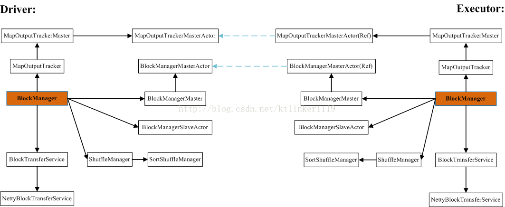
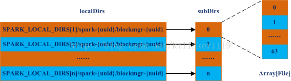
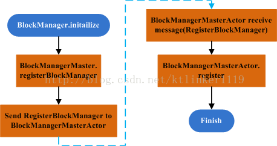

每个Driver和Executor都有自己的BlockManager，它管理RDD缓存、Shuffle计算结果、Broadcast存储等。

##一、BlockManager

```scala
/**
 * BlockManager 运行在每个节点上，包括driver和executors都会有一份主要提供了本地或者远程存储的功能
 * 支持内存 磁盘 堆外存储（Tychyon）
 */
private[spark] class BlockManager(
    executorId: String,  //BlockManager运行在哪个Executor之上
    rpcEnv: RpcEnv,   //远程通信体
    val master: BlockManagerMaster,  //BlockManagerMaster,管理整个集群的BlockManger
    val serializerManager: SerializerManager,//默认序列化器
    val conf: SparkConf,
    memoryManager: MemoryManager,//内存管理器
    mapOutputTracker: MapOutputTracker,//shuffle输出
    shuffleManager: ShuffleManager,//shuffle管理器
    val blockTransferService: BlockTransferService,//用于Block间的网络通信(进行备份时)
    securityManager: SecurityManager,
    numUsableCores: Int)
  extends BlockDataManager with BlockEvictionHandler with Logging {

......

  //负责内存存储  
  private[spark] val memoryStore =
    new MemoryStore(conf, blockInfoManager, serializerManager, memoryManager, this)
  //负责磁盘存储
  private[spark] val diskStore = new DiskStore(conf, diskBlockManager, securityManager)
  memoryManager.setMemoryStore(memoryStore)

......


  def initialize(appId: String): Unit = {
    //初始化BlockTransferService，其实是它的子类NettyBlockTransferService是下了init方法
    //该方法的作用就是初始化传输服务，通过传输服务可以从不同的节点上拉取Block数据
    blockTransferService.init(this)
    shuffleClient.init(appId)

    //设置block的复制分片策略，由spark.storage.replication.policy指定
    blockReplicationPolicy = {
      val priorityClass = conf.get(
        "spark.storage.replication.policy", classOf[RandomBlockReplicationPolicy].getName)
      val clazz = Utils.classForName(priorityClass)
      val ret = clazz.newInstance.asInstanceOf[BlockReplicationPolicy]
      logInfo(s"Using $priorityClass for block replication policy")
      ret
    }

    /**
     * 根据给定参数为对对应的Executor封装一个BlockManagerId对象（块存储的唯一标识）
     * executorId:executor的Id，
     * blockTransferService.hostName:传输Block数据的服务的主机名
     * blockTransferService.port:传输Block数据的服务的主机名
     */
    val id =
      BlockManagerId(executorId, blockTransferService.hostName, blockTransferService.port, None)

    //调用BlockManagerMaster的registerBlockManager方法向Driver上的BlockManagerMaster注册
    val idFromMaster = master.registerBlockManager(
      id,
      maxOnHeapMemory,
      maxOffHeapMemory,
      slaveEndpoint)

    //更新BlockManagerId
    blockManagerId = if (idFromMaster != null) idFromMaster else id

    //判断是否开了外部shuffle服务
    shuffleServerId = if (externalShuffleServiceEnabled) {
      logInfo(s"external shuffle service port = $externalShuffleServicePort")
      BlockManagerId(executorId, blockTransferService.hostName, externalShuffleServicePort)
    } else {
      blockManagerId
    }

    // Register Executors' configuration with the local shuffle service, if one should exist.
    //如果开启了外部shuffle服务，并且该节点是Driver的话就调用registerWithExternalShuffleServer方法
    //将BlockManager注册在本地
    if (externalShuffleServiceEnabled && !blockManagerId.isDriver) {
      registerWithExternalShuffleServer()
    }

    logInfo(s"Initialized BlockManager: $blockManagerId")
  }

......

}

```
###1.1、类图关系



MemoryStore、DiskStore和TachyonStore在图中没有画。这三个类在两端都是独立存在。

###1.2、重要成员
+ DiskBlockManager；

+ BlockManagerMaster

```scala
private[spark] class BlockManagerMaster(
    var driverActor: ActorRef,
    conf: SparkConf,
    isDriver: Boolean)
```
1. 它拥有一个ActorRef对象。

2. 在Driver端，它指向BlockManagerMasterActor对象；

3. 在Executor端，它指向Driver端的BlockManagerMasterActor对象的远程引用；（具体见SparkEnv）

+ MapOutputTracker
```scala
private[spark] abstract class MapOutputTracker(conf: SparkConf) extends Logging {
  private val timeout = AkkaUtils.askTimeout(conf)
  private val retryAttempts = AkkaUtils.numRetries(conf)
  private val retryIntervalMs = AkkaUtils.retryWaitMs(conf)
  /** Set to the MapOutputTrackerActor living on the driver. */
  var trackerActor: ActorRef = _
```
它拥有一个ActorRef对象。MapOutputTracker有两个实现类：MapOutputTrackerMaster，MapOutputTrackerWorker。

在Driver端，MapOutputTracker实际类为MapOutputTrackerMaster，trackerActor指向MapOutputTrackerMasterActor对象；

在Executor端，MapOutputTracker实际类为MapOutputTrackerWorker，trackerActor指向Driver端的MapOutputTrackerMasterActor对象的远程引用；（具体见SparkEnv）

+ MemoryStore，管理内存block；
+ DiskStore，管理磁盘block；
+ TachyonStore，管理存储在tachyon中的block；

###1.3、DiskBlockManager

该类用于创建和管理逻辑块与磁盘物理块的映射关系。默认情况下，一个block对应一个文件，文件名为BlockId的名称。也可让一个block对应文件的一个段。

```scala
sealed abstract class BlockId {
  /** A globally unique identifier for this Block. Can be used for ser/de. */
  def name: String
  ......
}
```

####1.3.1、创建目录(DiskBlockManager主构造函数)
```scala
  private[spark]
  val subDirsPerLocalDir = blockManager.conf.getInt("spark.diskStore.subDirectories", 64)
  /* Create one local directory for each path mentioned in spark.local.dir; then, inside this
   * directory, create multiple subdirectories that we will hash files into, in order to avoid
   * having really large inodes at the top level. */
  private[spark] val localDirs: Array[File] = createLocalDirs(conf)
  if (localDirs.isEmpty) {
    logError("Failed to create any local dir.")
    System.exit(ExecutorExitCode.DISK_STORE_FAILED_TO_CREATE_DIR)
  }
  private val subDirs = Array.fill(localDirs.length)(new Array[File](subDirsPerLocalDir))
```
在主构造函数中：
1. 定义每个LocalDir下子目录的个数，默认64个；

2. 根据SPARK_LOCAL_DIRS环境变量或spark.local.dir（该值会被SPARK_LOCAL_DIRS覆盖，所以建议采用环境变量配置）提供的参数创建目录（以逗号分隔各个目录，默认的基目录为/tmp）；

3. 根据localDirs数量（取决于SPARK_LOCAL_DIRS环境变量或spark.local.dir配置的目录个数），创建数组，数组元素为Array[File]，大小为64；

####1.3.2、DiskBlockManager.createLocalDirs

```scala
  private def createLocalDirs(conf: SparkConf): Array[File] = {
    Utils.getOrCreateLocalRootDirs(conf).flatMap { rootDir =>
      try {
        val localDir = Utils.createDirectory(rootDir, "blockmgr")
        logInfo(s"Created local directory at $localDir")
        Some(localDir)
      } catch {
        case e: IOException =>
          logError(s"Failed to create local dir in $rootDir. Ignoring this directory.", e)
          None
      }
    }
  }
```
（1）调用Utils.getOrCreateLocalRootDirs创建SPARK_LOCAL_DIRS或spark.local.dir配置的目录，目录结构为：
$(SPARK_LOCAL_DIRS[i])/spark-{UUID字符串}
在Driver和Executor端的$(SPARK_LOCAL_DIRS[i])是不同的，并非都是spark-env.sh中SPARK_LOCAL_DIRS所设置的值，Executor端在启动Executor进程之前会调整SPARK_LOCAL_DIRS环境变量；Driver端的SPARK_LOCAL_DIRS是配置文件中的配置值。

例如：
在Driver端：
SPARK_LOCAL_DIRS=/home/xxx/spark/mytmp
在Executor端：
SPARK_LOCAL_DIRS=/home/xxx/spark/mytmp/spark-{UUID字符串}/spark-{UUID字符串}
（2）在每个spark-{UUID字符串}目录下再创建一级目录，名称为：blockmgr-{UUID字符串}
整个目录结构为：
$(SPARK_LOCAL_DIRS[i])/spark-{UUID字符串}/blockmgr-{UUID字符串}，localDirs的元素就对应该目录结构。
例如（Driver端）：
--conf  spark.local.dir=/home/xxx/spark/mytmp
/home/xxx/spark/mytmp/spark-bfa31f15-f1ec-417c-86e2-85d1d6837203/blockmgr-208370cd-fa6e-48d9-b67a-700bcc498a2f
目录结构图：


初始化后，subDirs的元素Array[File]都是空的，每个元素最终会是一个目录，目录名称是0-63的16进制表示。

####1.3.3、Utils.getOrCreateLocalRootDirs

```scala
  private[spark] def getOrCreateLocalRootDirs(conf: SparkConf): Array[String] = {
    if (isRunningInYarnContainer(conf)) {
      ...
    } else {
      // In non-Yarn mode (or for the driver in yarn-client mode), we cannot trust the user
      // configuration to point to a secure directory. So create a subdirectory with restricted
      // permissions under each listed directory.
      Option(conf.getenv("SPARK_LOCAL_DIRS"))
        .getOrElse(conf.get("spark.local.dir", System.getProperty("java.io.tmpdir")))
        .split(",")
        .flatMap { root =>
          try {
            val rootDir = new File(root)
            if (rootDir.exists || rootDir.mkdirs()) {
              val dir = createDirectory(root)
              chmod700(dir)
              Some(dir.getAbsolutePath)
            } else {
              logError(s"Failed to create dir in $root. Ignoring this directory.")
              None
            }
          } catch {
            case e: IOException =>
            logError(s"Failed to create local root dir in $root. Ignoring this directory.")
            None
          }
        }
        .toArray
    }
  }
```
（1）依次判断SPARK_LOCAL_DIRS，spark.local.dir和java.io.tmpdir，获取基目录；
（2）创建基目录；
（3）调用createDirectory方法在基目录创建一个目录，以spark为前缀，目录名为spark-{UUID}。

#### 1.3.4、Executor端对SPARK_LOCAL_DIRS的调整

>1.3.4.1 Worker处理LaunchExecutor
处理Master发送的LaunchExecutor消息。

```scala
              // Create local dirs for the executor. These are passed to the executor via the
              // SPARK_LOCAL_DIRS environment variable, and deleted by the Worker when the
              // application finishes.
              val appLocalDirs = appDirectories.get(appId).getOrElse {
                  Utils.getOrCreateLocalRootDirs(conf).map { dir =>
                      Utils.createDirectory(dir).getAbsolutePath()
                  }.toSeq
              }
              appDirectories(appId) = appLocalDirs
              val manager = new ExecutorRunner(
                  appId,
                  execId,
                  appDesc.copy(command = Worker.maybeUpdateSSLSettings(appDesc.command, conf)),
                  cores_,
                  memory_,
                  self,
                  workerId,
                  host,
                  webUi.boundPort,
                  publicAddress,
                  sparkHome,
                  executorDir,
                  akkaUrl,
                  conf,
                  appLocalDirs, ExecutorState.LOADING)
              executors(appId + "/" + execId) = manager
              manager.start()
```
（1）为每个App创建本地目录，调用getOrCreateLocalRootDirs创建目录及app对应的子目录，子目录名为spark-{UUID}；
（2）在第一步创建的目录中再创建一级目录，目录名为spark-{UUID}，最终的app对应的目录结构为：
$SPARK_LOCAL_DIRS[i]/spark-{UUID}/spark-{UUID}，这里SPARK_LOCAL_DIRS为配置文件中所配置的值。
（3）创建ExecutorRunner对象；
（4）启动ExecutorRunner。

>1.3.4.2 ExecutorRunner.start

​start方法将启动线程，在线程中调用fetchAndRunExecutor方法。

>1.3.4.3 ExecutorRunner.fetchAndRunExecutor

```scala
  def fetchAndRunExecutor() {
    try {
      // Launch the process
      val builder = CommandUtils.buildProcessBuilder(appDesc.command, memory,
        sparkHome.getAbsolutePath, substituteVariables)
      val command = builder.command()
      logInfo("Launch command: " + command.mkString("\"", "\" \"", "\""))
      builder.directory(executorDir)
      builder.environment.put("SPARK_LOCAL_DIRS", appLocalDirs.mkString(","))
      // In case we are running this from within the Spark Shell, avoid creating a "scala"
      // parent process for the executor command
      builder.environment.put("SPARK_LAUNCH_WITH_SCALA", "0")
      ...
```
将appLocalDirs（在LaunchExecutor消息处理中创建的）设置为SPARK_LOCAL_DIRS环境变量。

这段是App发申请，由Master通知Worker创建Executor流程的一部分，在这只是为了说明Executor端创建DiskBlockManager时目录结果与Driver端的差异。

##二、BlockManager.initialize

BlockManager初始化过程。
```scala
  def initialize(appId: String): Unit = {
    blockTransferService.init(this)
    shuffleClient.init(appId)
    blockManagerId = BlockManagerId(
      executorId, blockTransferService.hostName, blockTransferService.port)
    shuffleServerId = if (externalShuffleServiceEnabled) {
      BlockManagerId(executorId, blockTransferService.hostName, externalShuffleServicePort)
    } else {
      blockManagerId
    }
    master.registerBlockManager(blockManagerId, maxMemory, slaveActor)
    // Register Executors' configuration with the local shuffle service, if one should exist.
    if (externalShuffleServiceEnabled && !blockManagerId.isDriver) {
      registerWithExternalShuffleServer()
    }
  }
```
（1）初始化NettyBlockTransferService和ShuffleClient，默认ShuffleClient= NettyBlockTransferService

（2）创建BlockManagerId；

（3）调用BlockManagerMaster.registerBlockManager向BlockManagerMasterActor发起注册，流程图如下：



Driver端和Executor端都会向Driver端的BlockManagerMaster
Actor发起BlockManager注册。

##三、DiskStore之block-文件映射关系

下面通过DiskStore.putBytes描述block和文件的映射关系。

###3.1、DiskStore.putBytes
```scala
  override def putBytes(blockId: BlockId, _bytes: ByteBuffer, level: StorageLevel): PutResult = {
    // So that we do not modify the input offsets !
    // duplicate does not copy buffer, so inexpensive
    val bytes = _bytes.duplicate()
    logDebug(s"Attempting to put block $blockId")
    val startTime = System.currentTimeMillis
    val file = diskManager.getFile(blockId)
    val channel = new FileOutputStream(file).getChannel
    while (bytes.remaining > 0) {
      channel.write(bytes)
    }
    channel.close()
    val finishTime = System.currentTimeMillis
    logDebug("Block %s stored as %s file on disk in %d ms".format(
      file.getName, Utils.bytesToString(bytes.limit), finishTime - startTime))
    PutResult(bytes.limit(), Right(bytes.duplicate()))
  }
```
（1）通过DiskBlockManager.getFile获取当前BlockId对应的文件；
（2）将数据写入文件；
（3）返回结果。

###3.2、DiskBlockManager.getFile
```scala
  def getFile(blockId: BlockId): File = getFile(blockId.name)
通过BlockId的name属性，调用重载的getFile方法。
  def getFile(filename: String): File = {
    // Figure out which local directory it hashes to, and which subdirectory in that
    val hash = Utils.nonNegativeHash(filename)
    val dirId = hash % localDirs.length
    val subDirId = (hash / localDirs.length) % subDirsPerLocalDir
    // Create the subdirectory if it doesn't already exist
    var subDir = subDirs(dirId)(subDirId)
    if (subDir == null) {
      subDir = subDirs(dirId).synchronized {
        val old = subDirs(dirId)(subDirId)
        if (old != null) {
          old
        } else {
          val newDir = new File(localDirs(dirId), "%02x".format(subDirId))
          if (!newDir.exists() && !newDir.mkdir()) {
            throw new IOException(s"Failed to create local dir in $newDir.")
          }
          subDirs(dirId)(subDirId) = newDir
          newDir
        }
      }
    }
    new File(subDir, filename)
  }
```
（1）计算filename，即BlockId的name属性的非负哈希值；
（2）在DiskBlockManager的初始化过程中创建了一个或多个目录，通过取余计算当前block应该放在哪个目录；
（3）计算block对应的子目录在subDir数组中的索引；
（4）以子目录所在索引值为目录名创建目录；
（5）创建文件并返回。

文件名结构：
$(SPARK_LOCAL_DIRS[i])/spark-{UUID字符串}/blockmgr-{UUID字符串}/{0-63的16进制}/{BlockId.name}
