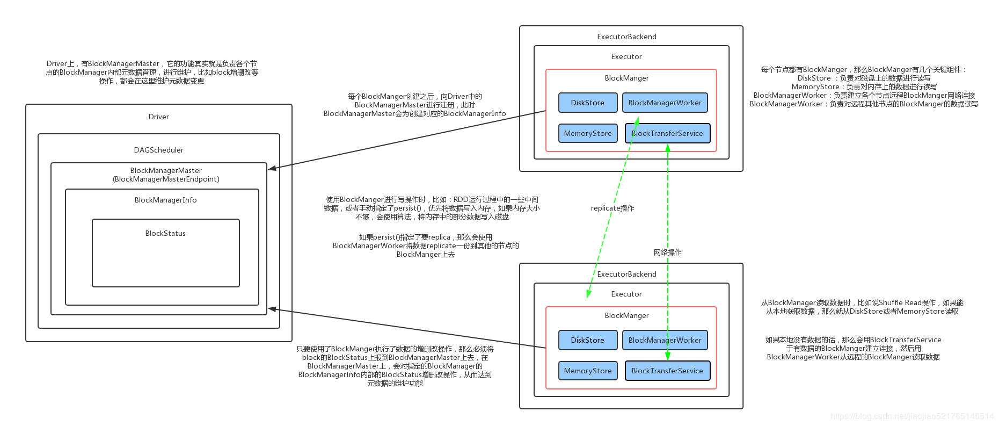
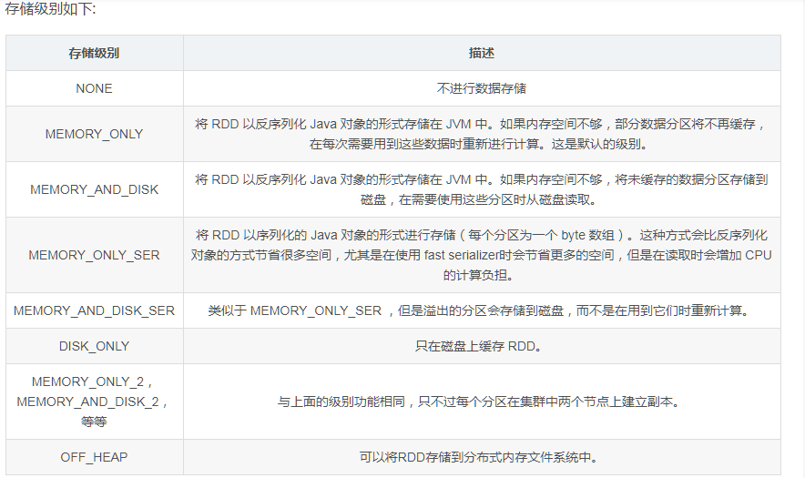
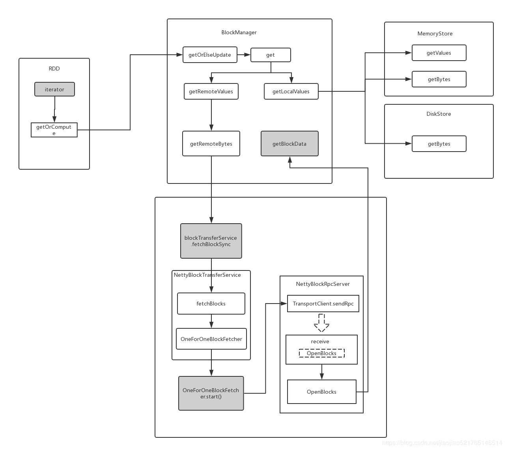
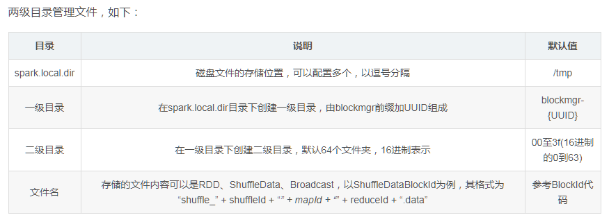
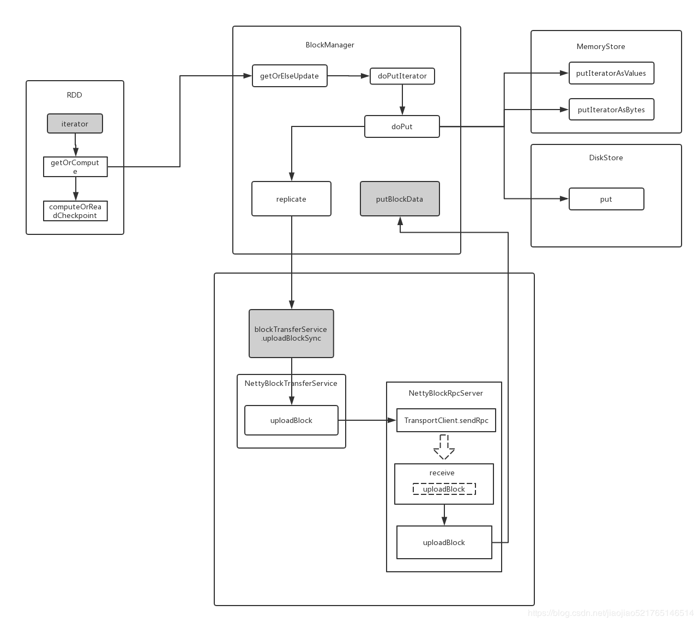

##Spark:BlockManager 读写流程分析



BlockManager是Spark的分布式存储系统，与我们平常说的分布式存储系统是有区别的，区别就是这个分布式存储系统只会管理Block块数据，它运行在所有节点上。BlockManager的结构是Maser-Slave架构，Master就是Driver上的BlockManagerMaster，Slave就是每个Executor上的BlockManager。BlockManagerMaster负责接受Executor上的BlockManager的注册以及管理BlockManager的元数据信息

###一、存储级别



RDD 可以使用 persist() 方法或 cache() 方法进行持久化。数据将会在第一次 action 操作时进行计算，并缓存在节点的内存中。Spark 的缓存具有容错机制，如果一个缓存的 RDD 的某个分区丢失了，Spark 将按照原来的计算过程，自动重新计算并进行缓存。

在 shuffle 操作中（例如 reduceByKey），即便是用户没有调用 persist 方法，Spark 也会自动缓存部分中间数据。这么做的目的是，在 shuffle 的过程中某个节点运行失败时，不需要重新计算所有的输入数据。如果用户想多次使用某个 RDD，强烈推荐在该 RDD 上调用 persist 方法。

cache()方法和persist()方法可以用来显式地将数据保存到内存或者磁盘中，其中cache方法是persist()在参数为MEMORY_ONLY时的封装。

```scala
  /**
   * Persist this RDD with the default storage level (`MEMORY_ONLY`).
   */
  def persist(): this.type = persist(StorageLevel.MEMORY_ONLY)

  /**
   * Persist this RDD with the default storage level (`MEMORY_ONLY`).
   */
  def cache(): this.type = persist()

  private def persist(newLevel: StorageLevel, allowOverride: Boolean): this.type = {
    // TODO: Handle changes of StorageLevel
    // RDD的存储级别一旦设置了之后就不能更改
    if (storageLevel != StorageLevel.NONE && newLevel != storageLevel && !allowOverride) {
      throw new UnsupportedOperationException(
        "Cannot change storage level of an RDD after it was already assigned a level")
    }
    // If this is the first time this RDD is marked for persisting, register it
    // with the SparkContext for cleanups and accounting. Do this only once.
    if (storageLevel == StorageLevel.NONE) {
      sc.cleaner.foreach(_.registerRDDForCleanup(this))
      sc.persistRDD(this)
    }
    storageLevel = newLevel
    this
  }
```

###二、BlockManager之block数据的读取



Task运行的时候是要去获取Parent 的RDD对应的Partition的数据的，即它会调用RDD的iterator方法把对应的Partition的数据集给遍历出来，然后写入存储，这个存储可能是磁盘或者内存，取决于StorageLevel是什么。

如果当前RDD的StorageLevel不为空，则表示已经存持久化了，我们可以直接在内存中获取，而不是去计算Parent RDD。如果没有StorageLevel，则表示没有缓存过，内存中没有，则我们需要运行的数据就需要从Parent RDD计算出来。注意，这里所谓的缓存并不是使用什么cache 组件，而直接是从本地读取,本地没有则从远端，获取的结果直接放入内存存储，方便后续读取，这才是真正cache的地方。这里的内存是指有没有RDD数据。

第一步：RDD的iterator方法

源码地址：org.apache.spark.rdd.RDD.scala

```scala
  final def iterator(split: Partition, context: TaskContext): Iterator[T] = {
    if (storageLevel != StorageLevel.NONE) {
      getOrCompute(split, context)
    } else {
      //进行RDD的partition计算
      computeOrReadCheckpoint(split, context)
    }
  }
```
第二步：getOrCompute(split, context)方法

```scala
  /**
   * 从内存或者磁盘获取，如果磁盘获取需要将block缓存到内存
   */
  private[spark] def getOrCompute(partition: Partition, context: TaskContext): Iterator[T] = {
    // 根据rdd id创建RDDBlockId
    val blockId = RDDBlockId(id, partition.index)
      // 是否从缓存的block读取
    var readCachedBlock = true
    // This method is called on executors, so we need call SparkEnv.get instead of sc.env.
    SparkEnv.get.blockManager.getOrElseUpdate(blockId, storageLevel, elementClassTag, () => {
      readCachedBlock = false
      // 如果数据不在内存，那么就尝试读取检查点结果迭代计算
      computeOrReadCheckpoint(partition, context)
    }) match {
      // 获取到了结果直接返回
      case Left(blockResult) =>
        // 如果从cache读取block
        if (readCachedBlock) {
          val existingMetrics = context.taskMetrics().inputMetrics
          existingMetrics.incBytesRead(blockResult.bytes)
          new InterruptibleIterator[T](context, blockResult.data.asInstanceOf[Iterator[T]]) {
            override def next(): T = {
              existingMetrics.incRecordsRead(1)
              delegate.next()
            }
          }
        } else {
          new InterruptibleIterator(context, blockResult.data.asInstanceOf[Iterator[T]])
        }
      case Right(iter) =>
        new InterruptibleIterator(context, iter.asInstanceOf[Iterator[T]])
    }
  }
```

第三步： SparkEnv.get.blockManager.getOrElseUpdate方法

```scala
  /**
   * 如果指定的block存在，则直接获取，否则调用makeIterator方法去计算block，然后持久化最后返回值
   */
  def getOrElseUpdate[T](
      blockId: BlockId,
      level: StorageLevel,
      classTag: ClassTag[T],
      makeIterator: () => Iterator[T]): Either[BlockResult, Iterator[T]] = {
    // Attempt to read the block from local or remote storage. If it's present, then we don't need to go through the local-get-or-put path.
    get[T](blockId)(classTag) match {
      case Some(block) =>
        return Left(block)
      case _ =>
        // Need to compute the block.
    }
    // Initially we hold no locks on this block.
    // 如果本地化和远端都没有获取到数据，则调用makeIterator计算，最后将结果写入block
    doPutIterator(blockId, makeIterator, level, classTag, keepReadLock = true) match {
      // 表示写入成功
      case None =>
        // doPut() didn't hand work back to us, so the block already existed or was successfully
        // stored. Therefore, we now hold a read lock on the block.
        // 从本地获取数据块
        val blockResult = getLocalValues(blockId).getOrElse {
          // Since we held a read lock between the doPut() and get() calls, the block should not
          // have been evicted, so get() not returning the block indicates some internal error.
          releaseLock(blockId)
          throw new SparkException(s"get() failed for block $blockId even though we held a lock")
        }
        // We already hold a read lock on the block from the doPut() call and getLocalValues()
        // acquires the lock again, so we need to call releaseLock() here so that the net number
        // of lock acquisitions is 1 (since the caller will only call release() once).
        releaseLock(blockId)
        Left(blockResult)
      case Some(iter) => // 如果写入失败
        // The put failed, likely because the data was too large to fit in memory and could not be
        // dropped to disk. Therefore, we need to pass the input iterator back to the caller so
        // that they can decide what to do with the values (e.g. process them without caching).
        // 如果put操作失败，表示可能是因为数据太大，无法写入内存，又无法被磁盘drop，因此我们需要返回这个iterator给调用者
       Right(iter)
    }
  }
```
第四步：BlockManager的get方法

```scala
  /**
   * 读取数据的入口点，会判断数据是否在本地而选择是直接从本地读取还是通过BlockTransferService读取远程数据：
   */
  def get[T: ClassTag](blockId: BlockId): Option[BlockResult] = {
   // 从本地获取block
    val local = getLocalValues(blockId)
      // 如果本地获取到了则返回
    if (local.isDefined) {
      logInfo(s"Found block $blockId locally")
      return local
    }
    // 如果本地没有获取到则从远端获取
    val remote = getRemoteValues[T](blockId)
    // 如果远端获取到了则返回，没有返回None
    if (remote.isDefined) {
      logInfo(s"Found block $blockId remotely")
      return remote
    }
    None
  }
```

第五步：BlockManager的getLocalValues方法

```scala
  /**
   * 从本地获取block,如果存在返回BlockResult，不存在返回None；
   * 如果storage level是磁盘，则还需将得到的block缓存到内存存储，方便下次读取
   */
  def getLocalValues(blockId: BlockId): Option[BlockResult] = {
    logDebug(s"Getting local block $blockId")
    // 调用block info manager，锁定该block，然后读取block,返回该block 元数据block info
    blockInfoManager.lockForReading(blockId) match {
      case None =>  // 没有读取到则返回None
        logDebug(s"Block $blockId was not found")
        None
      case Some(info) =>  // 读取到block元数据
        // 获取存储级别storage level
        val level = info.level
        logDebug(s"Level for block $blockId is $level")
        val taskAttemptId = Option(TaskContext.get()).map(_.taskAttemptId())
        // 如果使用内存，且内存memory store包含这个block id
        if (level.useMemory && memoryStore.contains(blockId)) {
          // 如果序列化了，那么说明是对象数据，使用getValues
          val iter: Iterator[Any] = if (level.deserialized) {
            memoryStore.getValues(blockId).get
          } else {
            // 没序列化，那么是数据流，使用getBytes()
            serializerManager.dataDeserializeStream(
              blockId, memoryStore.getBytes(blockId).get.toInputStream())(info.classTag)
          }
          // We need to capture the current taskId in case the iterator completion is triggered
          // from a different thread which does not have TaskContext set; see SPARK-18406 for
          // discussion.
          val ci = CompletionIterator[Any, Iterator[Any]](iter, {
            releaseLock(blockId, taskAttemptId)
          })
          // 构建一个BlockResult对象返回,这个对象包括数据，读取方式以及字节大小
          Some(new BlockResult(ci, DataReadMethod.Memory, info.size))
        } 
        // 如果使用磁盘存储，且disk store包含这个block则从磁盘获取，并且把结果放入内存
        else if (level.useDisk && diskStore.contains(blockId)) {
           // 先读取数据
          val diskData = diskStore.getBytes(blockId)
          val iterToReturn: Iterator[Any] = {
            //如果需要反序列化，则进行反序列
            if (level.deserialized) {
              val diskValues = serializerManager.dataDeserializeStream(
                blockId,
                diskData.toInputStream())(info.classTag)
              // 先序列化，后将数据放入内存
              maybeCacheDiskValuesInMemory(info, blockId, level, diskValues)
            } else {
              // 先将数据放入内存
              val stream = maybeCacheDiskBytesInMemory(info, blockId, level, diskData)
                .map { _.toInputStream(dispose = false) }
                .getOrElse { diskData.toInputStream() }
              //序列化返回的值
              serializerManager.dataDeserializeStream(blockId, stream)(info.classTag)
            }
          }
          val ci = CompletionIterator[Any, Iterator[Any]](iterToReturn, {
            releaseLockAndDispose(blockId, diskData, taskAttemptId)
          })
          // 构建BlockResult返回
          Some(new BlockResult(ci, DataReadMethod.Disk, info.size))
        } else {
          // 处理本地读取block失败，报告driver这是一个无效的block,将会删除这个block
          handleLocalReadFailure(blockId)
        }
    }
  }
```

第六步：memoryStore.getValues(blockId).get方法

```scala

// 区别：字节，序列化

  //存放每个block数据
  private val entries = new LinkedHashMap[BlockId, MemoryEntry[_]](32, 0.75f, true)

  def getValues(blockId: BlockId): Option[Iterator[_]] = {
   //多线程并发访问同步
    val entry = entries.synchronized { entries.get(blockId) }
    entry match {
      case null => None
      case e: SerializedMemoryEntry[_] =>
        throw new IllegalArgumentException("should only call getValues on deserialized blocks")
      case DeserializedMemoryEntry(values, _, _) =>
        val x = Some(values)
        x.map(_.iterator)
    }
  }

  def getBytes(blockId: BlockId): Option[ChunkedByteBuffer] = {
    val entry = entries.synchronized { entries.get(blockId) }
    entry match {
      case null => None
      case e: DeserializedMemoryEntry[_] =>
        throw new IllegalArgumentException("should only call getBytes on serialized blocks")
      case SerializedMemoryEntry(bytes, _, _) => Some(bytes)
    }
  }
```
发现都是从一个entries的LinkedHashMap里面按照blockId读取数据，可以看出Spark底层是在使用一个LinkedHashMap保存数据。使用LinkedHashMap可以保存键值对的插入顺序，这样在内存不够时，先插入的数据会先溢出到磁盘，实现了FIFO序。

第七步：磁盘读取diskStore.getBytes(blockId)方法

Spark通过spark.local.dir设置文件存储的目录，默认情况下设置一个一级目录，在这个一级目录下最多创建64个二级目录，目录的名称是00-63,目录中文件的名称是blockId.name这个字段，唯一标识一个块。

两级目录管理文件，如下：



```scala
  def getBytes(blockId: BlockId): BlockData = {
    val file = diskManager.getFile(blockId.name)
    val blockSize = getSize(blockId)

    securityManager.getIOEncryptionKey() match {
      case Some(key) =>
        // Encrypted blocks cannot be memory mapped; return a special object that does decryption
        // and provides InputStream / FileRegion implementations for reading the data.
        new EncryptedBlockData(file, blockSize, conf, key)

      case _ =>
        new DiskBlockData(minMemoryMapBytes, maxMemoryMapBytes, file, blockSize)
    }
  }
```

第八步：读取数据之前，首先使用了getFile来获取保存数据的文件

```scala
  def getFile(filename: String): File = {
    // Figure out which local directory it hashes to, and which subdirectory in that
    // filename 传进来的是blockId
    val hash = Utils.nonNegativeHash(filename)
    val dirId = hash % localDirs.length
    // 计算出当前的block数据存在哪个二级目录里面
    val subDirId = (hash / localDirs.length) % subDirsPerLocalDir

    // Create the subdirectory if it doesn't already exist
    // 要是这个二级目录不存在，那么需要创建这个二级目录
    val subDir = subDirs(dirId).synchronized {
      val old = subDirs(dirId)(subDirId)
      if (old != null) {
        old
      } else {
        val newDir = new File(localDirs(dirId), "%02x".format(subDirId))
        if (!newDir.exists() && !newDir.mkdir()) {
          throw new IOException(s"Failed to create local dir in $newDir.")
        }
        subDirs(dirId)(subDirId) = newDir
        newDir
      }
    }
```

第九步：远程读取val remote = getRemoteValues[T](blockId)

```scala
  /**
   * Get block from remote block managers.
   * This does not acquire a lock on this block in this JVM.
   */
  private def getRemoteValues[T: ClassTag](blockId: BlockId): Option[BlockResult] = {
    val ct = implicitly[ClassTag[T]]
   // 将远程fetch的结果进行反序列化，然后构建BlockResult返回
    getRemoteBytes(blockId).map { data =>
      val values =
        serializerManager.dataDeserializeStream(blockId, data.toInputStream(dispose = true))(ct)
      new BlockResult(values, DataReadMethod.Network, data.size)
    }
  }
```
第十步：getRemoteBytes方法

```scala
  def getRemoteBytes(blockId: BlockId): Option[ChunkedByteBuffer] = {
    // TODO if we change this method to return the ManagedBuffer, then getRemoteValues
    // could just use the inputStream on the temp file, rather than reading the file into memory.
    // Until then, replication can cause the process to use too much memory and get killed
    // even though we've read the data to disk.
    logDebug(s"Getting remote block $blockId")
    require(blockId != null, "BlockId is null")
    var runningFailureCount = 0
    var totalFailureCount = 0

    // Because all the remote blocks are registered in driver, it is not necessary to ask
    // all the slave executors to get block status.
    //查询这个数据的具体位置,获取到了所有持有这个block 的block manager id
    val locationsAndStatus = master.getLocationsAndStatus(blockId)
    val blockSize = locationsAndStatus.map { b =>
      b.status.diskSize.max(b.status.memSize)
    }.getOrElse(0L)
    val blockLocations = locationsAndStatus.map(_.locations).getOrElse(Seq.empty)

    // If the block size is above the threshold, we should pass our FileManger to
    // BlockTransferService, which will leverage it to spill the block; if not, then passed-in
    // null value means the block will be persisted in memory.
    val tempFileManager = if (blockSize > maxRemoteBlockToMem) {
      remoteBlockTempFileManager
    } else {
      null
    }
    val locations = sortLocations(blockLocations)
    // 最大允许的获取block的失败次数为该block对应的block manager数量
    val maxFetchFailures = locations.size
    var locationIterator = locations.iterator
    // 开始遍历block manager
    while (locationIterator.hasNext) {
      val loc = locationIterator.next()
      logDebug(s"Getting remote block $blockId from $loc")
      // 通过调用BlockTransferSerivce的fetchBlockSync方法从远端获取block
      val data = try {
        blockTransferService.fetchBlockSync(
          loc.host, loc.port, loc.executorId, blockId.toString, tempFileManager)
      } catch {
        case NonFatal(e) =>
          runningFailureCount += 1
          totalFailureCount += 1
          // 如果总的失败数量大于了阀值则返回None
          if (totalFailureCount >= maxFetchFailures) {
            // Give up trying anymore locations. Either we've tried all of the original locations,
            // or we've refreshed the list of locations from the master, and have still
            // hit failures after trying locations from the refreshed list.
            logWarning(s"Failed to fetch block after $totalFailureCount fetch failures. " +
              s"Most recent failure cause:", e)
            return None
          }

          logWarning(s"Failed to fetch remote block $blockId " +
            s"from $loc (failed attempt $runningFailureCount)", e)

          // If there is a large number of executors then locations list can contain a
          // large number of stale entries causing a large number of retries that may
          // take a significant amount of time. To get rid of these stale entries
          // we refresh the block locations after a certain number of fetch failures
          if (runningFailureCount >= maxFailuresBeforeLocationRefresh) {
            locationIterator = sortLocations(master.getLocations(blockId)).iterator
            logDebug(s"Refreshed locations from the driver " +
              s"after ${runningFailureCount} fetch failures.")
            runningFailureCount = 0
          }

          // This location failed, so we retry fetch from a different one by returning null here
          null
      }
      // 返回ChunkedByteBuffer
      if (data != null) {
        // SPARK-24307 undocumented "escape-hatch" in case there are any issues in converting to
        // ChunkedByteBuffer, to go back to old code-path.  Can be removed post Spark 2.4 if
        // new path is stable.
        if (remoteReadNioBufferConversion) {
          return Some(new ChunkedByteBuffer(data.nioByteBuffer()))
        } else {
          return Some(ChunkedByteBuffer.fromManagedBuffer(data))
        }
      }
      logDebug(s"The value of block $blockId is null")
    }
    logDebug(s"Block $blockId not found")
    None
  }


// 从blockLocations这个JHashMap里面查找,返回了持有这个block的所有block manager id
  private def getLocationsAndStatus(blockId: BlockId): Option[BlockLocationsAndStatus] = {
    val locations = Option(blockLocations.get(blockId)).map(_.toSeq).getOrElse(Seq.empty)
    val status = locations.headOption.flatMap { bmId => blockManagerInfo(bmId).getStatus(blockId) }

    if (locations.nonEmpty && status.isDefined) {
      Some(BlockLocationsAndStatus(locations, status.get))
    } else {
      None
    }
  }
```
第十步：blockTransferService.fetchBlockSync)方法负责根据BlockManagerId读取数据，需要说明的是BlockManagerId不是个字段，是个class,有host,port,executor id等字段

```scala
  def fetchBlockSync(
      host: String,
      port: Int,
      execId: String,
      blockId: String,
      tempFileManager: DownloadFileManager): ManagedBuffer = {
    // A monitor for the thread to wait on.
    // 监控等待的线程.
    val result = Promise[ManagedBuffer]()
    fetchBlocks(host, port, execId, Array(blockId),
      new BlockFetchingListener {
        override def onBlockFetchFailure(blockId: String, exception: Throwable): Unit = {
          result.failure(exception)
        }
        override def onBlockFetchSuccess(blockId: String, data: ManagedBuffer): Unit = {
          data match {
            case f: FileSegmentManagedBuffer =>
              result.success(f)
            case _ =>
              val ret = ByteBuffer.allocate(data.size.toInt)
              ret.put(data.nioByteBuffer())
              ret.flip()
              result.success(new NioManagedBuffer(ret))
          }
        }
      }, tempFileManager)
    ThreadUtils.awaitResult(result.future, Duration.Inf)
  }
```

第十一步：fetchBlocks是抽象方法，实际上调用了NettyBlockTransferService里面的实现

```scala
  /**
   * 用于获取远程shuffle文件，实际上是利用NettyBlockTransferService中创建的netty服务。
    *
   */
  override def fetchBlocks(
      host: String,
      port: Int,
      execId: String,
      blockIds: Array[String],
      listener: BlockFetchingListener,
      tempFileManager: DownloadFileManager): Unit = {
    logTrace(s"Fetch blocks from $host:$port (executor id $execId)")
    try {
      val blockFetchStarter = new RetryingBlockFetcher.BlockFetchStarter {
        override def createAndStart(blockIds: Array[String], listener: BlockFetchingListener) {
           //通过C/S模式从远程进行通信，来拉去数据。
          val client = clientFactory.createClient(host, port)
           // 一对一读取数据
          new OneForOneBlockFetcher(client, appId, execId, blockIds, listener,
            transportConf, tempFileManager).start()
        }
      }

      val maxRetries = transportConf.maxIORetries()
      if (maxRetries > 0) {
        // Note this Fetcher will correctly handle maxRetries == 0; we avoid it just in case there's
        // a bug in this code. We should remove the if statement once we're sure of the stability.
        new RetryingBlockFetcher(transportConf, blockFetchStarter, blockIds, listener).start()
      } else {
        blockFetchStarter.createAndStart(blockIds, listener)
      }
    } catch {
      case e: Exception =>
        logError("Exception while beginning fetchBlocks", e)
        blockIds.foreach(listener.onBlockFetchFailure(_, e))
    }
  }
```

第十二步：new OneForOneBlockFetcher(client, appId, execId, blockIds, listener,transportConf, tempFileManager).start()方法是用rpc向持有block的executor发送消息

```scala
  public void start() {
    if (blockIds.length == 0) {
      throw new IllegalArgumentException("Zero-sized blockIds array");
    }

    client.sendRpc(openMessage.toByteBuffer(), new RpcResponseCallback() {
      @Override
      public void onSuccess(ByteBuffer response) {
        try {
          streamHandle = (StreamHandle) BlockTransferMessage.Decoder.fromByteBuffer(response);
          logger.trace("Successfully opened blocks {}, preparing to fetch chunks.", streamHandle);

          // Immediately request all chunks -- we expect that the total size of the request is
          // reasonable due to higher level chunking in [[ShuffleBlockFetcherIterator]].
          for (int i = 0; i < streamHandle.numChunks; i++) {
            if (downloadFileManager != null) {
              client.stream(OneForOneStreamManager.genStreamChunkId(streamHandle.streamId, i),
                new DownloadCallback(i));
            } else {
              client.fetchChunk(streamHandle.streamId, i, chunkCallback);
            }
          }
        } catch (Exception e) {
          logger.error("Failed while starting block fetches after success", e);
          failRemainingBlocks(blockIds, e);
        }
      }

      @Override
      public void onFailure(Throwable e) {
        logger.error("Failed while starting block fetches", e);
        failRemainingBlocks(blockIds, e);
      }
    });
  }
```

第十三步：消息将由对应Executor的NettyBlockRpcServer中的receive收到，并调用getBlockData方法来读取数据

```scala
  override def receive(
      client: TransportClient,
      rpcMessage: ByteBuffer,
      responseContext: RpcResponseCallback): Unit = {
    val message = BlockTransferMessage.Decoder.fromByteBuffer(rpcMessage)
    logTrace(s"Received request: $message")

    message match {
      case openBlocks: OpenBlocks =>
        val blocksNum = openBlocks.blockIds.length
        val blocks = for (i <- (0 until blocksNum).view)
          yield blockManager.getBlockData(BlockId.apply(openBlocks.blockIds(i)))
        val streamId = streamManager.registerStream(appId, blocks.iterator.asJava)
        logTrace(s"Registered streamId $streamId with $blocksNum buffers")
        responseContext.onSuccess(new StreamHandle(streamId, blocksNum).toByteBuffer)

      case uploadBlock: UploadBlock =>
        // StorageLevel and ClassTag are serialized as bytes using our JavaSerializer.
        val (level: StorageLevel, classTag: ClassTag[_]) = {
          serializer
            .newInstance()
            .deserialize(ByteBuffer.wrap(uploadBlock.metadata))
            .asInstanceOf[(StorageLevel, ClassTag[_])]
        }
        val data = new NioManagedBuffer(ByteBuffer.wrap(uploadBlock.blockData))
        val blockId = BlockId(uploadBlock.blockId)
        logDebug(s"Receiving replicated block $blockId with level ${level} " +
          s"from ${client.getSocketAddress}")
        blockManager.putBlockData(blockId, data, level, classTag)
        responseContext.onSuccess(ByteBuffer.allocate(0))
    }
  }
```

第十四步：getBlockData方法来读取数据

```scala
源码地址：org.apache.spark.storage.BlockManager.scala

  override def getBlockData(blockId: BlockId): ManagedBuffer = {
    if (blockId.isShuffle) {
      //先调用的是ShuffleManager的shuffleBlockResolver方法，得到ShuffleBlockResolver
      //调用其IndexShuffleBlockResolver.getBlockData方法
      shuffleManager.shuffleBlockResolver.getBlockData(blockId.asInstanceOf[ShuffleBlockId])
    } else {
      getLocalBytes(blockId) match {
        case Some(blockData) =>
          new BlockManagerManagedBuffer(blockInfoManager, blockId, blockData, true)
        case None =>
          // If this block manager receives a request for a block that it doesn't have then it's
          // likely that the master has outdated block statuses for this block. Therefore, we send
          // an RPC so that this block is marked as being unavailable from this block manager.
          reportBlockStatus(blockId, BlockStatus.empty)
          throw new BlockNotFoundException(blockId.toString)
      }
    }
  }
```

第十六步：IndexShuffleBlockResolver#getBlockData()方法

```scala
  override def getBlockData(blockId: ShuffleBlockId): ManagedBuffer = {
    // The block is actually going to be a range of a single map output file for this map, so
    // find out the consolidated file, then the offset within that from our index
     //使用shuffleId和mapId，获取对应索引文件
    val indexFile = getIndexFile(blockId.shuffleId, blockId.mapId)

    // SPARK-22982: if this FileInputStream's position is seeked forward by another piece of code
    // which is incorrectly using our file descriptor then this code will fetch the wrong offsets
    // (which may cause a reducer to be sent a different reducer's data). The explicit position
    // checks added here were a useful debugging aid during SPARK-22982 and may help prevent this
    // class of issue from re-occurring in the future which is why they are left here even though
    // SPARK-22982 is fixed.
    //定位到本次Block对应的数据位置
    val channel = Files.newByteChannel(indexFile.toPath)
    channel.position(blockId.reduceId * 8L)
    val in = new DataInputStream(Channels.newInputStream(channel))
    try {
       //数据起始位置
      val offset = in.readLong()
       //数据结束位置
      val nextOffset = in.readLong()
      val actualPosition = channel.position()
      val expectedPosition = blockId.reduceId * 8L + 16
      if (actualPosition != expectedPosition) {
        throw new Exception(s"SPARK-22982: Incorrect channel position after index file reads: " +
          s"expected $expectedPosition but actual position was $actualPosition.")
      }
       //返回FileSegment
      new FileSegmentManagedBuffer(
        transportConf,
        getDataFile(blockId.shuffleId, blockId.mapId),
        offset,
        nextOffset - offset)
    } finally {
      in.close()
    }
  }

  override def stop(): Unit = {}
}
```

###二、BlockManager之block数据的写入



RDD 在缓存到存储内存之后，Partition 被转换成 Block，Record 在堆内或堆外存储内存中占用一块连续的空间。将Partition由不连续的存储空间转换为连续存储空间的过程，Spark称之为"展开"（Unroll）。Block 有序列化和非序列化两种存储格式，具体以哪种方式取决于该 RDD 的存储级别。非序列化的 Block 以一种 DeserializedMemoryEntry 的数据结构定义，用一个数组存储所有的对象实例，序列化的 Block 则以 SerializedMemoryEntry的数据结构定义，用字节缓冲区（ByteBuffer）来存储二进制数据。每个 Executor 的 Storage 模块用一个链式 Map 结构（LinkedHashMap）来管理堆内和堆外存储内存中所有的 Block 对象的实例，对这个 LinkedHashMap 新增和删除间接记录了内存的申请和释放。

因为不能保证存储空间可以一次容纳 Iterator 中的所有数据，当前的计算任务在 Unroll 时要向 MemoryManager 申请足够的 Unroll 空间来临时占位，空间不足则 Unroll 失败，空间足够时可以继续进行。对于序列化的 Partition，其所需的 Unroll 空间可以直接累加计算，一次申请。而非序列化的 Partition 则要在遍历 Record 的过程中依次申请，即每读取一条 Record，采样估算其所需的 Unroll 空间并进行申请，空间不足时可以中断，释放已占用的 Unroll 空间。如果最终 Unroll 成功，当前 Partition 所占用的 Unroll 空间被转换为正常的缓存 RDD 的存储空间。

getOrElseUpdate()方法里面的doPutIterator()是写入数据的入口：

第一步：doPutIteratord()方法

```scala
源码地址：org.apache.spark.storage.BlockManager.scala


  /**
   * 根据不同的配置，选择了不同的方法写入数据，然后更新了数据块的状态，然后做了备份的更新
   */
  private def doPutIterator[T](
      blockId: BlockId,
      iterator: () => Iterator[T],
      level: StorageLevel,
      classTag: ClassTag[T],
      tellMaster: Boolean = true,
      keepReadLock: Boolean = false): Option[PartiallyUnrolledIterator[T]] = {
    doPut(blockId, level, classTag, tellMaster = tellMaster, keepReadLock = keepReadLock) { info =>
      val startTimeMs = System.currentTimeMillis
      var iteratorFromFailedMemoryStorePut: Option[PartiallyUnrolledIterator[T]] = None
      // Size of the block in bytes
      var size = 0L
      //存储级别是内存
      if (level.useMemory) {
        // Put it in memory first, even if it also has useDisk set to true;
        // We will drop it to disk later if the memory store can't hold it.
        //需要序列化
        if (level.deserialized) {
          memoryStore.putIteratorAsValues(blockId, iterator(), classTag) match {
            case Right(s) =>
              size = s
            case Left(iter) =>
              // Not enough space to unroll this block; drop to disk if applicable
              //空间不够展开块且允许写入磁盘
              if (level.useDisk) {
                logWarning(s"Persisting block $blockId to disk instead.")
                diskStore.put(blockId) { channel =>
                  val out = Channels.newOutputStream(channel)
                  serializerManager.dataSerializeStream(blockId, out, iter)(classTag)
                }
                size = diskStore.getSize(blockId)
              } else {
                //返回错误提示
                iteratorFromFailedMemoryStorePut = Some(iter)
              }
          }
        } else { // !level.deserialized
          //不用序列化
          memoryStore.putIteratorAsBytes(blockId, iterator(), classTag, level.memoryMode) match {
            case Right(s) =>
              size = s
            case Left(partiallySerializedValues) =>
              // Not enough space to unroll this block; drop to disk if applicable
              //空间不够展开块且允许写入磁盘
              if (level.useDisk) {
                logWarning(s"Persisting block $blockId to disk instead.")
                diskStore.put(blockId) { channel =>
                  val out = Channels.newOutputStream(channel)
                  partiallySerializedValues.finishWritingToStream(out)
                }
                size = diskStore.getSize(blockId)
              } else {
                iteratorFromFailedMemoryStorePut = Some(partiallySerializedValues.valuesIterator)
              }
          }
        }
      //存储级别是磁盘
      } else if (level.useDisk) {
        diskStore.put(blockId) { channel =>
          val out = Channels.newOutputStream(channel)
          serializerManager.dataSerializeStream(blockId, out, iterator())(classTag)
        }
        size = diskStore.getSize(blockId)
      }
      val putBlockStatus = getCurrentBlockStatus(blockId, info)
      val blockWasSuccessfullyStored = putBlockStatus.storageLevel.isValid
      if (blockWasSuccessfullyStored) {
        // Now that the block is in either the memory or disk store, tell the master about it.
        info.size = size
        if (tellMaster && info.tellMaster) {
          reportBlockStatus(blockId, putBlockStatus)
        }
        //更新数据块信息
        addUpdatedBlockStatusToTaskMetrics(blockId, putBlockStatus)
        logDebug("Put block %s locally took %s".format(blockId, Utils.getUsedTimeMs(startTimeMs)))
        //备份数目>1
        if (level.replication > 1) {
          val remoteStartTime = System.currentTimeMillis
          val bytesToReplicate = doGetLocalBytes(blockId, info)
          // [SPARK-16550] Erase the typed classTag when using default serialization, since
          // NettyBlockRpcServer crashes when deserializing repl-defined classes.
          // TODO(ekl) remove this once the classloader issue on the remote end is fixed.
          val remoteClassTag = if (!serializerManager.canUseKryo(classTag)) {
            scala.reflect.classTag[Any]
          } else {
            classTag
          }
          try {
            replicate(blockId, bytesToReplicate, level, remoteClassTag)
          } finally {
            bytesToReplicate.dispose()
          }
          logDebug("Put block %s remotely took %s"
            .format(blockId, Utils.getUsedTimeMs(remoteStartTime)))
        }
      }
      assert(blockWasSuccessfullyStored == iteratorFromFailedMemoryStorePut.isEmpty)
      iteratorFromFailedMemoryStorePut
    }
  }
```
展开块是在写入数据到内存是不先写入，而是多次写入，每次写入之前首先检查剩余的内存是否足够存放块，不够的话就尝试将内存中已有的数据写入到磁盘，释放空间来放新的数据

第二步：memoryStore.putIteratorAsValues 尝试将当前块作为value保存在内存中

```scala
  /**
   * Attempt to put the given block in memory store as values.
   * 尝试将当前块作为value保存在内存中
   *  
   *  
   *  有可能iterator太大以至于不能保存到内存中，为了避免OOM,这个方法会逐渐展开iterator并间歇性检查是否有足够的空余内存
   *  如果这个块成功地保存到了内存中，那么这些在保存过程中暂时展开的的内存就成了存储内存，因此我们不会获取多余的内存。
   *  
   * @return in case of success, the estimated size of the stored data. In case of failure, return
   *         an iterator containing the values of the block. The returned iterator will be backed
   *         by the combination of the partially-unrolled block and the remaining elements of the
   *         original input iterator. The caller must either fully consume this iterator or call
   *         `close()` on it in order to free the storage memory consumed by the partially-unrolled
   *         block.
   */
  private[storage] def putIteratorAsValues[T](
      blockId: BlockId,
      values: Iterator[T],
      classTag: ClassTag[T]): Either[PartiallyUnrolledIterator[T], Long] = {

    val valuesHolder = new DeserializedValuesHolder[T](classTag)

    putIterator(blockId, values, classTag, MemoryMode.ON_HEAP, valuesHolder) match {
      case Right(storedSize) => Right(storedSize)
      case Left(unrollMemoryUsedByThisBlock) =>
        val unrolledIterator = if (valuesHolder.vector != null) {
          valuesHolder.vector.iterator
        } else {
          valuesHolder.arrayValues.toIterator
        }

        Left(new PartiallyUnrolledIterator(
          this,
          MemoryMode.ON_HEAP,
          unrollMemoryUsedByThisBlock,
          unrolled = unrolledIterator,
          rest = values))
    }
  }

  private def putIterator[T](
      blockId: BlockId,
      values: Iterator[T],
      classTag: ClassTag[T],
      memoryMode: MemoryMode,
      valuesHolder: ValuesHolder[T]): Either[Long, Long] = {
    require(!contains(blockId), s"Block $blockId is already present in the MemoryStore")

    // Number of elements unrolled so far
     // 当前已经展开的数据块
    var elementsUnrolled = 0
    // Whether there is still enough memory for us to continue unrolling this block
    // 是否仍有足够的内存来展开数据块
    var keepUnrolling = true
    // Initial per-task memory to request for unrolling blocks (bytes).
    // 每个展开线程初始的内存大小
    val initialMemoryThreshold = unrollMemoryThreshold
    // How often to check whether we need to request more memory
    // 每隔几次检查是否有足够的空余空间
    val memoryCheckPeriod = conf.get(UNROLL_MEMORY_CHECK_PERIOD)
    // Memory currently reserved by this task for this particular unrolling operation
    // 当前线程保留用来做展开块工作的内存大小
    var memoryThreshold = initialMemoryThreshold
    // Memory to request as a multiple of current vector size
   // 内存增长因子，每次请求的内存大小为(memoryGrowthFactor * vector .size())-memoryThreshold
    val memoryGrowthFactor = conf.get(UNROLL_MEMORY_GROWTH_FACTOR)
    // Keep track of unroll memory used by this particular block / putIterator() operation
    // 展开这个块使用的内存大小
    var unrollMemoryUsedByThisBlock = 0L

    // Request enough memory to begin unrolling
    // 请求足够的内存做unrolling
    keepUnrolling =
      reserveUnrollMemoryForThisTask(blockId, initialMemoryThreshold, memoryMode)

    if (!keepUnrolling) {
      logWarning(s"Failed to reserve initial memory threshold of " +
        s"${Utils.bytesToString(initialMemoryThreshold)} for computing block $blockId in memory.")
    } else {
      unrollMemoryUsedByThisBlock += initialMemoryThreshold
    }

    // Unroll this block safely, checking whether we have exceeded our threshold periodically
    // 安全地展开这个数据库，定期检查剩余内存是否足够
    while (values.hasNext && keepUnrolling) {
      valuesHolder.storeValue(values.next())
       // 每16次检查一次是否超出了分配的内存的大小
      if (elementsUnrolled % memoryCheckPeriod == 0) {
        val currentSize = valuesHolder.estimatedSize()
        // If our vector's size has exceeded the threshold, request more memory
        // 如果不够
        if (currentSize >= memoryThreshold) {
          val amountToRequest = (currentSize * memoryGrowthFactor - memoryThreshold).toLong
          // 申请内存
          keepUnrolling =
            reserveUnrollMemoryForThisTask(blockId, amountToRequest, memoryMode)
          if (keepUnrolling) {
            unrollMemoryUsedByThisBlock += amountToRequest
          }
          // New threshold is currentSize * memoryGrowthFactor
          memoryThreshold += amountToRequest
        }
      }
      elementsUnrolled += 1
    }

    // Make sure that we have enough memory to store the block. By this point, it is possible that
    // the block's actual memory usage has exceeded the unroll memory by a small amount, so we
    // perform one final call to attempt to allocate additional memory if necessary.
     
    if (keepUnrolling) {
      val entryBuilder = valuesHolder.getBuilder()
      val size = entryBuilder.preciseSize
      // 展开所用的内存小于数据块的大小
      if (size > unrollMemoryUsedByThisBlock) {
        val amountToRequest = size - unrollMemoryUsedByThisBlock
        // 获取额外的空间
        keepUnrolling = reserveUnrollMemoryForThisTask(blockId, amountToRequest, memoryMode)
        if (keepUnrolling) {
          unrollMemoryUsedByThisBlock += amountToRequest
        }
      }
      // 如果成功展开了这个块，估计该块在内存中占的空间的大小
      if (keepUnrolling) {
        val entry = entryBuilder.build()
        // Synchronize so that transfer is atomic
        // 将展开所用的内存转为存储的内存，释放掉展开的空间，然后获取内存用于存放block
        memoryManager.synchronized {
          releaseUnrollMemoryForThisTask(memoryMode, unrollMemoryUsedByThisBlock)
          val success = memoryManager.acquireStorageMemory(blockId, entry.size, memoryMode)
          assert(success, "transferring unroll memory to storage memory failed")
        }
        // 如果内存足够，那么写入数据到entry
        entries.synchronized {
          entries.put(blockId, entry)
        }

        logInfo("Block %s stored as values in memory (estimated size %s, free %s)".format(blockId,
          Utils.bytesToString(entry.size), Utils.bytesToString(maxMemory - blocksMemoryUsed)))
        Right(entry.size)
      } else {
        // We ran out of space while unrolling the values for this block
        logUnrollFailureMessage(blockId, entryBuilder.preciseSize)
        Left(unrollMemoryUsedByThisBlock)
      }
    } else {
      // We ran out of space while unrolling the values for this block
      logUnrollFailureMessage(blockId, valuesHolder.estimatedSize())
      Left(unrollMemoryUsedByThisBlock)
    }
  }
```

第三步： diskStore.put(blockId)写入磁盘

```scala
  def put(blockId: BlockId)(writeFunc: WritableByteChannel => Unit): Unit = {
    if (contains(blockId)) {
      throw new IllegalStateException(s"Block $blockId is already present in the disk store")
    }
    logDebug(s"Attempting to put block $blockId")
    val startTime = System.currentTimeMillis
    val file = diskManager.getFile(blockId)
    val out = new CountingWritableChannel(openForWrite(file))
    var threwException: Boolean = true
    try {
      writeFunc(out)
      blockSizes.put(blockId, out.getCount)
      threwException = false
    } finally {
      try {
        out.close()
      } catch {
        case ioe: IOException =>
          if (!threwException) {
            threwException = true
            throw ioe
          }
      } finally {
         if (threwException) {
          remove(blockId)
        }
      }
    }
    val finishTime = System.currentTimeMillis
    logDebug("Block %s stored as %s file on disk in %d ms".format(
      file.getName,
      Utils.bytesToString(file.length()),
      finishTime - startTime))
  }
```

第四步： 回调了参数中的writerFunc,将数据写入到文件

```scala
  def finishWritingToStream(os: OutputStream): Unit = {
    verifyNotConsumedAndNotDiscarded()
    consumed = true
    // `unrolled`'s underlying buffers will be freed once this input stream is fully read:
    ByteStreams.copy(unrolledBuffer.toInputStream(dispose = true), os)
    memoryStore.releaseUnrollMemoryForThisTask(memoryMode, unrollMemory)
    redirectableOutputStream.setOutputStream(os)
    while (rest.hasNext) {
     //writeObject方法来将数据写入到流中
      serializationStream.writeObject(rest.next())(classTag)
    }
    serializationStream.close()
  }
```

