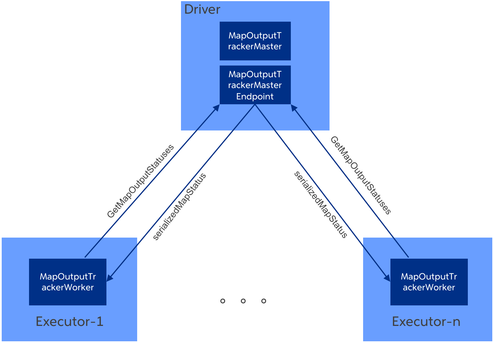
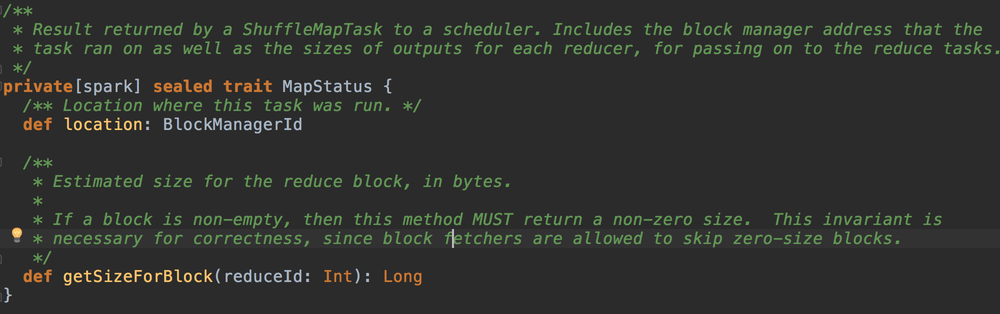
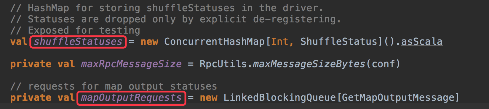
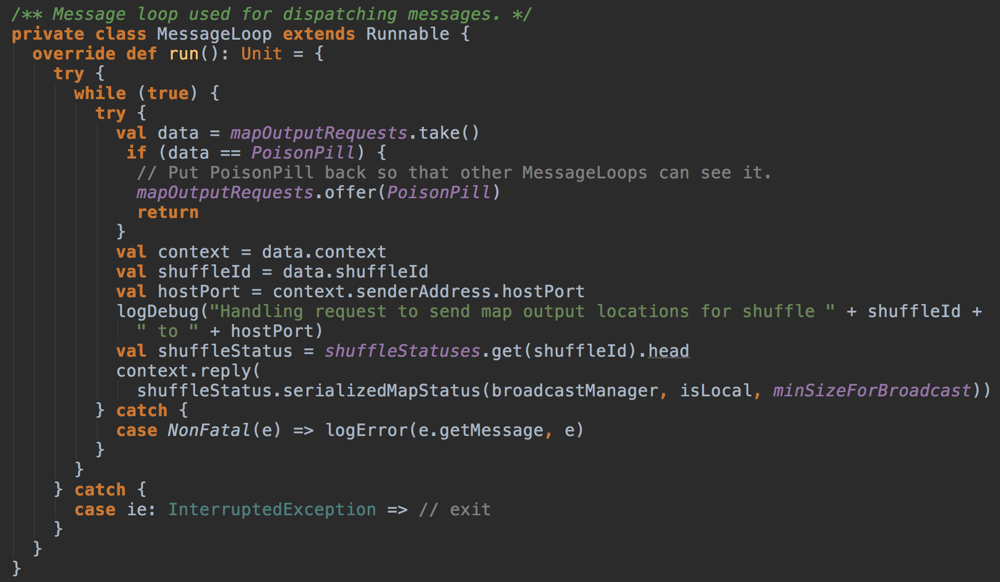
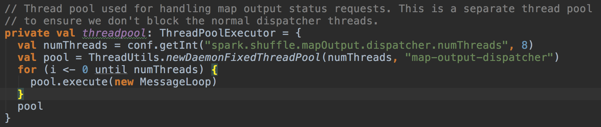
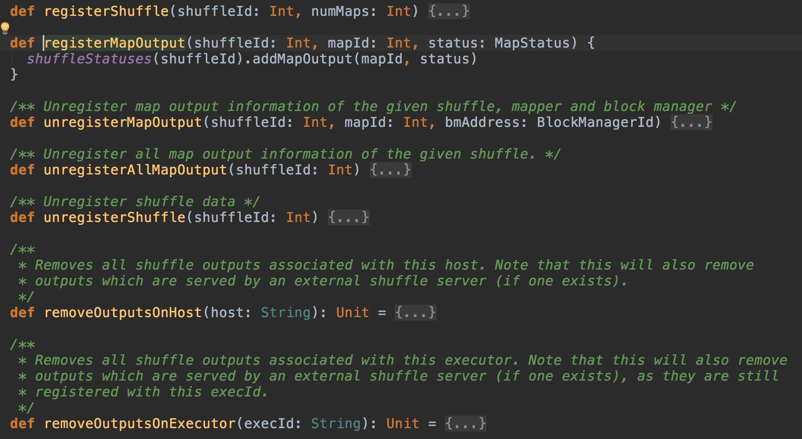
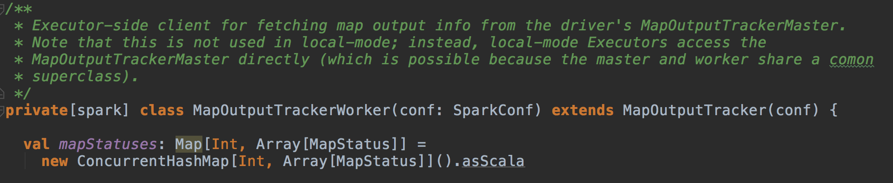
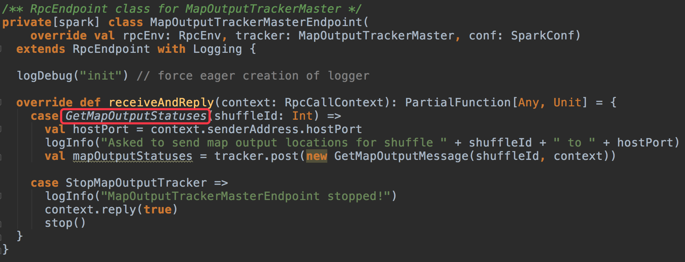

### 一、Shuffle输出追踪者——MapOutputTracker简介

这个组件作为shuffle的一个辅助组件，在整个shuffle模块中具有很重要的作用。我们在前面一系列的分析中，或多或少都会提到这个组件，比如在DAGScheduler提交一个stage时会将这个stage封装成一个任务集（TaskSet），但是可能有的分区已经计算过了，有了结果（stage由于失败可能会多次提交，其中有部分task可能已经计算完成），这些分区就不需要再次计算，而只需要计算那些失败的分区，那么很显然需要有一个组件来维护shuffle过程中的任务失败成功的状态，以及计算结果的位置信息。

此外，在shuffle读取阶段，我们知道一个reduce端的分区会依赖于多个map端的分区的输出数据，那么我们在读取一个reduce分区对应的数据时，就需要知道这个reduce分区依赖哪些map分区，每个block的物理位置是什么，blockId是什么，这个block中属于这个reduce分区的数据量大小是多少，这些信息的记录维护都是靠MapOutputTracker来实现的。

MapOutPutTrackerMaster负责跟踪所有的Mapper输出的。

当执行第二个 Stage 时，第二个 Stage 会向 Driver 中的 MapOutputTrackerMasterEndpoint 发消息请求上一个 Stage 中相应的输出，此時 MapOutputTrackerMaster 会把上一個 Stage 的输出数据的元数据信息发送给当前请求的 Stage。

MapOutputTracker是spark环境的主要组件之一，其功能是管理各个shuffleMapTask的输出数据。reduce任务就是根据MapOutputTracker提供的信息决定从哪些executor获取需要的map输出数据。MapOutputTracker的架构如下图所示：




如上图所示，MapOutputTracker在executor和driver端都存在。


MapOutputTracker.scala

MapOutputTracker组件的主要功能类和辅助类全部在这个文件中，我先大概说一下各个类的主要作用，然后重点分析关键的类。

1. ShuffleStatus，这个类是对一个stage的shuffle输出状态的封装，它内部的一个主要的成员mapStatuses是一个数组，这个数组的下标就是map的分区序号，存放了每个map分区的输出情况，关于MapStatus具体可以看MapStatus.scala，这里不打算展开。

2. MapOutputTrackerMessage，用于rpc请求的消息类，有两个实现类：GetMapOutputStatuses用于获取某次shuffle的所有输出状态；StopMapOutputTracker用于向driver端的发送停止MapOutputTrackerMasterEndpoint端点的请求。

3. MapOutputTrackerMasterEndpoint，如果熟悉spark的rpc模块的话，对这个类应该就很熟悉，它就是一个rpc服务端，通过向RpcEnv注册自己，通过一个名称标识自己，从而接收到特定一些消息，也就是上面说的两种消息。

4. MapOutputTracker，这个类是一个抽象类，只是定义了一些操作接口，它的一个最重要的作用可能就是内部维护了一个序列值epoch，这个值表示某一个一致的全局map输出状态，一旦有map输出发生变更，这个值就要加一，executor端会同步最新的epoch以判断自己的map输出状态的缓存是否过期。

5. MapOutputTrackerMaster，运行在driver端，实现类MapOutputTracker的大部分功能，是最核心的类

6. MapOutputTrackerWorker，运行在executor端，主要作用是封装了rpc调用的逻辑。
总的来看，最核心的类是MapOutputTrackerMaster，其他的类都是围绕这个类的一些辅助类，所以我们重点分析MapOutputTrackerMaster，其他的类我不打算深入展开，相信读者自己也能够较为轻松地理解。

1. MapOutputTrackerMaster和MapOutputTrackerMasterEndpoint存在于driver端

2. MapOutputTrackerMasterEndpoint是MapOutputTrackerMaster的RPC endpoint

3. MapOutputTrackerWorker存在于executor端

4. MapOutputTrackerMaster负责管理所有shuffleMapTask的输出数据，每个shuffleMapTask执行完后会把执行结果（MapStatus对象）注册到MapOutputTrackerMaster.

5. MapOutputTrackerMaster会处理executor发送的GetMapOutputStatuses请求，并返回serializedMapStatus给executor端

6. MapOutputTrackerWorker负责为reduce任务提供shuffleMapTask的输出数据信息（MapStatus对象）

7. 如果MapOutputTrackerWorker在本地没有找到请求的shuffle的mapStatuses，则会向MapOutputTrackerMasterEndpoint发送GetMapOutputStatuses请求获取对应的mapStatuses


MapOutputTracker是基于Master/Slave的架构，Master（Driver）负责存储当前Application上所有Shuffle的Map输出元数据信息，而Slave（Executor）可以通过rpc对Master上的Map输出状态信息进行查询。

### 注册Shuffle

在DAGScheduler使用createShuffleMapStage方法为当前的ShuffleDependency创建对应的ShuffleMapStage时，最后会调用MapOutputTracker.registerShuffle方法注册当前的shuffle，用于保存ShuffleMapStage上所有分区的MapStatus。

```scala
def registerShuffle(shuffleId: Int, numMaps: Int) {
  if (mapStatuses.put(shuffleId, new Array[MapStatus](numMaps)).isDefined) {
    throw new IllegalArgumentException("Shuffle ID " + shuffleId + " registered twice")
  }
  // add in advance
  shuffleIdLocks.putIfAbsent(shuffleId, new Object())
}
```

### 注册Map输出

当某个ShuffleMapStage运行完成，那么会调用MapOutputTracker.registerMapOutputs方法，将当前ShuffleMapStage中每个分区的计算结果（这些结果并不是真实的数据，而是这些数据所在的位置、大小等元数据信息）进行保存，并增加纪元号。这样依赖该ShuffleMapStage的其他ShuffleMapStage或ResultStage就可以通过这些元数据信息获取其需要的数据。

```scala
def registerMapOutputs(shuffleId: Int, statuses: Array[MapStatus], changeEpoch: Boolean = false) {
  mapStatuses.put(shuffleId, statuses.clone())
  if (changeEpoch) {
    incrementEpoch()
  }
}
```
如果执行器自己存储block（没有开启外部shuffle服务），并且如果执行器丢失导致所有相关的所有shuffle blocks丢失、或者执行器所在slave丢失，或者其他原因导致FetchFailed发生，在这种情况下，我们会假定所有与执行器相关的数据都已经丢失。这时就会移除当前Stage与此执行器相关的所有输出，并调用MapOutputTracker.registerMapOutputs方法更新当前ShuffleMapStage相关的信息。

### 获取Map输出状态

在BlockStoreShuffleReader中，会调用mapOutputTracker.getMapSizesByExecutorId方法获取一组二元组序列Seq[(BlockManagerId, Seq[(BlockId, Long)])]，第一项代表了BlockManagerId，第二项描述了存储于该BlockManager上的一组shuffle blocks。

1. 首先查看本地缓存中是否有shuffle数据，如果没有则从远程拉取；

2. 数据结构fetching存储了当前正在fetch的shuffleId，如果fetching列表中包含了需要获取的shuffle，那么当前线程阻塞等待；否则，将当前的shuffle加入到fetching列表中。

3. 接着调用askTracker方法，向MapOutputTrackerMaster发送GetMapOutputStatuses消息，并阻塞等待结果。

4. MapOutputTrackerMaster接收到该消息后，会调用getSerializedMapOutputStatuses方法，查询本地记录shuffle对应的Map输出状态。

5. 在获取的过程中需要为每个shuffleId分配一个分段锁，因为这里支持并发调用，同一时间有多个线程需要获取同一个shuffleId对应的输出，所以需要保证Map元数据信息只序列化或者广播一次。所以在获取锁之前和得到锁之后都需要再次查询一下缓存，可能有其他线程已经缓存了MapStatus。

6. 如果缓存还是为空，则需要将MapStatus序列化或者包装为Broadcast。对于序列化还是广播，通过比较序列化后的结果大小是否超出spark.shuffle.mapOutput.minSizeForBroadcast，默认值为512K。

7. 序列化完成后，将此结果进行缓存，并向MapOutputTrackerWorker返回结果。

8. MapOutputTrackerWorker的askTracker接收到返回的结果后结束阻塞，将数据反序列化并返回。

9. 最后根据执行的分区范围[startPartition, endPartition]将返回的结果Array[MapStatus]转换成Seq[(BlockManagerId, Seq[(BlockId, Long)])]。


###二、MapStatus和ShuffleStatus

MapStatus用于表示ShuffleMapTask的运行结果, 包括map任务输出数据的location和size信息：



ShuffleStatus用于管理一个shuffle对应的所有ShuffleMapTask的运行结果，ShuffleStatus对象只存在于MapOutputTrackerMaster中。

每个ShuffleStatus对象都包含一个mapStatuses数组，该数组的元素类型为MapStatus，数组下标即shuffleMapTask的map id。

ShuffleStatus提供了一系列用于添加，移除，序列化，缓存和广播mapStatus的方法。比如：

1. invalidateSerializedMapOutputStatusCache方法用于清空mapStatuses的缓存，包括移除对应的广播变量。

2. serializeMapStatuses方法用于序列化并广播mapStatuses数组

###三、MapOutputTrackerMaster

#### shuffleStatus映射和GetMapOutputMessage请求队列

MapOutputTrackerMaster是driver端用于管理所有shuffle的map任务输出数据的组件。MapOutputTrackerMaster维护了一个ShuffleStatus映射和一个GetMapOutputMessage请求队列：



GetMapOutputMessage由GetMapOutputStatuses转化而来，后面介绍MapOutputTrackerMasterEndpoint时会讲到。shuffleStatuses保存着shuffle id和shuffleStatus的mapping关系，而mapOutputRequests则保存着该MapOutputTrackerMaster所有未处理的GetMapOutputMessage请求。注意，这里使用了LinkedBlockingQueue进行存储，很容易想到，这个队列会被多个线程并发访问。

####MessageLoop和请求处理线程池

MapOutputTrackerMaster用MessageLoop来处理mapOutputRequests队列中的请求：



messageLoop会循环地从mapOutputRequests队列中获取GetMapOutputMessage请求进行处理，处理完后会调用RpcCallContext的reply方法将序列化后的shuffleStatus返回给客户端。messageLoop会一直循环处理请求，直到获取到PoisonPill消息，而这个消息是MapOutputTrackerMaster的stop方法发出的。

上文提到mapOutputRequests队列会被多个线程并发访问，这是因为MapOutputTrackerMaster创建了一个线程池并发运行多个messageLoop. 线程池的大小由参数spark.shuffle.mapOutput.dispatcher.numThreads控制，默认为8 :



####添加/移除shuffle和mapOutput

MapOutputTrackerMaster中包含了一系列用于添加/移除，注册/注销shuffle和map output的方法：




###四、MapOutputTrackerWorker

如上文所述，MapOutputTrackerWorker存在于executor端，其主要功能是从MapOutputTrackerMaster获取map output信息（mapStatuses）：



MapOutputTrackerWorker也维护了一个mapStatuses对象。注意，MapOutputTrackerWorker的mapStatuses和MapOutputTrackerMaster中shuffleStatus里面的mapStatuses是不同类型的。

shuffleStatus中mapStatuses的类型是Array[MapStatus]，数组下标是shuffle中的map id.

而MapOutputTrackerWorker中mapStatuses的类型是Map[Int, Array[MapStatus]]，key为shuffle id，value就是该shuffle对应的mapStatuses.

###五、MapOutputTrackerMasterEndpoint

MapOutputTrackerMasterEndpoint是MapOutputTrackerMaster的RPC endpoint，只存在于driver端。所有发送给MapOutputTrackerMaster的GetMapOutputStatuses请求都由MapOutputTrackerMasterEndpoint接收，转化成GetMapOutputMessage并添加到MapOutputTrackerMaster的mapOutputRequests队列中等待messageLoop处理：



###六、源码
MapOutputTrackerMaster

+ findMissingPartitions
```scala
这个方法会在DAGScheduler封装任务集的时候查找一个stage需要计算的分区时会调用到。

   def findMissingPartitions(shuffleId: Int): Option[Seq[Int]] = {
   shuffleStatuses.get(shuffleId).map(_.findMissingPartitions())
   }
ShuffleStatus.findMissingPartitions

  def findMissingPartitions(): Seq[Int] = synchronized {
  val missing = (0 until numPartitions).filter(id => mapStatuses(id) == null)
  assert(missing.size == numPartitions - _numAvailableOutputs,
    s"${missing.size} missing, expected ${numPartitions - _numAvailableOutputs}")
  missing
  }
```
这两段代码很简单，不用多说，就是从map结构中查找。

此外，像registerShuffle，registerMapOutput，unregisterMapOutput，unregisterShuffle，removeOutputsOnHost等等，我们可以看到这几个方法本身都是很简答的，无非就是对内部map结构的插入，更新和查找，关键的是你要清楚这些方法的调用时机是什么？弄清这一点，会让我们对MapOutputTracker在整个spark框架中的作用和充当的角色有更深的理解。方法的调用地点，通过Idea这类IDE工具其实都可以很简单地定位到，这里我不做过多展开，仅仅简单地概括一下：

>registerShuffle， DAGScheduler在创建一个ShuffleMapStage时会顺便把这个stage对应的shuffle注册进来。
>registerMapOutput， 在一个shuffleMapTask任务完成后，会把map输出的信息注册进来。
>removeOutputsOnHost，将某个host上的相关map输出信息全部移除，一般在主机丢失时调用此操作
>removeOutputsOnExecutor，同样地，将某个executor上的相关map输出信息全部移除，一般在executor丢失时调用此操作

+ getMapSizesByExecutorId

我们来看另一个比较重要的方法，在reduce阶段读取数据时，一个task首先需要知道它依赖于哪些map输出，这时它回想driver端的MapOutputTrackerMasterEndpoint组件发送一个获取map输出的消息，经过一系列方法调用最终会调用这个方法：
```scala
def getMapSizesByExecutorId(shuffleId: Int, startPartition: Int, endPartition: Int)
  : Seq[(BlockManagerId, Seq[(BlockId, Long)])] = {
logDebug(s"Fetching outputs for shuffle $shuffleId, partitions $startPartition-$endPartition")
shuffleStatuses.get(shuffleId) match {
  case Some (shuffleStatus) =>
    // 将所有的mapStatus数组转换成(BlockManagerId, Seq[(BlockId, Long)])对象
    shuffleStatus.withMapStatuses { statuses =>
      MapOutputTracker.convertMapStatuses(shuffleId, startPartition, endPartition, statuses)
    }
  case None =>
    Seq.empty
}
}
```

+ MapOutputTracker.convertMapStatuses:将每个map分区输出切分成reduce分区数量，最后产生的(BlockId, Long)元组数量等于map分区数量*reduce分区数量。

```scala
def convertMapStatuses(
  shuffleId: Int,
  startPartition: Int,
  endPartition: Int,
  statuses: Array[MapStatus]): Seq[(BlockManagerId, Seq[(BlockId, Long)])] = {
assert (statuses != null)
// 用于存放结果
val splitsByAddress = new HashMap[BlockManagerId, ArrayBuffer[(BlockId, Long)]]
// 最后产生的(BlockId, Long)元组数量等于map分区数量*reduce分区数量
for ((status, mapId) <- statuses.zipWithIndex) {
  if (status == null) {
    val errorMessage = s"Missing an output location for shuffle $shuffleId"
    logError(errorMessage)
    throw new MetadataFetchFailedException(shuffleId, startPartition, errorMessage)
  } else {
    for (part <- startPartition until endPartition) {
      splitsByAddress.getOrElseUpdate(status.location, ArrayBuffer()) +=
        ((ShuffleBlockId(shuffleId, mapId, part), status.getSizeForBlock(part)))
    }
  }
}

splitsByAddress.toSeq
}
```

+ getPreferredLocationsForShuffle

我们来看另外一个比较重要的方法。我们知道reduce端的分区一般会依赖于多个map端分区输出，但是对于每个map分区依赖的数据量是不同的，举个极端的例子，假设reduce端某个分区依赖于10个map端的输出分区，但是其中一个分区依赖的数据有10000条，而其他分区依赖的数据只有1条，这种情况下，显然我们应该吧这个reduce任务优先调度到那个依赖了10000条的executor上。当然这个例子举得很简单，可能也不是什么准确，但是也足够说明这个方法的作用。

```scala
def getPreferredLocationsForShuffle(dep: ShuffleDependency[_, _, _], partitionId: Int)
  : Seq[String] = {
// 首先判断几个参数配置，如果都符合条件，那么再进行偏向位置的计算
if (shuffleLocalityEnabled && dep.rdd.partitions.length < SHUFFLE_PREF_MAP_THRESHOLD &&
    dep.partitioner.numPartitions < SHUFFLE_PREF_REDUCE_THRESHOLD) {
  // 关键调用
  val blockManagerIds = getLocationsWithLargestOutputs(dep.shuffleId, partitionId,
    dep.partitioner.numPartitions, REDUCER_PREF_LOCS_FRACTION)
  if (blockManagerIds.nonEmpty) {
    blockManagerIds.get.map(_.host)
  } else {
    Nil
  }
} else {
  Nil
}
}
```
可以看出来，关键的方法是getLocationsWithLargestOutputs，接下来，我们就来看一下这个方法：
注释已经说得很清楚，这个方法的逻辑很简单，比如一个reduce端分区要读取的总数据量是100m, 某个executor上的所有map输出中与这个reduce分区相关的数据加起来有20m，即超过了总量的0.2，这时这个executor就能够成为偏向位置，是不是很简单。但是这里应该注意到一个问题，这个方法是以executor为最小单位计算偏向位置，而在前一个方法getPreferredLocationsForShuffle中，获取到成为偏向位置的那些BlockManagerId后，仅仅是取出了host作为偏向位置返回给上层调用者，问题在于一个host(即物理节点)上可能有多个executor，这就会造成返回的结果中会有重复的host，；另外，既然返回host作为偏向位置，那为什么不直接以host作为最小单位来计算偏向位置呢，比如将一个host上所有与这个reduce分区相关的数据加起来，如果超过0.2的占比就认为这个host能够作为偏向位置，这样好像更合理，也更容易产生偏向位置。举个极端的例子，一个host上运行了5个executor，每个executor与分区相关的数据占比0.1，另外有5个host上每个都只运行了一个executor，他们的数据占比均为0.1，这种情况下是不会产生偏向位置的，但是实际上显然应该将那个拥有5个executor的host作为偏向位置。

```scala
def getLocationsWithLargestOutputs(
  shuffleId: Int,
  reducerId: Int,
  numReducers: Int,
  fractionThreshold: Double)
: Option[Array[BlockManagerId]] = {

val shuffleStatus = shuffleStatuses.get(shuffleId).orNull
// 对shuffleStatus非空检查
if (shuffleStatus != null) {
  shuffleStatus.withMapStatuses { statuses =>
    // 对mapStatus数组的非空检查
    if (statuses.nonEmpty) {
      // HashMap to add up sizes of all blocks at the same location
      // 记录每个executor上的所有map输出的block中属于这个reduce端分区的数据量
      val locs = new HashMap[BlockManagerId, Long]
      var totalOutputSize = 0L
      var mapIdx = 0
      while (mapIdx < statuses.length) {
        val status = statuses(mapIdx)
        // status may be null here if we are called between registerShuffle, which creates an
        // array with null entries for each output, and registerMapOutputs, which populates it
        // with valid status entries. This is possible if one thread schedules a job which
        // depends on an RDD which is currently being computed by another thread.
        if (status != null) {
          val blockSize = status.getSizeForBlock(reducerId)
          if (blockSize > 0) {
            locs(status.location) = locs.getOrElse(status.location, 0L) + blockSize
            totalOutputSize += blockSize
          }
        }
        mapIdx = mapIdx + 1
      }
      // 最后，判断一个executor能否成为偏向位置的条件是：
      // 这个executor上所有与这个reduce分区相关的数据大小与这个分区数据总量的比值是否大于一个阈值
      // 这个阈值默认是0.2
      val topLocs = locs.filter { case (loc, size) =>
        size.toDouble / totalOutputSize >= fractionThreshold
      }
      // Return if we have any locations which satisfy the required threshold
      if (topLocs.nonEmpty) {
        return Some(topLocs.keys.toArray)
      }
    }
  }
}
None
}
```

###七、总结

简单总结一下map输出追踪器的作用：

+ 维护所有shuffle的map输出状态信息，位置信息等
+ 查找某个stage还有哪些未计算的分区
+ 获取reduce分区的偏向位置
+ 获取reduce分区依赖哪些map输出，他们的位置，每个map输出中相关数据的大小