##Spark 的 shuffle 过程（shuffle write）


##什么时候需要 shuffle writer

文中 窄依赖 就是指 Narrow Dependency， 宽依赖就是指 Wide Dependency，  宽依赖也称为 shuffle Dependency， 下文图中标识 S 打头，例如 S_X。

根据宽依赖和窄依赖， 整个job，会划分为不同的stage, 像是用篱笆隔开了一样， 如果中间有宽依赖，就用刀切一刀， 前后划分为两个 stage。

stage 分为两种， ResultStage 和 ShuffleMapStage， spark job 中产生结果最后一个阶段生成的stage 是ResultStage ， 中间阶段生成的stage 是 ShuffleMapStage。属于 ResultStage 的Task都是 ResultTask ， 属于 ShuffleMapStage 的Task都是 ShuffleMapTask。

假如我们有个 spark job 依赖关系如下

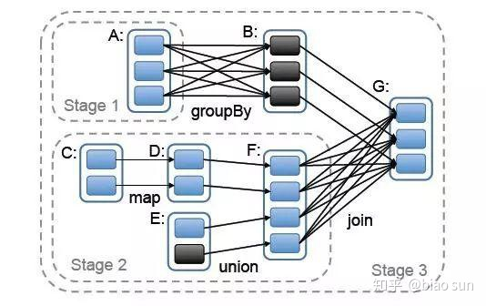


我们抽象出来其中的rdd和依赖关系

E <-------n------,
                  \
C <--n---D---n-----F--s---,
                           \
A <-------s------ B <--n----`-- G

对应的 划分后的RDD结构为：

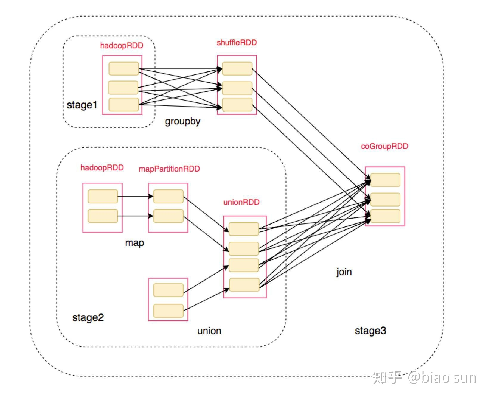
最终我们得到了整个执行过程：

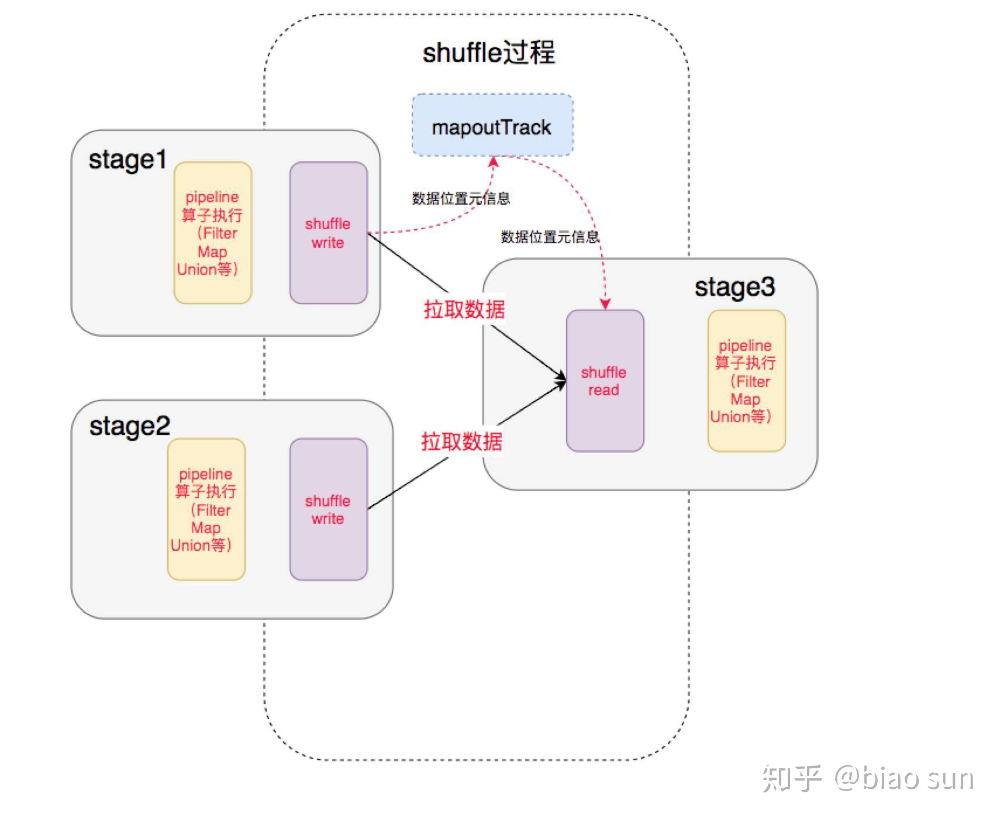

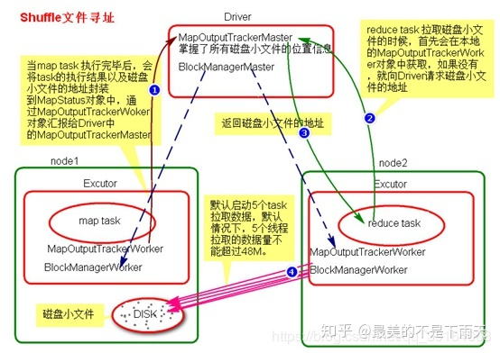

中间就涉及到shuffle 过程，前一个stage 的 ShuffleMapTask 进行 shuffle write， 把数据存储在 blockManager 上面， 并且把数据位置元信息上报到 driver 的 mapOutTrack 组件中， 下一个 stage 根据数据位置元信息， 进行 shuffle read， 拉取上个stage 的输出数据。

1. maptask 执行完毕后会把task执行结果和磁盘的小文件地址封装到MapStatus对象中，通过Executor中的MapOutputTrackerWorker对象向Driver中的MapOutputTrackerMaster汇报。MapOutputTracker使用来管理小文件地址的。

2. reduce task拉取数据的时候会先在本地的MapOutputTackerWorker中的获取，如果没有则向Driver的MapOutputTackerWorker请求小文件地址

3. Driver会返回请求的磁盘小文件地址

4. 获取到磁盘小文件地址后，会通过BlockManagerWorker中的ConnectionManager连接到对应的BlockManager

5. 然后通过BlockManagerWorker中的BlockTransferService传输数据，默认启动5个task拉取数据，拉取数据量不可以超过48MB

这边文章讲述的就是其中的 shuffle write 过程。

## spark shuffle 演进的历史

+ Spark 0.8及以前 Hash Based Shuffle
+ Spark 0.8.1 为Hash Based Shuffle引入File Consolidation机制
+ Spark 0.9 引入ExternalAppendOnlyMap
+ Spark 1.1 引入Sort Based Shuffle，但默认仍为Hash Based Shuffle
+ Spark 1.2 默认的Shuffle方式改为Sort Based Shuffle
+ Spark 1.4 引入Tungsten-Sort Based Shuffle
+ Spark 1.6 Tungsten-sort并入Sort Based Shuffle
+ Spark 2.0 Hash Based Shuffle退出历史舞台

总结一下，就是最开始的时候使用的是 Hash Based Shuffle， 这时候每一个Mapper会根据Reducer的数量创建出相应的bucket，bucket的数量是M R ，其中M是Map的个数，R是Reduce的个数。这样会产生大量的小文件，对文件系统压力很大，而且也不利于IO吞吐量。后面忍不了了就做了优化，把在统一core上运行的多个Mapper 输出的合并到同一个文件，这样文件数目就变成了 cores*R 个了。


##Shuffle进展

在Spark 1.2以前，默认的shuffle计算引擎是HashShuffleManager。该ShuffleManager而HashShuffleManager有着一个非常严重的弊端，就是会产生大量的中间磁盘文件，进而由大量的磁盘IO操作影响了性能。

在Spark 1.2以后的版本中，默认的ShuffleManager改成了SortShuffleManager。SortShuffleManager相较于HashShuffleManager来说，有了一定的改进。主要就在于，每个Task在进行shuffle操作时，虽然也会产生较多的临时磁盘文件，但是最后会将所有的临时文件合并（merge）成一个磁盘文件，因此每个Task就只有一个磁盘文件。在下一个stage的shuffle read task拉取自己的数据时，只要根据索引读取每个磁盘文件中的部分数据即可。

HashShuffleManager（spark 2.x弃用）

**未经优化的HashShuffleManager **

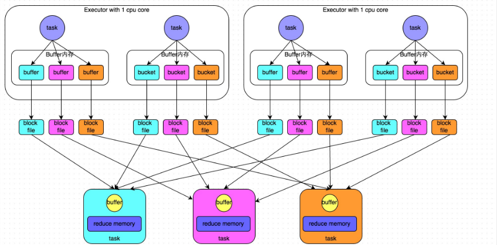

上游的stage的task对相同的key执行hash算法，从而将相同的key都写入到一个磁盘文件中，而每一个磁盘文件都只属于下游stage的一个task。在将数据写入磁盘之前，会先将数据写入到内存缓冲，当内存缓冲填满之后，才会溢写到磁盘文件中。但是这种策略的不足在于，下游有几个task，上游的每一个task都就都需要创建几个临时文件，每个文件中只存储key取hash之后相同的数据，导致了当下游的task任务过多的时候，上游会堆积大量的小文件。


举个例子：

本来是这样的，3个 map task， 3个 reducer， 会产生 9个小文件，

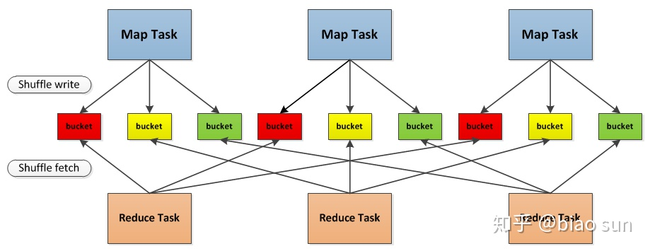

4个map task， 4个reducer， 如果不使用 Consolidation机制， 会产生 16个小文件。


**经过优化的hashShuffle**

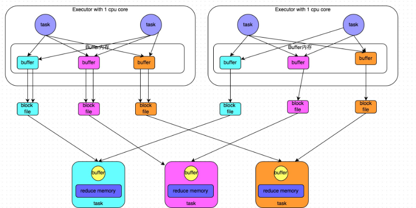

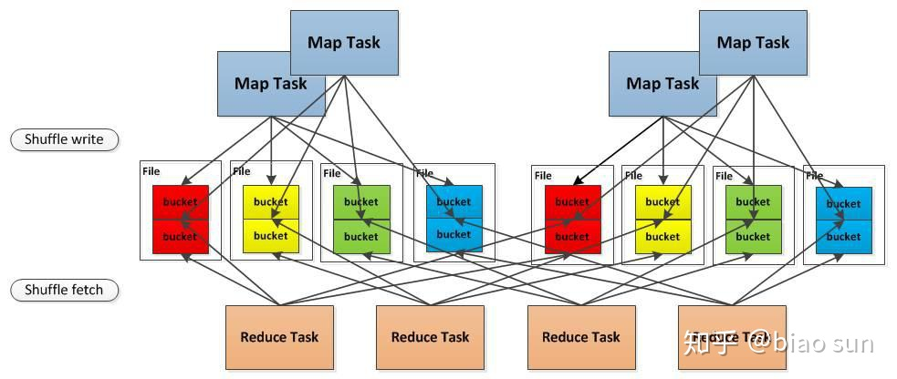

优化一个executor上task的输出文件，同一个executor中的所有Map Task将同一个Reducer的输出文件合并到一起。

在同一个 core 上先后运行的两个 map task的输出， 对应同一个文件的不同的 segment上， 称为一个 FileSegment， 形成一个 ShuffleBlockFile。

针对上面的第一个问题，Spark 做了改进，引入了 File Consolidation 机制。

一个 Executor 上所有的 Map Task 生成的分区文件只有一份，即将所有的 Map Task 相同的分区文件合并，这样每个 Executor 上最多只生成 N 个分区文件。

一个Executor的一个分区（reduce的一个task）占据一个文件。

注意：如果想使用优化之后的ShuffleManager，需要将：spark.shuffle.consolidateFiles调整为true。（当然，默认是开启的）

未经优化：     上游的task数量：m   ，  下游的task数量：n    ， 上游的executor数量：k (m>=k)   ，  总共的磁盘文件：m*n

优化之后的： 上游的task数量：m    ，  下游的task数量：n   ， 上游的executor数量：k (m>=k)   ，  总共的磁盘文件： k*n


**Sort Shuffle V1**

为了更好地解决上面的问题，Spark 参考了 MapReduce 中 Shuffle 的处理方式，引入基于排序的 Shuffle 写操作机制。

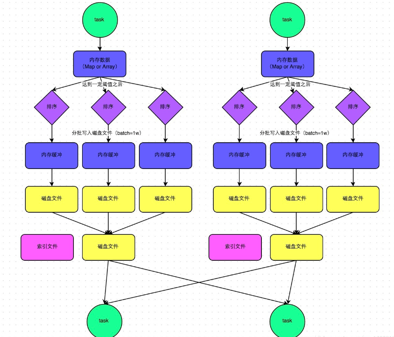

每个 Task 不会为后续的每个 Task 创建单独的文件，而是将所有对结果写入同一个文件。该文件中的记录首先是按照 Partition Id 排序，每个 Partition 内部再按照 Key 进行排序，Map Task 运行期间会顺序写每个 Partition 的数据，同时生成一个索引文件记录每个 Partition 的大小和偏移量。

在 Reduce 阶段，Reduce Task 拉取数据做 Combine 时不再是采用 HashMap，而是采用ExternalAppendOnlyMap，该数据结构在做 Combine 时，如果内存不足，会刷写磁盘，很大程度的保证了鲁棒性，避免大数据情况下的 OOM。

总体上看来 Sort Shuffle 解决了 Hash Shuffle 的所有弊端，但是因为需要其 Shuffle 过程需要对记录进行排序，所以在性能上有所损失。


**SortShuffle普通机制**

SortShuffleManager的运行机制主要分成两种，一种是普通运行机制，另一种是bypass运行机制。当shuffle read task的数量小于等于spark.shuffle.sort.bypassMergeThreshold参数的值时（默认为200），就会启用bypass机制。

shuffle write：mapper阶段，上一个stage得到最后的结果写出

shuffle read ：reduce阶段，下一个stage拉取上一个stage进行合并

每个 Task 不会为后续的每个 Task 创建单独的文件，而是将所有对结果写入同一个文件。该文件中的记录首先是按照 Partition Id 排序，每个 Partition 内部再按照 Key 进行排序，Map Task 运行期间会顺序写每个 Partition 的数据，同时生成一个索引文件记录每个 Partition 的大小和偏移量。

在 Reduce 阶段，Reduce Task 拉取数据做 Combine 时不再是采用 HashMap，而是采用ExternalAppendOnlyMap，该数据结构在做 Combine 时，如果内存不足，会刷写磁盘，很大程度的保证了鲁棒性，避免大数据情况下的 OOM。

总体上看来 Sort Shuffle 解决了 Hash Shuffle 的所有弊端，但是因为需要其 Shuffle 过程需要对记录进行排序，所以在性能上有所损失。

数据先写入内存数据结构（reduceByKey—Map）,每写一条数据，判断是否达到某个临界值，达到则根据key对数据排序，再溢出到磁盘。写入磁盘通过java的BufferedOutputStream实现，先缓存到内存，满后一次写入磁盘文件。合并所有临时磁盘文件（merge），归并排序，依次写入同一个磁盘文件，单独写一份索引文件，标识下游各个task的数据在文件中的start and end。

在普通模式下，数据会先写入一个内存数据结构中，此时根据不同的shuffle算子，可以选用不同的数据结构。如果是由聚合操作的shuffle算子，就是用map的数据结构（边聚合边写入内存），如果是join的算子，就使用array的数据结构（直接写入内存）。接着，每写一条数据进入内存数据结构之后，就会判断是否达到了某个临界值，如果达到了临界值的话，就会尝试的将内存数据结构中的数据溢写到磁盘，然后清空内存数据结构。

在溢写到磁盘文件之前，会先根据key对内存数据结构中已有的数据进行排序，排序之后，会分批将数据写入磁盘文件。默认的batch数量是10000条，也就是说，排序好的数据，会以每批次1万条数据的形式分批写入磁盘文件，写入磁盘文件是通过Java的BufferedOutputStream实现的。BufferedOutputStream是Java的缓冲输出流，首先会将数据缓冲在内存中，当内存缓冲满溢之后再一次写入磁盘文件中，这样可以减少磁盘IO次数，提升性能。

此时task将所有数据写入内存数据结构的过程中，会发生多次磁盘溢写，会产生多个临时文件，最后会将之前所有的临时文件都进行合并，最后会合并成为一个大文件。最终只剩下两个文件，一个是合并之后的数据文件，一个是索引文件（标识了下游各个task的数据在文件中的start offset与end offset）。最终再由下游的task根据索引文件读取相应的数据文件。

自己的理解：sortshuffle机制就是先将数据写入到内存缓存，缓存达到阈值进行磁盘溢写，磁盘溢写是分批次进行的，并且在溢写之前对key进行排序。这样就形成了很多的批次排序磁盘文件，然后将这些批次key排序磁盘文件进行合并，就形成了一个task的总的key的排序文件，在为这个key排序文件创建个索引文件，这样下一个stage的task就可以根据索引去文件中拉取自己的数据了。

磁盘文件数量 = 上游stage的task数量

**SortShuffle 的 ByPass 机制**


此时上游stage的task会为每个下游stage的task都创建一个临时磁盘文件，并将数据按key进行hash，然后根据key的hash值，将key写入对应的磁盘文件之中。当然，写入磁盘文件时也是先写入内存缓冲，缓冲写满之后再溢写到磁盘文件的。最后，同样会将所有临时磁盘文件都合并成一个磁盘文件，并创建一个单独的索引文件。

bypass不排序，还是用hash去为key分磁盘文件，分完之后再合并，形成一个索引文件和一个合并后的key hash文件。省掉了排序的性能。

bypass机制与普通SortShuffleManager运行机制的不同在于：

　　a、磁盘写机制不同；

　　b、不会进行排序。

也就是说，启用该机制的最大好处在于，shuffle write过程中，不需要进行数据的排序操作，也就节省掉了这部分的性能开销。

 

触发bypass机制的条件：

+ shuffle map task的数量小于 spark.shuffle.sort.bypassMergeThreshold 参数的值（默认200）或者不是聚合类的shuffle算子（比如groupByKey）

+ 当reducer的task数量  < spark.sort.bypassMergeThreshold（200），shuffle write过程不排序，按未经优化的HashShuffleManager的方式write，最后将所有临时磁盘文件合并成一个，并创建索引文件


Task每次溢出写入磁盘，以追加的方式按照Hash写入到相应的Reduce Task中，最后在合并。


**Tungsten-Sort Based Shuffle / Unsafe Shuffle**

从 Spark 1.5.0 开始，Spark 开始了钨丝计划（Tungsten），目的是优化内存和CPU的使用，进一步提升spark的性能。由于使用了堆外内存，而它基于 JDK Sun Unsafe API，故 Tungsten-Sort Based Shuffle 也被称为 Unsafe Shuffle。

它的做法是将数据记录用二进制的方式存储，直接在序列化的二进制数据上 Sort 而不是在 Java 对象上，这样一方面可以减少内存的使用和 GC 的开销，另一方面避免 Shuffle 过程中频繁的序列化以及反序列化。在排序过程中，它提供 cache-efficient sorter，使用一个 8 bytes 的指针，把排序转化成了一个指针数组的排序，极大的优化了排序性能。

但是使用 Tungsten-Sort Based Shuffle 有几个限制，Shuffle 阶段不能有 aggregate 操作，分区数不能超过一定大小（2^24-1，这是可编码的最大 Parition Id），所以像 reduceByKey 这类有 aggregate 操作的算子是不能使用 Tungsten-Sort Based Shuffle，它会退化采用 Sort Shuffle。

**Sort Shuffle v2**

从 Spark-1.6.0 开始，把 Sort Shuffle 和 Tungsten-Sort Based Shuffle 全部统一到 Sort Shuffle 中，如果检测到满足 Tungsten-Sort Based Shuffle 条件会自动采用 Tungsten-Sort Based Shuffle，否则采用 Sort Shuffle。从Spark-2.0.0开始，Spark 把 Hash Shuffle 移除，可以说目前 Spark-2.0 中只有一种 Shuffle，即为 Sort Shuffle。使用基于排序的Shuffle主要解决了Shuffle过程中产生过多的文件和Writer Handler的缓存开销过大的问题，所以借鉴了Hadoop在Shuffle中的处理方式。所以在Sort Based Shuffle中，每个Shuffle Map Task不会为后续的每个任务创建单独的文件，而是会将所有结果写到同一个文件中，对应生成一个Index文件进行索引。通过这种机制避免了大量文件的产生，一方面可以减轻文件系统管理众多文件的压力, 另一方面可以减少Writer Handler的缓存所占用的内存大小，节省了内存的同时避免了GC的风险和频率。


##Shuffle Write

1. 在什么时候获取数据，Parent Stage 中的一个 ShuffleMapTask 执行完还是等全部 ShuffleMapTasks 执行完？
>当 Parent Stage 的所有 ShuffleMapTasks 结束后再 fetch。

2. 边获取边处理还是一次性获取完再处理？

>因为 Spark 不要求 Shuffle 后的数据全局有序，因此没必要等到全部数据 shuffle 完成后再处理，所以是边 fetch 边处理。

3. 获取来的数据存放到哪里？

> 刚获取来的 FileSegment 存放在 softBuffer 缓冲区，经过处理后的数据放在内存 + 磁盘上。内存使用的是AppendOnlyMap ，类似 Java 的HashMap，内存＋磁盘使用的是ExternalAppendOnlyMap，如果内存空间不足时，ExternalAppendOnlyMap可以将 records 进行 sort 后 spill（溢出）到磁盘上，等到需要它们的时候再进行归并

4. 怎么获得数据的存放位置？

>通过请求 Driver 端的 MapOutputTrackerMaster 询问 ShuffleMapTask 输出的数据位置。


现在2.1 分为三种writer， 分为 BypassMergeSortShuffleWriter， SortShuffleWriter 和 UnsafeShuffleWriter，顾名思义，大家应该可以对应上，我们本着过时不讲的原则， 本文中只描述这三种 writer 的实现细节， Hash Based Shuffle 已经退出历史舞台了，我就不讲了。

##三种 writer 的分类

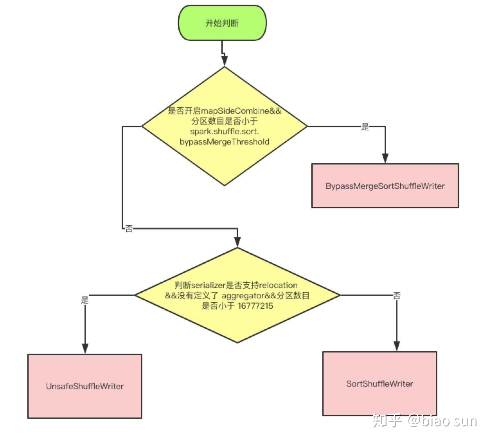

上面是使用哪种 writer 的判断依据， 是否开启 mapSideCombine 这个判断，是因为有些算子会在 map 端先进行一次 combine， 减少传输数据。 因为 BypassMergeSortShuffleWriter 会临时输出Reducer个（分区数目）小文件，所以分区数必须要小于一个阀值，默认是小于200。

UnsafeShuffleWriter需要Serializer支持relocation，Serializer支持relocation：原始数据首先被序列化处理，并且再也不需要反序列，在其对应的元数据被排序后，需要Serializer支持relocation，在指定位置读取对应数据。

**BypassMergeSortShuffleWriter 实现细节**

BypassMergeSortShuffleWriter和Hash Shuffle中的HashShuffleWriter实现基本一致， 唯一的区别在于，map端的多个输出文件会被汇总为一个文件。 所有分区的数据会合并为同一个文件，会生成一个索引文件，是为了索引到每个reduce分区的起始地址，可以随机 access 某个partition的所有数据。

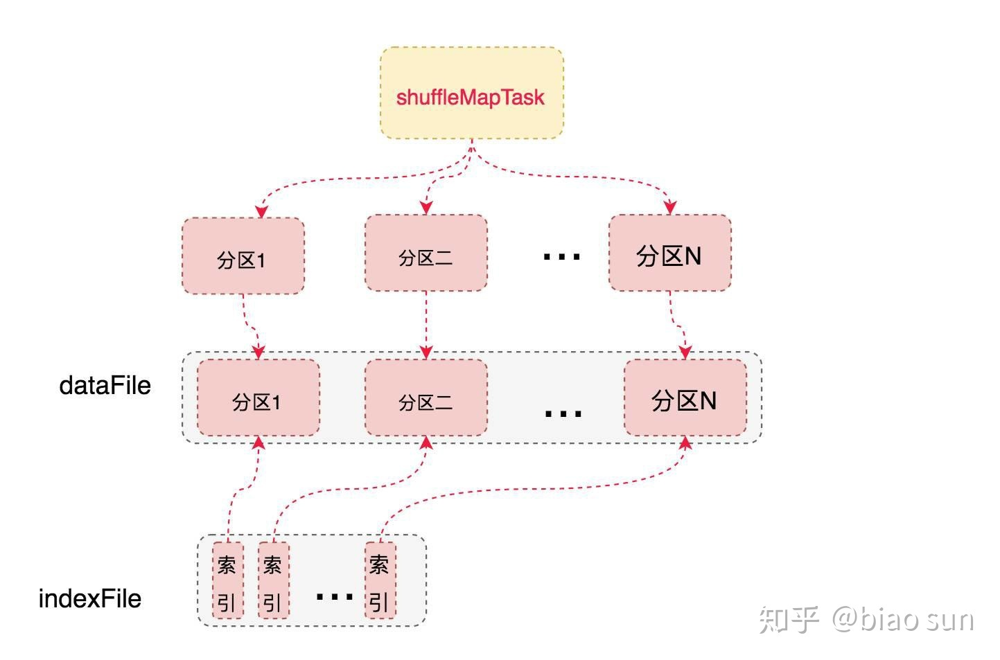

但是需要注意的是，这种方式不宜有太多分区，因为过程中会并发打开所有分区对应的临时文件，会对文件系统造成很大的压力。

具体实现就是给每个分区分配一个临时文件，对每个 record的key 使用分区器（模式是hash，如果用户自定义就使用自定义的分区器）找到对应分区的输出文件句柄，直接写入文件，没有在内存中使用 buffer。 最后copyStream方法把所有的临时分区文件拷贝到最终的输出文件中，并且记录每个分区的文件起始写入位置，把这些位置数据写入索引文件中。

**SortShuffleWriter 实现细节**

我们可以先考虑一个问题，假如我有 100亿条数据，但是我们的内存只有1M，但是我们磁盘很大， 我们现在要对这100亿条数据进行排序，是没法把所有的数据一次性的load进行内存进行排序的，这就涉及到一个外部排序的问题，我们的1M内存只能装进1亿条数据，每次都只能对这 1亿条数据进行排序，排好序后输出到磁盘，总共输出100个文件，最后怎么把这100个文件进行merge成一个全局有序的大文件。我们可以每个文件（有序的）都取一部分头部数据最为一个 buffer， 并且把这 100个 buffer放在一个堆里面，进行堆排序，比较方式就是对所有堆元素（buffer）的head元素进行比较大小， 然后不断的把每个堆顶的 buffer 的head 元素 pop 出来输出到最终文件中， 然后继续堆排序，继续输出。如果哪个buffer 空了，就去对应的文件中继续补充一部分数据。最终就得到一个全局有序的大文件。

如果你能想通我上面举的例子，就差不多搞清楚sortshufflewirter的实现原理了，因为解决的是同一个问题。

SortShuffleWriter 中的处理步骤就是

>这个partitionId是指reduce阶段的partitionId，因为这个是一个task，一个partionId。

+ 使用 PartitionedAppendOnlyMap 或者 PartitionedPairBuffer 在内存中进行排序，  排序的 K 是（partitionId， hash（key）） 这样一个元组。

+ 如果超过内存 limit， 我 spill 到一个文件中，这个文件中元素也是有序的，首先是按照 partitionId的排序，如果 partitionId 相同， 再根据 hash（key）进行比较排序

+ 如果需要输出全局有序的文件的时候，就需要对之前所有的输出文件 和 当前内存中的数据结构中的数据进行  merge sort， 进行全局排序

和我们开始提的那个问题基本类似，不同的地方在于，需要对 Key 相同的元素进行  aggregation， 就是使用定义的 func 进行聚合， 比如你的算子是 reduceByKey（+）, 这个func 就是加法运算， 如果两个key 相同， 就会先找到所有相同的key 进行 reduce(+) 操作，算出一个总结果 Result，然后输出数据（K，Result）元素。

SortShuffleWriter 中使用 ExternalSorter 来对内存中的数据进行排序，ExternalSorter内部维护了两个集合PartitionedAppendOnlyMap、PartitionedPairBuffer， 两者都是使用了 hash table 数据结构， 如果需要进行 aggregation， 就使用 PartitionedAppendOnlyMap（支持 lookup 某个Key，如果之前存储过相同key的K-V 元素，就需要进行 aggregation，然后再存入aggregation后的 K-V）， 否则使用 PartitionedPairBuffer（只进行添K-V 元素），

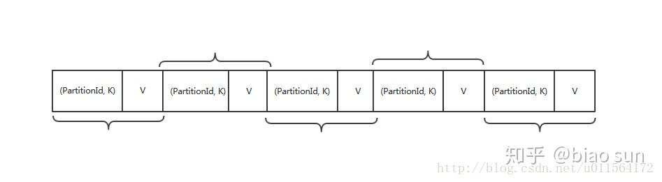

我们可以看上图， PartitionedAppendOnlyMap 中的 K 是（PatitionId, K）的元组， 这样就是先按照partitionId进行排序，如果 partitionId 相同，再按照  hash（key）再进行排序。

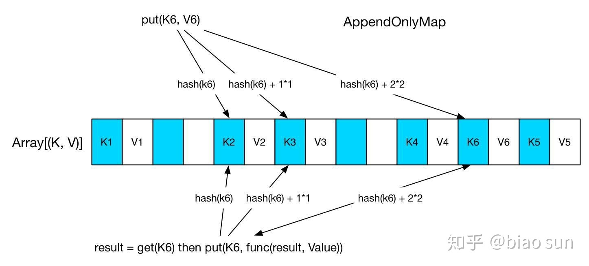

首先看下  AppendOnlyMap， 这个很简单就是个 hash table，其中的 K 是（PatitionId, hash（Key））的元组， 当要 put(K, V) 时，先 hash(K) 找存放位置，如果存放位置已经被占用，就使用 Quadratic probing 探测方法来找下一个空闲位置。对于图中的 K6 来说，第三次查找找到 K4 后面的空闲位置，放进去即可。get(K6) 的时候类似，找三次找到 K6，取出紧挨着的 V6，与先来的 value 做 func，结果重新放到 V6 的位置。

下面看下  ExternalAppendOnlyMap 结构， 这个就是内存中装不下所有元素，就涉及到外部排序，


上图中可以看到整个原理图，逻辑也很简单， 内存不够的时候，先spill了四次，输出到文件中的元素都是有序的，读取的时候都是按序读取，最后跟内存剩余的数据进行 全局merge。

merge 过程就是 每个文件读取部分数据（StreamBuffer）放到 mergeHeap 里面， 当前内存中的 PartitionedAppendOnlyMap 也进行 sort，形成一个 sortedMap 放在 mergeHeap 里面，  这个 heap 是一个 优先队列 PriorityQueue， 并且自定义了排序方式，就是取出堆元素StreamBuffer的head元素进行比较大小，

```scala
val heap = new mutable.PriorityQueue[Iter]()(new Ordering[Iter] {
      // Use the reverse of comparator.compare because PriorityQueue dequeues the max
      override def compare(x: Iter, y: Iter): Int = -comparator.compare(x.head._1, y.head._1)
    })
```
这样的话，每次从堆顶的 StreamBuffer 中 pop 出的 head 元素就是全局最小的元素（记住是按照（partitionId，hash（Key））排序的）， 如果需要 aggregation， 就把这些key 相同的元素放在一个一个 mergeBuffers 中，  第一个被放入 mergeBuffers 的 StreamBuffer 被称为 minBuffer，那么 minKey 就是 minBuffer 中第一个 record 的 key。当 merge-combine 的时候，与 minKey 有相同的Key的records 被 aggregate 一起，然后输出。

如果不需要 aggregation， 那就简单了， 直接把 堆顶的 StreamBuffer 中 pop 出的 head 元素 返回就好了。

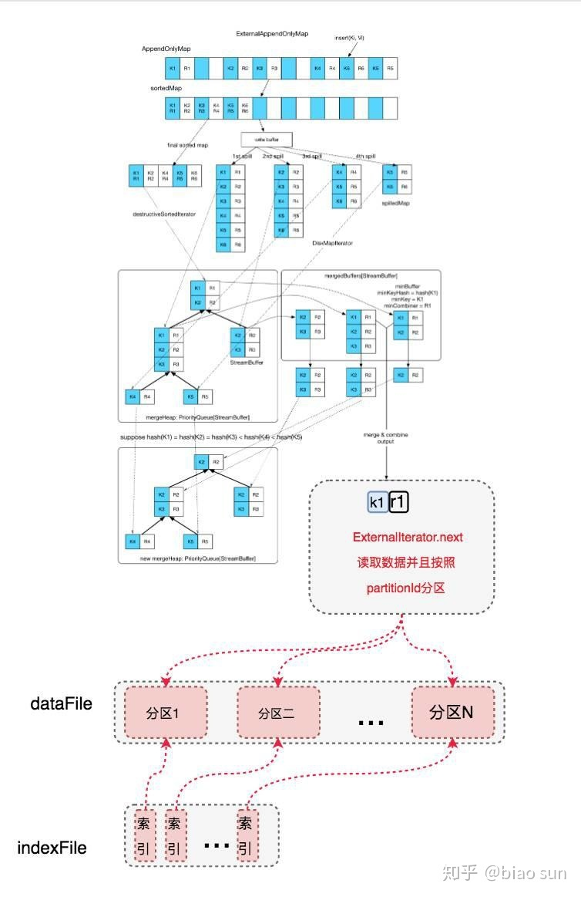

最终读取的时候，从整个 全局 merge 后的读取迭代器中读取的数据，就是按照 partitionId 从小到大排序的数据， 读取过程中使用再按照 分区分段， 并且记录每个分区的文件起始写入位置，把这些位置数据写入索引文件中。


执行流程：

1）map task会将计算结果根据不同的算子写入到不同的内存数据结构中，reduceByKey这种聚合类的shuffle算子，那么会选用Map数据结构，一边通过Map进行聚合，一边写入内存;如果是join这种普通的shuffle算子，那么会选用Array数据结构，直接写入内存。内存数据结构大小默认为5MB

2）每写一条数据进入内存数据结构之后，就会判断一下，是否达到了某个临界阈值。如果达到临界阈值的话，那么就会尝试将内存数据结构中的数据溢写到磁盘，然后清空内存数据结构。在shuffle的时候会有一个定时器，定时器会检查内存数据结构的大小，如果内存数据结构空间不够，那么会申请额外的内存，申请的大小满足如下公式：applyMemory=nowMenory*2-oldMemory。申请不成功就会溢写，申请成功则继续存放数据。

3）溢写到磁盘之前会。根据key进行排序分区

4）然后开始溢写，溢写是以batch的形式分批进行，每次10000条数据。先将数据放到bufferOutPutStream中，BufferedOutputStream是Java的缓冲输出流，首先会将数据缓冲在内存中，当内存缓冲满溢之后再一次写入磁盘文件中，这样可以减少磁盘IO次数，提升性能

5）溢写到磁盘之后是一个个的磁盘小文件，然后对这些小文件进行marge合并成一个大文件。同时生成一个索引文件，其中标识了下游各个task的数据在文件中的start offset与end offset

6）reduce task拉取数据的时候，会先去解析索引文件，然后去拉取对应的数据

注意：

1）产生的文件数量=2*num（map task）


**UnsafeShuffleWriter 实现细节**

该writer可将数据序列化后写入到堆外内存,只需要按照partitionid对地址进行排序,整个过程不涉及反序列化。

条件：

1、使用的序列化类需要支持object relocation.目前只能使用kryoSerializer
2、不需要map side aggregate即不能定义aggregator
3、partition数量不能大于支持的上限(2^24)

内存模型:

每条数据地址由一个64位的指针确定,其构成为：[24 bit partition number][13 bit memory page number][27 bit offset in page]

在内存为非8字节对齐的情况下,每个page的容量为227bits=128Mb,page总数为213,因此每个task可操作内存总量为：227*213bits=1Tb,在内存按字节对齐的情况下允许每个page的size有1g(即128*8,实际64位系统的内存都是8字节对齐的)的容量,数据存放在off heap上。在地址中加入partitionID 是为了排序阶段只需要对record的地址排序。


##Shuffle Read


1）maptask 执行完毕后会把task执行结果和磁盘的小文件地址封装到MapStatus对象中，通过Executor中的MapOutputTrackerWorker对象向Driver中的MapOutputTrackerMaster汇报。MapOutputTracker使用来管理小文件地址的，。

2）reduce task拉取数据的时候会先在本地的MapOutputTackerWorker中的获取，如果没有则向Driver的MapOutputTackerWorker请求小文件地址

3)Driver会返回请求的磁盘小文件地址

4）获取到磁盘小文件地址后，会通过BlockManagerWorker中的ConnectionManager连接到对应的BlockManager

5）然后通过BlockManagerWorker中的BlockTransferService传输数据，默认启动5个task拉取数据，拉取数据量不可以超过48MB