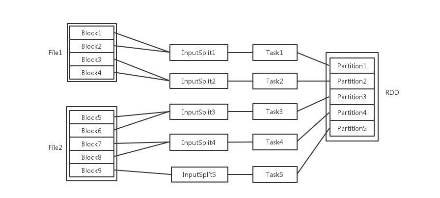

###一、spark组成

Spark组成(BDAS)：全称伯克利数据分析栈，通过大规模集成算法、机器、人之间展现大数据应用的一个平台。也是处理大数据、云计算、通信的技术解决方案。

它的主要组件有：

SparkCore：将分布式数据抽象为弹性分布式数据集（RDD），实现了应用任务调度、RPC、序列化和压缩，并为运行在其上的上层组件提供API。

SparkSQL：Spark Sql 是Spark来操作结构化数据的程序包，可以让我使用SQL语句的方式来查询数据，Spark支持 多种数据源，包含Hive表，parquest以及JSON等内容。

SparkStreaming： 是Spark提供的实时数据进行流式计算的组件。

MLlib：提供常用机器学习算法的实现库。

GraphX：提供一个分布式图计算框架，能高效进行图计算。

BlinkDB：用于在海量数据上进行交互式SQL的近似查询引擎。

Tachyon：以内存为中心高容错的的分布式文件系统。

### 二、RDD

RDD（Resilient Distributed Dataset）叫做弹性分布式数据集，是Spark中最基本的数据抽象，它代表一个不可变、可分区、里面的元素可并行计算的集合。RDD具有数据流模型的特点：自动容错、位置感知性调度和可伸缩性。RDD允许用户在执行多个查询时显式地将工作集缓存在内存中，后续的查询能够重用工作集，这极大地提升了查询速度。

####2.1、　RDD的属性
（1）一组分片（Partition），即数据集的基本组成单位。对于RDD来说，每个分片都会被一个计算任务处理，并决定并行计算的粒度。用户可以在创建RDD时指定RDD的分片个数，如果没有指定，那么就会采用默认值。默认值就是程序所分配到的CPU Core的数目。

（2）一个计算每个分区的函数。Spark中RDD的计算是以分片为单位的，每个RDD都会实现compute函数以达到这个目的。compute函数会对迭代器进行复合，不需要保存每次计算的结果。

（3）RDD之间的依赖关系。RDD的每次转换都会生成一个新的RDD，所以RDD之间就会形成类似于流水线一样的前后依赖关系。在部分分区数据丢失时，Spark可以通过这个依赖关系重新计算丢失的分区数据，而不是对RDD的所有分区进行重新计算。

（4）一个Partitioner，即RDD的分片函数。当前Spark中实现了两种类型的分片函数，一个是基于哈希的HashPartitioner，另外一个是基于范围的RangePartitioner。只有对于于key-value的RDD，才会有Partitioner，非key-value的RDD的Parititioner的值是None。Partitioner函数不但决定了RDD本身的分片数量，也决定了parent RDD Shuffle输出时的分片数量。

（5）一个列表，存储存取每个Partition的优先位置（preferred location）。对于一个HDFS文件来说，这个列表保存的就是每个Partition所在的块的位置。按照“移动数据不如移动计算”的理念，Spark在进行任务调度的时候，会尽可能地将计算任务分配到其所要处理数据块的存储位置。

####2.2、RDD编程API

Spark支持两个类型（算子）操作：Transformation和Action

##### Transformation
主要做的是就是将一个已有的RDD生成另外一个RDD。Transformation具有lazy特性(延迟加载)。Transformation算子的代码不会真正被执行。只有当我们的程序里面遇到一个action算子的时候，代码才会真正的被执行。这种设计让Spark更加有效率地运行。

常用的Transformation：

map(func)：返回一个新的RDD，该RDD由每一个输入元素经过func函数转换后组成

filter(func)：返回一个新的RDD，该RDD由经过func函数计算后返回值为true的输入元素组成

flatMap(func)：类似于map，但是每一个输入元素可以被映射为0或多个输出元素（所以func应该返回一个序列，而不是单一元素）

union(otherDataset)：对源RDD和参数RDD求并集后返回一个新的RDD

intersection(otherDataset)：对源RDD和参数RDD求交集后返回一个新的RDD

distinct([numTasks]))：对源RDD进行去重后返回一个新的RDD

groupByKey([numTasks])：在一个(K,V)的RDD上调用，返回一个(K, Iterator[V])的RDD

reduceByKey(func, [numTasks])：在一个(K,V)的RDD上调用，返回一个(K,V)的RDD，使用指定的reduce函数，将相同key的值聚合到一起，与groupByKey类似，reduce任务的个数可以通过第二个可选的参数来设置

aggregateByKey(zeroValue)(seqOp, combOp, [numTasks])：先按分区聚合 再总的聚合   每次要跟初始值交流 例如：aggregateByKey(0)(_+_,_+_) 对k/y的RDD进行操作

sortByKey([ascending], [numTasks])：在一个(K,V)的RDD上调用，K必须实现Ordered接口，返回一个按照key进行排序的(K,V)的RDD

sortBy(func,[ascending], [numTasks])：与sortByKey类似，但是更灵活 第一个参数是根据什么排序  第二个是怎么排序 false倒序   第三个排序后分区数  默认与原RDD一样

join(otherDataset, [numTasks])：在类型为(K,V)和(K,W)的RDD上调用，返回一个相同key对应的所有元素对在一起的(K,(V,W))的RDD  相当于内连接（求交集）

##### Action
触发代码的运行，我们一段spark代码里面至少需要有一个action操作。

常用的Action:

reduce(func)：通过func函数聚集RDD中的所有元素，这个功能必须是课交换且可并联的

collect()：在驱动程序中，以数组的形式返回数据集的所有元素

count()：返回RDD的元素个数

first()：返回RDD的第一个元素（类似于take(1)）

take(n)：返回一个由数据集的前n个元素组成的数组

###三、spark--对分区Partition的理解

####3.1、spark中partition与block的关系

hdfs中的block是分布式存储的最小单元，类似于盛放文件的盒子，一个文件可能要占多个盒子，但一个盒子里的内容只可能来自同一份文件。假设block设置为128M，你的文件是250M，那么这份文件占3个block（128+128+2）。这样的设计虽然会有一部分磁盘空间的浪费，但是整齐的block大小，便于快速找到、读取对应的内容。（p.s. 考虑到hdfs冗余设计，默认三份拷贝，实际上3*3=9个block的物理空间。）

spark中的partition 是弹性分布式数据集RDD的最小单元，RDD是由分布在各个节点上的partition 组成的。partition 是指的spark在计算过程中，生成的数据在计算空间内最小单元，同一份数据（RDD）的partition 大小不一，数量不定，是根据application里的算子和最初读入的数据分块数量决定的，这也是为什么叫“弹性分布式”数据集的原因之一。

总结：
+ block位于存储空间、partition 位于计算空间，
+ block的大小是固定的、partition 大小是不固定的，
+ block是有冗余的、不会轻易丢失，partition（RDD）没有冗余设计、丢失之后重新计算得到.

####3.2、为什么会分区

Spark RDD 是一种分布式的数据集，由于数据量很大，因此要它被切分并存储在各个结点的分区当中。从而当我们对RDD进行操作时，实际上是对每个分区中的数据并行操作。
我们需要注意的是，只有Key-Value类型的RDD才有分区的，非Key-Value类型的RDD分区的值是None的。

####3.4、Spark 如何设置合理分区数

1、分区数越多越好吗？

不是的，分区数太多意味着任务数太多，每次调度任务也是很耗时的，所以分区数太多会导致总体耗时增多。

2、分区数太少会有什么影响？

分区数太少的话，会导致一些结点没有分配到任务；另一方面，分区数少则每个分区要处理的数据量就会增大，从而对每个结点的内存要求就会提高；还有分区数不合理，会导致数据倾斜问题。

3、合理的分区数是多少？如何设置？

总核数=executor-cores * num-executor

一般合理的分区数设置为总核数的2~3倍

###四、spark并发度

梳理一下Spark中关于并发度涉及的几个概念File，Block，Split，Task，Partition，RDD以及节点数、Executor数、core数目的关系。

输入可能以多个文件的形式存储在HDFS上，每个File都包含了很多块，称为Block。

当Spark读取这些文件作为输入时，会根据具体数据格式对应的InputFormat进行解析，一般是将若干个Block合并成一个输入分片，称为InputSplit，注意InputSplit不能跨越文件。

随后将为这些输入分片生成具体的Task。InputSplit与Task是一一对应的关系。随后这些具体的Task每个都会被分配到集群上的某个节点的某个Executor去执行。

每个节点可以起一个或多个Executor。每个Executor由若干core组成，每个Executor的每个core一次只能执行一个Task。每个Task执行的结果就是生成了目标RDD的一个partiton。注意:  这里的core是虚拟的core而不是机器的物理CPU核，可以理解为就是Executor的一个工作线程。而 Task被执行的并发度 = Executor数目 * 每个Executor核数。

至于partition的数目：对于数据读入阶段，例如sc.textFile，输入文件被划分为多少InputSplit就会需要多少初始Task。在Map阶段partition数目保持不变。在Reduce阶段，RDD的聚合会触发shuffle操作，聚合后的RDD的partition数目跟具体操作有关，例如repartition操作会聚合成指定分区数，还有一些算子是可配置的。

RDD在计算的时候，每个分区都会起一个task，所以rdd的分区数目决定了总的的task数目。申请的计算节点（Executor）数目和每个计算节点核数，决定了你同一时刻可以并行执行的task。比如的RDD有100个分区，那么计算的时候就会生成100个task，你的资源配置为10个计算节点，每个2个核，同一时刻可以并行的task数目为20，计算这个RDD就需要5个轮次。如果计算资源不变，你有101个task的话，就需要6个轮次，在最后一轮中，只有一个task在执行，其余核都在空转。如果资源不变，你的RDD只有2个分区，那么同一时刻只有2个task运行，其余18个核空转，造成资源浪费。这就是在spark调优中，增大RDD分区数目，增大任务并行度的做法。

作者：王二
链接：https://www.zhihu.com/question/33270495/answer/82661639
来源：知乎
著作权归作者所有。商业转载请联系作者获得授权，非商业转载请注明出处。
