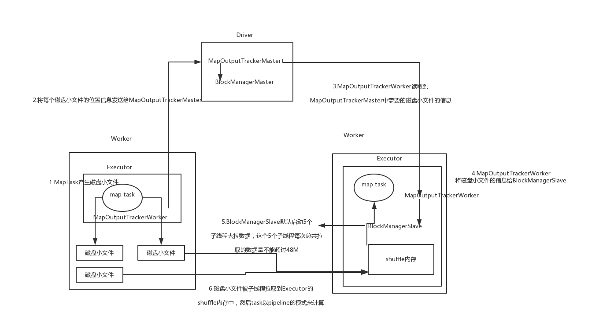
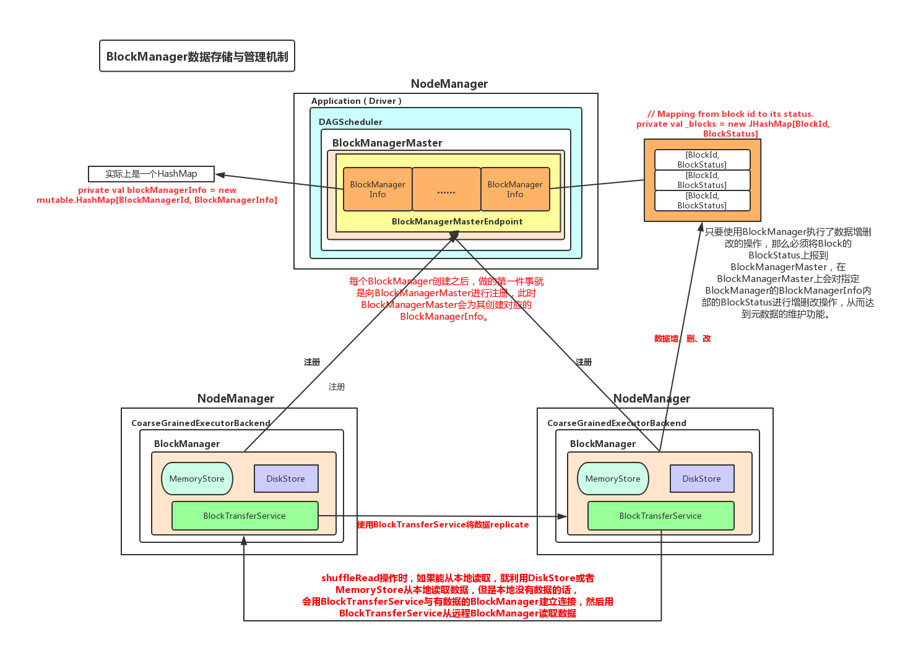
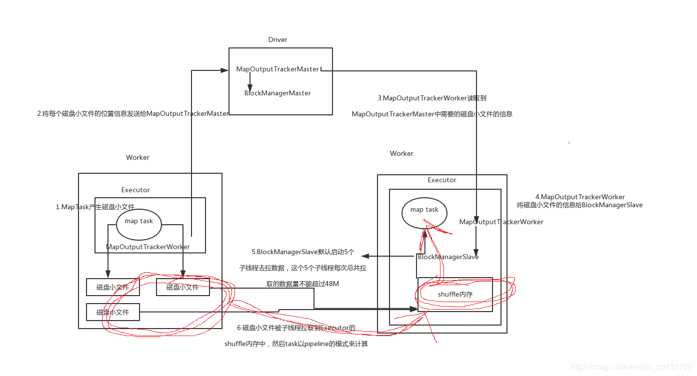

##磁盘小文件

###shuffle过程中，磁盘文件的寻址问题

若一个DAGScheduler把一个DAG分为2个stage，则第一个stage(暂称为stage0)中的task根据计算找数据，肯定是运行在数据对应节点上，stage0与stage1之前肯定是shuffle操作，因为它们是宽依赖关系，那么stage1的task应该在哪运行才不会违背计算找数据原则？

当stage0计算完成后发生shuffle write每个Task会把它的计算结果写入到磁盘文件中，stage1的task运行在这些磁盘文件对应的节点上就会保证计算找数据了，那么下图就是解释stage1怎么找到这写磁盘小文件所在的节点了。

其中MapOutputTrackerMaster、MapOutputTrackerWorker是两个对象，跟踪Map的输出，分别对应主从节点。

+ Map Task运行完毕后，将自己的执行结果信息(磁盘小文件位置，最终执行状态)封装到mapstatus中，然后会调用本进程中的MapOutputTrackerWorker，将mapstatus对象发送给Driver中的MapOutputTrackerMaster

+ 所以根据上述，Driver会掌握整个计算过程中的所有磁盘小文件的位置信息

+ 然后Reduce Task所在的节点worker中的MapOutputTrackerWorker就会根据Driver的MapOutputTrackerMaster信息，拿到它需要的磁盘小文件的位置,之后它会把每个磁盘小文件的位置告诉BlockManagerSlave，然后由BlockManagerSlave对磁盘小文件进行拉取数据，BlockManagerSlave默认启动5个子线程去拉数据，这个5个子线程每次总共拉取的数据量不能超过48M

+ 子线程拉来的数据放入 Executor中用来shuffle的内存区域（占Executor内存*20%*80%），然后reduce task以pipeline模式来计算这些数据(即Map Task产生的结果)。

###磁盘小文件寻址过程中容易OOM的地方

当reduce Task的处理速度没有子线程拉取磁盘小文件的速度快的时候，因为磁盘小文件被子线程拉取到executor的shuffle内存区域，当数据大小大于此内存的时候，就会发生OOM，那么如何解决它？

+ 提高executor的内存

+ 提高shuffle集合的内存比例(默认20%)

+ 减少子线程每次拉取的数据量

##shuffle调优

+ spark.shuffle.file.buffer
默认值：32k

参数说明：该参数用于设置shuffle write task的BufferedOutputStream的buffer缓冲大小。将数据写到磁盘文件之前，会先写入buffer缓冲中，待缓冲写满之后，才会溢写到磁盘。

调优建议：如果作业可用的内存资源较为充足的话，可以适当增加这个参数的大小（比如64k，一定是成倍的增加），从而减少shuffle write过程中溢写磁盘文件的次数，也就可以减少磁盘IO次数，进而提升性能。在实践中发现，合理调节该参数，性能会有1%~5%的提升

+ spark.reducer.maxSizeInFlight
默认值：48m
参数说明：该参数用于设置shuffle read task的buffer缓冲大小 而这个buffer缓冲决定了每次能够拉取多少数据。
调优建议：如果作业可用的内存资源较为充足的话，可以适当增加这个参数的大小（比如96m），从而减少拉取数据的次数，也就可以减少网络传输的次数，进而提升性能。在实践中发现，合理调节该参数，性能会有1%~5%的提升。

+ spark.shuffle.io.maxRetries
默认值：3
参数说明：shuffle read task从shuffle write task所在节点拉取属于自己的数据时，如果因为网络异常导致拉取失败，是会自动进行重试的。该参数就代表了可以重试的最大次数。如果在指定次数之内拉取还是没有成功，就可能会导致作业执行失败。
调优建议：对于那些包含了特别耗时的shuffle操作的作业，建议增加重试最大次数（比如60次），以避免由于JVM的full gc或者网络不稳定等因素导致的数据拉取失败。在实践中发现，对于针对超大数据量（数十亿~上百亿）的shuffle过程，调节该参数可以大幅度提升稳定性。
shuffle file not find taskScheduler不负责重试task，由DAGScheduler负责重试stage

+ spark.shuffle.io.retryWait
默认值：5s
参数说明：具体解释同上，该参数代表了每次重试拉取数据的等待间隔，默认是5s。
调优建议：建议加大间隔时长（比如60s），以增加shuffle操作的稳定性

+ spark.shuffle.memoryFraction
默认值：0.2
参数说明：该参数代表了Executor内存中，分配给shuffle read task进行聚合操作的内存比例，默认是20%。
调优建议：在资源参数调优中讲解过这个参数。如果内存充足，而且很少使用持久化操作，建议调高这个比例，给shuffle read的聚合操作更多内存，以避免由于内存不足导致聚合过程中频繁读写磁盘。在实践中发现，合理调节该参数可以将性能提升10%左右。

+ spark.shuffle.manager

默认值：sort|hash

参数说明：该参数用于设置ShuffleManager的类型。Spark 1.5以后，有三个可选项：hash、sort和tungsten-sort。HashShuffleManager是Spark 1.2以前的默认选项，但是Spark 1.2以及之后的版本默认都是SortShuffleManager了。tungsten-sort与sort类似，但是使用了tungsten计划中的堆外内存管理机制，内存使用效率更高。

调优建议：由于SortShuffleManager默认会对数据进行排序，因此如果你的业务逻辑中需要该排序机制的话，则使用默认的SortShuffleManager就可以；而如果你的业务逻辑不需要对数据进行排序，那么建议参考后面的几个参数调优，通过bypass机制或优化的HashShuffleManager来避免排序操作，同时提供较好的磁盘读写性能。这里要注意的是，tungsten-sort要慎用，因为之前发现了一些相应的bug。

+ spark.shuffle.sort.bypassMergeThreshold

默认值：200

参数说明：当ShuffleManager为SortShuffleManager时，如果shuffle read task的数量小于这个阈值（默认是200），则shuffle write过程中不会进行排序操作，而是直接按照未经优化的HashShuffleManager的方式去写数据，但是最后会将每个task产生的所有临时磁盘文件都合并成一个文件，并会创建单独的索引文件。
调优建议：当你使用SortShuffleManager时，如果的确不需要排序操作，那么建议将这个参数调大一些，大于shuffle read task的数量。那么此时就会自动启用bypass机制，map-side就不会进行排序了，减少了排序的性能开销。但是这种方式下，依然会产生大量的磁盘文件，因此shuffle write性能有待提高。

+ spark.shuffle.consolidateFiles

默认值：false

参数说明：如果使用HashShuffleManager，该参数有效。如果设置为true，那么就会开启consolidate机制，会大幅度合并shuffle write的输出文件，对于shuffle read task数量特别多的情况下，这种方法可以极大地减少磁盘IO开销，提升性能。
调优建议：如果的确不需要SortShuffleManager的排序机制，那么除了使用bypass机制，还可以尝试将spark.shffle.manager参数手动指定为hash，使用HashShuffleManager，同时开启consolidate机制。在实践中尝试过，发现其性能比开启了bypass机制的SortShuffleManager要高出10%~30%。
