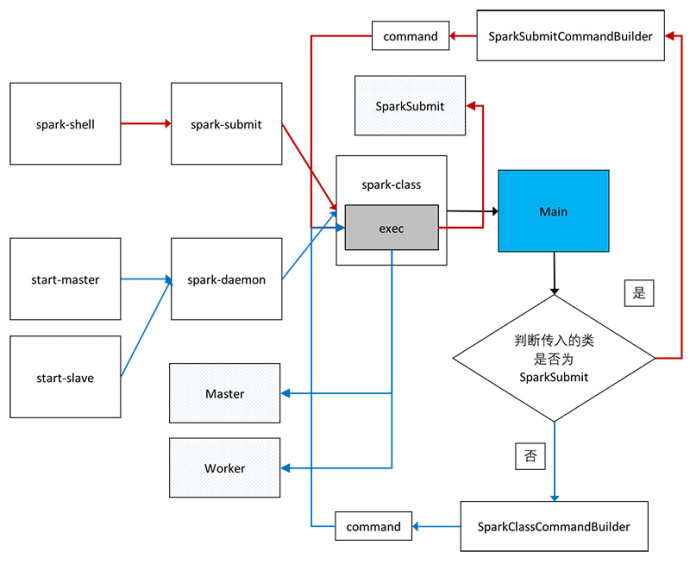

##Standalone mode下集群启动源码精读

我们就从start-all.sh开始，主要代码如下：

```scala
# Load the Spark configuration
. "${SPARK_HOME}/sbin/spark-config.sh"

# Start Master
"${SPARK_HOME}/sbin"/start-master.sh $TACHYON_STR

# Start Workers
"${SPARK_HOME}/sbin"/start-slaves.sh $TACHYON_STR
```
注释说的很明确了，我们继续追踪start-master.sh

```scala
CLASS="org.apache.spark.deploy.master.Master"
...
"${SPARK_HOME}/sbin"/spark-daemon.sh start $CLASS 1 \
  --ip $SPARK_MASTER_IP --port $SPARK_MASTER_PORT --webui-port $SPARK_MASTER_WEBUI_PORT \
  $ORIGINAL_ARGS
...
```

可以看出，是执行了spark-daemon.sh的start方法，即通过动态加载的方式将org.apache.spark.deploy.master.Master作为一个daemon（守护线程）来运行，所以我们直接分析Master的源码：

```scala
private[deploy] object Master extends Logging {
  val SYSTEM_NAME = "sparkMaster"
  val ENDPOINT_NAME = "Master"

  def main(argStrings: Array[String]) {
    //注册log
    SignalLogger.register(log)
    //实例化SparkConf，会加载`spark.*`格式的配置信息
    val conf = new SparkConf
    //使用MasterArguments对传入的参数argStrings和默认加载的conf进行封装，并执行一些初始化操作
    val args = new MasterArguments(argStrings, conf)
    val (rpcEnv, _, _) = startRpcEnvAndEndpoint(args.host, args.port, args.webUiPort, conf)
    rpcEnv.awaitTermination()
  }

  /**
   * Start the Master and return a three tuple of:
   *   (1) The Master RpcEnv
   *   (2) The web UI bound port
   *   (3) The REST server bound port, if any
   */
  def startRpcEnvAndEndpoint(
      host: String,
      port: Int,
      webUiPort: Int,
      conf: SparkConf): (RpcEnv, Int, Option[Int]) = {
    val securityMgr = new SecurityManager(conf)
    val rpcEnv = RpcEnv.create(SYSTEM_NAME, host, port, conf, securityMgr)
    val masterEndpoint = rpcEnv.setupEndpoint(ENDPOINT_NAME,
      new Master(rpcEnv, rpcEnv.address, webUiPort, securityMgr, conf))
    val portsResponse = masterEndpoint.askWithRetry[BoundPortsResponse](BoundPortsRequest)
    (rpcEnv, portsResponse.webUIPort, portsResponse.restPort)
  }
}
```
首先注册log，实例化SparkConf并加载spark.*格式的配置信息，然后使用MasterArguments对传入的参数argStrings和默认加载的conf进行封装，并执行一些初始化操作，主要是加载配置信息，这里不做详细说明，我们接着往下看。

下面才是真正意义上的Start Master，startRpcEnvAndEndpoint函数中首先实例化了SecurityManager（Spark中负责安全的类），然后创建了RpcEnv（Spark的Rpc通信有三个抽象：RpcEnv、RpcEndpoint、RpcEndpointRef，这样做屏蔽了底层的实现，方便用户进行扩展，Spark-1.6.3底层的默认实现方式是Netty，而Spark-2.x已经将Akka的依赖移除），接着实例化Master，实际上就是实例化了一个RpcEndpoint（因为Master实现了ThreadSafeRpcEndpoint接口，而ThreadSafeRpcEndpoint又继承了RpcEndpoint），实例化完成后通过RpcEnv的setupEndpoint向RpcEnv进行注册，注册的时候执行了Master的onStart方法，最后返回了一个RpcEndpointRef（实际上是NettyRpcEndpointRef），通过获得的RpcEndpointRef向Master（Endpoint）发送了一条BoundPortsRequest消息，Master通过receiveAndReply方法接受到该消息（实际上是通过NettyRpcEnv中的Dispatcher进行消息的分配），模式匹配到是BoundPortsRequest类型的消息，然后执行reply方法进行回复，源码如下：

```scala
case BoundPortsRequest => {
      context.reply(BoundPortsResponse(address.port, webUi.boundPort, restServerBoundPort))
    }
```
至此Master启动完成，下面贴出Master实例化部分和onStart方法的源码及中文注释：

**Master实例化部分：**

```scala
  //默认的情况下，取消的task不会从工作的队列中移除直到延迟时间完成，所以创建一个守护线程来“手动”移除它
  private val forwardMessageThread =
    ThreadUtils.newDaemonSingleThreadScheduledExecutor("master-forward-message-thread")

  //用于执行重建UI代码的守护线程
  private val rebuildUIThread =
    ThreadUtils.newDaemonSingleThreadExecutor("master-rebuild-ui-thread")
    
  //通过rebuildUIThread获得重建UI的执行上下文
  private val rebuildUIContext = ExecutionContext.fromExecutor(rebuildUIThread)

  //获取hadoop的配置文件
  private val hadoopConf = SparkHadoopUtil.get.newConfiguration(conf)

  //时间格式，用于构建application ID
  private def createDateFormat = new SimpleDateFormat("yyyyMMddHHmmss") // For application IDs

  //如果Master在60s内没有收到Worker发送的heartbeat信息就认为这个Worker timeout
  private val WORKER_TIMEOUT_MS = conf.getLong("spark.worker.timeout", 60) * 1000
  //webUI中显示的完成的application的最大个数，超过200个就移除掉(200/10,1)=20个完成的applications
  private val RETAINED_APPLICATIONS = conf.getInt("spark.deploy.retainedApplications", 200)
  //webUI中显示的完成的drivers的最大个数，超过200个就移除掉(200/10,1)=20个完成的drivers
  private val RETAINED_DRIVERS = conf.getInt("spark.deploy.retainedDrivers", 200)
  //如果Master在(REAPER_ITERATIONS + 1) * WORKER_TIMEOUT_MS)秒内仍然没有收到Worker发送的heartbeat信息，就删除这个Worker
  private val REAPER_ITERATIONS = conf.getInt("spark.dead.worker.persistence", 15)
  //recoveryMode：NONE、ZOOKEEPER、FILESYSTEM、CUSTOM，默认是NONE
  private val RECOVERY_MODE = conf.get("spark.deploy.recoveryMode", "NONE")
  //Executor失败的最大重试次数
  private val MAX_EXECUTOR_RETRIES = conf.getInt("spark.deploy.maxExecutorRetries", 10)

  //下面是各种“数据结构”，不再一一说明
  val workers = new HashSet[WorkerInfo]
  val idToApp = new HashMap[String, ApplicationInfo]
  val waitingApps = new ArrayBuffer[ApplicationInfo]
  val apps = new HashSet[ApplicationInfo]

  private val idToWorker = new HashMap[String, WorkerInfo]
  private val addressToWorker = new HashMap[RpcAddress, WorkerInfo]

  private val endpointToApp = new HashMap[RpcEndpointRef, ApplicationInfo]
  private val addressToApp = new HashMap[RpcAddress, ApplicationInfo]
  private val completedApps = new ArrayBuffer[ApplicationInfo]
  private var nextAppNumber = 0
  // Using ConcurrentHashMap so that master-rebuild-ui-thread can add a UI after asyncRebuildUI
  private val appIdToUI = new ConcurrentHashMap[String, SparkUI]

  private val drivers = new HashSet[DriverInfo]
  private val completedDrivers = new ArrayBuffer[DriverInfo]
  // Drivers currently spooled for scheduling
  private val waitingDrivers = new ArrayBuffer[DriverInfo]
  private var nextDriverNumber = 0

  Utils.checkHost(address.host, "Expected hostname")

  //下面是Metrics系统相关的代码
  private val masterMetricsSystem = MetricsSystem.createMetricsSystem("master", conf, securityMgr)
  private val applicationMetricsSystem = MetricsSystem.createMetricsSystem("applications", conf,
    securityMgr)
  private val masterSource = new MasterSource(this)

  // After onStart, webUi will be set
  private var webUi: MasterWebUI = null

  private val masterPublicAddress = {
    val envVar = conf.getenv("SPARK_PUBLIC_DNS")
    if (envVar != null) envVar else address.host
  }

  private val masterUrl = address.toSparkURL
  private var masterWebUiUrl: String = _

  //当前Master的状态：STANDBY, ALIVE, RECOVERING, COMPLETING_RECOVERY
  private var state = RecoveryState.STANDBY

  private var persistenceEngine: PersistenceEngine = _

  private var leaderElectionAgent: LeaderElectionAgent = _

  private var recoveryCompletionTask: ScheduledFuture[_] = _

  private var checkForWorkerTimeOutTask: ScheduledFuture[_] = _

  // As a temporary workaround before better ways of configuring memory, we allow users to set
  // a flag that will perform round-robin scheduling across the nodes (spreading out each app
  // among all the nodes) instead of trying to consolidate each app onto a small # of nodes.
  // 避免将application的运行限制在固定的几个节点上
  private val spreadOutApps = conf.getBoolean("spark.deploy.spreadOut", true)

  // Default maxCores for applications that don't specify it (i.e. pass Int.MaxValue)
  private val defaultCores = conf.getInt("spark.deploy.defaultCores", Int.MaxValue)
  if (defaultCores < 1) {
    throw new SparkException("spark.deploy.defaultCores must be positive")
  }

  // Alternative application submission gateway that is stable across Spark versions
  // 用来接受application提交的restServer
  private val restServerEnabled = conf.getBoolean("spark.master.rest.enabled", true)
  private var restServer: Option[StandaloneRestServer] = None
  private var restServerBoundPort: Option[Int] = None
  
onStart方法：

override def onStart(): Unit = {
    //打日志
    logInfo("Starting Spark master at " + masterUrl)
    logInfo(s"Running Spark version ${org.apache.spark.SPARK_VERSION}")
    //实例化standalone模式下的MasterWebUI并绑定到HTTP Server
    webUi = new MasterWebUI(this, webUiPort)
    webUi.bind()
    //可以通过这个Url地址看到Master的信息
    masterWebUiUrl = "http://" + masterPublicAddress + ":" + webUi.boundPort
    
    //以固定的时间间隔检查并移除time-out的worker
    checkForWorkerTimeOutTask = forwardMessageThread.scheduleAtFixedRate(new Runnable {
      override def run(): Unit = Utils.tryLogNonFatalError {
        self.send(CheckForWorkerTimeOut)
      }
    }, 0, WORKER_TIMEOUT_MS, TimeUnit.MILLISECONDS)

    //实例化并启动restServer用于接受application的提交
    if (restServerEnabled) {
      val port = conf.getInt("spark.master.rest.port", 6066)
      restServer = Some(new StandaloneRestServer(address.host, port, conf, self, masterUrl))
    }
    restServerBoundPort = restServer.map(_.start())

    //启动MetricsSystem
    masterMetricsSystem.registerSource(masterSource)
    masterMetricsSystem.start()
    applicationMetricsSystem.start()
    // Attach the master and app metrics servlet handler to the web ui after the metrics systems are
    // started.
    masterMetricsSystem.getServletHandlers.foreach(webUi.attachHandler)
    applicationMetricsSystem.getServletHandlers.foreach(webUi.attachHandler)

    //序列化器
    val serializer = new JavaSerializer(conf)
    
    //恢复机制，包括持久化引擎和选举机制
    val (persistenceEngine_, leaderElectionAgent_) = RECOVERY_MODE match {
      case "ZOOKEEPER" =>
        logInfo("Persisting recovery state to ZooKeeper")
        val zkFactory =
          new ZooKeeperRecoveryModeFactory(conf, serializer)
        (zkFactory.createPersistenceEngine(), zkFactory.createLeaderElectionAgent(this))
      case "FILESYSTEM" =>
        val fsFactory =
          new FileSystemRecoveryModeFactory(conf, serializer)
        (fsFactory.createPersistenceEngine(), fsFactory.createLeaderElectionAgent(this))
      case "CUSTOM" =>
        val clazz = Utils.classForName(conf.get("spark.deploy.recoveryMode.factory"))
        val factory = clazz.getConstructor(classOf[SparkConf], classOf[Serializer])
          .newInstance(conf, serializer)
          .asInstanceOf[StandaloneRecoveryModeFactory]
        (factory.createPersistenceEngine(), factory.createLeaderElectionAgent(this))
      case _ =>
        (new BlackHolePersistenceEngine(), new MonarchyLeaderAgent(this))
    }
    persistenceEngine = persistenceEngine_
    leaderElectionAgent = leaderElectionAgent_
  }
```

**下面介绍Worker的启动**

start-slaves.sh:

```scala
# Launch the slaves
"${SPARK_HOME}/sbin/slaves.sh" cd "${SPARK_HOME}" \; "${SPARK_HOME}/sbin/start-slave.sh" "spark://$SPARK_MASTER_IP:$SPARK_MASTER_PORT"
```

start-slave.sh:

```scala
CLASS="org.apache.spark.deploy.worker.Worker"
...
  "${SPARK_HOME}/sbin"/spark-daemon.sh start $CLASS $WORKER_NUM \
     --webui-port "$WEBUI_PORT" $PORT_FLAG $PORT_NUM $MASTER "$@"
```
和Master的启动类似，我们直接看Worker文件，仍然从main方法开始：

```scala
def main(argStrings: Array[String]) {
    SignalLogger.register(log)
    val conf = new SparkConf
    val args = new WorkerArguments(argStrings, conf)
    val rpcEnv = startRpcEnvAndEndpoint(args.host, args.port, args.webUiPort, args.cores,
      args.memory, args.masters, args.workDir, conf = conf)
    rpcEnv.awaitTermination()
  }
  
def startRpcEnvAndEndpoint(
      host: String,
      port: Int,
      webUiPort: Int,
      cores: Int,
      memory: Int,
      masterUrls: Array[String],
      workDir: String,
      workerNumber: Option[Int] = None,
      conf: SparkConf = new SparkConf): RpcEnv = {

    // The LocalSparkCluster runs multiple local sparkWorkerX RPC Environments
    val systemName = SYSTEM_NAME + workerNumber.map(_.toString).getOrElse("")
    val securityMgr = new SecurityManager(conf)
    val rpcEnv = RpcEnv.create(systemName, host, port, conf, securityMgr)
    val masterAddresses = masterUrls.map(RpcAddress.fromSparkURL(_))
    rpcEnv.setupEndpoint(ENDPOINT_NAME, new Worker(rpcEnv, webUiPort, cores, memory,
      masterAddresses, systemName, ENDPOINT_NAME, workDir, conf, securityMgr))
    rpcEnv
  }
```
可以看到前面和Master类似，只不过Worker有可能是多个，所以需要根据workerNumber构造一个systemName，用来创建不同的RpcEnv，然后实例化Worker（即实例化Endpoint），实例化的时候需要传入masterAddresses（注意此处可能有多个Master），以便以后向Master注册，同时由于要向对应的RpcEnv注册，注册的时候同样要执行Worker的onStart方法，我会将Worker实例化和onStart的源码放到后面，这里我们先来看一下Worker向Master注册的代码（onStart方法中调用registerWithMaster）：

```scala
private def registerWithMaster() {
    // onDisconnected may be triggered multiple times, so don't attempt registration
    // if there are outstanding registration attempts scheduled.
    registrationRetryTimer match {
      case None =>
        registered = false
        registerMasterFutures = tryRegisterAllMasters()
        connectionAttemptCount = 0
        registrationRetryTimer = Some(forwordMessageScheduler.scheduleAtFixedRate(
          new Runnable {
            override def run(): Unit = Utils.tryLogNonFatalError {
              Option(self).foreach(_.send(ReregisterWithMaster))
            }
          },
          INITIAL_REGISTRATION_RETRY_INTERVAL_SECONDS,
          INITIAL_REGISTRATION_RETRY_INTERVAL_SECONDS,
          TimeUnit.SECONDS))
      case Some(_) =>
        logInfo("Not spawning another attempt to register with the master, since there is an" +
          " attempt scheduled already.")
    }
  }
```
可以看到内部调用了tryRegisterAllMasters方法：

```scala
private def tryRegisterAllMasters(): Array[JFuture[_]] = {
    masterRpcAddresses.map { masterAddress =>
      registerMasterThreadPool.submit(new Runnable {
        override def run(): Unit = {
          try {
            logInfo("Connecting to master " + masterAddress + "...")
            val masterEndpoint =
              rpcEnv.setupEndpointRef(Master.SYSTEM_NAME, masterAddress, Master.ENDPOINT_NAME)
            registerWithMaster(masterEndpoint)
          } catch {
            case ie: InterruptedException => // Cancelled
            case NonFatal(e) => logWarning(s"Failed to connect to master $masterAddress", e)
          }
        }
      })
    }
  }
```
通过一个名为registerMasterThreadPool的线程池（最大线程数为Worker的个数）来运行run方法中的内容：首先通过setupEndpointRef方法获得其中一个Master的一个引用（RpcEndpointRef），然后执行registerWithMaster(masterEndpoint)方法，刚才得到的Master的引用作为参数传入，下面进入registerWithMaster方法：（注意此处的registerWithMaster方法是有一个RpcEndpointRef作为参数的，和刚开始的那个不一样）

```scala
private def registerWithMaster(masterEndpoint: RpcEndpointRef): Unit = {
    masterEndpoint.ask[RegisterWorkerResponse](RegisterWorker(
      workerId, host, port, self, cores, memory, webUi.boundPort, publicAddress))
      .onComplete {
        // This is a very fast action so we can use "ThreadUtils.sameThread"
        case Success(msg) =>
          Utils.tryLogNonFatalError {
            handleRegisterResponse(msg)
          }
        case Failure(e) =>
          logError(s"Cannot register with master: ${masterEndpoint.address}", e)
          System.exit(1)
      }(ThreadUtils.sameThread)
  }
```
内部使用masterEndpoint（Master的RpcEndpointRef）的ask方法向Master发送一条RegisterWorker的消息，并使用onComplete方法接受Master的处理结果，下面我们先来看一下消息到达Master端进行怎样的处理：

```scala
override def receiveAndReply(context: RpcCallContext): PartialFunction[Any, Unit] = {
    case RegisterWorker(
        id, workerHost, workerPort, workerRef, cores, memory, workerUiPort, publicAddress) => {
      logInfo("Registering worker %s:%d with %d cores, %s RAM".format(
        workerHost, workerPort, cores, Utils.megabytesToString(memory)))
      if (state == RecoveryState.STANDBY) {
        context.reply(MasterInStandby)
      } else if (idToWorker.contains(id)) {
        context.reply(RegisterWorkerFailed("Duplicate worker ID"))
      } else {
        val worker = new WorkerInfo(id, workerHost, workerPort, cores, memory,
          workerRef, workerUiPort, publicAddress)
        if (registerWorker(worker)) {
          persistenceEngine.addWorker(worker)
          context.reply(RegisteredWorker(self, masterWebUiUrl))
          schedule()
        } else {
          val workerAddress = worker.endpoint.address
          logWarning("Worker registration failed. Attempted to re-register worker at same " +
            "address: " + workerAddress)
          context.reply(RegisterWorkerFailed("Attempted to re-register worker at same address: "
            + workerAddress))
        }
      }
    }
```
首先receiveAndReply方法匹配到Worker发过来的RegisterWorker消息，然后执行具体的操作：打了一个日志，判断Master现在的状态，如果是STANDBY就reply一个MasterInStandby的消息，如果idToWorker中已经存在该Worker的ID就回复重复的worker ID的失败信息，如果都不是，将获得的Worker信息用WorkerInfo进行封装，然后执行registerWorker(worker)操作注册该Worker，如果成功就向persistenceEngine中添加该Worker并reply给Worker RegisteredWorker(self, masterWebUiUrl)消息并执行schedule方法，如果注册失败就reply RegisterWorkerFailed消息，下面我们具体看一下Master端是如何注册Worker的，即registerWorker(worker)方法：

```scala
private def registerWorker(worker: WorkerInfo): Boolean = {
    // There may be one or more refs to dead workers on this same node (w/ different ID's),
    // remove them.
    workers.filter { w =>
      (w.host == worker.host && w.port == worker.port) && (w.state == WorkerState.DEAD)
    }.foreach { w =>
      workers -= w
    }

    val workerAddress = worker.endpoint.address
    if (addressToWorker.contains(workerAddress)) {
      val oldWorker = addressToWorker(workerAddress)
      if (oldWorker.state == WorkerState.UNKNOWN) {
        // A worker registering from UNKNOWN implies that the worker was restarted during recovery.
        // The old worker must thus be dead, so we will remove it and accept the new worker.
        removeWorker(oldWorker)
      } else {
        logInfo("Attempted to re-register worker at same address: " + workerAddress)
        return false
      }
    }

    workers += worker
    idToWorker(worker.id) = worker
    addressToWorker(workerAddress) = worker
    true
  }
```

首先判断是否有和该Worker的host和port相同且状态为DEAD的Worker，如果有就remove掉，然后获得该Worker的RpcAddress，然后根据RpcAddress判断addressToWorker中是否有相同地址的记录，如果有记录且老的Worker的状态为UNKNOWN就remove掉老的Worker，如果没有记录就打日志并返回false（导致上一步reply：RegisterWorkerFailed）然后分别在workers、idToWorker、addressToWorker中添加该Worker，最后返回true，导致上一步向Worker reply注册成功的消息：context.reply(RegisteredWorker(self, masterWebUiUrl))，并执行schedule()，即向等待的applications分配当前可用的资源（每当新的application加入或者有资源变化时都会调用该方法），这个方法我会用单独的一片文章详细分析，现在我们先来看Worker端是如何进行回复的，回到上面的registerWithMaster方法（有参数的），我们直接看成功后执行的handleRegisterResponse(msg)这个方法：

```scala
private def handleRegisterResponse(msg: RegisterWorkerResponse): Unit = synchronized {
    msg match {
      case RegisteredWorker(masterRef, masterWebUiUrl) =>
        logInfo("Successfully registered with master " + masterRef.address.toSparkURL)
        registered = true
        changeMaster(masterRef, masterWebUiUrl)
        forwordMessageScheduler.scheduleAtFixedRate(new Runnable {
          override def run(): Unit = Utils.tryLogNonFatalError {
            self.send(SendHeartbeat)
          }
        }, 0, HEARTBEAT_MILLIS, TimeUnit.MILLISECONDS)
        if (CLEANUP_ENABLED) {
          logInfo(
            s"Worker cleanup enabled; old application directories will be deleted in: $workDir")
          forwordMessageScheduler.scheduleAtFixedRate(new Runnable {
            override def run(): Unit = Utils.tryLogNonFatalError {
              self.send(WorkDirCleanup)
            }
          }, CLEANUP_INTERVAL_MILLIS, CLEANUP_INTERVAL_MILLIS, TimeUnit.MILLISECONDS)
        }

      case RegisterWorkerFailed(message) =>
        if (!registered) {
          logError("Worker registration failed: " + message)
          System.exit(1)
        }

      case MasterInStandby =>
        // Ignore. Master not yet ready.
    }
  }
```
依然是模式匹配的方式：

如果接受到的是RegisteredWorker，会执行changeMaster方法，取消最后一次的重试，然后向自己的RpcEnv发送SendHeartBeat消息，使用receive方法接受到该消息后会通过sendToMaster方法向Master发送心跳，最后判断CLEANUP_ENABLED如果开启就向自己的RpcEnv发送WorkDirCleanup消息，接受到消息后将老的application的目录清除
如果接受到的是RegisterWorkerFailed就表明注册失败

changeMaster发送：

```scala
private def changeMaster(masterRef: RpcEndpointRef, uiUrl: String) {
    // activeMasterUrl it's a valid Spark url since we receive it from master.
    activeMasterUrl = masterRef.address.toSparkURL
    activeMasterWebUiUrl = uiUrl
    master = Some(masterRef)
    connected = true
    // Cancel any outstanding re-registration attempts because we found a new master
    cancelLastRegistrationRetry()
  }
cancelLastRegistrationRetry:

private def cancelLastRegistrationRetry(): Unit = {
    if (registerMasterFutures != null) {
      registerMasterFutures.foreach(_.cancel(true))
      registerMasterFutures = null
    }
    registrationRetryTimer.foreach(_.cancel(true))
    registrationRetryTimer = None
  }
  
如果Worker注册失败同样会通过registrationRetryTimer进行重试：

registrationRetryTimer = Some(forwordMessageScheduler.scheduleAtFixedRate(
          new Runnable {
            override def run(): Unit = Utils.tryLogNonFatalError {
              Option(self).foreach(_.send(ReregisterWithMaster))
            }
          },
          INITIAL_REGISTRATION_RETRY_INTERVAL_SECONDS,
          INITIAL_REGISTRATION_RETRY_INTERVAL_SECONDS,
          TimeUnit.SECONDS))
可以看到向自己发送重新注册的消息：ReregisterWithMaster，receive接收到后会执行reregisterWithMaster()方法：

private def reregisterWithMaster(): Unit = {
    Utils.tryOrExit {
      //重试次数加1
      connectionAttemptCount += 1
      if (registered) {
        //如果已经注册了，就取消重试
        cancelLastRegistrationRetry()
      } else if (connectionAttemptCount <= TOTAL_REGISTRATION_RETRIES) {  //判断是否超过最大重试次数
        logInfo(s"Retrying connection to master (attempt # $connectionAttemptCount)")
        /**
         * Re-register with the active master this worker has been communicating with. If there
         * is none, then it means this worker is still bootstrapping and hasn't established a
         * connection with a master yet, in which case we should re-register with all masters.
         *
         * It is important to re-register only with the active master during failures. Otherwise,
         * if the worker unconditionally attempts to re-register with all masters, the following
         * race condition may arise and cause a "duplicate worker" error detailed in SPARK-4592:
         *
         *   (1) Master A fails and Worker attempts to reconnect to all masters
         *   (2) Master B takes over and notifies Worker
         *   (3) Worker responds by registering with Master B
         *   (4) Meanwhile, Worker's previous reconnection attempt reaches Master B,
         *       causing the same Worker to register with Master B twice
         *
         * Instead, if we only register with the known active master, we can assume that the
         * old master must have died because another master has taken over. Note that this is
         * still not safe if the old master recovers within this interval, but this is a much
         * less likely scenario.
         */
        master match {
          case Some(masterRef) =>
            // registered == false && master != None means we lost the connection to master, so
            // masterRef cannot be used and we need to recreate it again. Note: we must not set
            // master to None due to the above comments.
            // 这里说的很清楚，如果注册失败了，但是master != None说明我们失去了和master的连接，所以需要重新创建一个masterRef
            // 先取消原来阻塞的用来等待消息回复的线程
            if (registerMasterFutures != null) {
              registerMasterFutures.foreach(_.cancel(true))
            }
            
            // 然后创建新的masterRef，然后重新注册
            val masterAddress = masterRef.address
            registerMasterFutures = Array(registerMasterThreadPool.submit(new Runnable {
              override def run(): Unit = {
                try {
                  logInfo("Connecting to master " + masterAddress + "...")
                  val masterEndpoint =
                    rpcEnv.setupEndpointRef(Master.SYSTEM_NAME, masterAddress, Master.ENDPOINT_NAME)
                  registerWithMaster(masterEndpoint)
                } catch {
                  case ie: InterruptedException => // Cancelled
                  case NonFatal(e) => logWarning(s"Failed to connect to master $masterAddress", e)
                }
              }
            }))
          case None =>
            // 如果没有masterRef，先取消原来阻塞的用来等待消息回复的线程
            if (registerMasterFutures != null) {
              registerMasterFutures.foreach(_.cancel(true))
            }
            
            // 然后执行最初的注册，即tryRegisterAllMasters
            // We are retrying the initial registration
            registerMasterFutures = tryRegisterAllMasters()
        }
        // We have exceeded the initial registration retry threshold
        // All retries from now on should use a higher interval
        // 如果超过刚开始设置的重试注册次数，取消之前的重试，开启新的注册，并改变重试次数和时间间隔
        // 刚开始的重试默认为6次，时间间隔在5到15秒之间，接下来的10次重试时间间隔在30到90秒之间
        if (connectionAttemptCount == INITIAL_REGISTRATION_RETRIES) {
          registrationRetryTimer.foreach(_.cancel(true))
          registrationRetryTimer = Some(
            forwordMessageScheduler.scheduleAtFixedRate(new Runnable {
              override def run(): Unit = Utils.tryLogNonFatalError {
                self.send(ReregisterWithMaster)
              }
            }, PROLONGED_REGISTRATION_RETRY_INTERVAL_SECONDS,
              PROLONGED_REGISTRATION_RETRY_INTERVAL_SECONDS,
              TimeUnit.SECONDS))
        }
      } else {
        logError("All masters are unresponsive! Giving up.")
        System.exit(1)
      }
    }
  }
```
至此Worker的启动和注册完成，即start-all.sh执行完成。

## master worker 启动

spark-class是Spark应用程序的命令行启动器，负责设置JVM环境并执行Spark的应用程序。org.apache.spark.launcher.Main会根据传入的类进行判断然后生成相应的command，最后交给exec来执行，我们现在主要关注Spark本身，所以直接进入SparkSubmit的源码部分。



下面我们对这张图进行说明：

1. 首先在spark-class中通过Main [class] [classArgs]的方式将SparkSubmit或者Master、Worker以参数的方式传入

2. Main中的main方法获取到spark-class传过来的className，判断是否为SparkSubmit

3. 如果是SparkSubmit就通过实例化SparkSubmitCommandBuilder并调用buildCommand方法来创建供spark-class中exec执行的command

4. 如果是其他的类(例如Master或者Worker等)就会实例化SparkClassCommandBuilder并调用buildCommand方法来创建供spark-class中exec执行的command

5. 3和4生成的command最终都会交给spark-class中的exec来执行，生成具体的进程：根据3生成的command创建的就是SparkSubmit进程，用来提交应用程序；根据4生成的command创建的就是Master、Worker等进程。

下面是Main类的main()方法，供大家参考：

```scala
public static void main(String[] argsArray) throws Exception {
  checkArgument(argsArray.length > 0, "Not enough arguments: missing class name.");
  List<String> args = new ArrayList<String>(Arrays.asList(argsArray));
  String className = args.remove(0);
  boolean printLaunchCommand = !isEmpty(System.getenv("SPARK_PRINT_LAUNCH_COMMAND"));
  AbstractCommandBuilder builder;
  if (className.equals("org.apache.spark.deploy.SparkSubmit")) {
    try {
      builder = new SparkSubmitCommandBuilder(args);
    } catch (IllegalArgumentException e) {
      printLaunchCommand = false;
      System.err.println("Error: " + e.getMessage());
      System.err.println();
      MainClassOptionParser parser = new MainClassOptionParser();
      try {
        parser.parse(args);
      } catch (Exception ignored) {
        // Ignore parsing exceptions.
      }
      List<String> help = new ArrayList<String>();
      if (parser.className != null) {
        help.add(parser.CLASS);
        help.add(parser.className);
      }
      help.add(parser.USAGE_ERROR);
      builder = new SparkSubmitCommandBuilder(help);
    }
  } else {
    builder = new SparkClassCommandBuilder(className, args);
  }
  Map<String, String> env = new HashMap<String, String>();
  List<String> cmd = builder.buildCommand(env);
  if (printLaunchCommand) {
    System.err.println("Spark Command: " + join(" ", cmd));
    System.err.println("========================================");
  }
  if (isWindows()) {
    System.out.println(prepareWindowsCommand(cmd, env));
  } else {
    // In bash, use NULL as the arg separator since it cannot be used in an argument.
    List<String> bashCmd = prepareBashCommand(cmd, env);
    for (String c : bashCmd) {
      System.out.print(c);
      System.out.print('\0');
    }
  }
}
```


## spark shell


下面我们来看一下当我们输入 spark-shell --master spark://master:7077时具体的执行流程，首先当然是看一下spark-shell.sh的源码，我们只选取了相对比较重要的部分：
```scala
##检测有没有设置SPARK_HOME环境变量，如果没有进行设置
if [ -z "${SPARK_HOME}" ]; then
  export SPARK_HOME="$(cd "`dirname "$0"`"/..; pwd)"
fi
##...
function main() {
  if $cygwin; then
    # Workaround for issue involving JLine and Cygwin
    # (see http://sourceforge.net/p/jline/bugs/40/).
    # If you're using the Mintty terminal emulator in Cygwin, may need to set the
    # "Backspace sends ^H" setting in "Keys" section of the Mintty options
    # (see https://github.com/sbt/sbt/issues/562).
    stty -icanon min 1 -echo > /dev/null 2>&1
    export SPARK_SUBMIT_OPTS="$SPARK_SUBMIT_OPTS -Djline.terminal=unix"
    "${SPARK_HOME}"/bin/spark-submit --class org.apache.spark.repl.Main --name "Spark shell" "$@"
    stty icanon echo > /dev/null 2>&1
  else
    export SPARK_SUBMIT_OPTS
    "${SPARK_HOME}"/bin/spark-submit --class org.apache.spark.repl.Main --name "Spark shell" "$@"
  fi
}
##...
main "$@"
##...
```
可以看出最后执行的是main方法并传入我们使用spark-shell命令时候的所有参数，比如--master，而main方法中无论是什么操作系统(当然生产环境是linux系统)都会最终执行spark-submit，并且class为org.apache.spark.repl.Main、name为“Spark shell”并且将spark-shell所有接收到的用户输入的参数一起传进去，下面我们来看spark-submit：

```scala
if [ -z "${SPARK_HOME}" ]; then
  export SPARK_HOME="$(cd "`dirname "$0"`"/..; pwd)"
fi

# disable randomized hash for string in Python 3.3+
export PYTHONHASHSEED=0

exec "${SPARK_HOME}"/bin/spark-class org.apache.spark.deploy.SparkSubmit "$@"
```

spark-submit的代码比较简洁，最后使用exec通过spark-class来启动SparkSubmit并将spark-submit接收到的所有参数传入，下面我们来看一下spark-class：(这里要说明一下，从这里开始起始就是我们通过spark-submit提交application的过程，只不过spark-submit提交的时候后面跟的是用户自己编写的类，而通过spark-shell过来的spark-submit后面跟的是org.apache.spark.repl.Main，spark-submit方式提交的application运行完成后就会结束，而通过spark-shell进入的REPL一直等待用户的输入)

```scala
if [ -z "${SPARK_HOME}" ]; then
  export SPARK_HOME="$(cd "`dirname "$0"`"/..; pwd)"
fi

## 载入环境变量
. "${SPARK_HOME}"/bin/load-spark-env.sh

## 获得java的二进制文件，后面会用来启动一个JVM进行
# Find the java binary
if [ -n "${JAVA_HOME}" ]; then
  RUNNER="${JAVA_HOME}/bin/java"
else
  if [ `command -v java` ]; then
    RUNNER="java"
  else
    echo "JAVA_HOME is not set" >&2
    exit 1
  fi
fi

## jar包的相关依赖
# Find assembly jar
SPARK_ASSEMBLY_JAR=
if [ -f "${SPARK_HOME}/RELEASE" ]; then
  ASSEMBLY_DIR="${SPARK_HOME}/lib"
else
  ASSEMBLY_DIR="${SPARK_HOME}/assembly/target/scala-$SPARK_SCALA_VERSION"
fi

GREP_OPTIONS=
num_jars="$(ls -1 "$ASSEMBLY_DIR" | grep "^spark-assembly.*hadoop.*\.jar$" | wc -l)"
if [ "$num_jars" -eq "0" -a -z "$SPARK_ASSEMBLY_JAR" -a "$SPARK_PREPEND_CLASSES" != "1" ]; then
  echo "Failed to find Spark assembly in $ASSEMBLY_DIR." 1>&2
  echo "You need to build Spark before running this program." 1>&2
  exit 1
fi
if [ -d "$ASSEMBLY_DIR" ]; then
  ASSEMBLY_JARS="$(ls -1 "$ASSEMBLY_DIR" | grep "^spark-assembly.*hadoop.*\.jar$" || true)"
  if [ "$num_jars" -gt "1" ]; then
    echo "Found multiple Spark assembly jars in $ASSEMBLY_DIR:" 1>&2
    echo "$ASSEMBLY_JARS" 1>&2
    echo "Please remove all but one jar." 1>&2
    exit 1
  fi
fi

SPARK_ASSEMBLY_JAR="${ASSEMBLY_DIR}/${ASSEMBLY_JARS}"

LAUNCH_CLASSPATH="$SPARK_ASSEMBLY_JAR"

# Add the launcher build dir to the classpath if requested.
if [ -n "$SPARK_PREPEND_CLASSES" ]; then
  LAUNCH_CLASSPATH="${SPARK_HOME}/launcher/target/scala-$SPARK_SCALA_VERSION/classes:$LAUNCH_CLASSPATH"
fi

export _SPARK_ASSEMBLY="$SPARK_ASSEMBLY_JAR"

# For tests
if [[ -n "$SPARK_TESTING" ]]; then
  unset YARN_CONF_DIR
  unset HADOOP_CONF_DIR
fi

# The launcher library will print arguments separated by a NULL character, to allow arguments with
# characters that would be otherwise interpreted by the shell. Read that in a while loop, populating
# an array that will be used to exec the final command.
CMD=()
while IFS= read -d '' -r ARG; do
  CMD+=("$ARG")
  ## 使用java -cp命令启动一个JVM进程并执行org.apache.spark.launcher.Main类的main方法，后面我们会看到这个进程就是SparkSubmit进程
done < <("$RUNNER" -cp "$LAUNCH_CLASSPATH" org.apache.spark.launcher.Main "$@")
exec "${CMD[@]}"
```

spark-class是Spark应用程序的命令行启动器，负责设置JVM环境并执行Spark的应用程序。org.apache.spark.launcher.Main会根据传入的类进行判断然后生成相应的command，最后交给exec来执行，我们现在主要关注Spark本身，所以直接进入SparkSubmit的源码部分。


##Spark submit


```scala
def main(args: Array[String]): Unit = {
  /** 使用SparkSubmitArguments封装spark-submit传入的参数，还记得都有什么吗？
   *  如果是spark-shell，就包括spark-shell及后面的一串参数，如果是直接使用spark-submit进行提交
   *  后面就是提交时传入的参数，由于SparkSubmitArguments中的参数比较多，本文中不再一一列出
   *  会在使用到某个参数的时候进行说明，详细的参数可以参看SparkSubmitArguments的源码。
  */
  val appArgs = new SparkSubmitArguments(args)
  // 如果开启了debug模式就打印出参数
  if (appArgs.verbose) {
    // scalastyle:off println
    printStream.println(appArgs)
    // scalastyle:on println
  }
  
  /** 这里的action就是spark-submit执行的动作，包括：SUBMIT, KILL, REQUEST_STATUS(使
   *  用了SparkSubmitAction进行了封装)，如果没有指定，默认就是SparkSubmitAction.SUBMIT，
   *  所以下面的这个模式匹配将执行submit(appArgs)
  */
  appArgs.action match {
    case SparkSubmitAction.SUBMIT => submit(appArgs)
    case SparkSubmitAction.KILL => kill(appArgs)
    case SparkSubmitAction.REQUEST_STATUS => requestStatus(appArgs)
  }
}
```
下面我们来看submit(appArgs)方法：

```scala
/**
 * submit方法的主要功能就是使用传进来的参数来提交应用程序。
 * 主要分为两步骤：
 * 1. 准备启动所需的环境，包括设置classpath、系统参数和应用程序的参数(根据部署模式和cluster
 * manager运行child main类)。
 * 2. 使用上一步准备好的环境调用child main class中的main函数，我们这里只考虑client模式，
 * cluster模式我们以后会单独分析。
 * 所以如果是spark-shell，child main class就是org.apache.spark.repl.Main，如果是
 * spark-submit直接进行提交，child main class就是用户编写的应用程序(含有main方法的类)
*/
private def submit(args: SparkSubmitArguments): Unit = {
  // 准备环境，主要就是获得childMainClass，即我们上面所说的child main class
  val (childArgs, childClasspath, sysProps, childMainClass) = prepareSubmitEnvironment(args)
   // 注意：源码中这里是doRunMain()方法，我们在后面单独拿出来进行分析
   // 判断gateway使用的是Akka还是基于REST的，但是不论那种方式最后都会调用doRunMain()方法
   // In standalone cluster mode, there are two submission gateways:
   //   (1) The traditional Akka gateway using o.a.s.deploy.Client as a wrapper
   //   (2) The new REST-based gateway introduced in Spark 1.3
   // The latter is the default behavior as of Spark 1.3, but Spark submit will fail over
   // to use the legacy gateway if the master endpoint turns out to be not a REST server.
  if (args.isStandaloneCluster && args.useRest) {
    try {
      // scalastyle:off println
      printStream.println("Running Spark using the REST application submission protocol.")
      // scalastyle:on println
      doRunMain()
    } catch {
      // Fail over to use the legacy submission gateway
      case e: SubmitRestConnectionException =>
        printWarning(s"Master endpoint ${args.master} was not a REST server. " +
          "Falling back to legacy submission gateway instead.")
        args.useRest = false
        submit(args)
    }
  // In all other modes, just run the main class as prepared
  } else {
    doRunMain()
  }
}
doRunMain()的实现部分：

def doRunMain(): Unit = {
  if (args.proxyUser != null) {
    // 这里是hadoop相关的用户和组的信息
    val proxyUser = UserGroupInformation.createProxyUser(args.proxyUser,
      UserGroupInformation.getCurrentUser())
    try {
      proxyUser.doAs(new PrivilegedExceptionAction[Unit]() {
        override def run(): Unit = {
          runMain(childArgs, childClasspath, sysProps, childMainClass, args.verbose)
        }
      })
    } catch {
      case e: Exception =>
        // Hadoop's AuthorizationException suppresses the exception's stack trace, which
        // makes the message printed to the output by the JVM not very helpful. Instead,
        // detect exceptions with empty stack traces here, and treat them differently.
        if (e.getStackTrace().length == 0) {
          // scalastyle:off println
          printStream.println(s"ERROR: ${e.getClass().getName()}: ${e.getMessage()}")
          // scalastyle:on println
          exitFn(1)
        } else {
          throw e
        }
    }
  } else {
    runMain(childArgs, childClasspath, sysProps, childMainClass, args.verbose)
  }
}
```
我们看到doRunMain()内部最终都执行了runMain方法，所以我们进入runMain方法：

```scala
/** 别看这个方法这么长，主要做的事情就是一件：运行child main class的main方法
再次说明一下，如果是直接使用spark-submit提交的应用程序，就是执行用户指定的类的main方法
如果是通过spark-shell执行的，就是执行org.apache.spark.repl.Main中的main方法
*/
private def runMain(
    childArgs: Seq[String],
    childClasspath: Seq[String],
    sysProps: Map[String, String],
    childMainClass: String,
    verbose: Boolean): Unit = {
  //是否打印debug信息
  // scalastyle:off println
  if (verbose) {
    printStream.println(s"Main class:\n$childMainClass")
    printStream.println(s"Arguments:\n${childArgs.mkString("\n")}")
    printStream.println(s"System properties:\n${sysProps.mkString("\n")}")
    printStream.println(s"Classpath elements:\n${childClasspath.mkString("\n")}")
    printStream.println("\n")
  }
  // scalastyle:on println
  
  // 下面这些操作是指定当前运行线程的ClassLoader
  val loader =
    if (sysProps.getOrElse("spark.driver.userClassPathFirst", "false").toBoolean) {
      new ChildFirstURLClassLoader(new Array[URL](0),
        Thread.currentThread.getContextClassLoader)
    } else {
      new MutableURLClassLoader(new Array[URL](0),
        Thread.currentThread.getContextClassLoader)
    }
  Thread.currentThread.setContextClassLoader(loader)
  
  // 添加jar依赖
  for (jar <- childClasspath) {
    addJarToClasspath(jar, loader)
  }
  // 系统属性
  for ((key, value) <- sysProps) {
    System.setProperty(key, value)
  }
  var mainClass: Class[_] = null
  // 通过反射的方式获得mainClass(child main class)
  try {
    mainClass = Utils.classForName(childMainClass)
  } catch {
    case e: ClassNotFoundException =>
      e.printStackTrace(printStream)
      if (childMainClass.contains("thriftserver")) {
        // scalastyle:off println
        printStream.println(s"Failed to load main class $childMainClass.")
        printStream.println("You need to build Spark with -Phive and -Phive-thriftserver.")
        // scalastyle:on println
      }
      System.exit(CLASS_NOT_FOUND_EXIT_STATUS)
    case e: NoClassDefFoundError =>
      e.printStackTrace(printStream)
      if (e.getMessage.contains("org/apache/hadoop/hive")) {
        // scalastyle:off println
        printStream.println(s"Failed to load hive class.")
        printStream.println("You need to build Spark with -Phive and -Phive-thriftserver.")
        // scalastyle:on println
      }
      System.exit(CLASS_NOT_FOUND_EXIT_STATUS)
  }
  // SPARK-4170
  if (classOf[scala.App].isAssignableFrom(mainClass)) {
    printWarning("Subclasses of scala.App may not work correctly. Use a main() method instead.")
  }
  // 获得mainClass(child main class)的main方法
  val mainMethod = mainClass.getMethod("main", new Array[String](0).getClass)
  // main方法必须是static级别的
  if (!Modifier.isStatic(mainMethod.getModifiers)) {
    throw new IllegalStateException("The main method in the given main class must be static")
  }
  def findCause(t: Throwable): Throwable = t match {
    case e: UndeclaredThrowableException =>
      if (e.getCause() != null) findCause(e.getCause()) else e
    case e: InvocationTargetException =>
      if (e.getCause() != null) findCause(e.getCause()) else e
    case e: Throwable =>
      e
  }
  // 最后调用main方法
  try {
    mainMethod.invoke(null, childArgs.toArray)
  } catch {
    case t: Throwable =>
      findCause(t) match {
        case SparkUserAppException(exitCode) =>
          System.exit(exitCode)
        case t: Throwable =>
          throw t
      }
  }
}
```

走到这里，如果是用户通过spark-submit提交自己编写的spark application，那么就直接调用main方法，然后一步一步执行用户编写的代码:SparkContext等等，我们会在以后的文章中进行分析，所以我们现在要跟随的就是org.apache.spark.repl.Main中的main方法(注意本文中我们只讨论client的模式，至于cluster的模式我们会单独进行分析)。

