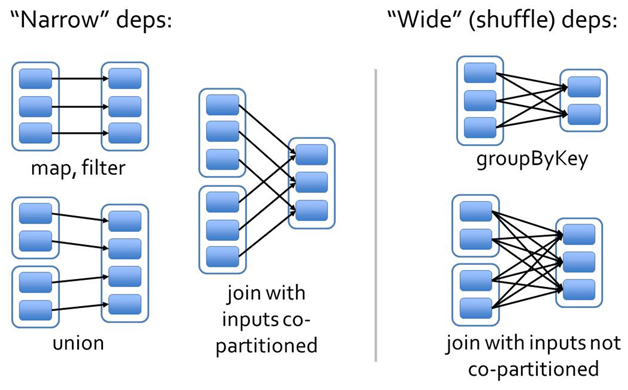
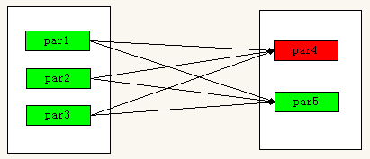

### RDD依赖关系的本质内幕

由于RDD是粗粒度的操作数据集，每个Transformation操作都会生成一个新的RDD，所以RDD之间就会形成类似流水线的前后依赖关系；RDD和它依赖的父RDD（s）的关系有两种不同的类型，即窄依赖（narrow dependency）和宽依赖（wide dependency）。如图所示显示了RDD之间的依赖关系。

从图中可知：

窄依赖：是指每个父RDD的一个Partition最多被子RDD的一个Partition所使用，例如map、filter、union等操作都会产生窄依赖；（独生子女）

宽依赖：是指一个父RDD的Partition会被多个子RDD的Partition所使用，例如groupByKey、reduceByKey、sortByKey等操作都会产生宽依赖；（超生）

根本之处：就是父RDD中分区内的数据，是否在子类RDD中也完全处于一个分区，如果是，窄依赖，如果不是，宽依赖。

需要特别说明的是对join操作有两种情况：

一个key只会发送给下一部分的一个分区里面。

+ 图中左半部分join：如果两个RDD在进行join操作时，一个RDD的partition仅仅和另一个RDD中已知个数的Partition进行join，那么这种类型的join操作就是窄依赖，例如图1中左半部分的join操作(join with inputs co-partitioned)；

+ 图中右半部分join：其它情况的join操作就是宽依赖,例如图1中右半部分的join操作(join with inputs not co-partitioned)，由于是需要父RDD的所有partition进行join的转换，这就涉及到了shuffle，因此这种类型的join操作也是宽依赖。

###宽依赖与窄依赖对比

相比于宽依赖，窄依赖对优化很有利 ，主要基于以下两点：

1. 宽依赖往往对应着shuffle操作，需要在运行过程中将同一个父RDD的分区传入到不同的子RDD分区中，中间可能涉及多个节点之间的数据传输；而窄依赖的每个父RDD的分区只会传入到一个子RDD分区中，通常可以在一个节点内完成转换。

2. 当RDD分区丢失时（某个节点故障），spark会对数据进行重算。

3. 对于窄依赖，由于父RDD的一个分区只对应一个子RDD分区，这样只需要重算和子RDD分区对应的父RDD分区即可，所以这个重算对数据的利用率是100%的；

4. 对于宽依赖，重算的父RDD分区对应多个子RDD分区，这样实际上父RDD 中只有一部分的数据是被用于恢复这个丢失的子RDD分区的，另一部分对应子RDD的其它未丢失分区，这就造成了多余的计算；更一般的，宽依赖中子RDD分区通常来自多个父RDD分区，极端情况下，所有的父RDD分区都要进行重新计算。

如下图所示，b1分区丢失，则需要重新计算a1,a2和a3，这就产生了冗余计算(a1,a2,a3中对应b2的数据)。

###宽依赖与窄依赖函数

窄依赖的函数有：map, filter, union, join(父RDD是hash-partitioned ), mapPartitions, mapValues

宽依赖的函数有：groupByKey, join(父RDD不是hash-partitioned ), partitionBy

###
在spark中，会根据RDD之间的依赖关系将DAG图（有向无环图）划分为不同的阶段，对于窄依赖，由于partition依赖关系的确定性，partition的转换处理就可以在同一个线程里完成，窄依赖就被spark划分到同一个stage中，而对于宽依赖，只能等父RDD shuffle处理完成后，下一个stage才能开始接下来的计算。

因此spark划分stage的整体思路是：从后往前推，遇到宽依赖就断开，划分为一个stage；遇到窄依赖就将这个RDD加入该stage中。因此在图2中RDD C,RDD D,RDD E,RDDF被构建在一个stage中,RDD A被构建在一个单独的Stage中,而RDD B和RDD G又被构建在同一个stage中。

在spark中，Task的类型分为2种：ShuffleMapTask和ResultTask；

简单来说，DAG的最后一个阶段会为每个结果的partition生成一个ResultTask，即每个Stage里面的Task的数量是由该Stage中最后一个RDD的Partition的数量所决定的！而其余所有阶段都会生成ShuffleMapTask；之所以称之为ShuffleMapTask是因为它需要将自己的计算结果通过shuffle到下一个stage中；也就是说上图中的stage1和stage2相当于mapreduce中的Mapper,而ResultTask所代表的stage3就相当于mapreduce中的reducer。

在之前动手操作了一个wordcount程序，因此可知，Hadoop中MapReduce操作中的Mapper和Reducer在spark中的基本等量算子是map和reduceByKey;不过区别在于：Hadoop中的MapReduce天生就是排序的；而reduceByKey只是根据Key进行reduce，但spark除了这两个算子还有其他的算子；因此从这个意义上来说，Spark比Hadoop的计算算子更为丰富。

总结：

在这里我们是从父RDD的partition被使用的个数来定义窄依赖和宽依赖，因此可以用一句话概括下：如果父RDD的一个Partition被子RDD的一个Partition所使用就是窄依赖，否则的话就是宽依赖。因为是确定的partition数量的依赖关系，所以RDD之间的依赖关系就是窄依赖；由此我们可以得出一个推论：即窄依赖不仅包含一对一的窄依赖，还包含一对固定个数的窄依赖。

一对固定个数的窄依赖的理解：即子RDD的partition对父RDD依赖的Partition的数量不会随着RDD数据规模的改变而改变；换句话说，无论是有100T的数据量还是1P的数据量，在窄依赖中，子RDD所依赖的父RDD的partition的个数是确定的，而宽依赖是shuffle级别的，数据量越大，那么子RDD所依赖的父RDD的个数就越多，从而子RDD所依赖的父RDD的partition的个数也会变得越来越多。

4.2　依赖关系下的数据流视图

在spark中，会根据RDD之间的依赖关系将DAG图（有向无环图）划分为不同的阶段，对于窄依赖，由于partition依赖关系的确定性，partition的转换处理就可以在同一个线程里完成，窄依赖就被spark划分到同一个stage中，而对于宽依赖，只能等父RDD shuffle处理完成后，下一个stage才能开始接下来的计算。

因此spark划分stage的整体思路是：从后往前推，遇到宽依赖就断开，划分为一个stage；遇到窄依赖就将这个RDD加入该stage中。因此在图2中RDD C,RDD D,RDD E,RDDF被构建在一个stage中,RDD A被构建在一个单独的Stage中,而RDD B和RDD G又被构建在同一个stage中。

在spark中，Task的类型分为2种：ShuffleMapTask和ResultTask；

简单来说，DAG的最后一个阶段会为每个结果的partition生成一个ResultTask，即每个Stage里面的Task的数量是由该Stage中最后一个RDD的Partition的数量所决定的！而其余所有阶段都会生成ShuffleMapTask；之所以称之为ShuffleMapTask是因为它需要将自己的计算结果通过shuffle到下一个stage中；也就是说上图中的stage1和stage2相当于mapreduce中的Mapper,而ResultTask所代表的stage3就相当于mapreduce中的reducer。

在之前动手操作了一个wordcount程序，因此可知，Hadoop中MapReduce操作中的Mapper和Reducer在spark中的基本等量算子是map和reduceByKey;不过区别在于：Hadoop中的MapReduce天生就是排序的；而reduceByKey只是根据Key进行reduce，但spark除了这两个算子还有其他的算子；因此从这个意义上来说，Spark比Hadoop的计算算子更为丰富。