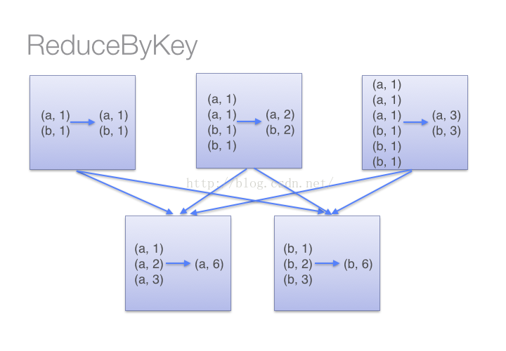
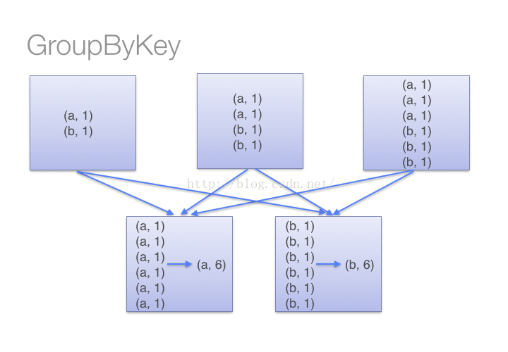

###一、官网解释

首先，看一看spark官网是怎么解释的：

>reduceByKey(func, numPartitions=None)

Merge the values for each key using an associative reduce function. This will also perform the merginglocally on each mapper before sending results to a reducer, similarly to a “combiner” in MapReduce. Output will be hash-partitioned with numPartitions partitions, or the default parallelism level if numPartitions is not specified.

也就是，reduceByKey用于对每个key对应的多个value进行merge操作，最重要的是它能够在本地先进行merge操作，并且merge操作可以通过函数自定义。

>groupByKey(numPartitions=None)

Group the values for each key in the RDD into a single sequence. Hash-partitions the resulting RDD with numPartitions partitions. Note: If you are grouping in order to perform an aggregation (such as a sum or average) over each key, using reduceByKey or aggregateByKey will provide much better performance.

也就是，groupByKey也是对每个key进行操作，但只生成一个sequence。需要特别注意“Note”中的话，它告诉我们：如果需要对sequence进行aggregation操作（注意，groupByKey本身不能自定义操作函数），那么，选择reduceByKey/aggregateByKey更好。这是因为groupByKey不能自定义函数，我们需要先用groupByKey生成RDD，然后才能对此RDD通过map进行自定义函数操作。


为了更好的理解上面这段话，下面我们使用两种不同的方式去计算单词的个数[2]：

```JAVA
val words = Array("one", "two", "two", "three", "three", "three")  
  
val wordPairsRDD = sc.parallelize(words).map(word => (word, 1))  
  
val wordCountsWithReduce = wordPairsRDD.reduceByKey(_ + _)  
  
val wordCountsWithGroup = wordPairsRDD.groupByKey().map(t => (t._1, t._2.sum)) 
```
上面得到的wordCountsWithReduce和wordCountsWithGroup是完全一样的，但是，它们的内部运算过程是不同的。

###示例图

（1）当采用reduceByKeyt时，Spark可以在每个分区移动数据之前将待输出数据与一个共用的key结合。借助下图可以理解在reduceByKey里究竟发生了什么。 注意在数据对被搬移前同一机器上同样的key是怎样被组合的(reduceByKey中的lamdba函数)。然后lamdba函数在每个区上被再次调用来将所有值reduce成一个最终结果。整个过程如下：




（2）当采用groupByKey时，由于它不接收函数，spark只能先将所有的键值对(key-value pair)都移动，这样的后果是集群节点之间的开销很大，导致传输延时。整个过程如下：



因此，在对大数据进行复杂计算时，reduceByKey优于groupByKey。

另外，如果仅仅是group处理，那么以下函数应该优先于 groupByKey ：
1. combineByKey 组合数据，但是组合之后的数据类型与输入时值的类型不一样。
2. foldByKey合并每一个 key 的所有值，在级联函数和“零值”中使用。


###三、总结

如果是用Python写的spark，那么有一个库非常实用：operator，其中可以用的函数包括：大小比较函数，逻辑操作函数，数学运算函数，序列操作函数等等。这些函数可以直接通过“from operator import *”进行调用，直接把函数名作为参数传递给reduceByKey即可。如下：

```java
from operator import add  
rdd = sc.parallelize([("a", 1), ("b", 1), ("a", 1)])  
sorted(rdd.reduceByKey(add).collect())  
  
[('a', 2), ('b', 1)]
```