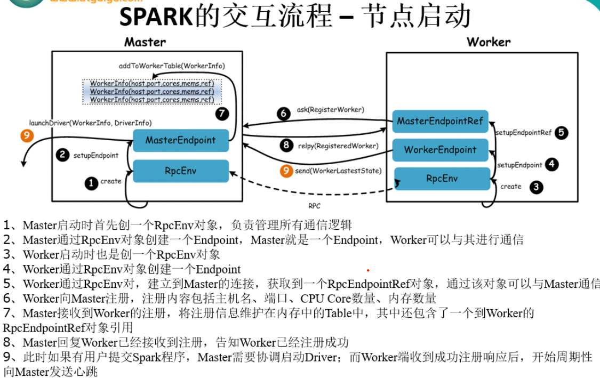
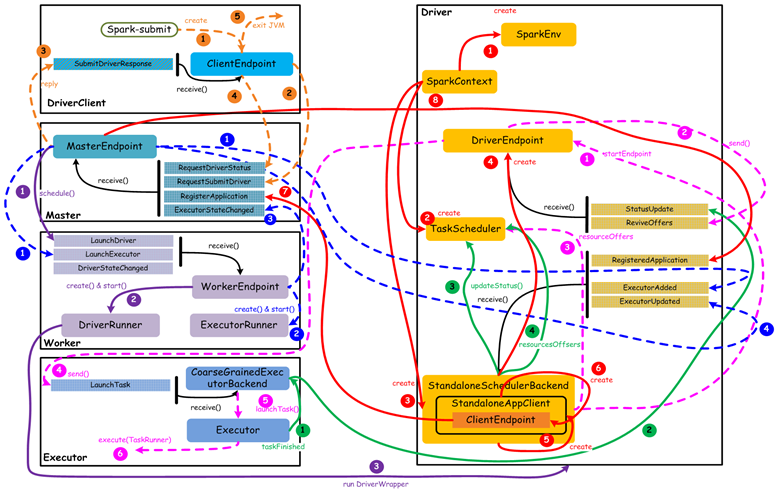

##Spark组件以及消息通信原理

###一、Spark核心基本概念

Application（应用程序）：指用户编写的Spark应用程序，包含驱动程序（Driver）和分布在集群中多个节点之上的Executor代码，在执行过程中由一个或多个作业组成。

Driver(驱动程序)：Spark中的Driver即运行上述Application的main函数并且创建SparkContext，其中创建SparkContext的目的是为了准备Spark应用程序的运行环境。在Spark中由SparkContext负责与ClusterManager通信，进行资源申请、任务的分配和监控等；当Executor部分运行完成时候，Driver负责将SparkContext关闭。通常用SparkContext 代表Driver。

Cluster Manager（集群资源管理器）：指在集群上获取资源的外部服务，目前有以下几种：

+ Standalane：Spark原生的资源管理，是由Master负责资源的管理。
+ Hadoop Yarn：由Yarn中的ResourceManager负责资源的管理。
+ Mesos：由Mesos中的Mesos Master负责资源管理

Worker(工作节点)：集群中任何可以运行Application代码的节点，类似于YARN的NodeManager

Master(总控进程)：Spark Standalane运行模型下的主节点，负责资源管理和分配资源来运行Spark Application。

Exeuctor(执行进程)：Application运行Worker节点上的一个进程，该进程负责运行Task，并负责将数据存在内存或者磁盘上，每个Application都有各自一批的Executor。在Spark On Yarn 模式下，其进程名字为CoarseGraniedExecutorBackend，类似于Hadoop MapReduce中的Yarn Child。

###二、Spark通信--client、master、worker间的通信

+ Client：提交作业。
+ Master：接收作业，启动Driver和Executor，管理Worker。
+ Worker：管理节点资源，启动Driver和Executor。

（1）Client to Master
RegisterApplication：注册应用。

（2）Master to Client
RegisteredApplication：注册应用后，回复给Client。
ExecutorAdded：通知Client Worker已经启动了Executor，当向Worker发送Launch-Executor时，通知Client Actor。
ExecutorUpdated：通知Client Executor状态已更新。

（3）Master to Worker
LaunchExecutor：启动Executor。
RegisteredWorker：Worker注册的回复。
RegisterWorkerFailed：注册Worker失败的回复。
KillExecutor：停止Executor进程。

（4）Worker to Master
RegisterWorker：注册Worker。
Heartbeat：周期性地Master发送心跳信息。
ExecutorStateChanged：通知Master，Executor状态更新。

1. 构建RDD
2. 构建DAGScheduler
3. 构建TASKScheduler
4. 提交到worker
、、、、、、、、、、、、、、、、、、、、、、、、、、、、、、、、、、、、、、、、、
1. 首先通过Spark-shell 提交任务的时候，启动Spark-Submit类，然后通过反射调用自定义的app的main方法。
2. 在wordcount的main方法中，加载默认的配置，SparkConf,接着创建非常重要的SparkContext，它是通往集群的入口。
3. 在SparkContext中完成了重要的三件事情，创建Spark-env（创建ActorSystem，用于创建DriverActor和ClientActor）构建DAGScheduler和TaskScheduler。
4. 通过SparkEnv来创建createDriverEnv，调用自己的Create方法来创建createDriverEnv.这里调用了CreateDriverEnv,返回一个SparkEnv对象，这个对象里面有很多重要的属性，最重要的就是ActorSystem。
5. 创建TaskScheduler（createTaskScheduler），这里有很多的正则表达式，用来匹配模式，根据URL选择不同的方式。SPARK_REGEX，spark的standalone模式，首先new TaskSchedulerImpl。
6. 接着val backend = new SparkDeploySchedulerBackEnd,初始化了一个调度器，默认是FIFO.
7. scheduler.initialize(backend) (backend,scheduler).
8. 在TaskSchedulerImpl中用backend调用start方法。
9. 在SparkDeploySchedulerBackEnd中，为启动java子进程准备一些参数，val command = new Command(“org.apache.spark.executor.CoarseGrainedExecutorBackend”,args, sc.executorEnvs, classPathEntries ++ testingClassPath, libraryPathEntries, javaOpts),用command拼接参数，最终会启动CoarseGrainedExecutorBackend。
10. 用ApplicationDescription封装了一些重要的参数，放到appDesc中，接着创建DriverActor，client.start()启动ClientActor.
11. 这里需要注意一个继承结构，SchedulerBackEnd—->CoarseGrainedSchedulerBackend—>SparkDeploySchedulerBackend
12. 在CoarseGrainedSchedulerBackend中，通过actorSystem.actorOf创建DriverActor,它是用于跟当前的app产生的Executor通信。
13. 到目前为止DriverActor和ClientActor都已经创建好了，接着就是通信了。注意（CoarseGrainedSchedulerBackend）DriverActor首先创建，（SparkDeploySchedulerBackend）ClientActor后面创建。
14. ClientActor向Master发送注册消息，模式匹配。在ClientActor的preStart方法中向master注册（registerWithMaster）通过actorSelection拿到master的引用，actor ! RegisterApplication(appDescription)向master发送异步消息。
15. 在master中接受到注册消息之后，ApplicationDescription中包含了需要的资源，将来要启动的实现类和一些参数。首先进行一些判断，接着将app放到集合当中。如果有zookeeper，则持久化到磁盘当中。然后向ClientActor反馈消息。ExecutorAdded master向ClientActor反馈消息，告诉Executor添加完成。
16. 接着master进行调度，schedule()很重要。在master的主构造器中，启动定时任务，有一个保存workerInfo的hashset，一个用于保存workid和workerinfo的hashmap，还有一个hashset用于保存客户端也就是spark-submit提交的任务，还有等待调度的app，保存driverinfo。主构造器执行完成之后会执行prestart方法，当然这里面还有receive方法，prestart方法中订阅事件，启动定时器，定期检查超时的worker，这里重点看一下重点看一下CheckForWorkerTimeOut。在receive方法中，接受worker的注册信息，首先判断worker是否已经注册过了。
17. 没有注册过，将worker的信息保存到wokerinfo中，workerinfo相当于一个类，这是个封装类。//向Worker反馈信息，告诉Worker注册成功 sender ! RegisteredWorker(masterUrl, masterWebUiUrl)
18. 然后进行任务的调度，schedule()这个方法很重要，有两种调度模式，一种是尽量打散，一种是尽量集中，也就是榨干机器的资源。首先来看看，尽量打散的方式，spreadOutApps，过滤所有的workerinfo(worker是alive的状态，其次worker的剩余cores大于所需要的cores，最后当前的executor中没有该任务的子进程)创建了一个数组，数组的长度为可用worker的数量，里面的内容是0，最后根据worker的资源情况，数组中是（1,1,1）(2,2,2)(3,3,3)……(n,n,n)这样的分配。
19. 封装executor的描述信息，开始启动executor(launchExecutor)，然后向worker发送启动executor的命令，传递一些参数启动的实现类(因为这个启动以后有可能在yarn上，也有可能在其他的方式中启动)。还会向ClientActor发送消息，告诉executor启动了。
20. worker拿到命令之后就去启动executor，appDesc中包含了一些启动的参数、需要启动的实现类。
21. worker new ExecutorRunner 启动一个线程帮助worker启动executor(异步，worker可以进行其他的任务，而不是等待结果的返回)， manager.start()启动。
22. 然后向master发送消息ExecutorStateChanged。
23. preStart()方法中executor主动向DriverActor注册，然后DriverActor进行makeOffers(),把task序列化，把序列化好的task发送给executor，在receive方法中有DriverActor发送过来的LaunchTask（//DriverActor发送给Executor的启动Task的消息）。在executor中，将task反序列化，启动task，executor.launchTask(this, taskId = taskDesc.taskId, attemptNumber = taskDesc.attemptNumber,taskDesc.name, taskDesc.serializedTask),把task的描述信息放到TaskRunner中，然后将RunnerTask丢到线程池里面进行具体的业务处理。

###二、消息通信原理

####2.1、Spark消息通信架构

在Spark中定义了通信框架接口，这些接口实现中调用Netty的具体方法（在Spark 2.0版本之前使用的是Akka）。在框架中以RpcEndPoint和RpcEndPointRef实现了Actor和ActorRef的相关动作，其中RpcEndPointRef是RpcEndPoint的引用，在消息通信中消息发送方持有引用RpcEndPointRef，它们之间的关系如下图所示：

通信框架使用了工厂设计模式实现，这种设计方式实现了对Netty的解耦，能够根据需要引入其他的消息通信工具。

具体的实现步骤如下：首先定义了RpcEnv和RpcEnvFactory两个抽象类，在RpcEnv中定义了RPC通信框架的启动、停止和关闭等抽象方法，在RpcEnvFactory中定义了创建抽象方法。然后在NettyRpcEnv和NettoyRpcEnvFactory类使用Netty对继承的方法进行了实现。

在各个模块中的实现，如Master和Worker等，会先使用RpcEnv的静态方法创建RpcEnv实例，然后实例化Master，由于Master继承与ThreadSafeRpcEndPoin，创建的Master实例是一个线程安全的终端点，接着调用RpcEnv的启动终端点方法，把Master的终端点和其对应的引用注册到RpcEnv中。在消息通信中，其他对象只需要获取到了Master终端点的引用，就能发送消息给Master进行通信。下面是Master.scala中的startRpcEnvAndEndPoint方法：

```scala
  /**
   * Start the Master and return a three tuple of:
   *   (1) The Master RpcEnv
   *   (2) The web UI bound port
   *   (3) The REST server bound port, if any
   */
  def startRpcEnvAndEndpoint(
      host: String,
      port: Int,
      webUiPort: Int,
      conf: SparkConf): (RpcEnv, Int, Option[Int]) = {
    val securityMgr = new SecurityManager(conf)
    val rpcEnv = RpcEnv.create(SYSTEM_NAME, host, port, conf, securityMgr)
    val masterEndpoint = rpcEnv.setupEndpoint(ENDPOINT_NAME,
      new Master(rpcEnv, rpcEnv.address, webUiPort, securityMgr, conf))
    val portsResponse = masterEndpoint.askWithRetry[BoundPortsResponse](BoundPortsRequest)
    (rpcEnv, portsResponse.webUIPort, portsResponse.restPort)
  }
```
####2.2、 Spark启动消息通信

Spark启动过程中主要是进行Master和Worker之间的通信，其消息发送关系如下，首先由worker节点向Master发送注册消息，然后Master处理完毕后，返回注册成功消息或失败消息。


其详细过程如下：

(1) 当Master启动后，随之启动各Worker，Worker启动时会创建通信环境RpcEnv和终端点EndPoint，并向Master发送注册Worker的消息RegisterWorker.Worker.tryRegisterAllMasters方法如下：
```scala
// 因为Master可能不止一个
private def tryRegisterAllMasters(): Array[JFuture[_]] = {
    masterRpcAddresses.map { masterAddress =>
      registerMasterThreadPool.submit(new Runnable {
        override def run(): Unit = {
          try {
            logInfo("Connecting to master " + masterAddress + "...")
            // 获取Master终端点的引用
            val masterEndpoint = rpcEnv.setupEndpointRef(masterAddress, Master.ENDPOINT_NAME)
            registerWithMaster(masterEndpoint)
          } catch {}
        ...    
  }
  
private def registerWithMaster(masterEndpoint: RpcEndpointRef): Unit = {
    // 根据Master节点的引用发送注册信息
    masterEndpoint.ask[RegisterWorkerResponse](RegisterWorker(
      workerId, host, port, self, cores, memory, workerWebUiUrl))
      .onComplete {
        // 返回注册成功或失败的结果
        // This is a very fast action so we can use "ThreadUtils.sameThread"
        case Success(msg) =>
          Utils.tryLogNonFatalError {handleRegisterResponse(msg)}
        case Failure(e) =>
          logError(s"Cannot register with master: ${masterEndpoint.address}", e)
          System.exit(1)
      }(ThreadUtils.sameThread)
  }
```
(2) Master收到消息后，需要对Worker发送的信息进行验证、记录。如果注册成功，则发送RegisteredWorker消息给对应的Worker，告诉Worker已经完成注册，随之进行步骤3，即Worker定期发送心跳给Master；如果注册过程中失败，则会发送RegisterWorkerFailed消息，Woker打印出错日志并结束Worker启动。Master.receiverAndReply方法如下：

```scala
override def receiveAndReply(context: RpcCallContext): PartialFunction[Any, Unit] = {
  case RegisterWorker(
      id, workerHost, workerPort, workerRef, cores, memory, workerWebUiUrl) =>
    logInfo("Registering worker %s:%d with %d cores, %s RAM".format(
      workerHost, workerPort, cores, Utils.megabytesToString(memory)))
    // Master处于STANDBY状态
    if (state == RecoveryState.STANDBY) {
      context.reply(MasterInStandby)
    } else if (idToWorker.contains(id)) { // 在注册列表中发现了该Worker节点
      context.reply(RegisterWorkerFailed("Duplicate worker ID"))
    } else {
      val worker = new WorkerInfo(id, workerHost, workerPort, cores, memory,
        workerRef, workerWebUiUrl)
      // registerWorker方法会把Worker放到注册列表中
      if (registerWorker(worker)) {
        persistenceEngine.addWorker(worker)
        context.reply(RegisteredWorker(self, masterWebUiUrl))
        schedule()
      } else {
        val workerAddress = worker.endpoint.address
        logWarning("Worker registration failed. Attempted to re-register worker at same " +
          "address: " + workerAddress)
        context.reply(RegisterWorkerFailed("Attempted to re-register worker at same address: "
          + workerAddress))
      }
    }
   
   ...
}
```
(3) 当Worker接收到注册成功后，会定时发送心跳信息Heartbeat给Master，以便Master了解Worker的实时状态。间隔时间可以在spark.worker.timeout中设置，注意，该设置值的1/4为心跳间隔。

Spark启动过程中主要是进行Master和Worker之间的通信，其消息发送关系如下，首先由worker节点向Master发送注册消息，然后Master处理完毕后，返回注册成功消息或失败消息。

####2.3、Spark运行时消息通信

用户提交应用程序时，应用程序的SparkContext会向Master发送注册应用信息，并由Master给该应用分配Executor，Executor启动后会向SparkContext发送注册成功消息；

当SparkContext的RDD触发行动操作后，通过DAGScheduler进行划分stage，并将stage转化为TaskSet，接着由TaskScheduler向注册的Executor发送执行消息，Executor接收到任务消息后启动并运行；最后当所有任务运行时，由Driver处理结果并回收资源。如下图所示：


其详细过程如下：

(1) 在SparkContext创建过程中会先实例化SchedulerBackend对象，standalone模式中实际创建的是StandaloneSchedulerBackend对象，在该对象启动过程中会继承父类DriverEndpoint和创建StandaloneAppClient的ClientEndpoint两个终端点。

在ClientEndpoint的tryRegisterAllMasters方法中创建注册线程池registerMasterThreadPool, 在该线程池中启动注册线程并向Master发送RegisterApplication注册应用的消息，代码如下：

```java
  /**
     *  Register with all masters asynchronously and returns an array `Future`s for cancellation.
     */
    private def tryRegisterAllMasters(): Array[JFuture[_]] = {
      // 遍历所有的Master, 这是一个for推导式，会构造会一个集合
      for (masterAddress <- masterRpcAddresses) yield {
        // 在线程池中启动注册线程，当该线程读到应用注册成功标识registered==true时退出注册线程
        registerMasterThreadPool.submit(new Runnable {
          override def run(): Unit = try {
            if (registered.get) { // private val registered = new AtomicBoolean(false) 原子类型
              return
            }
            logInfo("Connecting to master " + masterAddress.toSparkURL + "...")
            val masterRef = rpcEnv.setupEndpointRef(masterAddress, Master.ENDPOINT_NAME)
            // 发送注册消息
            masterRef.send(RegisterApplication(appDescription, self))
          } catch {
            case ie: InterruptedException => // Cancelled
            case NonFatal(e) => logWarning(s"Failed to connect to master $masterAddress", e)
          }
        })
      }
    }
```

当Master接收到注册应用消息时，在registerApplication方法中记录应用信息并把该应用加入到等待运行列表中,发送注册成功消息RegisteredApplication给ClientEndpoint，同时调用startExecutorsOnWorkers方法运行应用。Master.startExecutorsOnWorkers方法代码如下：

```scala
case RegisterApplication(description, driver) =>
  // TODO Prevent repeated registrations from some driver
  if (state == RecoveryState.STANDBY) {
    // ignore, don't send response
  } else {
    logInfo("Registering app " + description.name)
    val app = createApplication(description, driver)
    registerApplication(app)
    logInfo("Registered app " + description.name + " with ID " + app.id)
    // 使用持久化引擎，将Application进行持久化
    persistenceEngine.addApplication(app)
    driver.send(RegisteredApplication(app.id, self))
    schedule()
  }  

private def schedule(): Unit = {
    if (state != RecoveryState.ALIVE) {
      return
    }
    // 对Worker节点进行随机排序
    val shuffledAliveWorkers = Random.shuffle(workers.toSeq.filter(_.state == WorkerState.ALIVE))
    val numWorkersAlive = shuffledAliveWorkers.size
    var curPos = 0
    // 按照顺序在集群中启动Driver，Driver尽量在不同的Worker节点上运行
    for (driver <- waitingDrivers.toList) { 
      var launched = false
      var numWorkersVisited = 0
      while (numWorkersVisited < numWorkersAlive && !launched) {
        val worker = shuffledAliveWorkers(curPos)
        numWorkersVisited += 1
        if (worker.memoryFree >= driver.desc.mem && worker.coresFree >= driver.desc.cores) {
          launchDriver(worker, driver)
          waitingDrivers -= driver
          launched = true
        }
        curPos = (curPos + 1) % numWorkersAlive
      }
    }
    startExecutorsOnWorkers()
  }

private def startExecutorsOnWorkers(): Unit = {
    // 使用FIFO算法运行应用，即先注册的应用先运行
    for (app <- waitingApps if app.coresLeft > 0) {
      val coresPerExecutor: Option[Int] = app.desc.coresPerExecutor
      // Filter out workers that don't have enough resources to launch an executor
      val usableWorkers = workers.toArray.filter(_.state == WorkerState.ALIVE)
        .filter(worker => worker.memoryFree >= app.desc.memoryPerExecutorMB &&
          worker.coresFree >= coresPerExecutor.getOrElse(1))
        .sortBy(_.coresFree).reverse
      // 一种是spreadOutApps，就是把应用运行在尽量多的Worker上，另一种是非spreadOutApps
      val assignedCores = scheduleExecutorsOnWorkers(app, usableWorkers, spreadOutApps)

      // Now that we've decided how many cores to allocate on each worker, let's allocate them
      // 给每个worker分配完application要求的cpu core之后，遍历worker启动executor
      for (pos <- 0 until usableWorkers.length if assignedCores(pos) > 0) {
        allocateWorkerResourceToExecutors(
          app, assignedCores(pos), coresPerExecutor, usableWorkers(pos))
      }
    }
  }
``` 

(2) StandaloneAppClient.

ClientEndpoint接收到Master发送的RegisteredApplication消息，需要把注册标识registered置为true。代码如下：
```java
case RegisteredApplication(appId_, masterRef) =>
    appId.set(appId_)
    registered.set(true)
    master = Some(masterRef)
    listener.connected(appId.get)
```
(3) 在Master类的starExecutorsOnWorkers方法中分配资源运行应用程序时，调用allocateWorkerResourceToExecutors方法实现在Worker中启动Executor。当Worker收到Master发送过来的LaunchExecutor消息，先实例化ExecutorRunner对象，在ExecutorRunner启动中会创建进程生成器ProcessBuilder, 然后由该生成器使用command创建CoarseGrainedExecutorBackend对象，该对象是Executor运行的容器，最后Worker发送ExecutorStateChanged消息给Master，通知Executor容器已经创建完毕。

```scala
case LaunchExecutor(masterUrl, appId, execId, appDesc, cores_, memory_) =>
  if (masterUrl != activeMasterUrl) {
    logWarning("Invalid Master (" + masterUrl + ") attempted to launch executor.")
  } else {
    try {
      logInfo("Asked to launch executor %s/%d for %s".format(appId, execId, appDesc.name))

      // 创建executor执行目录
      val executorDir = new File(workDir, appId + "/" + execId)
      if (!executorDir.mkdirs()) {
        throw new IOException("Failed to create directory " + executorDir)
      }

      // 创建executor本地目录，当应用程序结束后由worker删除
      val appLocalDirs = appDirectories.getOrElse(appId,
        Utils.getOrCreateLocalRootDirs(conf).map { dir =>
          val appDir = Utils.createDirectory(dir, namePrefix = "executor")
          Utils.chmod700(appDir)
          appDir.getAbsolutePath()
        }.toSeq)
      appDirectories(appId) = appLocalDirs
      
      // 在ExecutorRunner中创建CoarseGrainedExecutorBackend对象，创建的是使用应用信息中的command，而command在
      // StandaloneSchedulerBackend的start方法中构建
      val manager = new ExecutorRunner(appId,execId,appDesc.copy(command = Worker.maybeUpdateSSLSettings(appDesc.command, conf)),
        cores_,memory_,self,workerId,host,webUi.boundPort,publicAddress,sparkHome,executorDir,workerUri,conf,
        appLocalDirs, ExecutorState.RUNNING)
      executors(appId + "/" + execId) = manager
      manager.start() // 启动ExecutorRunner
      coresUsed += cores_
      memoryUsed += memory_
      sendToMaster(ExecutorStateChanged(appId, execId, manager.state, None, None))
    } catch {...}
  }
```
在ExecutorRunner创建中调用了fetchAndRunExecutor方法进行实现，在该方法中command内容在StandaloneSchedulerBackend中定义，指定构造Executor运行容器CoarseGrainedExecutorBackend，代码如下：

```scala
private def fetchAndRunExecutor() {
    try {
      // 通过应用程序信息和环境配置创建构造器builder
      val builder = CommandUtils.buildProcessBuilder(appDesc.command, new SecurityManager(conf),
        memory, sparkHome.getAbsolutePath, substituteVariables)
      val command = builder.command()
      val formattedCommand = command.asScala.mkString("\"", "\" \"", "\"")
      logInfo(s"Launch command: $formattedCommand")

      // 在构造器builder中添加执行目录等信息
      builder.directory(executorDir)
      builder.environment.put("SPARK_EXECUTOR_DIRS", appLocalDirs.mkString(File.pathSeparator))
      builder.environment.put("SPARK_LAUNCH_WITH_SCALA", "0")

      // Add webUI log urls
      val baseUrl =
        s"http://$publicAddress:$webUiPort/logPage/?appId=$appId&executorId=$execId&logType="
      builder.environment.put("SPARK_LOG_URL_STDERR", s"${baseUrl}stderr")
      builder.environment.put("SPARK_LOG_URL_STDOUT", s"${baseUrl}stdout")

      // 启动构造器，创建CoarseGrainedExecutorBackend实例
      process = builder.start()
      val header = "Spark Executor Command: %s\n%s\n\n".format(
        formattedCommand, "=" * 40)

      // 输出CoarseGrainedExecutorBackend实例运行信息
      val stdout = new File(executorDir, "stdout")
      stdoutAppender = FileAppender(process.getInputStream, stdout, conf)
      val stderr = new File(executorDir, "stderr")
      Files.write(header, stderr, StandardCharsets.UTF_8)
      stderrAppender = FileAppender(process.getErrorStream, stderr, conf)

      // 等待CoarseGrainedExecutorBackend运行结束，当结束时向Worker发送退出状态信息
      val exitCode = process.waitFor() 
      state = ExecutorState.EXITED
      val message = "Command exited with code " + exitCode
      worker.send(ExecutorStateChanged(appId, execId, state, Some(message), Some(exitCode)))
    } catch {...}
  }
```
(4) Master接收到Worker发送的ExecutorStateChanged消息，代码如下：

```scala
case ExecutorStateChanged(appId, execId, state, message, exitStatus) =>
  // 找到executor对应的app，然后flatMap，通过app内部的缓存获取executor信息
  val execOption = idToApp.get(appId).flatMap(app => app.executors.get(execId))
  execOption match {
    case Some(exec) =>
      // 设置executor的当前状态
      val appInfo = idToApp(appId)
      val oldState = exec.state
      exec.state = state

      if (state == ExecutorState.RUNNING) {
        assert(oldState == ExecutorState.LAUNCHING,
          s"executor $execId state transfer from $oldState to RUNNING is illegal")
        appInfo.resetRetryCount()
      }
      // 向Driver发送ExecutorUpdated消息
      exec.application.driver.send(ExecutorUpdated(execId, state, message, exitStatus, false))
      ...
```

(5) 在3中的CoarseGrainedExecutorBackend启动方法onStart中，会发送注册Executor消息RegisterExecutor给DriverEndpoint，DriverEndpoint先判断该Executor是否已经注册，在makeOffers()方法中分配运行任务资源，最后发送LaunchTask消息执行任务。

```scala
case RegisterExecutor(executorId, executorRef, hostname, cores, logUrls) =>
    if (executorDataMap.contains(executorId)) {
      executorRef.send(RegisterExecutorFailed("Duplicate executor ID: " + executorId))
      context.reply(true)
    } else {
      ...
      // 记录executor编号以及该executor需要使用的核数
      addressToExecutorId(executorAddress) = executorId
      totalCoreCount.addAndGet(cores)
      totalRegisteredExecutors.addAndGet(1)
      val data = new ExecutorData(executorRef, executorRef.address, hostname,
        cores, cores, logUrls)
      // 创建executor编号和其具体信息的键值列表
      CoarseGrainedSchedulerBackend.this.synchronized {
        executorDataMap.put(executorId, data)
        if (currentExecutorIdCounter < executorId.toInt) {
          currentExecutorIdCounter = executorId.toInt
        }
        if (numPendingExecutors > 0) {
          numPendingExecutors -= 1
          logDebug(s"Decremented number of pending executors ($numPendingExecutors left)")
        }
      }
      // 回复Executor完成注册消息并在监听总线中加入添加executor事件
      executorRef.send(RegisteredExecutor)
      context.reply(true)
      listenerBus.post(
        SparkListenerExecutorAdded(System.currentTimeMillis(), executorId, data))
      // 分配运行任务资源并发送LaunchTask消息执行任务
      makeOffers()
    }
```
(6) CoarseGrainedExecutorBackend接收到Executor注册成功RegisteredExecutor消息时，在CoarseGrainedExecutorBackend容器中实例化Executor对象。启动完毕后，会定时向Driver发送心跳信息, 等待接收从DriverEndpoint发送执行任务的消息。CoarseGrainedExecutorBackend处理注册成功代码如下：
```scala
// 向driver注册成功了，返回RegisteredExecutor消息
case RegisteredExecutor =>
  logInfo("Successfully registered with driver")
  try {
    // 新建Executor, 该Executor会定时向Driver发送心跳信息，等待Driver下发任务
    executor = new Executor(executorId, hostname, env, userClassPath, isLocal = false)
  } catch {...}
```
(7) CoarseGrainedExecutorBackend的Executor启动后接收从DriverEndpoint发送的LaunchTask执行任务消息，任务执行是在Executor的launchTask方法实现的。在执行时会创建TaskRunner进程，由该进程进行任务处理，处理完毕后发送StateUpdate消息返回给CoarseGrainedExecutorBackend。任务执行和获取结果见后。

```scala
def launchTask(context: ExecutorBackend,taskId: Long,
      attemptNumber: Int,taskName: String,serializedTask: ByteBuffer): Unit = {
    // 对于每一个task创建一个TaskRunner
    val tr = new TaskRunner(context, taskId = taskId, attemptNumber = attemptNumber, taskName,serializedTask)
    // 将taskRunner放入内存缓存
    runningTasks.put(taskId, tr)
    // 将taskRunner放入线程池中，会自动排队
    threadPool.execute(tr)
  }
```
(8) 在TaskRunner执行任务完成时，会向DriverEndpoint发送StatusUpdate消息，DriverEndpoint接收到消息会调用TaskSchedulerImpl的statusUpdate方法，根据任务执行不同的结果处理，处理完毕后再给该Executor分配执行任务。代码如下：

```scala
 def statusUpdate(tid: Long, state: TaskState, serializedData: ByteBuffer) {
    var failedExecutor: Option[String] = None
    var reason: Option[ExecutorLossReason] = None
    synchronized {
      try {
        taskIdToTaskSetManager.get(tid) match {
          case Some(taskSet) =>
            if (state == TaskState.LOST) {
              // TaskState.LOST is only used by the deprecated Mesos fine-grained scheduling mode,
              // where each executor corresponds to a single task, so mark the executor as failed.
              val execId = taskIdToExecutorId.getOrElse(tid, throw new IllegalStateException(
                "taskIdToTaskSetManager.contains(tid) <=> taskIdToExecutorId.contains(tid)"))
              if (executorIdToRunningTaskIds.contains(execId)) {
                reason = Some(
                  SlaveLost(s"Task $tid was lost, so marking the executor as lost as well."))
                removeExecutor(execId, reason.get)
                failedExecutor = Some(execId)
              }
            }
            // 调用TaskSchedulerImpl的statusUpdate方法，根据任务执行不同的结果处理
            if (TaskState.isFinished(state)) {
              cleanupTaskState(tid)
              taskSet.removeRunningTask(tid)
              if (state == TaskState.FINISHED) {
                // 任务执行成功后，回收该Executor运行该任务的CPU，再根据实际情况分配任务
                taskResultGetter.enqueueSuccessfulTask(taskSet, tid, serializedData)
              } else if (Set(TaskState.FAILED, TaskState.KILLED, TaskState.LOST).contains(state)) {
                taskResultGetter.enqueueFailedTask(taskSet, tid, state, serializedData)
              }
            }
          case None =>
            logError(
              ("Ignoring update with state %s for TID %s because its task set is gone (this is " +
                "likely the result of receiving duplicate task finished status updates) or its " +
                "executor has been marked as failed.")
                .format(state, tid))
        }
      } catch {
        case e: Exception => logError("Exception in statusUpdate", e)
      }
    }
    // Update the DAGScheduler without holding a lock on this, since that can deadlock
    if (failedExecutor.isDefined) {
      assert(reason.isDefined)
      dagScheduler.executorLost(failedExecutor.get, reason.get)
      backend.reviveOffers()
    }
  }
```

###四、standalone 节点启动



###五、submit 应用提交流程



####5.1、应用提交

对应图中左上角橙色部分

1. 当submit 提交一个应用，为Client启动一个JVM运行并创建相应的运行环境，包括RpcEnv，Endpoint等,(ClientEndpoint主要用于和master通信)

2. ClientEndpoint 通过RequestSubmitDriver向master请求提交jar包

3. MasterEndpoint接收到该消息后，在一个Worker上通过LanchDriver 启动该任务的driver，启动成功后通过SubmitDriverResponse 回复ClientEndpoint提交成功

4. Client收到该消息后，通过RequestDriverStatus 验证driver状态检查driver是否真正启动成功

5. 如果验证通过则退出JVM

####5.2、启动Driver进程

左侧第三个图，紫色线

1. WorkerEndpoint 接收到Master的LauchDriver消息

2. WorkerEndpoint 创建并启动DriverRunner的封装类

3. DriverRunner通过run DriverWrapper 在本台机器（就是该Worker）上启动一个新的JVM运行Driver

####5.3、注册Application

1. Driver中的SparkContext 创建一个SparkEnv(包括Spark集群连接、资源等运行所需要的环境的类)

2. SparkContext创建DAG Scheduler和TaskScheduler

3. SparkContext根据运行模式(Local/Standalone/Cluster)创建相应的SchedulerBackend

4. SchedulerBackend创建一个DriverEndpoint，主要用于发布任务，和Excutor通信

5. SchedulerBackend创建一个包含了ClientEndpoint的AppClient,ClientEndpoint主要用于和Master 通信

6. ClientEndpoint通过RegisterApplication消息通知Master要注册一个应用

7. Master收到该消息后，通过RegisteredApplication回复Driver(ClientEndpoint接收)表示应用已经注册

####5.4、启动Excutor进程
蓝色虚线

1. Master根据注册应用的信息（资源需求等）,挑选一个合适的Worker，通过LauchExcutor消息通知Worker要启动一个Excutor;同时Master还会向Driver发送ExcutorAdded消息，通知Driver正在申请Excutor,但此时Excutor还未成功建立。

2. 接收到LauchExcutor消息后，Worker创建一个ExcutorRunner并启动，ExuctorRunner 会在一个JVM上运行Excutor并拥有该JVM句柄(控制该JVM)。

3. Excutor创建完成后，Worker向Master发送ExcutorStatusChanged消息，通知Master Excutor已经创建完成

4. Master收到该消息后，向Driver发送ExcutorUpdated消息，通知它Excutor已经创建好，可以运行task了

####5.5、启动Task执行
粉色虚线，和图有一点出入，具体可参考spark运行原理,搜索"receiveOffer"

1. Driver接收到ExcutorUpdated消息后,Excutor的CoarseGrainedExcutorBackend不断向DriverEndpoint发送ReceiveOffers消息，汇报资源使用情况

2. DriverEndpoint收到该消息后，获取可用的excutor

3. TaskScheduler通过DriverEndpoint的LauchTask消息将具体Task发送给CoarseGrainedExcutorBackend

4. CoarseGrainedSchedulerBackend调用launchTasks方法把任务发送给对应的ExecutorBackend进行执行

####5.6、Task运行完成

1. Excutor向CoarseGrainedExcutorBackend报告运行完成

2. CoarseGrainedExcutorBackend向Driver发送StatusUpdate消息，告知Driver该任务完成

3. Driver继续调度剩下的任务

4. 当Driver所有任务完成后，会通知Master,Master会通知Worker，Worker会结束其控制的Excutor的JVM