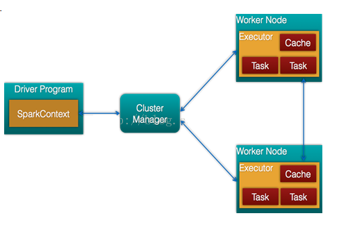
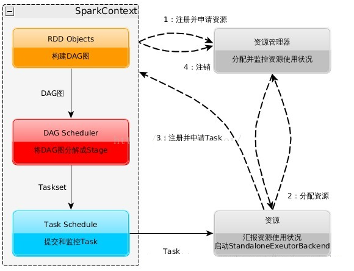
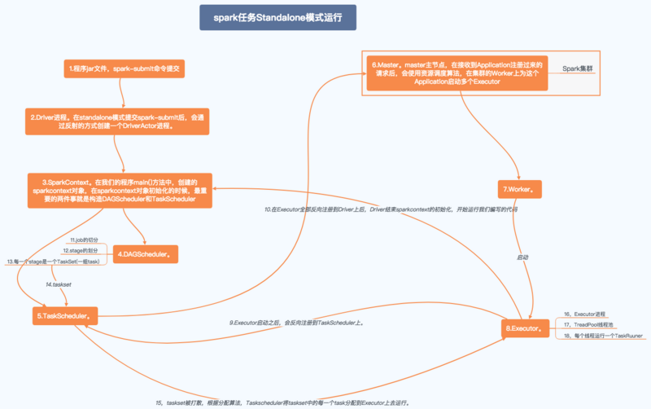
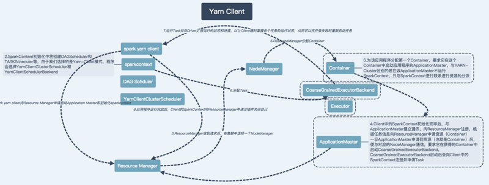
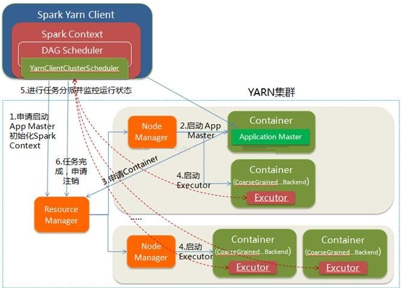
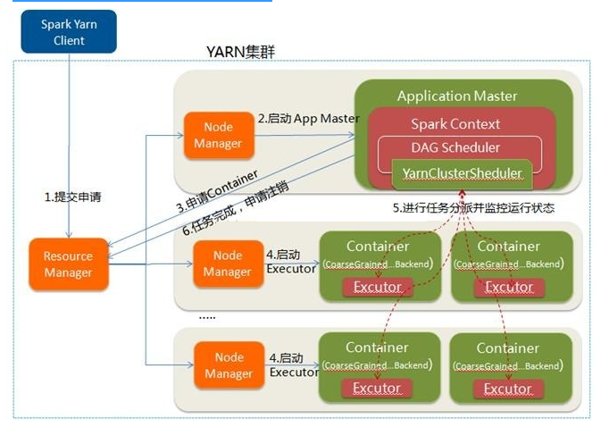

###一、Spark架构的组成图

+ Cluster Manager：在standalone模式中即为Master主节点，控制整个集群，监控worker。在YARN模式中为ResourceManager

+ Worker节点：从节点，负责控制计算节点，启动Executor或者Driver。

+ Driver： 运行Application 的main()函数，是一个进程，我们编写的 Spark 应用程序就运行在 Driver 上， 由Driver 进程执行

+ Executor：执行器，是为某个Application运行在worker node上的一个进程,Executor中有线程池

+ Application: Appliction都是指用户编写的Spark应用程序，其中包括一个Driver功能的代码和分布在集群中多个节点上运行的Executor代码

+ Driver: Spark中的Driver即运行上述Application的main函数并创建SparkContext，创建SparkContext的目的是为了准备Spark应用程序的运行环境，在Spark中有SparkContext负责与ClusterManager通信，进行资源申请、任务的分配和监控等，当Executor部分运行完毕后，Driver同时负责将SparkContext关闭，通常用SparkContext代表Driver

+ Executor: 某个Application运行在worker节点上的一个进程， 该进程负责运行某些Task， 并且负责将数据存到内存或磁盘上，每个Application都有各自独立的一批Executor， 在Spark on Yarn模式下，其进程名称为CoarseGrainedExecutor Backend。一个CoarseGrainedExecutor Backend有且仅有一个Executor对象， 负责将Task包装成taskRunner,并从线程池中抽取一个空闲线程运行Task， 这个每一个oarseGrainedExecutor Backend能并行运行Task的数量取决与分配给它的cpu个数

+ Cluter Manager：指的是在集群上获取资源的外部服务。目前有三种类型

1. Standalone : spark原生的资源管理，由Master负责资源的分配
2. Apache Mesos:与hadoop MR兼容性良好的一种资源调度框架
3. Hadoop Yarn: 主要是指Yarn中的ResourceManager

+ Worker: 集群中任何可以运行Application代码的节点，在Standalone模式中指的是通过slave文件配置的Worker节点，在Spark on Yarn模式下就是NodeManager节点

+ Task: 被送到某个Executor上的工作单元，但hadoopMR中的MapTask和ReduceTask概念一样，是运行Application的基本单位，多个Task组成一个Stage，而Task的调度和管理等是由TaskScheduler负责

+ Job: 包含多个Task组成的并行计算，往往由Spark Action触发生成， 一个Application中往往会产生多个Job

+ Stage: 每个Job会被拆分成多组Task， 作为一个TaskSet， 其名称为Stage，Stage的划分和调度是有DAGScheduler来负责的，Stage有非最终的Stage（Shuffle Map Stage）和最终的Stage（Result Stage）两种，Stage的边界就是发生shuffle的地方

+ DAGScheduler: 根据Job构建基于Stage的DAG（Directed Acyclic Graph有向无环图)，并提交Stage给TASkScheduler。 其划分Stage的依据是RDD之间的依赖的关系找出开销最小的调度方法。

+ TASKSedulter: 将TaskSET提交给worker运行，每个Executor运行什么Task就是在此处分配的. TaskScheduler维护所有TaskSet，当Executor向Driver发生心跳时，TaskScheduler会根据资源剩余情况分配相应的Task。另外TaskScheduler还维护着所有Task的运行标签，重试失败的Task。在不同运行模式中任务调度器具体为：

1. Spark on Standalone模式为TaskScheduler

2. YARN-Client模式为YarnClientClusterScheduler

3. YARN-Cluster模式为YarnClusterScheduler

那么一点点来说: spark的application 运行需要一个环境, 也即spark本身。

而往往我们使用的就是集群环境, 集群环境中有多台机器, 多个进程, 这就需要一个管理器, 管理 多个master 和 多个 worker节点. 这个就是 cluster manager. 而我们直接通信的对象, 也就是 application 直接通信的对象 就是 master. 由master 来告诉我们 application 的可用资源在哪里。

一个集群中, 可以运行多个application。

当我们提交application之后, 会接入master, master分配给我们资源, 也即executor, main程序所在的进程. 就被称作是 driver。 driver 分配任务, 协调各个executor, 运行各个 task的就是 executor.

注意在这里并没有指定driver究竟会运行在哪个节点上，与选取的模式有关。

而master呢? 在master中注册 application, driver, worker这三种资源, 而 executor资源是注册在 driver中的, 新的worker加入, driver状态变化, worker状态变化 都会通告给 master 以重新协调资源。

我们会发现, executor在分配之后是与master无关的, 程序是运行在executor中的, driver并不一定运行在master中, 因此即使master挂掉, 程序也并不是就不能够运行了。

master worker是集群中的物理资源分配, driver , executor 是对物理资源的使用。在申请新的资源时, 需要向master申请, 在任务调度运行时, 则无需向master通报。

其实仔细想想, 在大多数集群的处理中, 都是采用这种模式, cluster manager负责集群的资源管理, 相互通信, master节点负责资源调度, 资源状态变更处理, 而 application 是独立于它们运行的, 一旦获取到自己需要的资源, 就不和master进行通信了。

###二、Spark任务运行流程

1. 构建Spark Application的运行环境，启动SparkContext

2. SparkContext向资源管理器（可以是Standalone，Mesos，Yarn）申请运行Executor资源，并启动StandaloneExecutorbackend

3. Executor向SparkContext申请Task

4. SparkContext将应用程序分发给Executor

5. SparkContext构建成DAG图，将DAG图分解成Stage、将Taskset发送给Task Scheduler，最后由Task Scheduler将Task发送给Executor运行

6. Task在Executor上运行，运行完释放所有资源

Spark运行特点：

+ 每个Application获取专属的executor进程，该进程在Application期间一直驻留，并以多线程方式运行Task。这种Application隔离机制是有优势的，无论是从调度角度看（每个Driver调度他自己的任务），还是从运行角度看（来自不同Application的Task运行在不同JVM中），当然这样意味着Spark Application不能跨应用程序共享数据，除非将数据写入外部存储系统

+ Spark与资源管理器无关，只要能够获取executor进程，并能保持相互通信就可以了

+ 提交SparkContext的Client应该靠近Worker节点（运行Executor的节点），最好是在同一个Rack里，因为Spark Application运行过程中SparkContext和Executor之间有大量的信息交换

+ Task采用了数据本地性和推测执行的优化机制

###三、Spark运行模式

####3.1、standalone: 独立集群运行模式

+ Standalone模式使用Spark自带的资源调度框架

+ 采用Master/Slaves的典型架构，选用ZooKeeper来实现Master的HA

+ 框架结构图如下:

该模式主要的节点有Client节点、Master节点和Worker节点。其中Driver既可以运行在Master节点上中，也可以运行在本地Client端。当用spark-shell交互式工具提交Spark的Job时，Driver在Master节点上运行；当使用spark-submit工具提交Job或者在Eclips、IDEA等开发平台上使用”new SparkConf.setManager(“spark://master:7077”)”方式运行Spark任务时，Driver是运行在本地Client端上的。

####3.2、YARN-client模式

Spark on YARN模式根据Driver在集群中的位置分为两种模式：一种是YARN-Client模式，另一种是YARN-Cluster（或称为YARN-Standalone模式）

Yarn-Client模式中，Driver在客户端本地运行，这种模式可以使得Spark Application和客户端进行交互，因为Driver在客户端，所以可以通过webUI访问Driver的状态，默认是http://hadoop1:4040访问，而YARN通过http:// hadoop1:8088访问

YARN-client的工作流程步骤为：

1. Spark Yarn Client向YARN的ResourceManager申请启动Application Master。同时在SparkContent初始化中将创建DAGScheduler和TASKScheduler等，由于我们选择的是Yarn-Client模式，程序会选择YarnClientClusterScheduler和YarnClientSchedulerBackend

2. ResourceManager收到请求后，在集群中选择一个NodeManager，为该应用程序分配第一个Container，要求它在这个Container中启动应用程序的ApplicationMaster，与YARN-Cluster区别的是在该ApplicationMaster不运行SparkContext，只与SparkContext进行联系进行资源的分派

3. Client中的SparkContext初始化完毕后，与ApplicationMaster建立通讯，向ResourceManager注册，根据任务信息向ResourceManager申请资源（Container）

4. 一旦ApplicationMaster申请到资源（也就是Container）后，便与对应的NodeManager通信，要求它在获得的Container中启动CoarseGrainedExecutorBackend，CoarseGrainedExecutorBackend启动后会向Client中的SparkContext注册并申请Task

5. client中的SparkContext分配Task给CoarseGrainedExecutorBackend执行，CoarseGrainedExecutorBackend运行Task并向Driver汇报运行的状态和进度，以让Client随时掌握各个任务的运行状态，从而可以在任务失败时重新启动任务

6. 应用程序运行完成后，Client的SparkContext向ResourceManager申请注销并关闭自己

在 YARN Client 模式下，Driver 在任务提交的本地机器上运行，Driver 启动后会和 ResourceManager 通讯申请启动 ApplicationMaster， 随后 ResourceManager 分配 container ， 在 合 适 的 NodeManager 上启动 ApplicationMaster ，此时的 ApplicationMaster 的功能相当于一个 ExecutorLaucher， 只负责向 ResourceManager申请 Executor 内存。ResourceManager 接到 ApplicationMaster 的资源申请后会分配 container，然后ApplicationMaster 在资源分配指定的 NodeManager 上启动 Executor 进程， Executor 进程启动后会向 Driver 反向注册， Executor 全部注册完成后 Driver 开始执行 main 函数，之后执行到 Action 算子时，触发一个 job，并根据宽依赖开始划分 stage，每个 stage 生成对应的 taskSet，之后将 task 分发到各个 Executor 上执行。

####3.3、YARN-cluster模式

在YARN-Cluster模式中，当用户向YARN中提交一个应用程序后，YARN将分两个阶段运行该应用程序：

第一个阶段是把Spark的Driver作为一个ApplicationMaster在YARN集群中先启动；

第二个阶段是由ApplicationMaster创建应用程序，然后为它向ResourceManager申请资源，并启动Executor来运行Task，同时监控它的整个运行过程，直到运行完成

YARN-cluster的工作流程分为以下几个步骤:

1. Spark Yarn Client向YARN中提交应用程序，包括ApplicationMaster程序、启动ApplicationMaster的命令、需要在Executor中运行的程序等

2. ResourceManager收到请求后，在集群中选择一个NodeManager，为该应用程序分配第一个Container，要求它在这个Container中启动应用程序的ApplicationMaster，其中ApplicationMaster进行SparkContext等的初始化

3. ApplicationMaster向ResourceManager注册，这样用户可以直接通过ResourceManage查看应用程序的运行状态，然后它将采用轮询的方式通过RPC协议为各个任务申请资源，并监控它们的运行状态直到运行结束

4. 一旦ApplicationMaster申请到资源（也就是Container）后，便与对应的NodeManager通信，要求它在获得的Container中启动CoarseGrainedExecutorBackend，CoarseGrainedExecutorBackend启动后会向ApplicationMaster中的SparkContext注册并申请Task。这一点和Standalone模式一样，只不过SparkContext在Spark Application中初始化时，使用CoarseGrainedSchedulerBackend配合YarnClusterScheduler进行任务的调度，其中YarnClusterScheduler只是对TaskSchedulerImpl的一个简单包装，增加了对Executor的等待逻辑等

5. ApplicationMaster中的SparkContext分配Task给CoarseGrainedExecutorBackend执行，CoarseGrainedExecutorBackend运行Task并向ApplicationMaster汇报运行的状态和进度，以让ApplicationMaster随时掌握各个任务的运行状态，从而可以在任务失败时重新启动任务

6. 应用程序运行完成后，ApplicationMaster向ResourceManager申请注销并关闭自己.

在 YARN Cluster 模式下， 任务提交后会和 ResourceManager 通讯申请启动
ApplicationMaster， 随后 ResourceManager 分配 container，在合适的 NodeManager上启动 ApplicationMaster，此时的 ApplicationMaster 就是 Driver。Driver 启动后向 ResourceManager 申请 Executor 内存， ResourceManager 接到ApplicationMaster 的资源申请后会分配 container，然后在合适的 NodeManager 上启动 Executor 进程，Executor 进程启动后会向 Driver 反向注册， Executor 全部注册完成后 Driver 开始执行 main 函数，之后执行到 Action 算子时，触发一个 job，并根据宽依赖开始划分 stage，每个 stage 生成对应的 taskSet，之后将 task 分发到各个Executor 上执行。

####3.4、Spark Client 和 Spark Cluster的区别:

理解YARN-Client和YARN-Cluster深层次的区别之前先清楚一个概念：Application Master。在YARN中，每个Application实例都有一个ApplicationMaster进程，它是Application启动的第一个容器。它负责和ResourceManager打交道并请求资源，获取资源之后告诉NodeManager为其启动Container。从深层次的含义讲YARN-Cluster和YARN-Client模式的区别其实就是ApplicationMaster进程的区别。

+ YARN-Cluster模式下，Driver运行在AM(Application Master)中，它负责向YARN申请资源，并监督作业的运行状况。当用户提交了作业之后，就可以关掉Client，作业会继续在YARN上运行，因而YARN-Cluster模式不适合运行交互类型的作业。

+ YARN-Client模式下，Application Master仅仅向YARN请求Executor，Client会和请求的Container通信来调度他们工作，也就是说Client不能离开。

