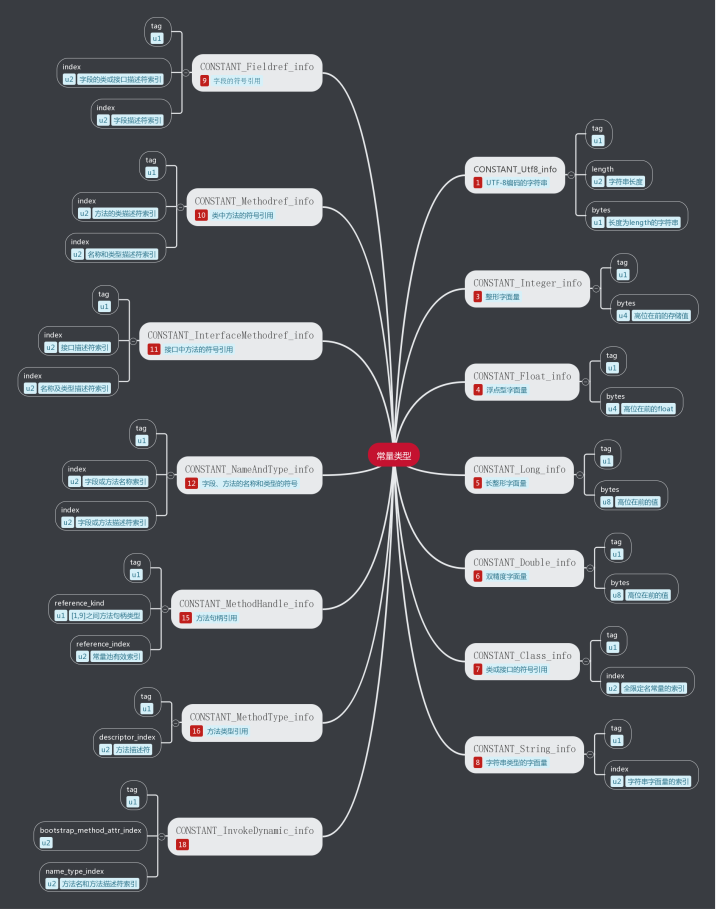
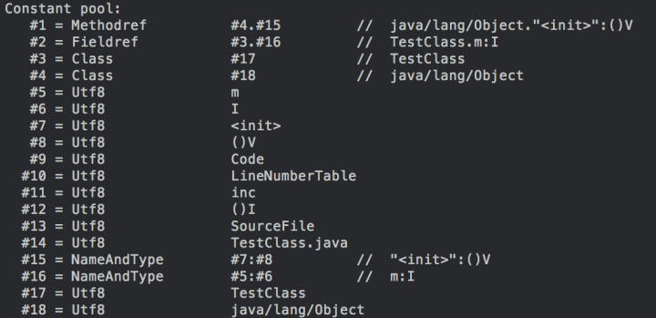
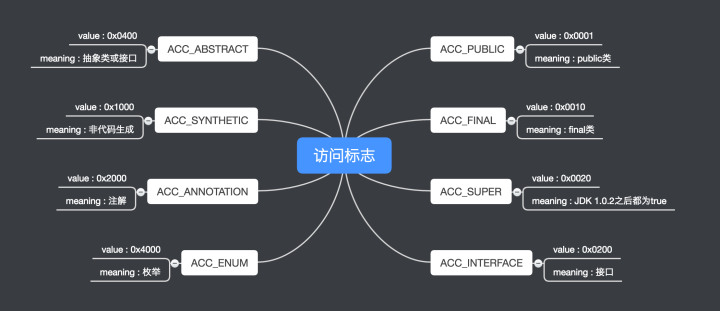
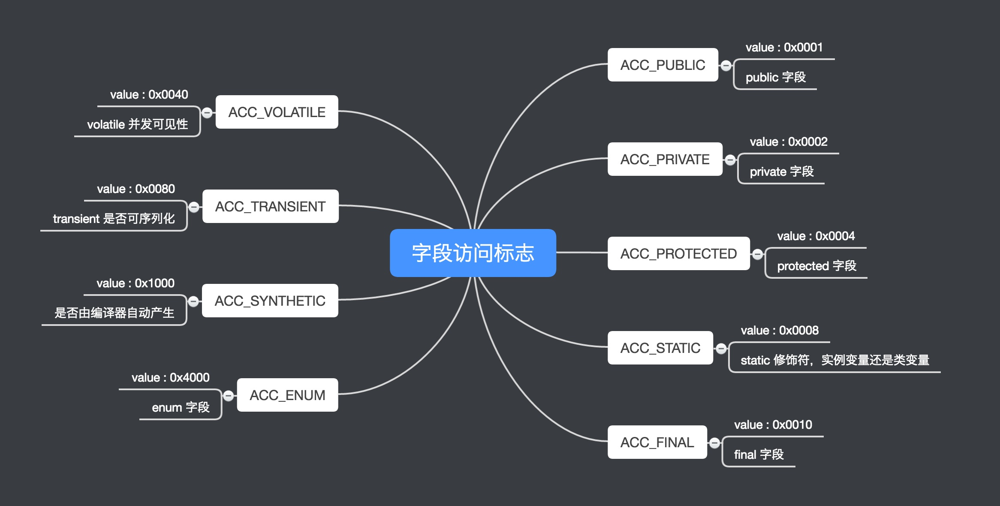
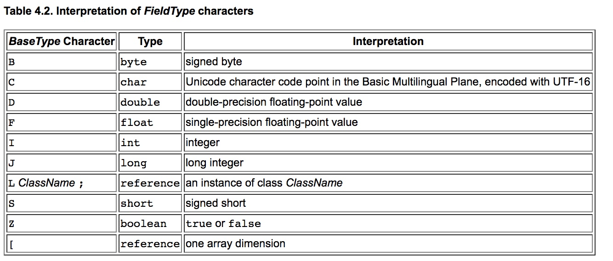
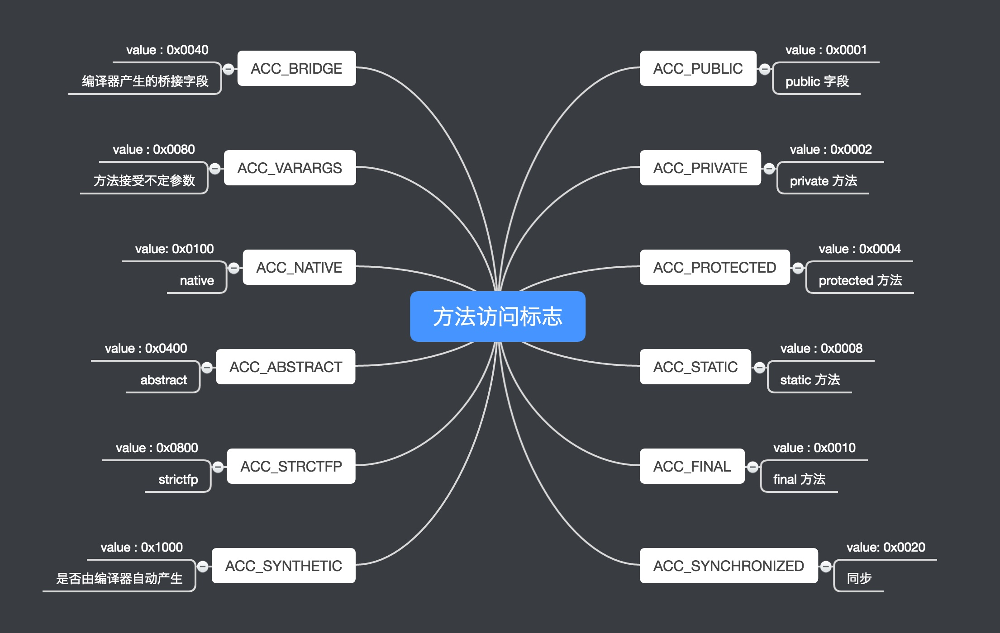
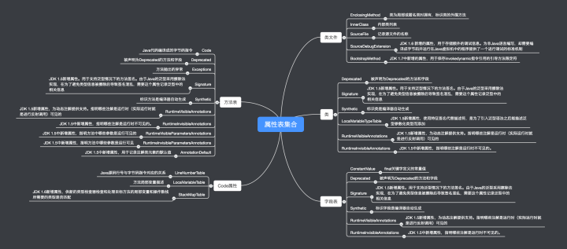

Java在刚刚诞生之时曾经提出过一个非常著名的宣传口号：”一次编写，到处运行”（Write once, run anywhere、WORA，有时也作“write once, run everywhere”、WORE）。理想中，这意味着Java可以在任何设备上开发，编译成一段标准的字节码并且可以在任何安装有Java虚拟机（JVM）的设备上运行。美中不足的是JVM在各种不同的操作系统上有多种不同的实现，导致Java程序在不同的JVM虚拟机和操作系统上执行的时候有微妙的差别，所以一种应用可能需要在许多平台上进行测试，这造就了一个Java开发者的笑话：”一次编译，到处Debug”。

Java虚拟机有自己完善的硬体架构，如处理器、堆栈、寄存器等，还具有相应的指令系统。JVM屏蔽了与具体操作系统平台相关的信息，使得Java程序只需生成在Java虚拟机上运行的目标代码（字节码），就可以在多种平台上不加修改地运行。通过对中央处理器（CPU）所执行的软件实作，实现能执行编译过的Java程序码（Applet与应用程序）。作为一种编程语言的虚拟机，实际上不只是专用于Java语言，只要生成的编译文件匹配JVM对载入编译文件格式要求，任何语言都可以由JVM编译运行。
### 一、Class文件概述
Class文件是由8个字节为基础的字节流构成的，这些字节流之间都严格按照规定的顺序排列，并且字节之间不存在任何空隙，对于超过8个字节的数据，将按照Big-Endian的顺序存储的，也就是说高位字节存储在低的地址上面，而低位字节存储到高地址上面，其实这也是class文件要跨平台的关键，因为 PowerPC架构的处理采用Big-Endian的存储顺序，而x86系列的处理器则采用Little-Endian的存储顺序，因此为了Class文 件在各中处理器架构下保持统一的存储顺序，虚拟机规范必须对起进行统一。
### 二、Class文件组成
Class文件结构采用类似C语言的结构体来存储数据的，主要有两类数据项，无符号数和表，无符号数用来表述数字，索引引用以及字符串等，比如 u1，u2，u4，u8分别代表1个字节，2个字节，4个字节，8个字节的无符号数，而表是有多个无符号数以及其它的表组成的复合结构，习惯地以_info结尾。表用于描述有层次关系的符合结构的数据，整个Class文件本质上就是一张表。
```java
ClassFile {
    u4             magic;
    u2             minor_version;
    u2             major_version;
    u2             constant_pool_count;
    cp_info        constant_pool[constant_pool_count-1];
    u2             access_flags;
    u2             this_class;
    u2             super_class;
    u2             interfaces_count;
    u2             interfaces[interfaces_count];
    u2             fields_count;
    field_info     fields[fields_count];
    u2             methods_count;
    method_info    methods[methods_count];
    u2             attributes_count;
    attribute_info attributes[attributes_count];}
```
#### 1. magic 与 version
每个 Class 文件的头 4 个字节称为魔数（magic），它的值固定为 0xCAFEBABE，表示文件类型是能够被JVM处理的Class文件。紧接着magic之后的四个字节存储的是 Class 文件的次版本号和主版本号。
#### 2. constant_pool
在主次版本号之后是常量池。入口是u2类型数据，表示常量池中常量表个数。常量池计数从1开始，如常量池容量为0x0016，表示常量池中有21个常量表，第0位意味不引用任何一个常量池项目。

常量池主要存储了字面量以及符号引用，其中字面量主要包括字符串，final常量的值或者某个属性的初始值等，而符号引用主要存储类和接口的全限定名称，字段的名称以及描述符，方法的名称以及描述符。

在常量池中每一个常量都是个常量表。在JDK1.7之前共有11中不同结构的常量表，在JDK 1.7中有额外增加了3种常量表。每个常量表都是以u1类型的标志位开始，来区分常量表的类型。



JDK为我们提供一个用来分析Class字节码的工具：javap，利用javap工具方面查看Class文件中常量池数据。
```java
javap -verbose TestClass.class  
```

#### 3. access_flags
在常量池之后是访问标志，用于识别类或接口层次的访问信息。Java定义了8种访问标志，access_flags则从8种组合而成，表示类或接口访问的类型。


#### 4. this_class、super_class 和 interfaces
Java类的继承关系由类索引、父类索引和接口索引集合三项确定。类索引、父类索引和接口索引集合按照顺序排在访问标志之后，类索引和父类索引用u2类型的索引值来表示，指向常量表类型为Constan_Class_info的类描述符，根据常量表中index值找到全限定名字符串。

接口索引集合类似常量池，入口用一个u2类型数据来保存集合容量。集合中每项都是类型为Constan_Class_info的类描述符。
#### 5. fileds
紧跟接口索引集合之后的是字段表集合。字段表（filed_info）用于描述接口或者类中声明的变量。
```java
field_info {
    u2             access_flags;
    u2             name_index;
    u2             descriptor_index;
    u2             attributes_count;
    attribute_info attributes[attributes_count];}
```
access_flags存放字段修饰符，修饰字段的作用域、变量类型、可变性、并发可见性、序列化、类型。



name_index表示字段名称，descriptor_index表示字段描述符，两个都指向常量池类型为CONSTANT_UTF8_info常量表。

* **全限定名**

    把类的全名中"."替换为"/"，并以";"结尾，组成的字符串被称为类的全限定名。如"com/example/AClass;"。

* **简单名称**

    没有类型和参数修饰的方法或字段名称

* **描述符**

    描述符主要是用来描述字段的数据类型，方法的参数列表（包括数量、类型和顺序）和返回值。

基本数据类型（byte、short、int、long、float、double、char、boolean）和void类型返回值都使用大写的字符表示。

对象类型则用L加对象的全限定名表示。

数组类型每个维度用一个前置"["字符表示。

用参数列表来描述方法时，按照先参数列表后返回值顺序描述。

如"java.lang.String[] getStrings()"的描述符为"()[Ljava/lang/String;"


#### 6. methods
字段表集合之后是方法表集合，起始u2类型数据表示方法数量，然后是方法表集合。Class文件存储格式对方法的描述采取了和字段描述集合完全一致的方式。
```java
method_info {
    u2             access_flags;
    u2             name_index;
    u2             descriptor_index;
    u2             attributes_count;
    attribute_info attributes[attributes_count];}
```
volatile关键字和transient关键词不能修饰方法，方法表中访问标志因此没有ACC_VOLATILE和ACC_TRANSIENT两个标志。又由于synchronized、native、strictfp和abstract关键词可以修饰方法，所以方法表中又增加了ACC_SYNCHRONIZED、ACC_NATIVE、ACC_STRICTFP、ACC_ABSTRACT标志。



方法里的 Java 代码，经过编译器编译成字节码指令后，存放在方法属性表集合中的一个名为"Code"的属性中。
#### 7. attributes
在Class文件、字段表、方法表、Code表都可以携带自己的属性表集合，用于描述场景专有的信息，只要不与现有属性名重复，任何人实现的编译器都可以向属性表中写入自己定义的属性信息，Java虚拟集运行时会忽略它不认识的属性。



* **Code**

    Java程序方法体中的代码经过Javac编译处理后，最终变为字节码指令存储在Code属性内。
```java
Code_attribute {
    u2 attribute_name_index;
    u4 attribute_length;
    u2 max_stack;
    u2 max_locals;
    u4 code_length;
    u1 code[code_length];
    u2 exception_table_length;
    {   u2 start_pc;
        u2 end_pc;
        u2 handler_pc;
        u2 catch_type;
    } exception_table[exception_table_length];
    u2 attributes_count;
    attribute_info attributes[attributes_count];
}
```
> attribute_name_index 属性名索引，常量值固定为"Code"
> 
> attribute_length 属性值长度，值为整个表的长度减去6个字节
> 
> max_stack 操作数栈深度最大值
> 
> max_locals 局部变量表所需的存储空间，单位为"Slot"，Slot是虚拟机为局部变量分配内存所使用的最小的单位。
> 
> code_length、code[] 存储Java源程序编译后生成的字节码指令，每个指令为u1类型的单字节。虚拟机规范中明确限制了一个方法不允许超过65535条字节指令，实际上只用了u2长度。在实例方法的局部变量表中至少会存在一个指向当前对象实例的局部变量this，局部变量表中也会预留出第一个Slot来存放对象实例的引用。但如果方法为static，局部变量表长度则可能为0。
> 
> exception_table_length、exception_table[] 异常表包含四个字段。表示：如果当字节码在start_pc行到end_pc行出现类类型为catch_type或者其子类异常，则转到第handle_pc行继续处理。异常表是Java代码的一部分，编译器使用异常表而不是简答的跳转命令来实现Java异常及finally处理机制。

* **LineNumberTable**

    描述Java源码行号与字节码行号（字节码偏移量）之间的对应关系。
```java
LineNumberTable_attribute {
    u2 attribute_name_index;
    u4 attribute_length;
    u2 line_number_table_length;
    {   u2 start_pc;
        u2 line_number; 
    } line_number_table[line_number_table_length];
}
```
* **Exceptions**

    列举出方法中可能抛出的异常
```java
Exceptions_attribute {
    u2 attribute_name_index;
    u4 attribute_length;
    u2 number_of_exceptions;
    u2 exception_index_table[number_of_exceptions];
}
```
* **LocalVariableTable**

    描述栈中局部变量表中的变量与Java源码中定义的变量之间的关系。
```java
LocalVariableTable_attribute {
    u2 attribute_name_index;
    u4 attribute_length;
    u2 local_variable_table_length;
    {   u2 start_pc;
        u2 length;
        u2 name_index;
        u2 descriptor_index;
        u2 index;
    } local_variable_table[local_variable_table_length];}
```
* **ConstantValue**

    通知虚拟机自动为静态变量赋值，只有被static关键字修饰的变量（类变量）才具有这个属性。对于非static类型的变量的赋值是在实例构造器中进行；而对于类变量，则有两种方式：在类构造器<init>方法中或者使用ConstantValue属性。
```java
ConstantValue_attribute {
    u2 attribute_name_index;
    u4 attribute_length;
    u2 constantvalue_index;
}
```
* **Deprecated与Synthetic**
    Deprecated与Synthetic两个属性都属于标志类型的布尔属性，只存在有和没有区别，没有属性值区别。

    Deprecated表示某个类、字段或方法已经被开发者定位不再推荐使用。使用@deprecated注释设置。
    
    Synthetic表示此字段或方法不是Java源码直接产生，而是由编译器添加。
```java
Deprecated_attribute {
    u2 attribute_name_index;
    u4 attribute_length;}

Synthetic_attribute {
    u2 attribute_name_index;
    u4 attribute_length;}
```
* **StackMapTable**

    在JDK 1.6加入到Class文件规范中，复杂的变长属性，位于Code属性的属性表中。

    会在虚拟机类加载的字节码验证阶段被新类型检查验证器使用，目的是代替以前比较消耗性能的基于数据流分析的类型推导验证器。
```java
StackMapTable_attribute {
    u2              attribute_name_index;
    u4              attribute_length;
    u2              number_of_entries;
    stack_map_frame entries[number_of_entries];}
```
* **Signature**

    JDK 1.5版本加入到Class文件规范中，可选的定长属性，出现在类、字段表和方法表结构的属性表中。因为Java语言的泛型采用的是擦除法实现的伪泛型，在字节码（Code属性）中，泛型信息编译之后通通被擦除掉，如运行期做反射时无法获得泛型信息。Signature属性就是为了弥补这个缺陷而增设，可以让Java的反射API能够获取反省类型。
```java
Signature_attribute {
    u2 attribute_name_index;
    u4 attribute_length;
    u2 signature_index;}
```
* **BootstrapMethod**

    JDK 1.7版本加入到Class文件规范中，复杂的可变属性，位于类文件的属性表中。用于记录invokeddynamic指令引用的引导方法限定符，最多只能有一个BootstrapMethod属性。
```java
BootstrapMethods_attribute {
    u2 attribute_name_index;
    u4 attribute_length;
    u2 num_bootstrap_methods;
    {   u2 bootstrap_method_ref;
        u2 num_bootstrap_arguments;
        u2 bootstrap_arguments[num_bootstrap_arguments];
    } bootstrap_methods[num_bootstrap_methods];}
```
* **InnerClass**

    用于记录内部类与宿主类之间的关联。
```java
InnerClasses_attribute {
    u2 attribute_name_index;
    u4 attribute_length;
    u2 number_of_classes;
    {   u2 inner_class_info_index;
        u2 outer_class_info_index;
        u2 inner_name_index;
        u2 inner_class_access_flags;
    } classes[number_of_classes];}
```
