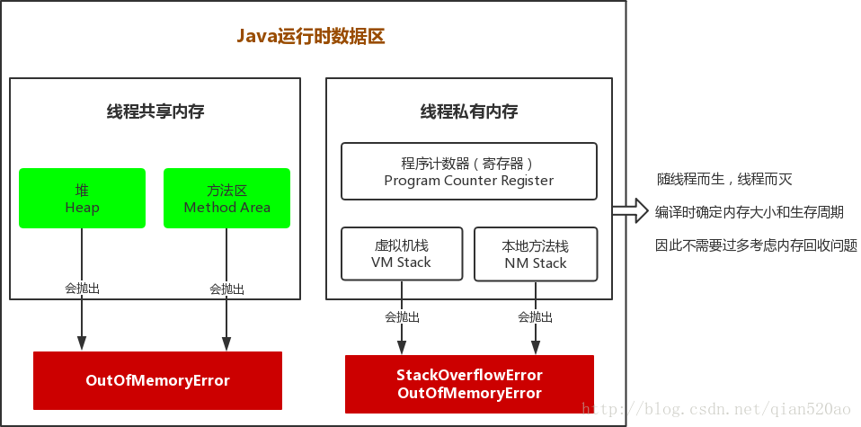
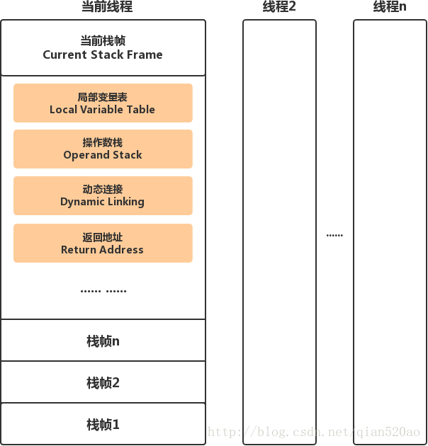

### 运行时数据区域
jdk1.7中， Java虚拟机在执行Java程序的过程中会把它所管理的内存划分为若干个不同的数据区域。

#### 程序计数器
1. 程序计数器（Program Counter Register）是一块较小的内存空间，它可以看做是当前线程所执行的字节码的行号指示器。字节码解释器工作时就是通过改变这个计数器的值来选取下一条需要执行的字节码指令。

2. 字节码指令、分支、循环、跳转、异常处理、线程恢复等基础功能都要依赖这个计数器来完成。

3. 每条线程都有一个独立的程序计数器，各条线程之间计数器互不影响，独立存储。如上图所示，我们称这类内存区域为 : 线程私有内存。

4. 如果线程正在执行的是一个Java方法，这个计数器记录的是正在执行的虚拟机字节码指令的地址；如果正在执行的是Native方法，这个计数器值则为空（Undefined）。

5. 此内存区域是唯一一个在Java虚拟机中没有规范任何OutOfMemoryError情况的区域。

#### Java虚拟机栈
1. Java虚拟机栈也是线程私有的，它的生命周期与线程相同（随线程而生，随线程而灭）

2. 如果线程请求的栈深度大于虚拟机所允许的深度，将抛出StackOverflowError异常；如果虚拟机栈可以动态扩展，如果扩展时无法申请到足够的内存，就会抛出OutOfMemoryError异常；（当前大部分JVM都可以动态扩展，只不过JVM规范也允许固定长度的虚拟机栈）

3. Java虚拟机栈描述的是Java方法执行的内存模型：每个方法执行的同时会创建一个栈帧。 对于我们来说，主要关注的stack栈内存，就是虚拟机栈中局部变量表部分。

##### 栈帧
栈帧是用于支持虚拟机进行方法调用和方法执行的数据结构，它是虚拟机运行时数据区中的虚拟机栈的栈元素。栈帧用于存储局部变量表、操作数栈、动态链接、方法返回等信息。 每个方法从调用直至执行完成的过程，就对应着一个栈帧在虚拟机栈中入栈到出栈的过程。

在活动线程中，只有位于栈顶的栈帧才是有效的，称为当前栈帧，与这个栈帧相关联的方法称为当前方法。执行引擎运行的所有字节码指令都只针对当前栈帧进行操作。

局部变量表存放了编译期可知的各种基本数据类型(boolean、byte、char、short、int、float、long、double)「String是引用类型」，对象引用(reference类型)和returnAddress类型（它指向了一条字节码指令的地址） 。
> 「**小知识**」网上的很多资料都称 ： 基本数据和对象引用存储在栈中。
> 
> 当然这种说法虽然是正确的，但是很不严谨，只能说这种说法针对的是局部变量。局部变量存储在局部变量表中，随着线程而生，线程而灭。并且线程间数据不共享。 
> 
> 但是，如果是成员变量，或者定义在方法外对象的引用，它们存储在堆中。因为在堆中，是线程共享数据的，并且栈帧里的命名就已经清楚的划分了界限 : 局部变量表！

#### 本地方法栈
本地方法栈（Native Method Stack）与虚拟机栈所发挥的作用是非常相似的，它们之间的区别不过是虚拟机栈为虚拟机执行Java方法服务（也就是字节码）服务，而本地方法栈为虚拟机使用到的Native方法服务。

Java虚拟机规范对本地方法栈使用的语言、使用方法与数据结构并没有强制规定，因此可以由虚拟机自由实现。例如：HotSpot虚拟机直接将本地方法栈和虚拟机栈合二为一。

同虚拟机栈相同，Java虚拟机规范对这个区域也规定了两种异常情况StackOverflowError 和 OutOfMemoryError异常。
#### 堆
1. Java堆是被所有线程共享的一块内存区域，在虚拟机启动时创建，是虚拟机所管理的内存中最大的一块。此内存区域的唯一目的就是【存放对象实例和数组】，几乎所有的对象实例和数组都在这里分配内存。

2. Java堆是垃圾收集器管理的主要区域，也称为GC 垃圾堆。后面会专门分析GC算法。

>从内存回收的角度看，由于现在收集器基本都采用分代收集算法，所以Java堆可以细分为：新生代、老生代；
>
>从内存分配的角度看，线程共享的Java堆可能划分出多个线程私有的分配缓冲区（TLAB）； 
>
>不论如何划分，都与存放的内容无关，无论哪个区域，存储的仍然是对象实例和数组。

3. 如果在堆中没有内存完成实例分配，并且堆上也无法再扩展时，将会抛出OutOfMemoryError异常。

4. 内存泄露和内存溢出 
> **内存泄露** ： 指程序中动态分配内存给一些临时对象，但是对象不会被GC所回收，它始终占用内存。即被分配的对象可达但已无用，可用内存越来越少。 
> 
> **内存溢出** ： 指程序运行过程中无法申请到足够的内存而导致的一种错误。内存溢出通常发生于老年代或永久代垃圾回收后，仍然无内存空间容纳新的Java对象的情况。
> 
> 内存泄露是内存溢出的一种诱因，不是唯一因素。

#### 方法区
1. 方法区又被称为静态区，是程序中永远唯一的元素存储区域。和堆一样，是各个线程共享的内存区域。它用于存储已被虚拟机加载的类信息、常量、静态变量、即时编译器编译后的代码等数据。

2. Java虚拟机规范对方法区的限制非常宽松，除了和Java堆一样 不需要连续的内存和可以选择固定大小或者可扩展之外，还可以选择不实现垃圾回收。 
> 这区域的内存回收目标主要是针对常量池的回收和类型的卸载，一般而言，这个区域的内存回收比较难以令人满意，尤其是类型的回收，条件相当苛刻，但是这部分区域的内存回收确实是必要的。

3. 很多开发者更愿意把方法区称为“永久代”(Perm Gen)(Permanent Generation)「总是存放不会轻易改变的内容」。在目前已经发布的JDK 1.7 的HotSpot中，已经把原本放在永久代的字符串常量池移至堆中。

4. 运行时常量池(Runtime Constant Pool)是方法区的一部分。

> JDK 1.8 中，已经没有方法区(永久代)，而是将方法区直接放在一个与堆不相连的本地内存区域(Native Memory)，这个区域被叫做元空间。

##### 运行时常量池
1. Class文件中除了有类的版本、字段、方法、接口等描述信息外，还有一项信息是常量池(Constant Pool Table)，用于存放编译期生成的字面量和符号引用，这部分内容（也可以称为 .Class文件中的静态常量池）将在类加载后进入方法区的运行时常量池中存放。
> **字面量** ： 比较接近Java语言层面的常量概念，如文本字符串、声明为final的常量值等。（final修饰的成员变量和类变量！「类变量即静态(成员)变量)」，也就是除final修饰的局部变量。
> 
> **符号引用** ： 属于编译原理方面的概念，包括 
> 
> > 1). 类和接口的全限定名(即路径，包名+类名)。 
> > 
> > 2). 字段的名称和描述符。 
> > 
> > 3). 方法的名称和描述符。
>  
> > 当虚拟机运行时，需要从常量池获得对应的符号引号，再在类创建或运行时解析、翻译到具体的内存地址之中（直接引用）。

2. 除了保存Class文件中描述的符号引用外，还会把编译出来的直接引用也存储在运行时常量池中。

3. Java语言并不要求常量一定只有编译期才能生成，也就是并非置入Class文件中常量池的内容才能进入方法区运行时常量池，运行期间也可能将新的常量放入池中，这种特性被开发人员利用得比较多的便是String 类的intern()方法。

4. 当常量池无法再申请到内存时也会抛出OutofMemoryError异常。

### 拓展
#### 成员变量与局部变量

* **成员变量** : 方法外部，类内部定义的变量；
* **局部变量** : 方法或语句块内部定义的变量，必须初始化。

形参是局部变量，实参则可能是方法中的局部变量或全局变量。 

栈内存中的局部变量随方法而生，随方法而灭。

成员变量存储在堆中的对象里，由垃圾收集器回收。

| 定义 | 成员变量 | 局部变量 | 静态变量 |
| --- | --- | --- | --- |
| 定义位置 | 在类中，方法外 | 方法中，或形参 | 类中，方法外（java只有静态成员变量） |
| 初始化值 | 有默认初始化值 | 无，先定义，后赋值 | 默认初始化值 |
| 存储位置 | 堆 | 栈 | 方法区 |
| 声明周期 | 与对象共存亡 | 与方法(线程)共存亡 | 与类共存亡 |
| 别名 | 实例变量 | - | 类变量 |
