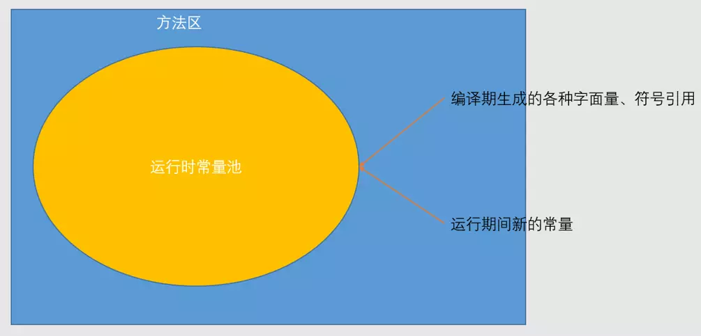
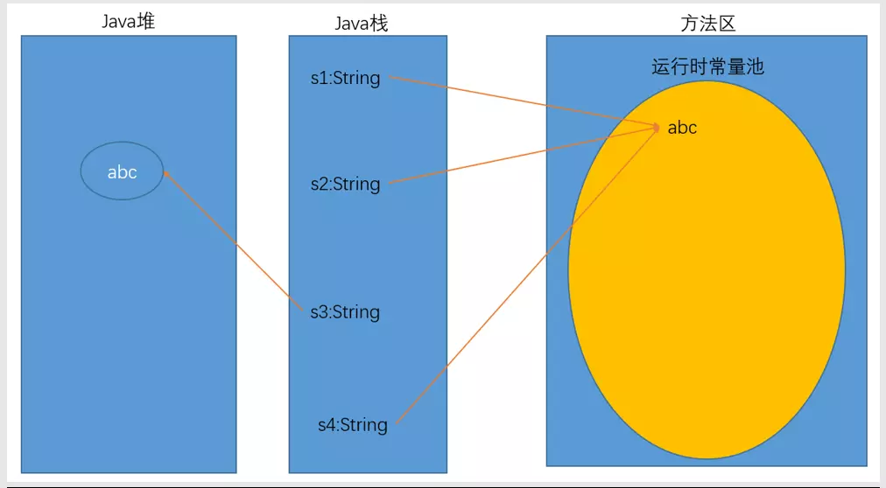

运行时常量池（Runtime Constant Pool)是方法区的一部分。Class文件中除了有类的版本、字段、方法、接口等描述信息外，还有一项信息是常量池（Constant Pool Table)，用于存放编译期生成的各种字面量和符号引用，这部分内容将在类加载后进入方法区的运行时常量池中存放。

Java虚拟机对Class文件每一部分（自然也包括常量池）的格式都有严格规定，每一个字节用于存储哪种数据都必须符合规范上的要求才会被虚拟机认可、装载和执行，但对于运行时常量池，Java虚拟机规范没有做任何细节的要求，不同的提供商实现的虚拟机可以按照白己的需要来实现这个内存区域。不过，一般来说，除了保存Class文件中描述的符号引用外，还会把翻译出来的直接引用也存储在运行时常量池中。

运行时常量池相对于Class文件常员池的另外一个重要特征是具备动态性，Java语言并不要求常量一定只有编译期才能产生，也就是并非预置入Class文件中常量池的内容才能进人方法区运行时常量池，运行期间也可能将新的常量放入池中，这种特性被开发人员利用得比较多的便是String类的intern()方法。

既然运行时常量池是方法区的一部分，当然受到方法区内存的限制，当常量池无法再申请到内存时会抛出OutOfMemoryError异常。



**测试代码**


```java
package top.itcourse.jvm;

public class TestRuntimeConstantPool {
    public static void main(String[] args) {
        /*
         * 1. 编译期生成的各种字面量、符号引用
         */
        String s1 = "abc";
        String s2 = "abc";
        
        String s3 = new String("abc");
        
        /*
         * true: 因为"abc"第一次出现将被放在运行时常量池中，后面再有相关变量需要使用，就直接指向它
         */
        System.out.println(s1 == s2);
        /*
         * false: new会直接在java堆空间中创建对象
         */
        System.out.println(s1 == s3);
        /*
         * 2. 运行期间新的常量
         */
        /*
         * true: intern方法会把堆中字符串转移到运行时常量池中，并返回常量池中的引用
         */
        String s4 = s3.intern();
        System.out.println(s1 == s4);
    }
}
```
