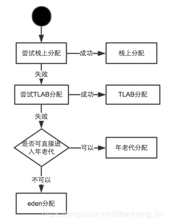

在学习使用Java的过程中，一般认为new出来的对象都是被分配在堆上，但是这个结论不是那么的绝对，通过对Java对象分配的过程分析，可以知道有两个地方会导致Java中new出来的对象并不一定分别在所认为的堆上。这两个点分别是Java中的逃逸分析和TLAB（Thread Local Allocation Buffer）。本文首先对这两者进行介绍，而后对Java对象分配过程进行介绍。
### 1. 逃逸分析
#### 1.1 逃逸分析的定义 
逃逸分析，是一种可以有效减少Java 程序中同步负载和内存堆分配压力的跨函数全局数据流分析算法。通过逃逸分析，Java Hotspot编译器能够分析出一个新的对象的引用的使用范围从而决定是否要将这个对象分配到堆上。

在计算机语言编译器优化原理中，逃逸分析是指分析指针动态范围的方法，它同编译器优化原理的指针分析和外形分析相关联。当变量（或者对象）在方法中分配后，其指针有可能被返回或者被全局引用，这样就会被其他过程或者线程所引用，这种现象称作指针（或者引用）的逃逸(Escape)。

Java在Java SE 6u23以及以后的版本中支持并默认开启了逃逸分析的选项。Java的 HotSpot JIT编译器，能够在方法重载或者动态加载代码的时候对代码进行逃逸分析，同时Java对象在堆上分配和内置线程的特点使得逃逸分析成Java的重要功能。
#### 1.2 逃逸分析的方法 
Java Hotspot编译器使用的是论文《Escape Analysis for Java》中描述的算法进行逃逸分析的。该算法引入了连通图，用连通图来构建对象和对象引用之间的可达性关系，并在次基础上，提出一种组合数据流分析法。由于算法是上下文相关和流敏感的，并且模拟了对象任意层次的嵌套关系，所以分析精度较高，只是运行时间和内存消耗相对较大。 

绝大多数逃逸分析的实现都基于一个所谓“封闭世界(closed world)”的前提：所有可能被执行的，方法在做逃逸分析前都已经得知，并且，程序的实际运行不会改变它们之间的调用关系 。但当真实的 Java 程序运行时，这样的假设并不成立。Java 程序拥有的许多特性，例如动态类加载、调用本地函数以及反射程序调用等等，都将打破所谓“封闭世界”的约定。 
#### 1.3 逃逸分析后的处理 
经过逃逸分析之后，可以得到三种对象的逃逸状态。

GlobalEscape（全局逃逸）， 即一个对象的引用逃出了方法或者线程。例如，一个对象的引用是复制给了一个类变量，或者存储在在一个已经逃逸的对象当中，或者这个对象的引用作为方法的返回值返回给了调用方法。 

ArgEscape（参数级逃逸），即在方法调用过程当中传递对象的应用给一个方法。这种状态可以通过分析被调方法的二进制代码确定。 NoEscape（没有逃逸），一个可以进行标量替换的对象。可以不将这种对象分配在传统的堆上。 

编译器可以使用逃逸分析的结果，对程序进行一下优化。 

堆分配对象变成栈分配对象。一个方法当中的对象，对象的引用没有发生逃逸，那么这个方法可能会被分配在栈内存上而非常见的堆内存上。

消除同步。线程同步的代价是相当高的，同步的后果是降低并发性和性能。逃逸分析可以判断出某个对象是否始终只被一个线程访问，如果只被一个线程访问，那么对该对象的同步操作就可以转化成没有同步保护的操作，这样就能大大提高并发程度和性能。 矢量替代。逃逸分析方法如果发现对象的内存存储结构不需要连续进行的话，就可以将对象的部分甚至全部都保存在CPU寄存器内，这样能大大提高访问速度。 

下面，我们看一下逃逸分析的例子。
```java
class Main {  
  public static void main(String[] args) {  
    example();  
  }  
  public static void example() {  
    Foo foo = new Foo(); // alloc  
    Bar bar = new Bar(); // alloc  
    bar.setFoo(foo);  
  }  
}  
 
class Foo {}  
 
class Bar {  
  private Foo foo;  
  public void setFoo(Foo foo) {  
    this.foo = foo;  
  }  
}  
```
在这个例子当中，我们创建了两个对象，Foo对象和Bar对象，同时我们把Foo对象的应用赋值给了Bar对象的方法。此时，如果Bar对在堆上就会引起Foo对象的逃逸，但是，在本例当中，编译器通过逃逸分析，可以知道Bar对象没有逃出example()方法，因此这也意味着Foo也没有逃出example方法。因此，编译器可以将这两个对象分配到栈上。
#### 1.4 编译器经过逃逸分析的效果
测试代码：
```java
package com.yang.test2;  

class EscapeAnalysis {  
    private static class Foo {  
        private int x;  
        private static int counter;  
 
        public Foo() {  
            x = (++counter);  
        }  
    }  
 
    public static void main(String[] args) {  
        long start = System.nanoTime();  
        for (int i = 0; i < 1000 * 1000 * 10; ++i) {  
            Foo foo = new Foo();  
        }  
        long end = System.nanoTime();  
        System.out.println("Time cost is " + (end - start));  
    }  
}  
```
设置JVM运行参数： 

未开启逃逸分析设置为： -server -verbose:gc 

开启逃逸分析设置为： -server -verbose:gc -XX:+DoEscapeAnalysis 

在未开启逃逸分析的状况下运行情况如下： 
```java
[GC 5376K->427K(63872K), 0.0006051 secs] 
[GC 5803K->427K(63872K), 0.0003928 secs] 
[GC 5803K->427K(63872K), 0.0003639 secs] 
[GC 5803K->427K(69248K), 0.0003770 secs] 
[GC 11179K->427K(69248K), 0.0003987 secs] 
[GC 11179K->427K(79552K), 0.0003817 secs] 
[GC 21931K->399K(79552K), 0.0004342 secs] 
[GC 21903K->399K(101120K), 0.0002175 secs] 
[GC 43343K->399K(101184K), 0.0001421 secs] 
Time cost is 58514571 
```
开启逃逸分析的状况下，运行情况如下： 
```java
Time cost is 10031306 
```
未开启逃逸分析时，运行上诉代码，JVM执行了GC操作，而在开启逃逸分析情况下，JVM并没有执行GC操作。同时，操作时间上，开启逃逸分析的程序运行时间是未开启逃逸分析时间的1/5。
### 2. TLAB 
JVM在内存新生代Eden Space中开辟了一小块线程私有的区域，称作TLAB（Thread-local allocation buffer）。默认设定为占用Eden Space的1%。在Java程序中很多对象都是小对象且用过即丢，它们不存在线程共享也适合被快速GC，所以对于小对象通常JVM会优先分配在TLAB上，并且TLAB上的分配由于是线程私有所以没有锁开销。因此在实践中分配多个小对象的效率通常比分配一个大对象的效率要高。 

也就是说，Java中每个线程都会有自己的缓冲区称作TLAB（Thread-local allocation buffer），每个TLAB都只有一个线程可以操作，TLAB结合bump-the-pointer技术可以实现快速的对象分配，而不需要任何的锁进行同步，也就是说，在对象分配的时候不用锁住整个堆，而只需要在自己的缓冲区分配即可。 
### 3. Java对象分配的过程 

### 4. 为什么不直接在堆上分配
我们知道堆是由所有线程共享的，既然如此那它就是竞争资源，对于竞争资源，必须采取必要的同步，所以当使用new关键字在堆上分配对象时，是需要锁的。既然有锁，就必定存在锁带来的开销，而且由于是对整个堆加锁，相对而言锁的粒度还是比较大的，影响效率。而无论是TLAB还是栈都是线程私有的，私有即避免了竞争。

所以对于某些特殊情况，可以采取避免在堆上分配对象的办法，以提高对象创建和销毁的效率。
### 5. 对象内存分配的两种方法
为对象分配空间的任务等同于把一块确定大小的内存从Java堆中划分出来。

**1） 指针碰撞(Serial、ParNew等带Compact过程的收集器)**
假设Java堆中内存是绝对规整的，所有用过的内存都放在一边，空闲的内存放在另一边，中间放着一个指针作为分界点的指示器，那所分配内存就仅仅是把那个指针向空闲空间那边挪动一段与对象大小相等的距离，这种分配方式称为“指针碰撞”（Bump the Pointer）。
**2）空闲列表(CMS这种基于Mark-Sweep算法的收集器)**
如果Java堆中的内存并不是规整的，已使用的内存和空闲的内存相互交错，那就没有办法简单地进行指针碰撞了，虚拟机就必须维护一个列表，记录上哪些内存块是可用的，在分配的时候从列表中找到一块足够大的空间划分给对象实例，并更新列表上的记录，这种分配方式称为“空闲列表”（Free List）。

选择哪种分配方式由Java堆是否规整决定，而Java堆是否规整又由所采用的垃圾收集器是否带有压缩整理功能决定。因此，在使用Serial、ParNew等带Compact过程的收集器时，系统采用的分配算法是指针碰撞，而使用CMS这种基于Mark-Sweep算法的收集器时，通常采用空闲列表。
