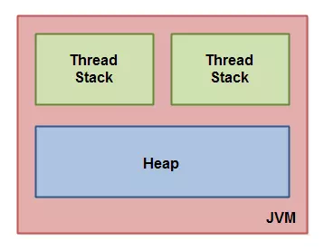
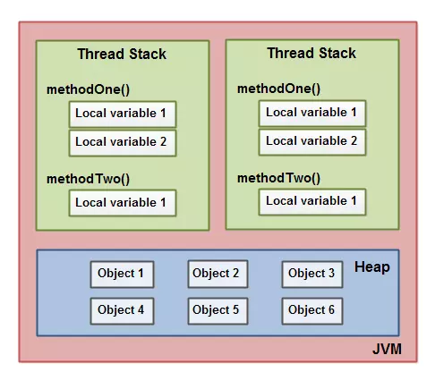
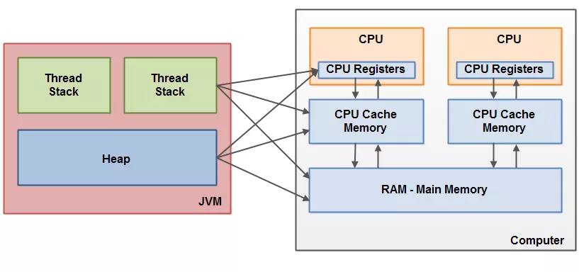
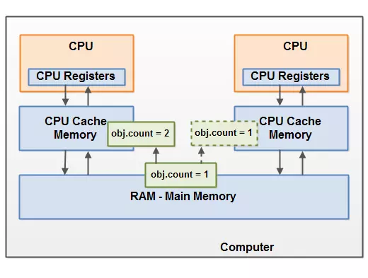
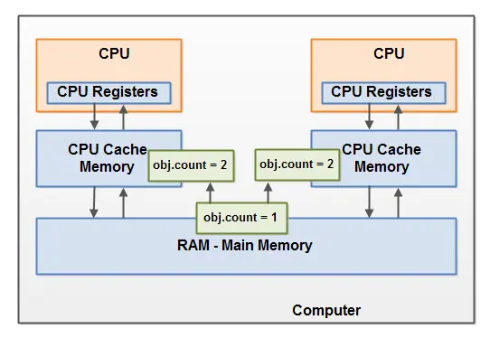

Java内存模型定义了Java虚拟机如何与计算机内存进行交互。Java虚拟机是一个完整的计算机模型，所以自然也包含内存模型，也就是Java内存模型。

如果你想要正确地设计并发程序，了解Java内存模型非常重要。Java内存模型定义了不同的线程如何以及何时能够看见被其他线程写入的变量，以及如何同步访问共享变量。

原始的Java内存并不充分，所以Java 1.5 对Java内存模型进行了修正。这个版本在Java 8中依然在使用。
### 内部的Java内存模型
JVM内部使用的内存模型划分内存为线程栈与堆。



Java虚拟机中的每个线程有它自己的线程栈。线程栈包含到当前执行点前所有调用方法的信息。我把它称为“调用栈”。当线程执行它的代码时，调用栈就会发生变化。

线程栈也包含每个执行方法的局部变量。一个线程只能访问它自己的线程栈。线程创建的局部变量对其他所有线程是不可见的。即使两个线程执行两个完全相同的代码，他们仍然会在自己的线程栈上创建对应的局部变量。所以，每个线程对每个局部变量都有它自己的版本。

所有原始类型的局部变量( boolean, byte, short, char, int, long, float, double) 完全存储在线程栈，因此对其他线程不可见。一个线程可能会拷贝一份原始变量到另一个线程，但它不能共享那个原始的局部变量本身。

堆包含了Java应用程度创建的所有对象，不管是什么线程创建的。这包含原始类型的包装类（例如, Byte, Integer, Long等）。一个对象作为一个局部变量被创建，还是作为另一个对象的成员变量被创建都不重要，这个对象仍然保存在堆上。

下图阐述了调用栈、线程栈上的局部变量以及堆上的对象：



一个局部变量可能是原始类型，这种情况它完全保存在线程栈上。

一个局部变量也可能是指向一个对象的引用。这种情况下，这个引用（局部变量）存储在线程栈，但对象本身存储在堆上。

一个对象可能包含多个方法并且每个方法可能都有局部变量。这些局部变量同样存储在线程栈上，尽管这个方法所属的对象保存的堆上。

一个对象的成员变量与对象一起存储在堆上。不管这个成员变量是原始类型还是对象的引用。

静态类变量与类定义一起存储在堆上。

堆上的对象能被所有拥有这个对象的引用的线程访问。当一个线程访问一个对象时，它能够访问这个对象的成员变量。如果两个线程同时访问同一个对象，它们都可能访问这个对象的成员变量，但每个线程对每个变量有它自己的一份拷贝。

所以，什么样的Java代码才能导致如上图的内存布局，很简单，就如以下代码：
```java
public class MyRunnable implements Runnable() {

    public void run() {
        methodOne();
    }

    public void methodOne() {
        int localVariable1 = 45;

        MySharedObject localVariable2 =
            MySharedObject.sharedInstance;

        // ... do more with local variables.

        methodTwo();
    }

    public void methodTwo() {
        Integer localVariable1 = new Integer(99);

        // ... do more with local variable.
    }
}
```
```java
public class MySharedObject {

    // static variable pointing to instance of MySharedObject

    public static final MySharedObject sharedInstance =
        new MySharedObject();


    // member variables pointing to two objects on the heap

    public Integer object2 = new Integer(22);
    public Integer object4 = new Integer(44);

    public long member1 = 12345;
    public long member1 = 67890;
}
```
### 硬件内存架构
现代硬件内存架构稍微与内部Java内存模块有点不同。为了理解Java内存模型，理解硬件内存架构很重要。这节会介绍通用的硬件内存架构，后面的章节会介绍Java内存模型如何与之工作。

以下是现代硬件内存架构的简图：


一台现代计算机通常拥有2个或多个CPU。这些CPU也可能有多个核。重点是，拥有2个或多个CPU的计算机可以同时运行多个线程。在给定的时间内，每个CPU能够运行一个线程。也就是说，如果你的Java应用程序是多线程的，多个线程会同时(或并发地)运行。

每个CPU包含一组寄存器，CPU访问寄存器的速度远大于访问内存。

同样注意的是，第个CPU也会有缓存层的存在。CPU访问缓存的速度比访问内存要快，但比访问寄存器慢。所以，CPU缓存速度介于寄存器与内存之间。

一台计算机也包含主存区域（RAM），所有CPU都能够访问主存。主存区域要比缓存的容量要大得多。

通常，当CPU访问主存时，它会读取主存的部分数据在缓存中，甚至会读取缓存中的部分数据到内部的寄存器中，然后做运算。当CPU需要写回主存时，它会将寄存器的数据刷新到缓存，在某个时间点再刷新在主存。

当CPU需要在缓存中存储其他数据时，此时缓存的数据通常会刷新回主存。缓存以“缓存行”为单位。
### Java内存模型与硬件内存架构间的映射
正如已经提到的，Java内存模型与硬件内存架构是不同的。硬件内存架构不区分线程栈与堆。硬件上，线程栈与堆都位于主内存中。线程栈与堆的一部分可能有时会出现在CPU缓存和寄存器中。如下图：



当对象与变量能存储在计算机的不同内存区域时，某些问题可能会发生。主要两个问题是：

* 线程对共享变量的更新（写）的可见性
* 读取、检查与写入共享变量时的竞态条件

### 共享变量的可见性
两个或多个线程正在共享一个对象，如果没有正确volatile声明或同步，一个线程对共享变量的更新可能对另一线程是不可见的。

想象一下，共享变量开始存储在主内存中。运行在CPU 1上线程读取了共享变量到CPU缓存中。然后它对共享变量进行了更改。只要CPU缓存没有刷新回主内存中，共享变量的变更版本对运行在其他CPU上的线程是不可见的。



解决这个问题的办法是你可以使用Java关键字volatile。volatile关键字能够保证一个给定的变量从主内存中直接读取，并且更新时总是写回到主内存。
### 竞态条件
如果两个或多个线程共享一个对象，并且超过一个线程更新共享对象中的变量，竞态条件可能发生。

想象一下，如果线程A读取共享对象的变量 count到它的CPU缓存。同样，线程B也做相同的操作，但是是不同的CPU缓存。线程A和线程B都对count加1。现在count被增加了两次。

如果这些增加操作是按顺序执行的，变量count应该增加了两次并且以原有值+2为新值写回到主内存。

然而，两次增加操作是没有同步的并发操作。不然是线程A还是线程B将更新后的count写回到主内存，更新值仅仅比原来的值大1。

下图展示了上面的描述：



为了解决这个问题，你可以使用Java同步块。一个同步块保证在给定时间内只有一个线程能够进入代码的临界区。同步块也保证同步块中访问的所有变量会从主内存读取，并且离开同步块后，所有更新的变量会刷新到主内存中，不管变量是否声明为volatile。
