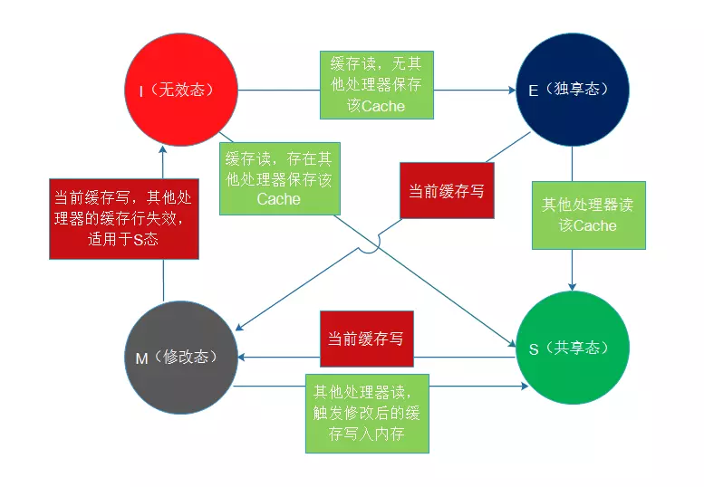

处理器在执行锁操作时，使用MESI（M=Modified修改，E=Exclusive独占，S=Shared共享，I=Invalid无效）协议去维护内部缓存和其他处理器缓存的一致性，本篇文章就专门介绍这个MESI协议如何实现缓存一致性。
### MESI缓存一致性
MESI协议是以缓存行(缓存的基本数据单位，在Intel的CPU上一般是64字节)的几个状态来命名的(全名是Modified、Exclusive、Share or Invalid)。该协议要求在每个缓存行上维护两个状态位，使得每个数据单位可能处于M、E、S和I这四种状态之一，各种状态含义如下：

**M**：被修改的。处于这一状态的数据，只在本处理器中有缓存数据，而其他处理器中没有。同时其状态相对于内存中的值来说，是已经被修改的，且没有更新到内存中。

**E**：独占的。处于这一状态的数据，只有在本处理器中有缓存，且其数据没有修改，即与内存中一致。

**S**：共享的。处于这一状态的数据在多个处理器中都有缓存，且与内存一致。

**I**：无效的。当前处理器中的这份缓存已经无效，一旦进入这个状态，处理器读数据就必须发出总线事务，从内存读
### 监听（嗅探）机制
首先介绍该协议约定的缓存上对应的监听（嗅探）机制：

一个处于M状态的缓存行，必须时刻监听所有试图读取该缓存行对应的主存地址的操作，如果监听到，则必须在此操作执行前把其缓存行中的数据写回CPU。

一个处于S状态的缓存行，必须时刻监听使该缓存行无效的请求，如果监听到，则必须把其缓存行状态设置为I（其他处理器将缓存置为M状态，则当前缓存置为I）。

一个处于E状态的缓存行，必须时刻监听其他试图读取该缓存行对应的主存地址的操作，如果监听到，则必须把其缓存行状态设置为S。

根据以上规则，我画了一个缓存行状态图：

**其中**：

缓存读表示从读取缓存行对应的内存到处理器

缓存写表示数据写入缓存行对应内存地址

当前缓存写/读表示当前处理器的读/写操作

并非所有情况都会使用缓存一致性的，如被操作的数据不能被缓存在CPU内部或操作数据跨越多个缓存行(状态无法标识，这就涉及了缓存行填充，后续再细说这部分)，则处理器会调用总线锁定；另外当CPU不支持缓存锁定时，自然也只能用总线锁定了。
### 总结
多核处理器下，CPU执行锁操作或者内存屏障时，使用MESI协议维护了缓存一致性。当共享的缓存行数据修改后，由于存在监听（嗅探）机制会失效其他处理器的共享的该缓存行，并把修改后的数据写入内存，处理器针对失效的缓存行进行读操作时，从内存中读取最新的数据，这样就实现了缓存一致性。
