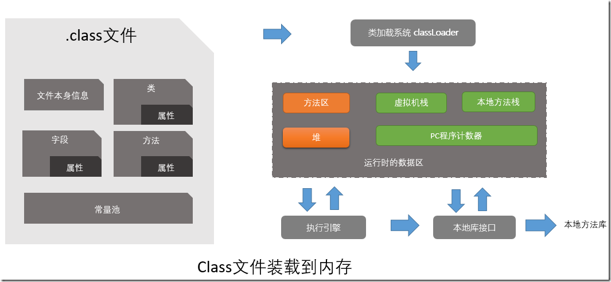
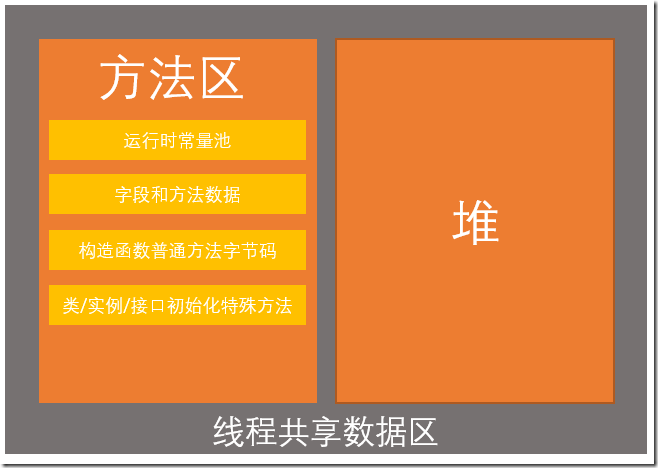
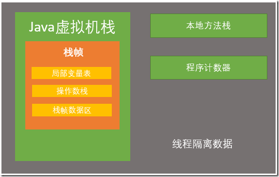
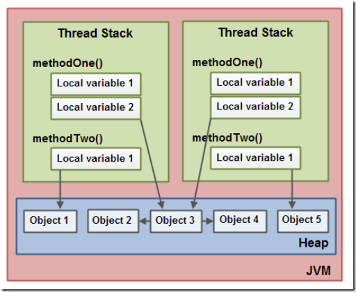
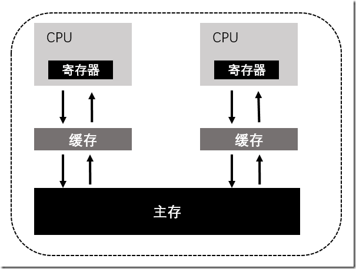
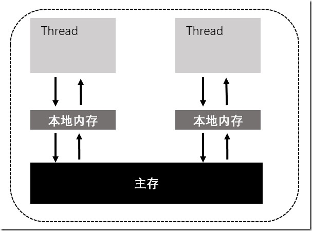
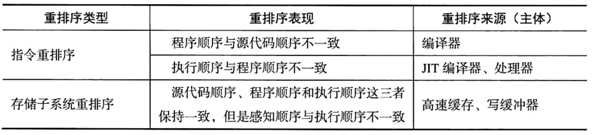
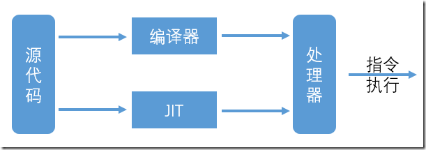

### JVM运行时内存结构回顾
在JVM相关的介绍中，有说到JAVA运行时的内存结构，简单回顾下

整体结构如下图所示，大致分为五大块



而对于方法区中的数据，是属于所有线程共享的数据结构



而对于虚拟机栈中数据结构，则是线程独有的，被保存在线程私有的内存空间中，所以这部分数据不涉及线程安全的问题



不管是堆还是栈，他们都是保存在主内存中的

线程堆栈包含正在执行的每个方法的所有局部变量（调用堆栈上的所有方法）。线程只能访问它自己的线程堆栈。

由线程创建的局部变量对于创建它的线程以外的所有其他线程是不可见的。

即使两个线程正在执行完全相同的代码，两个线程仍将在每个自己的线程堆栈中创建该代码的局部变量。因此，每个线程都有自己的每个局部变量的版本。

局部变量可以是基本类型，在这种情况下，很显然它完全保留在线程堆栈上

局部变量也可以是对象的引用，这种情况下，局部变量本身仍旧是在线程堆栈上，但是所指向的对象本身却是在堆中的

很显然，所有具有对象引用的线程都可以访问堆上的对象，尽管是多个局部变量（引用），但是实际上是同一个对象，所以如果这个对象有成员变量，那么将会出现数据安全问题。



如上图所示，两个线程，localVariable1并 localVariable2两个局部变量位于不同的线程，但是同时指向的是Object3

简单说，从上面可以看得出来，在Java中所有实例域、静态域和数组元素存储在堆内存中，堆内存在线程之间共享。

对于多线程的线程安全问题，根本在于共享数据的读写。
### JMM（Java内存模型）
Java 内存模型作为JVM的一种抽象内存模型，屏蔽掉各种硬件和操作系统的内存差异，达到跨平台的内存访问效果。

Java语言规范定义了一个统一的内存管理模型JMM(Java Memory Model)

不管是堆还是栈，数据都是保存在主存中的，整个的内存，都只是物理内存的一部分，也就是操作系统分配给JVM进程的那一部分

这部分内存按照运行区域的划分规则进行了区域划分

运行时内存区域的划分，可以简单理解为空间的分配，比如一个房间多少平，这边用于衣帽间，那边用于卧室，卧室多大，衣帽间多大

而对于内存的访问，规定Java内存模型分为主内存，和工作内存；工作内存就是线程私有的部分，主内存是所有的线程所共享的

每条线程自己的工作内存中保存了被该线程使用到的变量的主内存副本拷贝，所有的工作都是在工作内存这个操作台上，线程并不能直接操作主存，也不能访问其他线程的工作内存

你划分好了区域，比如有的地方用于存放局部变量，有的地方用于存放实例变量，但是这些数据的存取规则是什么？

换句话说，如何正确有效的进行数据的读取？显然光找好地方存是不行的，怎么存？怎么读？怎么共享？这又是另外的一个很复杂的问题

比如上面的两个线程对于Object3的数据读取顺序、限制都是什么样子的？

所以内存区域的分块划分和工作内存与主存的交互访问是两个不同的维度

在对JMM进行介绍之前，先回想下计算机对于数据的读取

数据本质上是存放于主存（最终是存放于磁盘）中的，但是计算却又是在CPU中，很显然他们的速度有天壤之别

所以在计算机硬件的发展中，出现了缓存（一级缓存、二级缓存），借助于缓存与主存进行数据交互，而且现代计算机中已经不仅仅只是有一个CPU

一个简单的示意图如下



对于访问速度来说，寄存器--缓存--主存  依次递减，但是空间却依次变大

有了缓存，CPU将不再需要频繁的直接从主存中读取数据，性能有了很大程度的提高（当然，如果需要的数据不在缓存中，那么还是需要从主存中去读取数据，是否存在，被称为缓存的命中率，显然，命中率对于CPU效率有很大影响）

在速度提高的同时，很显然，出现了一个问题：

如果两个CPU同时对主存中的一个变量x （值为1）进行处理，假设一个执行x+1 另外一个执行x-1

如果其中一个处理后另一个才开始读取，显然并没有什么问题

但是如果最初缓存中都没有数据或者说一个CPU处理过程中还没来得及将缓存写入主存，另一个CPU开始进行处理，那么最后的结果将会是不确定的

这个问题被称为：缓存一致性问题

所以说：对于多个处理器运算任务都涉及同一块主存，需要一种协议可以保障数据的一致性，这类协议有MSI、MESI、MOSI及Dragon Protocol等

Java内存模型指定Java虚拟机如何与计算机内存(RAM)一起工作。

Java虚拟机是整个计算机的模型，因此这个模型自然包括一个内存模型——也就是Java内存模型
 
对于多线程场景下，对于线程私有的数据是本地的，这个无可置疑，但是对于共享数据，前面已经提到，也是“私有的”

因为每个线程对于共享数据，都会读取一份拷贝到本地内存中（也是线程私有的内存），所有的工作都是在本地内存这个操作台上进行的，如下图所示 

这本质就是一种read-modify-write模式，所以必然有线程安全问题的隐患



与计算机硬件对于主存数据的访问是不是很相似？

需要注意的是，此处的主存并不是像前面硬件架构中的主存（RAM），是一个泛指，保存共享数据的地方，可能是主存也可能是缓存，总之是操作系统提供的服务，在JMM中可以统一认为是主存

这里的本地内存，就好似对于CPU来说的缓存一样，很显然，也会有一致性方面的问题

如果两个线程之间不是串行的，必然对于数据处理后的结果会出现不确定性

**所以JMM规范到底是什么？**

他其实就是JVM内部的内存数据的访问规则，线程进行共享数据读写的一种规则，在JVM内部，多线程就是这么读取数据的

具体的数据是如何设置到上图中“主存”这个概念中的？本地内存如何具体的与主存进行交互的？这都是操作系统以及JVM底层实现层面的问题

单纯的对于多线程编程来说，就不用管什么RAM、寄存器、缓存一致性等等问题，就只需要知道：

数据分为两部分，共享的位于主存，线程局部的位于私有的工作内存，所有的工作都是在工作内存中进行的，也就意味着有“读取-拷贝-操作-回写”这样一个大致的过程

既然人家叫做JVM  java虚拟机，自然是五脏俱全，而且如果不能做到统一形式的内存访问模型，还叫什么跨平台？

如果把线程类比为CPU，工作内存类比寄存器、缓存，主存类比为RAM

那么JMM就相当于解决硬件缓存一致性问题的、类似的一种解决Java多线程读写共享数据的协议规范

所以说，如果要设计正确的并发程序，了解Java内存模型非常重要。Java内存模型指定了不同线程如何以及何时可以看到其他线程写入共享变量的值，以及如何在必要时同步对共享变量的访问

每个线程局部数据自己独有，共享数据会读取拷贝一份到工作内存，操作后会回写到主存

换一个说法，可以认为JMM的核心就是用于解决线程安全问题的，而线程安全问题根本就是对于共享数据的操作，所以说JMM对于数据操作的规范要求，本质也就是多线程安全问题的解决方案（缓存一致性也是数据安全的解决方案）

所以说理解了可能出现问题的原因与场景，就了解了线程安全的问题，了解了问题，才能理解解决方案，那多线程到底有哪些主要的安全问题呢？
### 竞争场景
线程安全问题的本质就是共享数据的访问，没有共享就没有安全问题，所以说有时干脆一个类中都没有成员变量，也就避免了线程安全问题，但是很显然，这只是个别场景下适合，如果一味如此，就是因噎废食了

如果对于数据的访问是串行的，也不会出现问题，因为不存在竞争，但是很显然，随着计算机硬件的升级，多核处理器的出现，并发（并行）是必然，你不能为了安全就牺牲掉性能，也是一种因噎废食

所以换一个说法，为何会有线程安全问题？是因为对于共享数据的竞争访问！

**常见的两种竞争场景**

* read-modify-write（读-改-写）
* check-then-act（检查后行动）

#### read-modify-write（读-改-写）
read-modify-write（读-改-写）可以简单地分为三个步骤：
> 1. 读取数据
> 
> 2. 修改数据
> 
> 3. 回写数据

很显然，如果多个线程同时进行，将会出现不可预知的后果，假设两个线程，A和B，他们的三个步骤为A1，A2，A3  和 B1，B2，B3

如果按照A1，A2，A3，B1，B2，B3 或者 B1，B2，B3，A1，A2，A3的顺序，并不会出现问题

但是如果是交叉进行，比如A1，A2，B1，B2，B3，A3，那么就会出现问题，B对数据的写入被覆盖了！
#### check-then-act（检查后行动）
比如
```java
if（x >1）{
    // do sth....
    x--；
}
```
如果A线程条件满足后，还没有继续进行，此时B线程开始执行，条件判断后满足继续执行，执行后x的值并不满足条件了！

这也是一种常见的线程安全问题

很显然，单线程情况下，或者说所有的变量全部都是局部变量的话，不会出现问题，否则就很可能出现问题（线程安全问题并不是必然出现的，长时间不出问题也很可能）

对于线程安全的问题主要分为三类

* 原子性
* 可见性
* 有序性

### 原子性
原子 Atomic，意指不可分割，也就是作为一个整体，要么全部执行，要么不会执行

对于共享变量访问的一个操作，如果对于除了当前执行线程以外的任何线程来说，都是不可分割的，那么就是具有原子性

简言之，对于别的线程而言，他要么看到的是该线程还没有执行的情况，要么就是看到了线程执行后的情况，不会出现执行一半的场景，简言之，其他线程永远不会看到中间结果

生活中有一个典型的例子，就是ATM机取款

尽管中间有很多的工作，比如账户扣款，ATM吐出钞票等，但是从取钱的角度来看，对于用户却是不可分割的一个过程

要么，取钱成功了，要么取款失败了，对于共享变量也就是账户余额来说，要么会减少，要么不变，不会出现钱去了余额不变或者余额减少，但是却没有看到钱的情况

既然是原子操作，既然是不可分割的，那么就是要么做了，要么没做，不会中间被耽搁，最终的结果看起来就好似串行的执行一样，不会出现线程安全问题

**Java中有两种方式实现原子性**

一种是使用锁机制，锁具有排他性，也就是说它能够保证一个共享变量在任意一个时刻仅仅被一个线程访问，这就消除了竞争；

另外一种是借助于处理器提供的专门的CAS指令（compare-and-swap）

在Java中，long和double以外的任何类型的变量的写操作都是原子操作

也就是基础类型（byte int short char float boolean）以及引用类型的变量的写操作都是原子的，由Java语言规范规定，JVM实现

对于long和double，64位长度，如果是在32位机器上，写操作可能分为两个步骤，分别处理高低32位，两个步骤就打破了原子性，可能出现数据安全问题

有一点需要注意的是，原子操作+原子操作，并非仍旧是原子操作

比如
```java
a=1；
b=1；
```
很显然，都是原子操作，但是在a=1执行后，如果此时另外的线程过来读取数据，会读取到a=1，而b却是没设置的中间状态
### 可见性
在多线程环境下，一个线程对某个共享变量进行更新之后，后续访问该变量的线程可能无法立刻读取到这个更新的结果，甚至永远也无法读取到这个更新的结果。

这就是线程安全问题的另外一个表现形式:可见性(Visibility )

如果一个线程对某个共享变量进行更新之后，后续访问该变量的线程可以读取到该更新的结果，那么就称这个线程对该共享变量的更新对其他线程可见，否则就称这个线程对该共享变量的更新对其他线程不可见。

简言之，如果一个线程对共享数据做出了修改，而另外的线程却并没有读取到最新的结果，这是有问题的

多线程程序在可见性方面存在问题意味着某些线程读取到了旧数据，通常也是不被希望的

**为什么会出现可见性问题？**

因为数据本质是要从主存存取的，但是对于线程来说，有了工作内存，这个私有的工作台，也就是read-modify-write模式

即使线程正确的处理了结果，但是却没有及时的被其他的线程读取，而别人却读取了错误的结果（旧数据），这是一个很大的问题

所以此处也可以看到，如果仅仅是保障原子性，对于线程安全来说，完全是不够的（有些场景可能足够了）

原子性保障了不会读取到中间结果，要么是结束要么是未开始，但是如果操作结束了，这个结果真的就能看到么？所以还需要可见性的保障
### 有序性
关于有序性，首先要说下重排序的概念，如果不曾有重排序，那么也就不涉及这方面的问题了

比如下面两条语句
```java
a=1；
b=2；
```
在源代码中是有顺序的，经过编译后形成指令后，也必然是有顺序的

在一个线程中从代码执行的角度来看，也总是有先后顺序的

比如上面两条语句，a的赋值在前，b的赋值在后，但是实际上，这种顺序是没有保障的

处理器可能并不会完全按照已经形成的指令（目标代码）顺序执行，这种现象就叫做重排序
#### 为什么要重排序？
重排序是对内存访问操作的一种优化，他可以在不影响单线程程序正确性的前提下进行一定的调整，进而提高程序的性能

但是对于多线程场景下，就可能产生一定的问题

当然，重排序导致的问题，也不是必然出现的

比如，编译器进行编译时，处理器进行执行时，都有可能发生重排序

先声明几个概念

* 源代码顺序，很明显字面意思就是源代码的顺序
* 程序顺序，源码经过处理后的目标代码顺序（解释后或者JIT编译后的目标代码或者干脆理解成源代码解析后的机器指令）
* 执行顺序，处理器对目标代码执行时的顺序
* 感知顺序，处理器执行了，但是别人看到的并不一定就是你执行的顺序，因为操作后的数据涉及到数据的回写，可能会经过寄存器、缓存等，即使你先计算的a后计算的b，如果b先被写回呢？这就是感知顺序，简单说就是别人看到的结果

在此基础上，可以将重排序可以分为两种，指令重排序和存储重排序

下图来自《Java多线程编程实战指南-核心篇》



编译器可能导致目标代码与源代码顺序不一致；即时编译器JIT和处理器可能导致执行顺序与程序顺序不一致；

缓存、缓冲器可能导致感知顺序不一致
#### 指令重排序
不管是程序顺序与源代码顺序不一致还是执行顺序与程序顺序不一致，结果都是指令重排序，因为最终的效果就是源代码与最终被执行的指令顺序不一致

如下图所示，不管是哪一段顺序被重拍了，最终的结果都是最终执行的指令乱序了



ps：Java有两种编译器，一种是Javac静态编译器，将源文件编译为字节码，代码编译阶段运行；JIT是在运行时，动态的将字节码编译为本地机器码（目标代码）

通常javac不会进行重排序，而JIT则很可能进行重排序

此处不对为什么要重排序展开，简单说就是硬件或者编译器等为了能够更好地执行指令，提高性能，所做出的一定程度的优化，重排序也不是随随便便的就改变了顺序的，它具有一定的规则，叫做貌似串行语义As-if-serial Semantics，也就是从单线程的角度保障不会出现问题，但是对于多线程就可能出现问题。

貌似串行语义的规则主要是对于具有数据依赖关系的数据不会进行重排序，没有依赖关系的则可能进行重排序

比如下面的三条语句，c=a+b；依赖a和b，所以不会与他们进行重排序，但是a和b没有依赖关系，就可能发生重排序
```java
a=1；
b=2；
c=a+b；
```
#### 存储重排序
为什么会出现执行一种顺序，而结果的写入是另外的一种顺序？

前面说过，对于CPU来说并不是直接跟主存交互的，因为速度有天壤之别，所以有多级缓存，有读缓存，其实也有写缓存

有了缓存，也就意味着这中间就多了一些步骤，那么就可能即使严格按照指令的顺序执行，但是从结果上看起来却是乱序的

指令重排序是一种动作，实际发生了，而存储重排序则是一种现象，从结果看出来的一种现象，其实本身并没有在执行上重拍，但是这也可能引起问题
#### 如何保证顺序？
貌似串行语义As-if-serial Semantics，只是保障单线程不会出问题，所以有序性保障，可以理解为，将貌似串行语义As-if-serial Semantics扩展到多线程，在多线程中也不会出现问题

换句话说，有序性的保障，就是貌似串行语义在逻辑上看起来，有些必要的地方禁止重排序

从底层的角度来看，是借助于处理器提供的相关指令内存屏障来实现的

对于Java语言本身来说，Java已经帮我们与底层打交道，我们不会直接接触内存屏障指令，java提供的关键字synchronized和volatile，可以达到这个效果，保障有序性（借助于显式锁Lock也是一样的，Lock逻辑与synchronized一致）
#### happens-before 原则
关键字volatile和synchronized都可以保证有序性，他们都会告知底层，相关的处理需要保障有序，但是很显然，如果所有的处理都需要主动地去借助于这两个关键字去维护有序，这将是一件繁琐痛苦的事情，而且，也说到了重排序也并不是随意的

Java有一个内置的有序规则，也就是说，对于重排序有一个内置的规则实现，你不需要自己去动脑子思考，动手去写代码，有一些有序的保障Java天然存在，简化了你对重排序的设计与思考

这个规则就叫做happens-before 原则

如果可以从这个原则中推测出来顺序，那么将会对他们进行有序性保障；如果不能推导出来，换句话说不与这些要求相违背，那么就可能会被重排序，JVM不会对有序性进行保障。
##### 程序次序规则(Program Order Rule)
在一个线程内，按照程序代码顺序，书写在前面的操作先行发生于书写在后面的操作。准确地说，应该是控制流顺序而不是程序代码顺序，因为要考虑分支、循环等结构，只要确保在一个线程内最终的结果和代码顺序执行的结果一致即可，仍旧可能发生重排序，但是得保证这个前提
##### 管程锁定规则(Monitor Lock Rule)
一个unlock操作先行发生于后面对同一个锁的 lock操作。这里必须强调的是同一个锁，而“后面”是指时间上的先后顺序
##### volatile变量规则(Volatile Variable Rule)
对一个volatile变量的写操作先行发生于后面对这个变量的读操作，这里的“后面”同样是指时间上的先后顺序。
##### 线程启动规则(Thread Start Rule)
Thread对象的start()方法先行发生于此线程的每一个动作。你必须得先启动一个线程才能有后续
##### 线程终止规则(Thread Termination Rule)
线程中的所有操作都先行发生于对此线程的终止检测，也就是说所有的操作肯定是要在线程终止之前的，终止之后就不能有操作了，可以通过Thread.join()方法结束、Thread. isAlive()的返回值等手段检测到线程已经终止执行。
##### 线程中断规则(Thread Interruption Rule)
对线程 interrupt()方法的调用先行发生于被中断线程的代码检测到中断事件的发生，也就是你得先调用方法，才会产生中断，你不能别人发现中断信号了，你竟然你都还没调用interrupt方法，可以通过Thread.isinterrupted ()方法检测到是否有中断发生。
##### 对象终结规则(Finalizer Rule)
一个对象的初始化完成(构造函数执行结束)先行发生于它的finalizeO方法的开始，先生后死，这个是必须的
##### 传递性(Transitivity)
如果操作A先行发生于操作B,操作B先行发生于操作C,那就可以得出操作A先行发生于操作C的结论。

再次强调：对于happens-before规则，不需要做任何的同步限制，Java是天然支持的

《深入理解Java虚拟机：JVM高级特性与最佳实践》中有一个例子对于理解该原则有所帮助
```java
private int value = 0; 
public int getValue() {
    return value;
} 
public void setValue(int value) {
    this.value = value;
}
```
假设两个线程A和B，线程A先（在时间上先）调用了这个对象的setValue（1），接着线程B调用getValue方法，那么B的返回值是多少？

对照着hp原则

不是同一个线程，所以不涉及：程序次序规则

不涉及同步，所以不涉及：管程锁定规则

没有volatile关键字，所以不涉及：volatile变量规则

没有线程的启动，中断，终止，所以不涉及：线程启动规则，线程终止规则，线程中断规则

没有对象的创建于终结，所以不涉及：对象终结规则

更没有涉及到传递性

所以一条规则都不满足，所以，尽管线程A在时间上与线程B具有先后顺序，但是，却并不涉及hp原则，也就是有序性并不会保障，所以线程B的数据获取是不安全的！！

比如的确是先执行了，但是没有及时写入呢？

简言之，时间上的先后顺序，并不代表真正的先行发生（hp），而且，先行发生（hp）也并不能说明时间上的先后顺序是什么

这也说明，不要被时间先后迷惑，只有真正的有序了，才能保障安全

也就是要么满足hp原则了（天然就支持有序了），或者借助于volatile或者synchronized关键字或者显式锁Lock对他们进行保障（显式手动控制有序），才能保障有序

happens-before是JMM的一个核心概念，因为对于程序员来说，希望一个简单高效最重要的是要易用的，易于理解的编程模型，但是反过来说从编译器和处理器执行的角度来看，自然是希望约束越少越好，没有约束，那么就可以高度优化，很显然两者是矛盾的，一个希望严格、简单、易用，另一个则希望尽可能少的约束；

happens-before则相当于一个折中后的方案，二者的一个权衡，以上是基本大致的的一个规范，有兴趣的可以深入研究happens-before原则  

**原子性、可见性、有序性**

前面说过，原子性保障了要么执行要么不执行，不会出现中间结果，但是即使原子了，不可分割了，但是是否对另外一个可见，是无法保障的，所以需要可见性

而有序性则是另外的线程对当前线程执行看起来的顺序，所以如果都不可见，何谈有序性，所以可见性是有序性的基础

另外，有序性对于可见性是有影响的，比如某些操作本来在前，结果是可见的，但是重排序后，被排序到了后面，这就可能导致不可见，比如父线程的操作对子线程是可见的，但是如果有些位置顺序调整了呢？   
### 总结
Java内存区域的划分是对于主存的一种划分，存储的划分，而这个主存则是分配给JVM进程的内存空间，而JVM的这部分内存只是物理内存的一部分

这部分内存有共享的主存储空间，还有一部分是线程私有的本地内存空间

线程所用到的所有的变量都位于线程的本地内存中，局部变量本身就在本地内存，而共享变量则会持有一份私有拷贝

线程的操作台就是这个本地内存，既不能直接访问主存也不能访问其他线程本地内存，只能借助于主存进行交互

JMM模型则是对于JVM对于内存访问的一种规范，多线程工作内存与主内存之间的交互原则进行了指示，他是独立于具体物理机器的一种内存存取模型

对于多线程的数据安全问题，三个方面，原子性、可见性、有序性是三个相互协作的方面，不是说保障了任何一个就万事大吉了，另外也并不一定是所有的场景都需要全部都保障才能够线程安全

比如volatile关键字只能保障可见性和有序性以及自身修饰变量的原子性，但是如果是一个代码段却并不能保障原子性，所以是一种弱的同步，而synchronized则可以从三个维度进行保障

这三个特性也是JMM的核心，对相关的原则进行了规范，所以概括的说什么是JMM？他就只是一个规范概念

Java通过提供同步机制（synchronized、volatile）关键字借助于编译器、JVM实现，依赖于底层操作系统，对这些规范进行了实现，提供了对于这些特性的一个保障

反复提到的下面的这个图就是JMM的基础结构，而延展出来的规范特性，就是基于这个结构，并且针对于多线程安全问题提出的一些解决方案

只要正确的使用提供的同步机制，就能够开发出正确的并发程序
