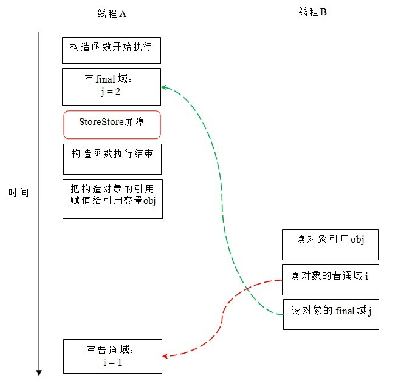
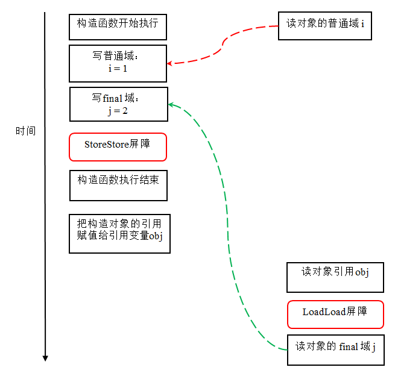
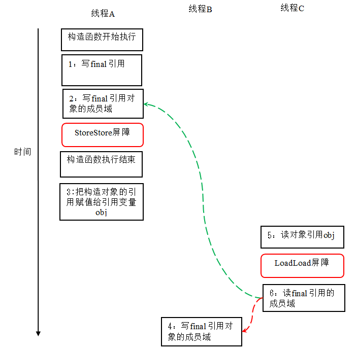
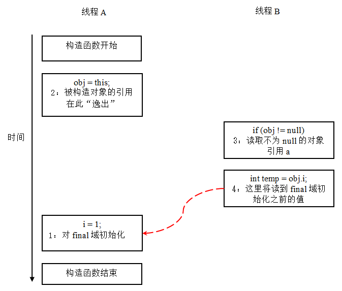

与锁和volatile相比较，对final域的读和写更像是普通的变量访问。对于final域，编译器和处理器要遵守两个重排序规则：
> 1. 在构造函数内对一个final域的写入，与随后把这个被构造对象的引用赋值给一个引用变量，这两个操作之间不能重排序。
> 
> 2. 初次读一个包含final域的对象的引用，与随后初次读这个final域，这两个操作之间不能重排序。

下面，通过一些示例性的代码来分别说明这两个规则：
```java
public class FinalExample {
    int i;                            // 普通变量
    final int j;                      // final变量
    static FinalExample obj;

    public void FinalExample () {     // 构造函数
        i = 1;                        // 写普通域
        j = 2;                        // 写final域
    }

    public static void writer () {    // 写线程A执行
        obj = new FinalExample ();
    }

    public static void reader () {       // 读线程B执行
        FinalExample object = obj;       // 读对象引用
        int a = object.i;                // 读普通域
        int b = object.j;                // 读final域
    }
}
```
这里假设一个线程A执行writer ()方法，随后另一个线程B执行reader ()方法。下面我们通过这两个线程的交互来说明这两个规则。
#### 写final域的重排序规则
写final域的重排序规则禁止把final域的写重排序到构造函数之外。这个规则的实现包含下面2个方面：

* JMM禁止编译器把final域的写重排序到构造函数之外。
* 编译器会在final域的写之后，构造函数return之前，插入一个StoreStore屏障。这个屏障禁止处理器把final域的写重排序到构造函数之外。

现在分析writer ()方法。writer ()方法只包含一行代码：finalExample = new FinalExample ()。这行代码包含两个步骤：

* 构造一个FinalExample类型的对象；
* 把这个对象的引用赋值给引用变量obj。

假设线程B读对象引用与读对象的成员域之间没有重排序（马上会说明为什么需要这个假设），下图是一种可能的执行时序：



在上图中，写普通域的操作被编译器重排序到了构造函数之外，读线程 B 错误的读取了普通变量 i 初始化之前的值。而写 final 域的操作，被写 final 域的重排序规则“限定”在了构造函数之内，读线程 B 正确的读取了 final 变量初始化之后的值。

写 final 域的重排序规则可以确保：在对象引用为任意线程可见之前，对象的 final 域已经被正确初始化过了，而普通域不具有这个保障。以上图为例，在读线程 B“看到”对象引用 obj 时，很可能 obj 对象还没有构造完成（对普通域 i 的写操作被重排序到构造函数外，此时初始值 2 还没有写入普通域 i）。
#### 读 final 域的重排序规则

读 final 域的重排序规则如下：
> 在一个线程中，初次读对象引用与初次读该对象包含的 final 域，JMM 禁止处理器重排序这两个操作（注意，这个规则仅仅针对处理器）。编译器会在读 final 域操作的前面插入一个 LoadLoad 屏障。

初次读对象引用与初次读该对象包含的 final 域，这两个操作之间存在间接依赖关系。由于编译器遵守间接依赖关系，因此编译器不会重排序这两个操作。大多数处理器也会遵守间接依赖，大多数处理器也不会重排序这两个操作。但有少数处理器允许对存在间接依赖关系的操作做重排序（比如 alpha 处理器），这个规则就是专门用来针对这种处理器。

reader() 方法包含三个操作：
> 1. 初次读引用变量 obj;
> 
> 2. 初次读引用变量 obj 指向对象的普通域 j。
> 
> 3. 初次读引用变量 obj 指向对象的 final 域 i。

现在假设写线程 A 没有发生任何重排序，同时程序在不遵守间接依赖的处理器上执行，下面是一种可能的执行时序：



在上图中，读对象的普通域的操作被处理器重排序到读对象引用之前。读普通域时，该域还没有被写线程 A 写入，这是一个错误的读取操作。而读 final 域的重排序规则会把读对象 final 域的操作“限定”在读对象引用之后，此时该 final 域已经被 A 线程初始化过了，这是一个正确的读取操作。

读 final 域的重排序规则可以确保：在读一个对象的 final 域之前，一定会先读包含这个 final 域的对象的引用。在这个示例程序中，如果该引用不为 null，那么引用对象的 final 域一定已经被 A 线程初始化过了。
#### 如果 final 域是引用类型
上面看到的 final 域是基础数据类型，下面让我们看看如果 final 域是引用类型，将会有什么效果？

请看下列示例代码：
```java
public class FinalReferenceExample {
    final int[] intArray;                     // final 是引用类型 
    static FinalReferenceExample obj;

    public FinalReferenceExample () {        // 构造函数 
        intArray = new int[1];              // 1
        intArray[0] = 1;                   // 2
    }

    public static void writerOne () {          // 写线程 A 执行 
        obj = new FinalReferenceExample ();  // 3
    }

    public static void writerTwo () {          // 写线程 B 执行 
        obj.intArray[0] = 2;                 // 4
    }

    public static void reader () {              // 读线程 C 执行 
        if (obj != null) {                    // 5
            int temp1 = obj.intArray[0];       // 6
        }
    }
}
```
这里 final 域为一个引用类型，它引用一个 int 型的数组对象。对于引用类型，写 final 域的重排序规则对编译器和处理器增加了如下约束：
> 在构造函数内对一个 final 引用的对象的成员域的写入，与随后在构造函数外把这个被构造对象的引用赋值给一个引用变量，这两个操作之间不能重排序。

对上面的示例程序，假设首先线程 A 执行 writerOne() 方法，执行完后线程 B 执行 writerTwo() 方法，执行完后线程 C 执行 reader () 方法。下面是一种可能的线程执行时序：



在上图中，1 是对 final 域的写入，2 是对这个 final 域引用的对象的成员域的写入，3 是把被构造的对象的引用赋值给某个引用变量。这里除了前面提到的 1 不能和 3 重排序外，2 和 3 也不能重排序。

JMM 可以确保读线程 C 至少能看到写线程 A 在构造函数中对 final 引用对象的成员域的写入。即 C 至少能看到数组下标 0 的值为 1。而写线程 B 对数组元素的写入，读线程 C 可能看的到，也可能看不到。JMM 不保证线程 B 的写入对读线程 C 可见，因为写线程 B 和读线程 C 之间存在数据竞争，此时的执行结果不可预知。

如果想要确保读线程 C 看到写线程 B 对数组元素的写入，写线程 B 和读线程 C 之间需要使用同步原语（lock 或 volatile）来确保内存可见性。
#### 为什么 final 引用不能从构造函数内“逸出”
前面提到过，写 final 域的重排序规则可以确保：在引用变量为任意线程可见之前，该引用变量指向的对象的 final 域已经在构造函数中被正确初始化过了。其实要得到这个效果，还需要一个保证：在构造函数内部，不能让这个被构造对象的引用为其他线程可见，也就是对象引用不能在构造函数中“逸出”。为了说明问题，来看下面示例代码：
```java
public class FinalReferenceEscapeExample {
    final int i;
    static FinalReferenceEscapeExample obj;

    public FinalReferenceEscapeExample () {
        i = 1;                              // 1 写 final 域 
        obj = this;                          // 2 this 引用在此“逸出”
    }

    public static void writer() {
        new FinalReferenceEscapeExample ();
    }

    public static void reader {
        if (obj != null) {                     // 3
            int temp = obj.i;                 // 4
        }
    }
}
```
假设一个线程 A 执行 writer() 方法，另一个线程 B 执行 reader() 方法。这里的操作 2 使得对象还未完成构造前就为线程 B 可见。即使这里的操作 2 是构造函数的最后一步，且即使在程序中操作 2 排在操作 1 后面，执行 read() 方法的线程仍然可能无法看到 final 域被初始化后的值，因为这里的操作 1 和操作 2 之间可能被重排序。实际的执行时序可能如下图所示：



从上图可以看出：在构造函数返回前，被构造对象的引用不能为其他线程可见，因为此时的 final 域可能还没有被初始化。在构造函数返回后，任意线程都将保证能看到 final 域正确初始化之后的值。
#### final 语义在处理器中的实现
现在以 x86 处理器为例，说明 final 语义在处理器中的具体实现。

上面提到，写 final 域的重排序规则会要求译编器在 final 域的写之后，构造函数 return 之前，插入一个 StoreStore 障屏。读 final 域的重排序规则要求编译器在读 final 域的操作前面插入一个 LoadLoad 屏障。

由于 x86 处理器不会对写 - 写操作做重排序，所以在 x86 处理器中，写 final 域需要的 StoreStore 障屏会被省略掉。同样，由于 x86 处理器不会对存在间接依赖关系的操作做重排序，所以在 x86 处理器中，读 final 域需要的 LoadLoad 屏障也会被省略掉。也就是说在 x86 处理器中，final 域的读 / 写不会插入任何内存屏障！
#### JSR-133 为什么要增强 final 的语义
在旧的 Java 内存模型中 ，最严重的一个缺陷就是线程可能看到 final 域的值会改变。比如，一个线程当前看到一个整形 final 域的值为 0（还未初始化之前的默认值），过一段时间之后这个线程再去读这个 final 域的值时，却发现值变为了 1（被某个线程初始化之后的值）。最常见的例子就是在旧的 Java 内存模型中，String 的值可能会改变（参考文献 2 中有一个具体的例子，感兴趣的可以自行参考，这里就不赘述了）。

为了修补这个漏洞，JSR-133 专家组增强了 final 的语义。通过为 final 域增加写和读重排序规则，可以为 java 程序员提供初始化安全保证：只要对象是正确构造的（被构造对象的引用在构造函数中没有“逸出”），那么不需要使用同步（指 lock 和 volatile 的使用），就可以保证任意线程都能看到这个 final 域在构造函数中被初始化之后的值。
