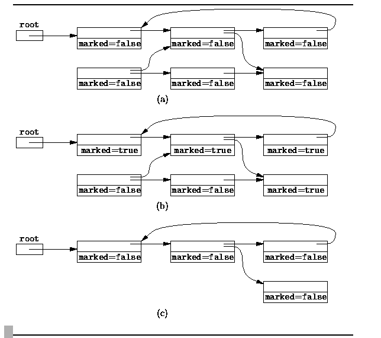
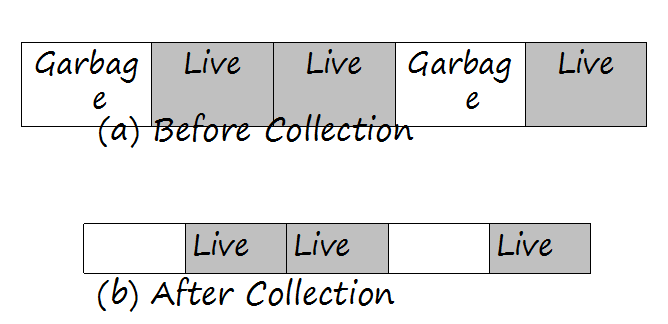
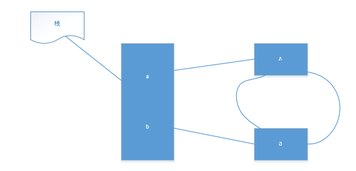
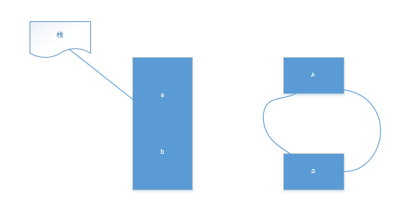

### 概念介绍
#### root对象
在标记清除算法中，会把如下对象称之为root对象

* 被栈中的变量(栈中存的是对象的引用)所引用的对象
* 被static变量引用的对象

#### 可访问的对象
如果栈中有一个变量a引用了一个对象，那么该对象是可访问的，如果该对象中的某一个字段引用了另一个对象b，那么b也是可访问的。可访问的对象也称之为live对象
### 标记清除算法介绍
该算法有两个阶段。 
> 1. 标记阶段：找到所有可访问的对象，做个标记 
> 2. 清除阶段：遍历堆，把未被标记的对象回收

备注：
> 该算法一般应用于老年代,因为老年代的对象生命周期比较长。

#### 标记阶段算法
伪代码类似如下：
```java
for each root variable r
    mark (r);
sweep ();
```
为了能够区分对象是live的,可以为每个对象添加一个marked字段，该字段在对象创建的时候，默认值是false 

假设有一个对象p，p对象还间接的引用了其他对象，那么可以使用一个递归算法去进行标记，例如：
```java
void mark(Object p)
    if (!p.marked)
        p.marked = true;
        for each Object q referenced by p
            mark (q);
```
这个mark方法只有当所有对象已经被mark后才会退出。
#### 清除阶段算法
在这个阶段，需要去遍历堆中所有对象，并找出未被mark的对象，进行回收。与此同时，那些被mark过的对象的marked字段的值会被重新设置为false，以便下次的垃圾回收。

伪代码如下：
```java
void sweep ()
    for each Object p in the heap
        if (p.marked)
            p.marked = false
        else
            heap.release (p);
```
下面用一张图来表示标记清除算法的整个过程。 


### 标记清除算法的优点和缺点 
#### 优点 

* 是可以解决循环引用的问题 
* 必要时才回收(内存不足时) 

#### 缺点

* 回收时，应用需要挂起，也就是stop the world。 
* 标记和清除的效率不高，尤其是要扫描的对象比较多的时候 
* 会造成内存碎片(会导致明明有内存空间,但是由于不连续,申请稍微大一些的对象无法做到),如下图： 


### 解决循环引用
出现循环引用的代码如下：
```java
class TestA{
  public TestB b;

}
class TestB{
  public TestA a;
}
public class Main{
    public static void main(String[] args){
        A a = new A();
        B b = new B();
        a.b=b;
        b.a=a;
        a = null;
        b = null;
    }
}
```
对应的图如下： 



这个时候，当a = null; b = null;的时候，图像变成如下：



那么使用标记清除算法是可以回收a和b的，原因是标记清除算法是从栈中根对象开始的，改算法走完后，a对象和b对象是没有被标记的，会被直接回收。
