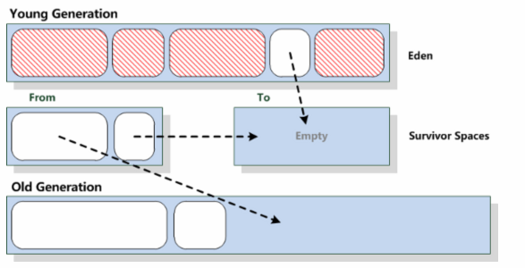

### 概述
如果jvm使用了coping算法，一开始就会将可用内存分为两块，from域和to域， 每次只是使用from域，to域则空闲着。当from域内存不够了，开始执行GC操作，这个时候，会把from域存活的对象拷贝到to域,然后直接把from域进行内存清理。
### 应用场景
coping算法一般是使用在新生代中，因为新生代中的对象一般都是朝生夕死的，存活对象的数量并不多，这样使用coping算法进行拷贝时效率比较高。

jvm将Heap 内存划分为新生代与老年代，又将新生代划分为Eden(伊甸园) 与2块Survivor Space(幸存者区) ,然后在Eden –>Survivor Space 以及From Survivor Space 与To Survivor Space 之间实行Copying 算法。 不过jvm在应用coping算法时，并不是把内存按照1:1来划分的，这样太浪费内存空间了。一般的jvm都是8:1。也即是说,Eden区:From区:To区域的比例是8:1:1。

始终有90%的空间是可以用来创建对象的,而剩下的10%用来存放回收后存活的对象。

1、当Eden区满的时候,会触发第一次young gc,把还活着的对象拷贝到Survivor From区；当Eden区再次触发young gc的时候,会扫描Eden区和From区域,对两个区域进行垃圾回收,经过这次回收后还存活的对象,则直接复制到To区域,并将Eden和From区域清空。 

2、当后续Eden又发生young gc的时候,会对Eden和To区域进行垃圾回收,存活的对象复制到From区域,并将Eden和To区域清空。

3、可见部分对象会在From和To区域中复制来复制去,如此交换15次(由JVM参数MaxTenuringThreshold决定,这个参数默认是15),最终如果还是存活,就存入到老年代

**注意**：

万一存活对象数量比较多，那么To域的内存可能不够存放，这个时候会借助老年代的空间。
### 优点
在存活对象不多的情况下，性能高，能解决内存碎片和java垃圾回收算法之-标记清除中导致的引用更新问题。
### 缺点
会造成一部分的内存浪费。不过可以根据实际情况，将内存块大小比例适当调整；

如果存活对象的数量比较大，coping的性能会变得很差。
